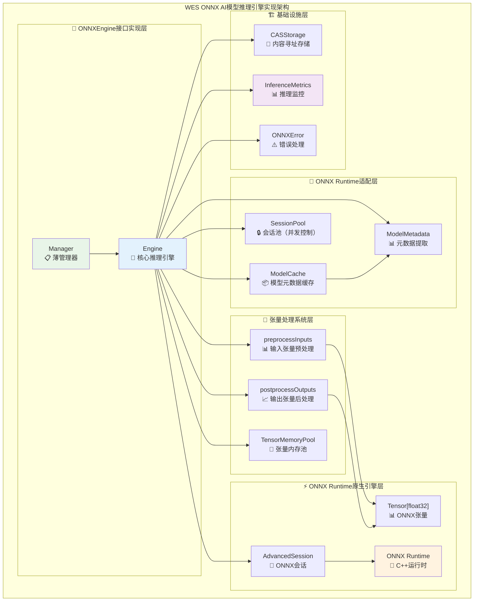

# WES ONNX AI模型推理引擎实现（internal/core/engines/onnx）

【实现定位】
　　本模块是WES系统中**ONNX AI模型推理引擎的具体实现**，负责**基于onnxruntime-go集成实现高性能AI模型推理执行**。通过**原生张量计算优化**和**ONNX标准模型支持**，提供**确定性的AI推理能力**，支撑**链上AI、预测市场、智能推荐等区块链AI应用场景**，确保**推理性能最优化和模型执行的可验证性**。

【设计原则】
- **onnxruntime-go原生集成**：直接使用Microsoft ONNX Runtime的Go绑定，保持AI推理的最佳性能
- **ONNX标准支持**：完整支持ONNX模型格式，兼容主流AI框架导出的模型（PyTorch/TensorFlow/Keras）
- **确定性推理保证**：严格确保相同输入产生位级别相同推理输出，满足ISPC单次执行验证的确定性要求
- **张量内存优化**：高效的张量内存管理和会话池优化，最小化推理开销
- **模型生命周期管理**：完整的模型加载、元数据缓存、推理、后处理生命周期

【核心职责】
1. **ONNXEngine接口具体实现**：实现pkg/interfaces/engines.ONNXEngine的CallModel方法
2. **onnxruntime-go深度适配**：封装onnxruntime_go的AdvancedSession、Tensor等核心API
3. **ONNX模型生命周期**：管理模型的元数据提取、缓存、会话创建全生命周期
4. **张量处理系统**：实现输入张量预处理、ONNX Runtime执行、输出张量后处理
5. **内存和计算优化**：处理张量内存池、会话池、并发控制等性能优化
6. **AI推理监控**：推理性能监控、模型使用统计、异常检测等运维支撑

【实现架构】

　　采用**分层推理架构**，确保**onnxruntime-go原生性能的充分发挥**和**ONNX标准的完整支持**。



**实现层次说明：**

1. **ONNXEngine接口实现层**：Manager薄管理器，Engine核心引擎
2. **ONNX Runtime适配层**：模型元数据缓存、会话池、元数据提取
3. **张量处理系统层**：完整的张量预处理、后处理、内存池
4. **ONNX Runtime原生引擎层**：直接使用onnxruntime_go的核心组件

---

## 🌐 **平台支持**

### ONNX Runtime 官方支持平台

ONNX Runtime 官方支持以下操作系统和架构：

| 操作系统 | 支持的架构 | GOOS/GOARCH 映射 | 状态 |
|---------|-----------|-----------------|------|
| **Windows** | x86_32, x86_64, ARM32v7, ARM64 | `windows/386`, `windows/amd64`, `windows/arm`, `windows/arm64` | ✅ 支持 |
| **Linux** | x86_32, x86_64, ARM32v7, ARM64, PPC64LE, RISCV64, S390X | `linux/386`, `linux/amd64`, `linux/arm`, `linux/arm64`, `linux/ppc64le`, `linux/riscv64`, `linux/s390x` | ✅ 支持 |
| **macOS** | x86_64, ARM64 | `darwin/amd64`, `darwin/arm64` | ✅ 支持 |
| **Android** | ARM32v7, ARM64 | `android/arm`, `android/arm64` | ✅ 支持 |
| **iOS** | ARM64 | `ios/arm64` | ✅ 支持 |

**注意**：ONNX Runtime 官方**不提供** BSD、Solaris 等系统的预编译库。

### 当前嵌入的平台

当前已嵌入库文件的平台（5个常用平台）：

| 平台 | GOOS/GOARCH | 库文件 | 状态 |
|------|-------------|--------|------|
| macOS Intel | `darwin/amd64` | `libonnxruntime.dylib` | ✅ 已嵌入 |
| macOS Apple Silicon | `darwin/arm64` | `libonnxruntime.dylib` | ✅ 已嵌入 |
| Linux x64 | `linux/amd64` | `libonnxruntime.so` | ✅ 已嵌入 |
| Linux ARM64 | `linux/arm64` | `libonnxruntime.so` | ✅ 已嵌入 |
| Windows x64 | `windows/amd64` | `onnxruntime.dll` | ✅ 已嵌入 |

其他官方支持的平台需要下载库文件并添加到 `pkg/build/deps/onnx/libs/` 目录。

### 平台检测与优雅降级

**核心原则**：ONNX 引擎是可选功能，不能阻止区块链核心功能运行。

**实现机制**：
1. **平台检测**：通过 `pkg/build/deps/onnx.IsPlatformSupported()` 检测平台支持
2. **条件创建**：仅在支持的平台上创建 ONNX 引擎（`internal/core/ispc/module.go`）
3. **nil 处理**：不支持时返回 `nil`，引擎管理器会正确处理
4. **错误提示**：调用 ONNX 功能时返回明确的错误信息

**代码示例**：
```go
// 平台检测
if !onnxdeps.IsPlatformSupported() {
    info := onnxdeps.GetPlatformSupportInfo()
    logger.Warnf("⚠️ 当前平台 (%s) 不支持 ONNX Runtime: %s", info.Platform, info.Reason)
    logger.Info("ℹ️ ONNX AI 推理功能将不可用，但区块链核心功能（WASM、交易、共识等）正常工作")
    return nil, nil // 返回 nil，不阻止系统启动
}
```

**影响范围**：
- ✅ **区块链核心功能**（WASM 执行、交易处理、共识、网络等）在所有平台都正常工作
- ⚠️ **ONNX AI 推理功能**仅在支持的平台上可用

**详细文档**：
- [平台支持设计文档](../../../../../docs/analysis/ONNX_PLATFORM_SUPPORT_DESIGN.md)
- [平台支持检测代码](../../../../build/deps/onnx/platform.go)

---

## 🎯 **技术选型**

### 核心库

- **github.com/yalue/onnxruntime_go v1.22.0**: Microsoft ONNX Runtime的Go绑定
  - ✅ 直接加载标准ONNX文件
  - ✅ 高性能推理（C++优化）
  - ✅ 确定性保证
  - ✅ 官方维护

### 架构设计

- **模型元数据缓存**: 使用`GetInputOutputInfoWithONNXData`提取并缓存输入/输出名称
- **动态会话创建**: 由于API限制，在执行时动态创建AdvancedSession
- **张量内存管理**: 使用sync.Pool进行内存复用（已实现但当前未使用，因为ONNX Runtime会复制数据）
- **并发控制**: 信号量限制并发推理数量（默认10）

---

## 📁 **文件结构**

```
internal/core/engines/onnx/
├── manager.go              # Manager薄管理器（依赖注入）
├── engine.go               # Engine核心推理引擎（~350行）
├── model_cache.go          # 模型元数据缓存
├── model_metadata.go       # 模型元数据提取
├── session_pool.go         # 会话池（并发控制）
├── memory_pool.go          # 张量内存池（备用）
├── metrics.go              # 推理性能监控
├── errors.go               # ONNX专用错误类型
├── engine_test.go          # 单元测试
└── README.md               # 本文档
```

---

## 🚀 **核心功能实现**

### 1. CallModel接口实现

**流程**：
```
1. 参数验证
2. 初始化ONNX Runtime环境（单例）
3. 解析模型地址（64位hex → 32字节content hash）
4. 从CAS存储加载模型文件
5. 获取模型元数据（缓存）
6. 获取推理执行权限（并发控制）
7. 预处理输入张量（[][]float64 → []ort.Value）
8. 创建输出张量（根据元数据）
9. 创建ONNX会话并执行推理
10. 后处理输出张量（[]ort.Value → [][]float64）
11. 记录推理指标
```

### 2. 模型元数据提取

使用`GetInputOutputInfoWithONNXData`API直接提取：
- 输入张量名称和形状
- 输出张量名称和形状
- 数据类型信息

### 3. 张量转换

**输入转换**：
- **旧方法**：`[][]float64` → `[]*ort.Tensor[float32]`（向后兼容）
- **新方法**：`[]TensorInput` → `[]*ort.Tensor[float32]`（支持多维）
  - `TensorInput` 包含数据和形状信息
  - 支持用户提供形状或从模型元数据获取

**输出转换**：
- `[]*ort.Tensor[float32]` → `[][]float64`
- 自动内存管理（defer释放）

### 4. 错误处理

- 统一的`ONNXError`错误包装
- 支持错误链追踪（errors.Is/As）
- 详细的错误信息（操作名称、模型地址）

---

## 📊 **性能优化**

### 已实现优化

1. **模型元数据缓存**: 避免重复解析模型文件
2. **并发控制**: 信号量限制并发推理数（默认10）
3. **单例ONNX Runtime**: 使用sync.Once确保只初始化一次
4. **推理监控**: 统计推理次数、延迟、错误率、缓存命中率

### 未来优化方向

1. **会话复用**: 如果onnxruntime_go支持，可以缓存会话（当前API限制）
2. **批量推理**: 支持批量输入以提高吞吐量
3. **GPU加速**: 配置CUDA provider options

---

## 🧪 **测试**

### 单元测试

运行测试：
```bash
go test ./internal/core/engines/onnx/... -v
```

已实现测试：
- ✅ `TestEngine_parseModelAddress` - 模型地址解析
- ✅ `TestEngine_CallModel_InvalidInput` - 无效输入验证
- ✅ `TestSessionPool_AcquireRelease` - 会话池并发控制
- ✅ `TestInferenceMetrics` - 推理监控指标

### 集成测试

**需要真实的ONNX模型文件**才能进行完整测试。测试步骤：
1. 准备测试用ONNX模型（简单分类模型）
2. 将模型部署到CAS存储
3. 调用`CallModel`执行推理
4. 验证输出结果

---

## ⚠️ **部署要求**

### ONNX Runtime动态库

**必须安装ONNX Runtime动态库**才能使用本模块。

#### macOS
```bash
brew install onnxruntime
```

#### Linux (Ubuntu/Debian)
```bash
wget https://github.com/microsoft/onnxruntime/releases/download/v1.18.0/onnxruntime-linux-x64-1.18.0.tgz
tar -xzf onnxruntime-linux-x64-1.18.0.tgz
export LD_LIBRARY_PATH=$LD_LIBRARY_PATH:/path/to/onnxruntime/lib
```

#### Docker
```dockerfile
FROM golang:1.24-alpine
RUN apk add --no-cache onnxruntime
COPY . /app
WORKDIR /app
RUN go build -o weisyn cmd/weisyn/main.go
CMD ["./weisyn"]
```

### 验证安装

```go
import ort "github.com/yalue/onnxruntime_go"

// 检查ONNX Runtime是否可用
if ort.IsInitialized() {
    println("ONNX Runtime已初始化")
}
```

---

## 📋 **使用示例**

### 基本使用（2D输入）

```go
// 创建ONNX引擎
engine, err := onnx.NewEngine(logger, casStorage)
if err != nil {
    log.Fatal(err)
}

// 执行推理（2D输入，向后兼容）
ctx := context.Background()
modelHash := []byte{...} // 32字节模型哈希
inputTensors := [][]float64{
    {1.0, 2.0, 3.0, 4.0, 5.0},
}

outputs, err := engine.CallModel(ctx, modelHash, inputTensors)
if err != nil {
    log.Fatal(err)
}

// 处理输出
for i, output := range outputs {
    log.Printf("输出[%d]: %v", i, output)
}
```

### 多维张量输入（P1改进后）✅

```go
// 使用新的CallModelWithTensors方法支持多维输入
tensorInputs := []onnx.TensorInput{
    {
        Name:  "input",
        Data:  []float64{0.1, 0.2, ...}, // 展平的图像数据（150528个元素）
        Shape: []int64{1, 3, 224, 224},   // 4D形状：[batch, channels, height, width]
    },
}

outputs, err := engine.CallModelWithTensors(ctx, modelHash, tensorInputs)
if err != nil {
    log.Fatal(err)
}

// 处理输出
for i, output := range outputs {
    log.Printf("输出[%d]: %v", i, output)
}
```

### 形状优先级说明

`CallModelWithTensors` 方法中形状的确定优先级：

1. **用户提供的形状**（`TensorInput.Shape`）- 最高优先级
2. **模型元数据中的形状**（`InputInfos[i].Dimensions`）- 次优先级
3. **默认推断形状**（`[1, N]`）- 向后兼容

```go
// 示例1：用户提供形状（优先使用）
tensorInputs := []onnx.TensorInput{
    {
        Data:  imageData,
        Shape: []int64{1, 3, 224, 224}, // ✅ 使用此形状
    },
}

// 示例2：不提供形状（使用模型元数据）
tensorInputs := []onnx.TensorInput{
    {
        Data: imageData,
        // Shape为空，将从模型元数据获取
    },
}
```

### 错误处理

```go
outputs, err := manager.CallModel(ctx, modelAddress, inputTensors)
if err != nil {
    var onnxErr *onnx.ONNXError
    if errors.As(err, &onnxErr) {
        log.Printf("ONNX错误: 操作=%s, 模型=%s, 错误=%v", 
            onnxErr.Op, onnxErr.Model, onnxErr.Err)
    }
    return err
}
```

---

## 🎯 **支持的ONNX模型类型**

- ✅ **分类模型**: 图像分类、文本分类、音频分类
- ✅ **回归模型**: 数值预测、时序分析
- ✅ **生成模型**: 文本生成、图像生成（如果支持）
- ⚠️ **多输入/多输出**: 支持（需匹配输入/输出数量）

### 支持的算子

- 基础算子: Add, Sub, Mul, Div, MatMul, Conv, Pool
- 激活函数: ReLU, Sigmoid, Tanh, Softmax, GELU
- 归一化: BatchNorm, LayerNorm
- 结构操作: Reshape, Transpose, Concat, Split
- 高级算子: LSTM, GRU, Embedding

详细支持列表请参考：[ONNX Runtime算子支持](https://onnxruntime.ai/docs/reference/operators/)

---

## 🔍 **已知限制**

1. **会话无法预创建**: 由于onnxruntime_go API限制，每次推理都需要创建新会话
2. **模型形状验证**: 当前没有完全验证输入形状是否与模型期望匹配
3. **动态形状**: 需要手动处理动态形状的输出

---

## 📚 **参考资料**

- [onnxruntime_go GitHub](https://github.com/yalue/onnxruntime_go)
- [ONNX Runtime官方文档](https://onnxruntime.ai/)
- [ONNX规范文档](https://onnx.ai/)
- [实施计划文档](../../_docs/implementation/ONNX_IMPLEMENTATION_PLAN.md)

---

> 📝 **实现状态**: ✅ 阶段0-7已完成  
> 📅 **最后更新**: 2025-11-XX  
> ✍️ **维护者**: WES核心开发团队  
> 🔄 **更新策略**: 随功能扩展同步更新
