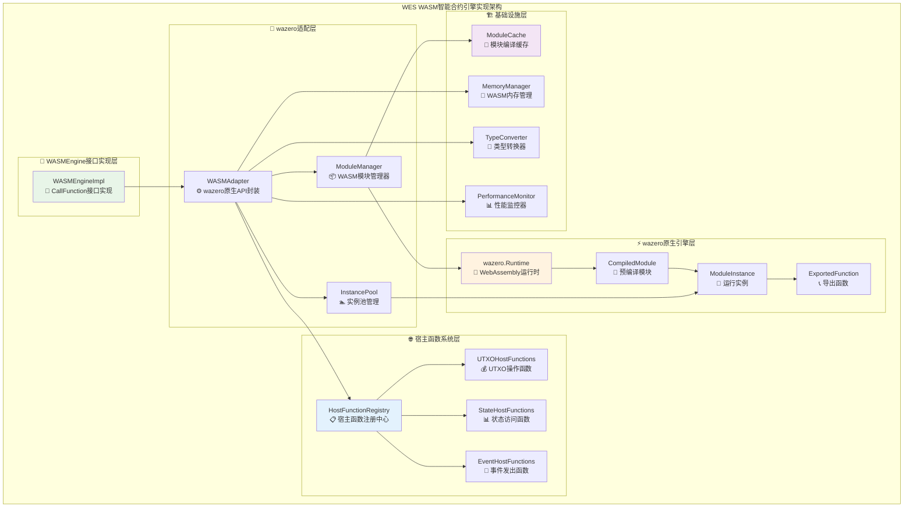
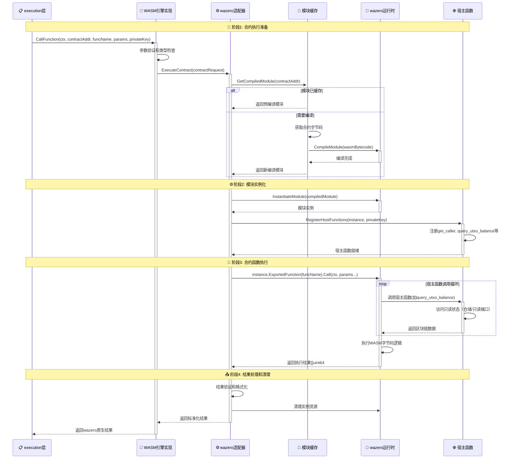
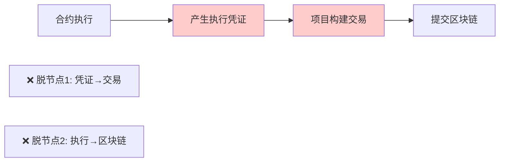
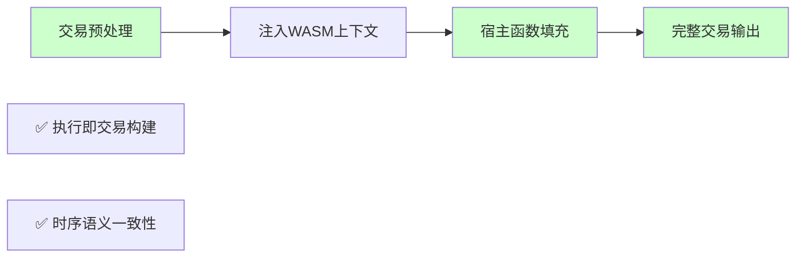
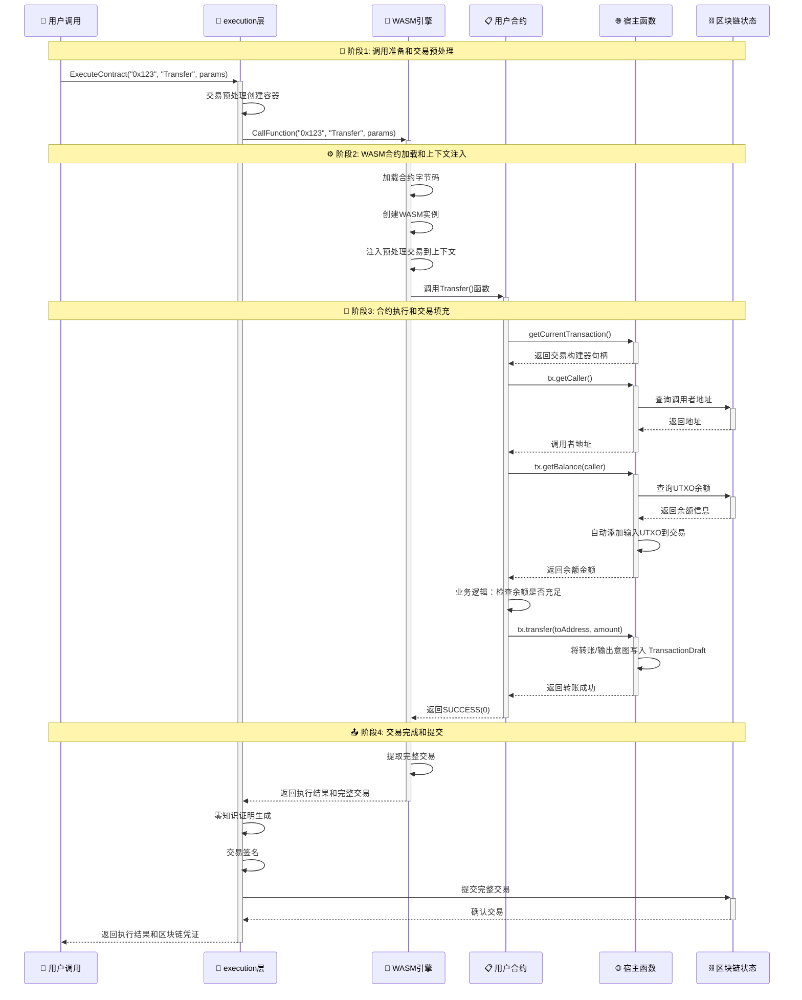

# WES WASM智能合约引擎实现（internal/core/engines/wasm）

【实现定位】
　　本模块是WES系统中**WASM智能合约引擎的具体实现**，负责**基于wazero深度集成实现高性能WebAssembly智能合约执行**。通过**零抽象开销的原生API映射**和**完整的宿主函数系统**，提供**确定性的智能合约执行能力**，支撑**DeFi、NFT、游戏等区块链应用场景**，确保**执行性能最优化和区块链状态访问的完整性**。

---

## ✅ 执行语义：读直取、写走草稿（打散构造期环）

**核心语义**：宿主函数的“读”直接从只读端口/仓储获取链状态；“写”不直接上链，而是写入 `ExecutionContext.TransactionDraft`，由 tx 层在出块/提交路径统一构建、签名、提交。

架构影响：
- engines 模块在 Provider 阶段不应对 `ChainService/BlockService` 建立硬依赖（否则形成 `engines → blockchain → ... → engines` 的回边）。
- 读能力可通过：
  - 在 ISPC 组装 `ExecutionContext` 时注入只读端口；或
  - 使用 fx.Invoke 在系统 ready 后将只读接口注入宿主实现（运行期注入，而非 Provider 形参）。
- 写能力严格经 `TransactionDraft` 聚合到 tx 层，避免 engines → tx 的构造期边。

与主流做法对齐：
- EVM：执行期累积状态变更，成功一次性提交；不在执行中“再提交一笔新交易”。
- CosmWasm/Substrate：合约不直达 mempool/共识；以消息/事件表达意图，由运行时/外部逻辑持久化。
- EUTXO：链下构建、链上验证；与“写走草稿”的职责拆分吻合。

ABI 注意：
- 发现 `execute_utxo_transfer` 在 SDK 与宿主侧存在 tokenID 形参不一致的风险，需统一两端签名；短期可使用 `create_utxo_output` 或对齐后再启用转账接口。

---

## 📊 交易草稿机制（Transaction Draft）

### 核心概念

合约执行不直接上链，而是构建"交易草稿"（Transaction Draft），由 tx 层统一构建、签名、提交：

```
合约执行 → ExecutionContext.TransactionDraft → tx 层构建/签名 → 上链
   ↓
 记录意图（Asset/State/Resource Outputs + 事件）
```

### 草稿内容构成

```go
type TransactionDraft struct {
    Outputs []* pb.TxOutput // 资产/状态/资源输出列表
    Events  []*Event        // 事件列表
    ReturnData []byte       // 返回数据
    // 转账意图由宿主函数转换为输出（消费/创建）
}
```

### DraftRecorder 能力现状

**✅ 架构重构（2025-10-16）**：草稿构建已委托给 `TransactionDraftService`

| 方法 | 功能 | 现状 | 说明 |
|------|------|------|------|
| `AppendAssetOutput` | 追加资产输出 | ✅ 已重构 | 委托给 TransactionDraftService，支持原生币和合约代币 |
| `AppendStateOutput` | 追加状态输出 | ✅ 已重构 | 委托给 TransactionDraftService，基础实现完成 |
| `AppendResourceOutput` | 追加资源输出 | ✅ 已重构 | 委托给 TransactionDraftService，支持 WASM/ONNX/文档 |
| `Transfer` | 记录转账意图 | ✅ 已实现 | 通过 TransactionDraftService 创建输出，业务语义清晰 |

**架构改进**：
- ❌ 之前：HostABI 直接构建 `TransactionDraft`（越俎代庖）
- ✅ 现在：HostABI 委托给 `TransactionDraftService`（职责清晰）
- 💡 优势：分层清晰、复用性高、易于测试、符合原始设计

### 与业务能力的映射

| 业务场景 | 宿主函数 | 草稿操作 | 阻塞因素 |
|---------|---------|---------|---------|
| 代币发行/增发 | `create_utxo_output` | AppendAssetOutput（ContractTokenAsset） | ❌ 合约代币输出创建待实现 |
| 转账 | `execute_utxo_transfer` | AppendAssetOutput（to）+ 消费 from UTXO | ⚠️ 签名不一致；合约币未通 |
| 批量转账/空投 | `batch_create_outputs` | 批量 AppendAssetOutput | ❌ ABI 缺失 |
| 冻结/解冻 | `create_asset_output_with_lock` | AppendAssetOutput（含锁定条件） | ❌ 锁定条件入参缺失 |
| 质押 | `create_asset_output_with_lock` | AppendAssetOutput（Time/Height/Delegation Lock） | ❌ 锁定条件入参缺失 |
| 治理/数据锚定 | `append_state_output` | AppendStateOutput（proposal/vote hash + ZK） | ❌ 宿主未暴露 |
| 合约/模型部署 | `append_resource_output` | AppendResourceOutput（ResourceUTXO） | ❌ 宿主未暴露 |

【设计原则】

### 🎯 **核心原则：职责单一，执行与验证分离**

**1. 职责单一原则**
- 执行引擎的唯一职责是**为智能合约提供完整的宿主能力**
- 不负责验证执行的正确性或安全性（交给 ZK 层 - ISPC）

**2. 能力完整性原则**
- 提供完整的宿主函数能力（包括数据库、网络、文件系统等 I/O）
- 不预设限制，支持任意业务场景（电商、医疗、金融等）

**3. 可验证性原则**
- 记录完整的执行轨迹（ExecutionTrace）
- 安全性和正确性由 ZK 层通过数学证明保证

⚠️ **架构变更**：host/ 目录已删除，宿主函数功能已迁移到 `internal/core/ispc/hostabi/`

**4. 技术实现原则**
- **wazero原生集成**：直接使用wazero的原生API，保持WebAssembly执行的最佳性能
- **宿主函数完整性**：提供完整的区块链状态访问宿主函数，支持合约与链上数据交互
- **内存管理优化**：高效的WASM内存管理和数据传递，最小化执行开销
- **合约生命周期管理**：完整的合约加载、编译、实例化、执行、销毁生命周期

【核心职责】
1. **WASMEngine接口具体实现**：实现pkg/interfaces/engines.WASMEngine的CallFunction方法
2. **wazero深度适配**：封装wazero的Runtime、Module、Function等核心API
3. **WASM合约生命周期**：管理合约的加载、编译、缓存、实例化全生命周期
4. **宿主函数系统**：实现get_caller、query_utxo_balance等区块链宿主函数
5. **内存和类型管理**：处理Go与WASM之间的数据类型转换和内存管理
6. **性能优化集成**：模块预编译、函数缓存、并发执行等性能优化

【实现架构】

　　采用**分层适配架构**，确保**wazero原生性能的充分发挥**和**区块链功能的完整集成**。



**实现层次说明：**

1. **WASMEngine接口实现层**：提供符合pkg/interfaces/engines规范的CallFunction实现
2. **wazero适配层**：封装wazero原生API，提供统一的WASM执行接口  
3. **宿主函数系统层**：实现完整的区块链状态访问宿主函数
4. **wazero原生引擎层**：直接使用wazero的核心组件，保持最佳性能

---

## 🎯 **WASM智能合约执行实现**

【WASM执行实现概述】

　　基于**wazero v1.9.0**的原生API，通过**零拷贝的数据传递**和**高效的内存管理**，实现高性能的智能合约执行能力。

### **📊 WASM合约执行流程图**



### **🔄 详细实现分析**

#### **阶段1: WASMEngine接口具体实现**

**📍 核心实现职责**: 实现pkg/interfaces/engines.WASMEngine接口，提供标准化的WASM执行能力

**🔄 关键实现组件**:

1. **WASMEngine核心实现** (`engine_impl.go`)
   ```go
   // pkg/interfaces/engines.WASMEngine.CallFunction的具体实现
   func (we *WASMEngineImpl) CallFunction(
       ctx context.Context,
       contractAddress string,
       functionName string, 
       params []uint64,
       callerPrivateKey ...string,
   ) ([]uint64, error) {
       // 1. 参数验证和私钥提取
       if err := we.validateInputs(contractAddress, functionName, params); err != nil {
           return nil, fmt.Errorf("参数验证失败: %w", err)
       }
       
       privateKey := ""
       if len(callerPrivateKey) > 0 {
           privateKey = callerPrivateKey[0]
       }
       
       // 2. 构建执行请求并委托给适配器
       request := &WASMExecutionRequest{
           ContractAddress:  contractAddress,
           FunctionName:     functionName,
           Parameters:       params,
           CallerPrivateKey: privateKey,
           ExecutionContext: ctx,
       }
       
       result, err := we.adapter.ExecuteContract(ctx, request)
       if err != nil {
           return nil, fmt.Errorf("WASM合约执行失败: %w", err)
       }
       
       return result.Results, nil
   }
   ```

#### **阶段2: wazero深度适配实现**

**📍 核心实现职责**: 封装wazero原生API，提供高性能的WASM执行能力

**🔄 关键实现组件**:

1. **WASM适配器核心** (`adapter.go`)
   ```go
   // 执行WASM合约的核心实现
   func (wa *WASMAdapter) ExecuteContract(
       ctx context.Context, 
       request *WASMExecutionRequest,
   ) (*WASMExecutionResult, error) {
       // 1. 获取编译模块和实例
       module, err := wa.moduleManager.GetCompiledModule(ctx, request.ContractAddress)
       if err != nil {
           return nil, fmt.Errorf("模块获取失败: %w", err)
       }
       
       instance, err := wa.instancePool.GetOrCreateInstance(ctx, module)
       if err != nil {
           return nil, fmt.Errorf("实例创建失败: %w", err)
       }
       defer wa.instancePool.ReturnInstance(instance)
       
       // 2. 注册宿主函数并执行
       if err := wa.hostRegistry.RegisterToInstance(instance, request.CallerPrivateKey); err != nil {
           return nil, fmt.Errorf("宿主函数注册失败: %w", err)
       }
       
       exportedFunc := instance.ExportedFunction(request.FunctionName)
       if exportedFunc == nil {
           return nil, fmt.Errorf("函数 %s 在合约中不存在", request.FunctionName)
       }
       
       results, err := exportedFunc.Call(ctx, request.Parameters...)
       if err != nil {
           return nil, fmt.Errorf("函数执行失败: %w", err)
       }
       
       return &WASMExecutionResult{
           Results:         results,
           Success:         true,
           ContractAddress: request.ContractAddress,
           FunctionName:    request.FunctionName,
           ExecutionTime:   time.Since(time.Now()),
       }, nil
   }
   ```

2. **模块管理器实现** (`module_manager.go`)
   ```go
   // 获取编译后的WASM模块（优先从缓存）
   func (mm *ModuleManager) GetCompiledModule(ctx context.Context, contractAddress string) (wazero.CompiledModule, error) {
       // 1. 尝试从缓存获取
       mm.mutex.RLock()
       if module, exists := mm.cache[contractAddress]; exists {
           mm.mutex.RUnlock()
           return module, nil
       }
       mm.mutex.RUnlock()
       
       // 2. 缓存未命中，加载并编译
       bytecode, err := mm.bytecodeStore.GetContractBytecode(contractAddress)
       if err != nil {
           return nil, fmt.Errorf("字节码加载失败: %w", err)
       }
       
       module, err := mm.runtime.CompileModule(ctx, bytecode)
       if err != nil {
           return nil, fmt.Errorf("模块编译失败: %w", err)
       }
       
       // 3. 缓存编译结果
       mm.mutex.Lock()
       mm.cache[contractAddress] = module
       mm.mutex.Unlock()
       
       return module, nil
   }
   ```

#### **阶段3: 宿主函数系统实现**

**📍 核心实现职责**: 为WASM合约提供完整的区块链状态访问能力

**🔄 关键实现组件**:

1. **宿主函数注册中心** (`host_functions.go`)
   ```go
   // 向WASM实例注册所有宿主函数
   func (hfr *HostFunctionRegistry) RegisterToInstance(
       instance wazero.Module, 
       callerPrivateKey string,
   ) error {
       hostCtx := &HostContext{
           CallerPrivateKey: callerPrivateKey,
           UTXOService:      hfr.utxoService,
           StateService:     hfr.stateService,
           EventService:     hfr.eventService,
       }
       
       // 定义核心宿主函数映射
       hostFunctions := map[string]interface{}{
           "get_caller":              hfr.createGetCallerFunc(hostCtx),
           "query_utxo_balance":      hfr.createQueryBalanceFunc(hostCtx),
           "execute_utxo_transfer":   hfr.createTransferFunc(hostCtx),
           "state_get":               hfr.createStateGetFunc(hostCtx),
           "state_set":               hfr.createStateSetFunc(hostCtx),
           "emit_event":              hfr.createEmitEventFunc(hostCtx),
           // ... 其他宿主函数
       }
       
       // 批量注册到wazero实例
       for name, fn := range hostFunctions {
           if err := instance.ExportHostFunction(name, fn); err != nil {
               return fmt.Errorf("宿主函数 %s 注册失败: %w", name, err)
           }
       }
       return nil
   }
   
   // UTXO余额查询宿主函数
   func (hfr *HostFunctionRegistry) createQueryBalanceFunc(ctx *HostContext) func(uint32, uint32, uint32) uint64 {
       return func(addressPtr, tokenIDPtr, tokenIDLen uint32) uint64 {
           address, _ := readStringFromWASMMemory(addressPtr)
           tokenID, _ := readStringFromWASMMemory(tokenIDPtr, tokenIDLen)
           
           balance, err := ctx.UTXOService.QueryBalance(address, tokenID)
           if err != nil {
               return 0
           }
           return uint64(balance)
       }
   }
   ```

2. **WASM内存管理** (`memory_manager.go`)
   ```go
   // 从WASM内存读取字符串
   func (mm *MemoryManager) ReadString(ptr, length uint32) (string, error) {
       if ptr == 0 || length == 0 {
           return "", nil
       }
       
       memory := mm.instance.Memory()
       bytes, ok := memory.Read(ptr, length)
       if !ok {
           return "", errors.New("内存读取失败")
       }
       return string(bytes), nil
   }
   
   // 向WASM内存写入字符串
   func (mm *MemoryManager) WriteString(data string) (ptr, length uint32, err error) {
       bytes := []byte(data)
       memory := mm.instance.Memory()
       
       // 通过malloc分配WASM内存
       mallocFunc := mm.instance.ExportedFunction("malloc")
       results, err := mallocFunc.Call(context.Background(), uint64(len(bytes)))
       if err != nil {
           return 0, 0, fmt.Errorf("内存分配失败: %w", err)
       }
       
       ptr = uint32(results[0])
       memory.Write(ptr, bytes)
       return ptr, uint32(len(bytes)), nil
   }
   ```

### **🔒 ISPC确定性执行约束**

基于ISPC的单次执行验证语义，WASM引擎必须严格遵循确定性执行原则：

#### **确定性要求** ⚡
- **执行结果一致性**: 相同输入和上下文必须产生完全相同的执行结果
- **宿主函数调用确定性**: 所有宿主函数调用必须在相同状态下返回相同结果
- **内存访问确定性**: WASM内存分配和访问模式必须可重现
- **时间源确定性**: 通过执行上下文提供确定性时间戳，禁用系统时间调用

#### **实现策略** 🎯
```go
// 示例：确定性执行设置
type DeterministicConfig struct {
    FixedTimestamp   int64 // 固定执行时间戳
    DisableRandom    bool  // 禁用随机数生成
    MemoryDeterminism bool  // 启用确定性内存分配
}

// 确保WASM执行的确定性
func (we *WASMEngineImpl) ensureDeterministic() {
    // 通过执行上下文注入确定性数据
    we.contextManager.InjectDeterministicSources()
    // 禁用可能导致非确定性的宿主函数
    we.hostRegistry.DisableNonDeterministicFunctions()
}
```

#### **受控外部交互机制** 🌐
- **禁止直接外部I/O**: 所有外部数据访问必须通过`DeclareExternalState`宿主函数
- **声明式外部状态**: 合约声明需要的外部数据状态，由执行层验证并提供
- **可验证外部交互**: 所有外部交互必须提供可验证的证据和签名

### **⚡ WASM引擎性能特征**

- **模块编译**: 首次编译和缓存命中性能优化
- **实例创建**: 包含宿主函数注册的高效创建
- **函数调用**: 基于函数复杂度的执行优化
- **宿主函数调用**: 区块链操作的高效接口调用
- **内存操作**: 字符串读写的零拷贝优化
- **缓存策略**: 生产环境的智能缓存机制
- **确定性保证**: 100%可重现的执行结果

### **📋 WASM引擎实现价值总结**

#### **1. WebAssembly标准的完整实现** 🎯
- **完整规范支持**: 支持WebAssembly Core 1.0和2.0规范
- **高性能执行**: 利用wazero的JIT编译优化（在支持平台）
- **跨平台兼容**: 支持所有Go编译目标平台

#### **2. 区块链智能合约能力完整集成** 🌐
- **宿主函数完整**: 提供完整的区块链状态访问能力
- **UTXO操作支持**: 完整的UTXO查询、转账、输出创建功能
- **事件系统**: 支持合约事件发出和日志记录

#### **3. 高性能优化的深度实现** ⚡
- **模块预编译缓存**: 避免重复编译开销
- **实例池管理**: 复用实例，减少创建销毁开销  
- **零拷贝数据传递**: 最小化Go与WASM之间的数据拷贝

　　WES WASM智能合约引擎通过深度集成wazero和完整的宿主函数系统，实现了高性能、功能完整的WebAssembly智能合约执行能力，为DeFi、NFT、游戏等区块链应用提供了可靠的底层执行支撑。

---

## 📁 **WASM引擎实现结构** 🎯

【重构后的实际架构】

基于WES三层架构原则完成重构，实现了Manager薄实现+Service厚实现的标准模式：

```
internal/core/engines/wasm/
├── 📋 manager.go                   # 薄Manager：依赖注入+委托（InternalWASMEngine实现）
├── 📐 abi/                         # ABI编解码服务
│   ├── service.go                  # ABI Service：合约参数编解码业务逻辑
│   └── errors.go                   # ABI专用错误定义
├── ⚙️ engine/                      # WASM执行引擎服务  
│   ├── service.go                  # Engine Service：wazero执行业务逻辑
│   └── errors.go                   # Engine专用错误定义
├── 🌐 (host/ 目录已删除)          # 宿主函数功能已迁移到 internal/core/ispc/hostabi/
├── 📦 loader/                      # 合约加载器
│   ├── contract_loader.go          # ContractLoader：合约字节码加载
│   └── errors.go                   # Loader专用错误定义
├── 🚀 runtime/                     # WASM运行时
│   ├── wazero_runtime.go           # WASMRuntime：wazero运行时封装
│   ├── errors.go                   # Runtime专用错误定义
│   └── README.md                   # Runtime子系统文档
└── 📚 README.md                    # 本文档
```

### **🎯 重构后的组件职责分工** ⭐

| **组件** | **架构角色** | **核心职责** | **关键特性** | **文件数量** |
|---------|-------------|-------------|-------------|-------------|
| `manager.go` | 薄Manager | InternalWASMEngine接口实现，纯委托 | 依赖注入、方法委托 | 1个 |
| `abi/` | Service子系统 | 合约ABI编解码服务 | 参数序列化、结果反序列化 | 2个 |
| `engine/` | Service子系统 | WASM合约执行引擎 | wazero集成、性能优化 | 2个 |
| (host/ 已删除) | - | 功能已迁移到 hostabi | - | - |
| `loader/` | Provider子系统 | 合约字节码加载器 | 合约缓存、版本管理 | 2个 |
| `runtime/` | Service子系统 | wazero运行时封装 | 运行时配置、实例管理 | 3个 |

---

## 💡 **交易预处理+运行时填充创新方案**

【WES执行系统的核心创新】

　　WES WASM引擎实现了业界首创的**"交易预处理+运行时填充"执行模式**，完美解决了传统区块链执行系统中"执行结果与区块链凭证脱节"的根本问题。

### **🎯 传统模式的根本缺陷**



**问题分析**：
- **时序脱节**: 执行完成后才构建交易，存在时间窗口问题
- **语义脱节**: 执行逻辑与区块链状态变更分离，难以保证一致性
- **开发复杂**: 开发者需要同时处理业务逻辑和区块链交易构建

### **✅ WES创新解决方案：交易预处理模式**



#### **🔧 技术实现机制**

**阶段1: execution层预处理阶段**
```go
// internal/core/ispc层的实现
func (e *ExecutionCoordinator) Execute(request *ExecutionRequest) {
    // 1. 预处理：创建交易容器
    preprocessTx := &Transaction{
        ID:        generateTxID(),
        Inputs:    []UTXOReference{},  // 预留输入位置
        Outputs:   []UTXOOutput{},     // 预留输出位置  
        Operations: []Operation{},      // 预留操作位置
        Status:    "PREPROCESSING",    // 预处理状态
    }
    
    // 2. 注入到WASM执行上下文
    wasmCtx := e.wasmEngine.NewContext()
    wasmCtx.InjectTransaction(preprocessTx)  // 🎯 关键：预处理注入
    
    // 3. 执行合约（交易在执行中被填充）
    result := e.wasmEngine.ExecuteWithContext(wasmCtx, request.Contract)
    
    // 4. 提取完整交易
    completeTx := wasmCtx.ExtractTransaction()
    completeTx.Status = "COMPLETE"      // 标记完成
}
```

**阶段2: WASM运行时提供交易访问**
```go
// WASM执行上下文实现
type WASMExecutionContext struct {
    transactionBuilder *TransactionBuilder  // 私有交易构建器
    stateSnapshot      *StateView          // 只读状态视图
    executionID        string              // 执行唯一标识
}

// 宿主函数：无参获取预处理交易上下文
func hostGetCurrentTransaction(ctx *WASMContext) TransactionHandle {
    return ctx.GetTransactionBuilder()  // 🎯 无参数获取！
}
```

**阶段3: 合约代码零感知使用**
```go
// 合约代码示例 - 完全不知道区块链复杂性存在！
//export Transfer  
func Transfer() uint32 {
    // 1. 获取预处理交易上下文（无参数，系统自动提供）
    tx := getCurrentTransaction()  // 🎯 神奇的无参数获取
    
    // 2. 读取转账参数（从调用参数中）
    params := getContractParams()
    toAddress := params.GetString("to")
    amount := params.GetUint64("amount")
    
    // 3. 查询当前余额（自动填充交易的输入UTXO）
    myAddress := tx.getCaller()
    balance := tx.getBalance(myAddress) // 宿主函数自动处理UTXO查找
    
    if balance < amount {
        return ERROR_INSUFFICIENT_BALANCE
    }
    
    // 4. 执行转账（自动构建交易的输出UTXO）
    success := tx.transfer(toAddress, amount) // 宿主函数自动构建交易
    
    if success {
        return SUCCESS
    }
    return ERROR_EXECUTION_FAILED
}
```

#### **🌟 方案的突破性价值**

1. **时序一致性** 🕐
   - 交易容器在执行前预处理创建，避免时间窗口问题
   - 执行过程即交易构建过程，保证强一致性

2. **语义连贯性** 🧩  
   - 业务执行与区块链状态变更完全同步
   - 宿主函数调用直接对应交易操作，语义清晰

3. **开发者友好** 👨‍💻
   - 合约开发者完全不感知区块链复杂性
   - 写合约如写普通程序，系统自动处理区块链逻辑

4. **确定性保证** 🔒
   - 相同输入必然产生相同的交易结果
   - 执行失败时交易自动回滚，保证数据一致性

### **🔄 与传统方案的对比**

| **特性** | **传统后置凭证模式** | **WES交易预处理模式** |
|---------|-------------------|--------------------|
| **时序关系** | 先执行→后构建交易 | 先预处理交易→执行中填充 |
| **一致性** | 弱一致性，可能脱节 | 强一致性，执行即构建 |
| **开发复杂度** | 需要处理交易构建 | 完全透明，零感知 |
| **错误处理** | 两阶段错误处理 | 统一错误处理 |
| **性能** | 两次状态检查 | 一次性完成 |
| **可靠性** | 存在竞态条件 | 无竞态条件 |

　　这种**交易预处理+运行时填充**的创新模式，让WES成为业界首个真正实现"**执行即交易构建**"的区块链执行系统！

### **🔄 完整交互流程图**



### **📝 具体合约模板示例**

#### **示例1: 基础代币转账合约 (Learning模式)**

**文件位置**: `contracts/templates/learning/simple-token/src/main.go`

```go
//go:build tinygo.wasm

package main

import (
    "github.com/weisyn/v1/contracts/sdk/go/framework"
)

// ==================== 基础代币转账合约 ====================
//
// 🎯 这是一个Learning模式的代币合约，使用Framework SDK封装
// 适合初学者学习WES合约开发基础概念
//
// 💡 关键特点：
// - 使用framework.GetCurrentTransaction()获取交易上下文  
// - 简洁的API调用，错误处理完善
// - 详细的注释说明，适合学习

//export Transfer
func Transfer() uint32 {
    // 🎯 第1步：获取当前交易上下文（WES创新：无参数获取！）
    tx := framework.GetCurrentTransaction()
    if tx == nil {
        return framework.ERROR_EXECUTION_FAILED
    }
    
    // 📋 第2步：解析合约调用参数
    params := framework.GetContractParams()
    toAddress, err := params.GetString("to")
    if err != nil {
        framework.SetReturnString("参数解析失败: to地址无效")
        return framework.ERROR_INVALID_PARAMS
    }
    
    amount, err := params.GetUint64("amount")
    if err != nil {
        framework.SetReturnString("参数解析失败: amount金额无效")
        return framework.ERROR_INVALID_PARAMS  
    }
    
    // 👤 第3步：获取调用者地址
    caller := tx.GetCaller()
    if caller == "" {
        framework.SetReturnString("无法获取调用者地址")
        return framework.ERROR_UNAUTHORIZED
    }
    
    // 💰 第4步：查询调用者余额（自动处理输入UTXO）
    balance := tx.GetBalance(caller)
    if balance < amount {
        framework.SetReturnString("余额不足")
        return framework.ERROR_INSUFFICIENT_BALANCE
    }
    
    // 🔄 第5步：执行转账（自动构建交易输出）
    success := tx.Transfer(toAddress, amount)
    if !success {
        framework.SetReturnString("转账执行失败") 
        return framework.ERROR_EXECUTION_FAILED
    }
    
    // ✅ 第6步：设置成功返回信息
    framework.SetReturnString("转账成功完成")
    return framework.SUCCESS
}

//export GetBalance
func GetBalance() uint32 {
    // 获取交易上下文
    tx := framework.GetCurrentTransaction()
    
    // 解析查询地址参数
    params := framework.GetContractParams()
    address, err := params.GetString("address")
    if err != nil {
        return framework.ERROR_INVALID_PARAMS
    }
    
    // 查询余额
    balance := tx.GetBalance(address)
    
    // 返回余额结果
    framework.SetReturnUint64(balance)
    return framework.SUCCESS
}

//export Initialize  
func Initialize() uint32 {
    framework.SetReturnString("简单代币合约初始化完成")
    return framework.SUCCESS
}

func main() {
    // WASM合约入口点
}
```

#### **示例2: 高性能代币合约 (Standard模式)**

**文件位置**: `contracts/templates/standard/token/standard_token_template.go`

```go
//go:build tinygo.wasm

package main

import (
    "unsafe"
)

// ==================== 高性能标准代币合约 ====================
//
// 🎯 这是一个Standard模式的代币合约，直接使用宿主函数
// 适合生产环境，追求最高性能
//
// 💡 关键特点：
// - 直接调用宿主函数，零封装开销
// - 手动内存管理，性能最优
// - 支持完整ERC20功能集

// ==================== 宿主函数声明 ====================

// 🌐 交易上下文宿主函数
//go:wasmimport env get_current_transaction
func getCurrentTransaction() uint32

//go:wasmimport env get_caller  
func getCaller(addrPtr uint32) uint32

//go:wasmimport env get_contract_params
func getContractParams(paramsPtr uint32) uint32

// 🔍 UTXO查询宿主函数
//go:wasmimport env query_utxo_balance
func queryUTXOBalance(addressPtr uint32, addressLen uint32) uint64

// ⚡ UTXO操作宿主函数  
//go:wasmimport env execute_utxo_transfer
func executeUTXOTransfer(fromPtr uint32, fromLen uint32, toPtr uint32, toLen uint32, amount uint64) uint32

// 📤 返回值设置宿主函数
//go:wasmimport env set_return_data
func setReturnData(dataPtr uint32, dataLen uint32)

// 🧠 内存管理宿主函数
//go:wasmimport env malloc
func malloc(size uint32) uint32

//go:wasmimport env free
func free(ptr uint32)

// ==================== 合约核心实现 ====================

//export Transfer
func Transfer() uint32 {
    // 🎯 第1步：获取当前交易上下文句柄
    txHandle := getCurrentTransaction()
    if txHandle == 0 {
        return 6 // ERROR_EXECUTION_FAILED
    }
    
    // 📋 第2步：解析合约参数（高性能内存操作）
    paramsPtr := malloc(256)  // 分配参数缓冲区
    defer free(paramsPtr)
    
    if getContractParams(paramsPtr) == 0 {
        return 1 // ERROR_INVALID_PARAMS  
    }
    
    // 解析to地址和amount（直接内存操作）
    toAddressPtr := malloc(42)   // 地址长度42字节
    defer free(toAddressPtr)
    
    amountPtr := malloc(8)       // uint64金额8字节
    defer free(amountPtr)
    
    // 从参数缓冲区提取数据（省略具体解析逻辑）
    parseTransferParams(paramsPtr, toAddressPtr, amountPtr)
    
    amount := *(*uint64)(unsafe.Pointer(uintptr(amountPtr)))
    
    // 👤 第3步：获取调用者地址
    callerPtr := malloc(42)
    defer free(callerPtr)
    
    if getCaller(callerPtr) == 0 {
        return 3 // ERROR_UNAUTHORIZED
    }
    
    // 💰 第4步：查询余额（直接宿主函数调用）
    balance := queryUTXOBalance(callerPtr, 42)
    if balance < amount {
        setErrorReturn("余额不足")
        return 2 // ERROR_INSUFFICIENT_BALANCE
    }
    
    // 🔄 第5步：执行UTXO转账（高性能宿主函数）
    result := executeUTXOTransfer(
        callerPtr, 42,      // from地址和长度
        toAddressPtr, 42,   // to地址和长度  
        amount,             // 转账金额
    )
    
    if result == 0 {
        setErrorReturn("转账执行失败")
        return 6 // ERROR_EXECUTION_FAILED
    }
    
    // ✅ 第6步：设置成功返回
    setSuccessReturn("转账成功")
    return 0 // SUCCESS
}

// 工具函数：设置成功返回
func setSuccessReturn(message string) {
    msgBytes := []byte(message)
    msgPtr := malloc(uint32(len(msgBytes)))
    
    // 拷贝消息到WASM内存
    copy((*(*[256]byte)(unsafe.Pointer(uintptr(msgPtr))))[:len(msgBytes)], msgBytes)
    
    setReturnData(msgPtr, uint32(len(msgBytes)))
    free(msgPtr)
}

// 工具函数：设置错误返回
func setErrorReturn(message string) {
    // 实现类似setSuccessReturn
    setSuccessReturn(message)
}

// 工具函数：解析转账参数（省略具体实现）
func parseTransferParams(paramsPtr, toPtr, amountPtr uint32) {
    // 实现参数解析逻辑
}

func main() {}
```


### **🌐 宿主函数系统完整列表**

WES为WASM合约提供了丰富的宿主函数，实现交易预处理+运行时填充：

#### **🎯 交易上下文函数（核心创新）**
```go
//go:wasmimport env get_current_transaction
func getCurrentTransaction() uint32             // 🌟 获取当前预处理交易句柄

//go:wasmimport env get_caller
func getCaller(addrPtr uint32) uint32          // 获取调用者地址

//go:wasmimport env get_contract_address
func getContractAddress(addrPtr uint32) uint32 // 获取合约地址
```

#### **💰 UTXO操作函数（自动填充交易）**
```go
//go:wasmimport env query_utxo_balance  
func queryUTXOBalance(addressPtr uint32, tokenIDPtr uint32, tokenIDLen uint32) uint64
// 🔍 查询余额时自动添加相关UTXO为交易输入

//go:wasmimport env execute_utxo_transfer
func executeUTXOTransfer(fromPtr uint32, toPtr uint32, amount uint64, tokenIDPtr uint32, tokenIDLen uint32) uint32
// ⚡ 执行转账时自动构建UTXO输出到交易中

//go:wasmimport env create_utxo_output
func createUTXOOutput(addressPtr uint32, amount uint64, tokenIDPtr uint32) uint32
// 🏗️ 创建UTXO输出（代币铸造、奖励发放等）
```

#### **📊 状态访问函数**
```go
//go:wasmimport env state_get
func stateGet(keyPtr uint32, keyLen uint32, valuePtr uint32) uint32

//go:wasmimport env state_set
func stateSet(keyPtr uint32, keyLen uint32, valuePtr uint32, valueLen uint32) uint32

//go:wasmimport env state_exists
func stateExists(keyPtr uint32, keyLen uint32) uint32
```

#### **📡 事件和日志函数**
```go
//go:wasmimport env emit_event
func emitEvent(namePtr uint32, nameLen uint32, dataPtr uint32, dataLen uint32)

//go:wasmimport env set_return_data
func setReturnData(dataPtr uint32, dataLen uint32)
```

#### **🔗 区块链信息函数**  
```go
//go:wasmimport env get_block_height
func getBlockHeight() uint64

//go:wasmimport env get_timestamp  
func getTimestamp() uint64

//go:wasmimport env get_block_hash
func getBlockHash(height uint64, hashPtr uint32) uint32
```

🔑 **关键特性**：每个宿主函数调用都会：
- **查询类函数**: 通过只读端口读取，不产生副作用
- **操作类函数**: 仅记录副作用到 `TransactionDraft`（不直接落链）  
- **上下文函数**: 提供执行环境信息，不影响交易结构


---

## 🚀 **智能合约应用场景支持**

【支持的合约类型】

### **DeFi智能合约** 💰
- **代币合约**: ERC20风格的代币发行、转账、授权
- **交易所合约**: AMM流动性池、订单簿交易、价格预言机
- **借贷合约**: 抵押借贷、利率计算、清算机制
- **质押合约**: 代币质押、奖励分发、锁仓释放

### **NFT智能合约** 🎨
- **NFT发行**: ERC721/ERC1155风格的NFT铸造和管理
- **NFT市场**: 拍卖、固定价格销售、版税分配
- **游戏道具**: 游戏内资产、属性升级、合成机制
- **收藏品**: 限量发行、稀有度系统、盲盒开启

### **游戏智能合约** 🎮
- **游戏逻辑**: 回合制战斗、策略游戏、抽卡系统
- **经济系统**: 游戏内货币、道具交易、公会系统
- **竞技系统**: 排行榜、锦标赛、奖励分发
- **社交功能**: 好友系统、聊天记录、社区治理

### **治理智能合约** 🏛️
- **投票系统**: 提案创建、投票统计、执行机制
- **DAO治理**: 代币持有者治理、资金管理、权限控制
- **多签钱包**: 多方签名、交易审批、权限管理
- **合规监管**: KYC/AML检查、黑名单管理、合规报告

---

## 📋 **开发实施指南**

【实现状态评估】

### **当前实现状态** 🚧
- **基础管理器**: 已有manager.go基础实现 
- **fx集成**: 已集成到engines模块中
- **接口定义**: pkg/interfaces/engines.WASMEngine已定义

### **优先实施计划**

1. **第一优先级：核心引擎实现** (Week 1-2)
   - 实现`engine_impl.go`中的CallFunction方法
   - 创建`adapter.go`中的wazero适配器核心
   - 实现基础的`module_manager.go`模块管理

2. **第二优先级：宿主函数系统** (Week 2-3)  
   - 实现`host_functions.go`中的完整宿主函数
   - 创建`memory_manager.go`处理WASM内存操作
   - 集成区块链服务接口调用

3. **第三优先级：性能优化** (Week 3-4)
   - 实现`cache.go`中的模块编译缓存
   - 创建`instance_pool.go`实例池优化
   - 完善`metrics.go`性能监控

### **质量标准要求**
- **性能基准**: 与直接wazero调用性能差异 < 10%
- **功能完整性**: 支持所有pkg/interfaces/engines.WASMEngine接口
- **宿主函数覆盖**: 实现contracts/sdk/go/framework中声明的所有宿主函数
- **缓存效率**: 模块编译缓存优化

### **测试验证策略**
- **单元测试**: 每个组件的独立功能测试
- **集成测试**: 与execution层的集成测试  
- **性能测试**: 各类智能合约的性能基准测试
- **兼容性测试**: 不同类型WASM合约的兼容性验证

【参考文档】
- [wazero官方文档](https://wazero.io/)
- [WebAssembly规范](https://webassembly.github.io/spec/)
- [合约SDK框架](../../../../contracts/sdk/go/framework/)
- [engines层总体架构](../README.md)

---

> 📝 **实现说明**：本README详细说明了WASM引擎的具体实现架构和wazero深度集成方案。重点关注高性能执行能力和完整的宿主函数系统实现。

> 🔄 **维护指南**：随着WASM引擎实现的推进，本文档将持续更新实现细节和性能优化策略。建议在每次重要功能完成后同步更新对应的实现状态和测试结果。
