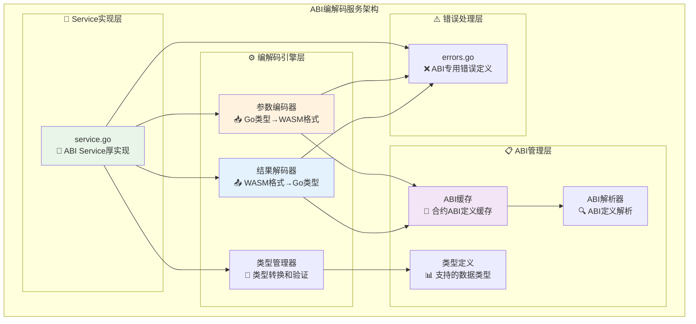
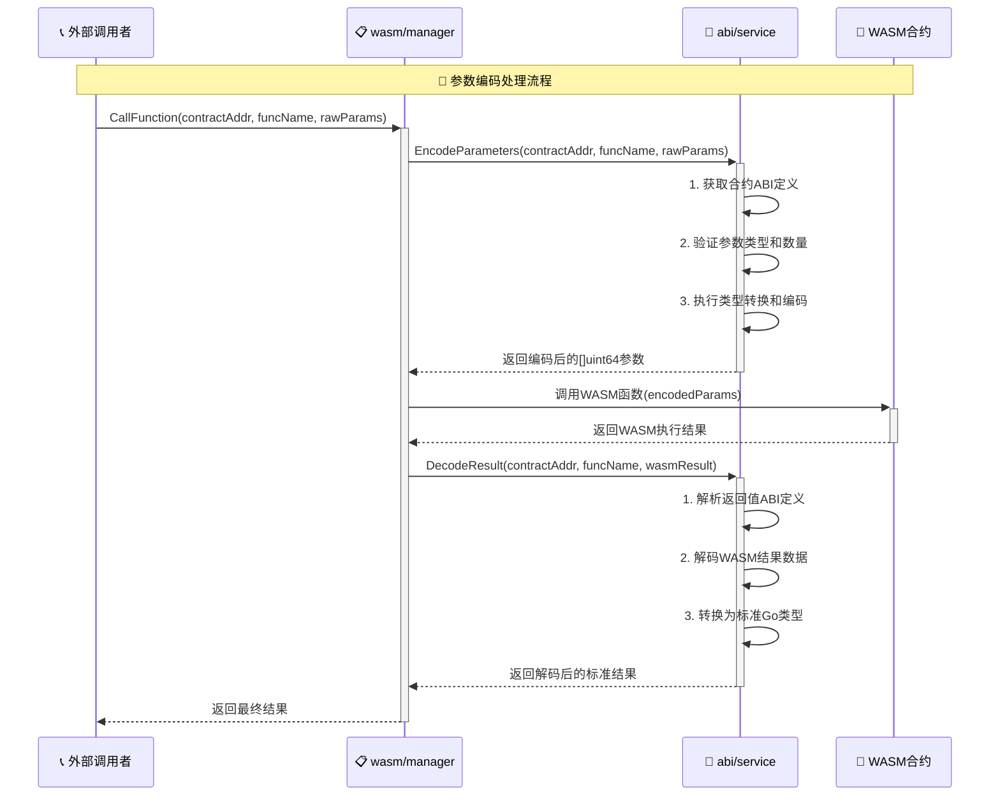

# ABI编解码服务（internal/core/engines/wasm/abi）

【模块定位】
　　本模块是WES系统中**WASM合约ABI编解码服务的具体实现**，负责**智能合约参数和结果的序列化与反序列化处理**。通过**高性能编解码算法**和**类型安全保证**，提供**合约调用参数的标准化处理能力**，支撑**WASM合约与外部系统的数据交互**，确保**数据格式的一致性和兼容性**。

【设计原则】
- **类型安全保证**：严格的参数类型检查和转换，避免数据溢出和类型错误
- **高性能编解码**：优化的序列化算法，最小化编解码开销
- **标准ABI兼容**：遵循以太坊ABI标准，确保跨平台兼容性
- **错误处理完善**：详细的错误分类和错误信息，便于调试和排错
- **Service实现模式**：厚实现包含具体业务逻辑，由wasm/manager薄委托

【核心职责】
1. **参数编码服务**：将外部调用参数编码为WASM合约可识别的格式
2. **结果解码服务**：将WASM合约执行结果解码为标准格式
3. **ABI管理服务**：管理智能合约的ABI定义和缓存
4. **类型转换服务**：处理Go类型与WASM类型之间的安全转换
5. **统一错误处理**：提供ABI操作相关的专门错误定义

【实现架构】

　　采用**Service实现模式**，通过**高效的编解码引擎**确保**数据处理的性能和准确性**。



---

## 🔄 **ABI处理流程**

### **📊 参数编码流程**



### **⚡ 性能特征**

- **参数编码**: ~0.1-1ms (取决于参数复杂度)
- **结果解码**: ~0.1-0.5ms (取决于返回数据大小)
- **ABI缓存查询**: ~0.01-0.05ms (内存缓存)
- **类型转换**: ~0.05-0.2ms (取决于类型复杂度)
- **内存占用**: 每个ABI定义 ~1-10KB

---

## 📁 **模块文件结构**

```
internal/core/engines/wasm/abi/
├── 📐 service.go                  # ABI Service厚实现
│   ├── EncodeParameters()         # 参数编码实现
│   ├── DecodeResult()             # 结果解码实现
│   ├── RegisterABI()              # ABI注册管理
│   ├── GetABI()                   # ABI获取查询
│   └── 内部编解码方法              # 具体的编解码逻辑
└── ⚠️ errors.go                   # ABI专用错误定义
    ├── ErrContractNotFound        # 合约未找到错误
    ├── ErrABINotRegistered        # ABI未注册错误
    ├── ErrParameterTypeMismatch   # 参数类型不匹配错误
    ├── ErrInvalidParameterCount   # 参数数量错误
    └── ErrDecodingFailed          # 解码失败错误
```

### **🎯 核心方法说明**

| **方法** | **功能** | **输入** | **输出** | **复杂度** |
|---------|---------|---------|---------|-----------|
| `EncodeParameters()` | 参数编码 | Go类型参数 | []uint64编码结果 | 中等 |
| `DecodeResult()` | 结果解码 | WASM执行结果 | 标准Go类型结果 | 中等 |
| `RegisterABI()` | ABI注册 | 合约地址+ABI定义 | 注册成功状态 | 低 |
| `GetABI()` | ABI查询 | 合约地址 | ABI定义 | 低 |

---

## 🚀 **开发实施要点**

### **实现优先级**
1. **核心编解码逻辑** - EncodeParameters和DecodeResult方法
2. **ABI缓存管理** - 高效的ABI定义存储和查询
3. **类型系统完善** - 支持各种Go和WASM类型转换
4. **错误处理优化** - 详细的错误信息和分类

### **质量要求**
- **编码准确性**: 100%数据完整性保证
- **性能要求**: 参数编码<1ms，结果解码<0.5ms
- **内存效率**: ABI缓存命中率>95%
- **错误覆盖**: 完整的异常情况处理

---

> 📝 **说明**：ABI服务是WASM引擎的重要组成部分，负责外部世界与WASM合约间的数据格式转换，其实现质量直接影响合约调用的便利性和性能。
