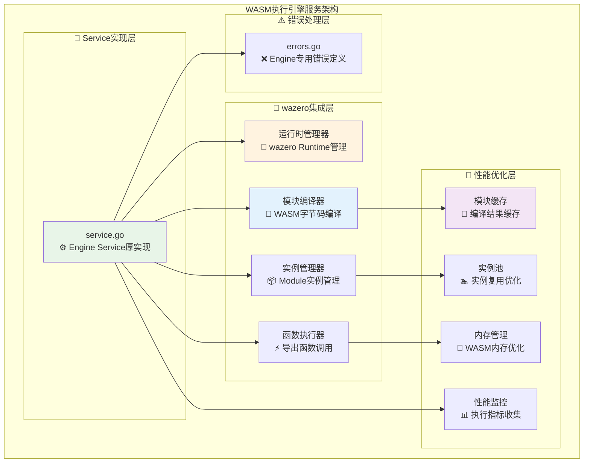
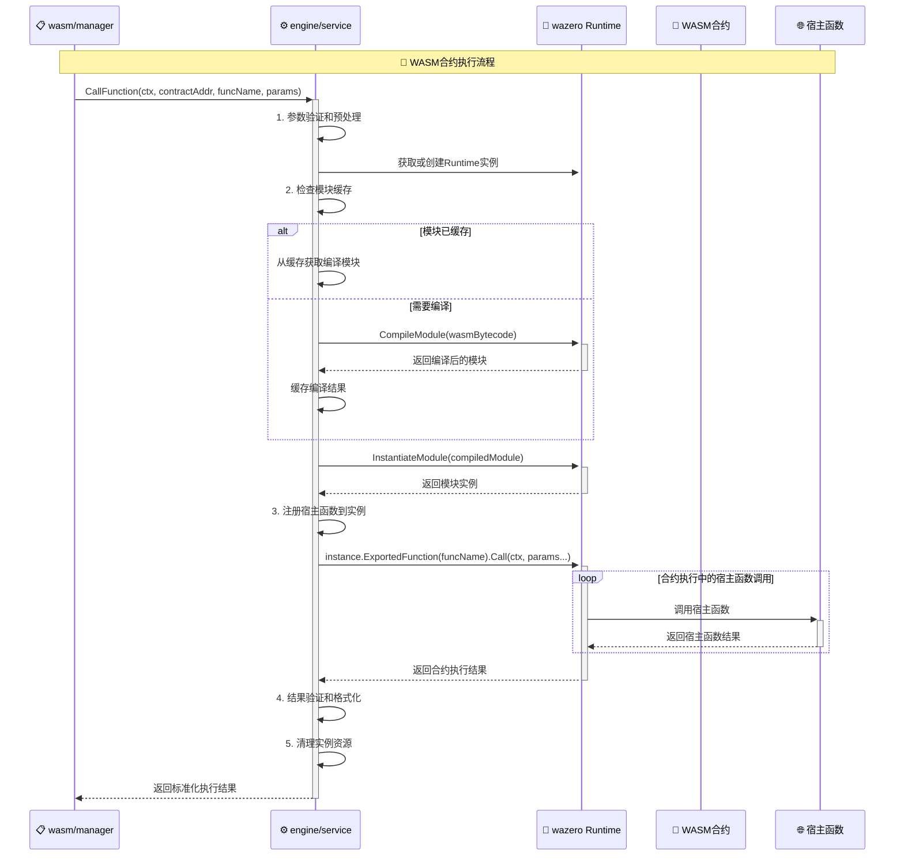

# WASM执行引擎服务（internal/core/engines/wasm/engine）

【模块定位】
　　本模块是WES系统中**WASM智能合约执行引擎的核心实现**，负责**基于wazero的高性能WebAssembly字节码执行**。通过**原生API深度集成**和**性能优化策略**，提供**确定性的智能合约执行能力**，支撑**DeFi、NFT、游戏等区块链应用的合约运行**，确保**执行性能最优化和资源管理的高效性**。

【设计原则】
- **wazero原生集成**：直接使用wazero的核心API，保持WebAssembly执行的最佳性能
- **确定性执行保证**：确保相同输入产生相同输出，满足区块链执行的确定性要求
- **资源管理优化**：高效的WASM实例和内存管理，最小化资源消耗
- **并发执行支持**：支持多个合约的并发执行，提升系统吞吐量
- **Service实现模式**：厚实现包含复杂执行逻辑，由wasm/manager薄委托

【核心职责】
1. **WASM字节码执行**：实现engines.WASMEngine接口的核心CallFunction方法
2. **wazero运行时管理**：管理wazero运行时实例和配置
3. **合约实例生命周期**：处理WASM模块的编译、实例化、执行、销毁
4. **性能优化实现**：模块缓存、实例复用、内存优化等性能策略
5. **统一错误处理**：提供执行引擎相关的专门错误定义

【实现架构】

　　采用**Service实现模式**，通过**wazero深度集成**确保**高性能的WebAssembly执行能力**。



---

## 🔄 **WASM执行流程**

### **📊 合约执行流程**



### **⚡ 性能特征**

- **模块编译**: ~5-50ms (取决于合约大小，缓存命中<1ms)
- **实例创建**: ~1-5ms (包含宿主函数注册)
- **函数调用**: ~0.1-10ms (取决于合约复杂度)
- **内存操作**: ~0.01-0.1ms (字符串读写)
- **缓存查询**: ~0.01-0.05ms (内存缓存)
- **实例清理**: ~0.1-1ms (资源释放)

---

## 📁 **模块文件结构**

```
internal/core/engines/wasm/engine/
├── ⚙️ service.go                  # Engine Service厚实现
│   ├── CallFunction()             # 核心执行方法实现
│   ├── CompileContract()          # 合约编译实现
│   ├── CreateInstance()           # 实例创建实现
│   ├── ExecuteFunction()          # 函数执行实现
│   ├── 性能优化方法                # 缓存和优化逻辑
│   └── 资源管理方法                # 实例和内存管理
└── ⚠️ errors.go                   # Engine专用错误定义
    ├── ErrContractCompilationFailed    # 合约编译失败错误
    ├── ErrInstanceCreationFailed       # 实例创建失败错误
    ├── ErrFunctionNotFound             # 函数未找到错误
    ├── ErrExecutionFailed              # 执行失败错误
    ├── ErrInvalidParameters            # 参数无效错误
    └── ErrResourceExhausted            # 资源耗尽错误
```

### **🎯 核心方法说明**

| **方法** | **功能** | **输入** | **输出** | **复杂度** |
|---------|---------|---------|---------|-----------|
| `CallFunction()` | 合约函数执行 | 合约地址+函数名+参数 | 执行结果 | 高 |
| `CompileContract()` | 合约编译 | WASM字节码 | 编译后的模块 | 中等 |
| `CreateInstance()` | 实例创建 | 编译模块+配置 | 模块实例 | 中等 |
| `ExecuteFunction()` | 函数执行 | 实例+函数名+参数 | 执行结果 | 高 |

---

## 🔧 **wazero集成特性**

### **运行时配置** ⚙️
```go
// 示例：wazero运行时配置
runtimeConfig := wazero.NewRuntimeConfig().
    WithCompilationCache(compilationCache).     // 启用编译缓存
    WithCloseOnContextDone(true).               // 上下文取消时自动清理
    WithMemoryLimitPages(256)                   // 内存限制：256页(16MB)
```

### **确定性执行保证** 🔒
- **固定时间源**: 使用确定性时间戳，避免系统时间差异
- **禁用非确定性功能**: 关闭随机数生成等非确定性操作  
- **内存布局固定**: 确保相同的内存分配模式
- **执行路径一致**: 相同输入产生完全相同的执行路径

### **性能优化策略** ⚡
- **JIT编译**: 利用wazero的即时编译优化（支持的平台）
- **模块预编译**: 提前编译常用合约，减少执行延迟
- **实例复用**: 智能的实例池管理，避免频繁创建销毁
- **内存映射**: 高效的WASM内存映射和访问

---

## 🚀 **开发实施要点**

### **实现优先级**
1. **核心执行逻辑** - CallFunction方法和wazero集成
2. **性能优化实现** - 模块缓存和实例池管理
3. **确定性保证** - 确定性配置和验证机制
4. **错误处理完善** - 详细的错误分类和处理

### **质量要求**
- **执行准确性**: 100%与wazero官方行为一致
- **性能指标**: 缓存命中率>90%，执行延迟<10ms
- **资源管理**: 内存泄漏零容忍，实例清理完整性
- **确定性验证**: 相同输入100%相同输出

---

> 📝 **说明**：Engine服务是WASM引擎的执行核心，直接影响智能合约的执行性能和稳定性。其与wazero的集成深度决定了整个系统的执行能力上限。
