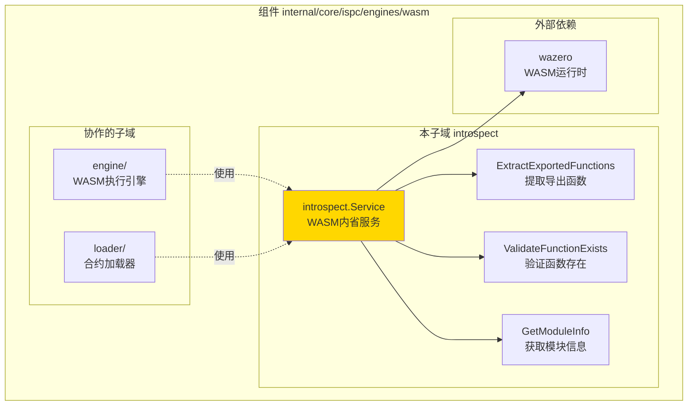
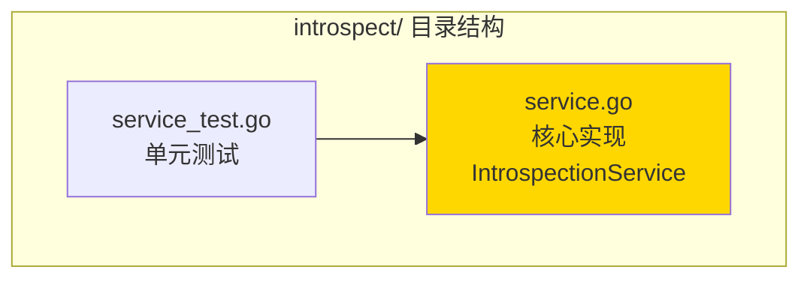

# introspect - WASM字节码内省服务

---

## 📌 版本信息

- **版本**：1.0
- **状态**：stable
- **最后更新**：2025-11-24
- **最后审核**：2025-11-24
- **所有者**：WES ISPC 开发组
- **适用范围**：WASM合约静态分析和元数据提取

---

## 🎯 子域定位

**路径**：`internal/core/ispc/engines/wasm/introspect/`

**所属组件**：`ispc`

**核心职责**：提供WASM字节码的静态分析能力，提取合约导出函数、ABI信息等元数据

**在组件中的角色**：
- 合约部署时自动提取导出函数列表
- 合约调用前验证函数存在性
- 开发工具展示合约接口信息
- ABI生成与校验

---

## 🏗️ 架构设计

### 在组件中的位置

> **说明**：展示此子域在组件内部的位置和协作关系



**位置说明**：

| 关系类型 | 目标 | 关系说明 |
|---------|------|---------|
| **被使用** | engine | 执行引擎在调用前验证函数存在性 |
| **被使用** | loader | 加载器在加载时提取合约元数据 |
| **依赖** | wazero | 使用wazero解析WASM模块结构 |

---

### 内部组织

> **说明**：展示此子域内部的文件组织和类型关系



---

## 📁 目录结构

```
internal/core/ispc/engines/wasm/introspect/
├── README.md                    # 本文档
├── service.go                   # 核心实现：内省服务
└── service_test.go              # 单元测试
```

---

## 🔧 核心实现

### 实现文件：`service.go`

**核心类型**：`IntrospectionService`

**职责**：提供WASM模块的静态分析能力，包括导出函数提取、函数存在性验证、模块信息获取

**关键字段**：

```go
type IntrospectionService struct {
    // 可扩展字段，如缓存、配置等
}
```

**关键方法**：

| 方法名 | 职责 | 可见性 | 备注 |
|-------|------|-------|-----|
| `NewIntrospectionService()` | 构造函数 | Public | 创建内省服务实例 |
| `ExtractExportedFunctions()` | 提取导出函数列表 | Public | 从WASM字节码解析导出表 |
| `ExtractExportedFunctionsFromFile()` | 从文件提取导出函数 | Public | 便捷方法，封装文件读取 |
| `ValidateFunctionExists()` | 验证函数存在性 | Public | 检查指定函数是否导出 |
| `GetModuleInfo()` | 获取模块完整信息 | Public | 返回模块元数据（可扩展） |

---

## 🔗 协作关系

### 依赖的接口

| 接口 | 来源 | 用途 |
|-----|------|-----|
| `wazero.Runtime` | `github.com/tetratelabs/wazero` | WASM模块解析 |

---

### 被依赖关系

**被以下子域使用**：
- `engine/` - 执行前验证函数存在性
- `loader/` - 加载时提取合约元数据
- 开发工具 - 展示合约接口信息

**示例**：

```go
// 在执行引擎中使用
import "github.com/weisyn/v1/internal/core/ispc/engines/wasm/introspect"

func (e *Engine) CallFunction(ctx context.Context, hash []byte, method string, params []uint64) {
    // 验证函数存在性
    svc := introspect.NewIntrospectionService()
    exists, err := svc.ValidateFunctionExists(wasmBytes, method)
    if err != nil || !exists {
        return nil, fmt.Errorf("函数 %s 不存在", method)
    }
    
    // 执行函数...
}
```

---

## 🧪 测试

### 测试覆盖

| 测试类型 | 文件 | 覆盖率目标 | 当前状态 |
|---------|------|-----------|---------|
| 单元测试 | `service_test.go` | ≥ 80% | ✅ 已实现 |

---

### 测试示例

```go
func TestExtractExportedFunctionsFromFile(t *testing.T) {
    // Arrange
    svc := introspect.NewIntrospectionService()
    wasmPath := "./test_contract.wasm"
    
    // Act
    functions, err := svc.ExtractExportedFunctionsFromFile(wasmPath)
    
    // Assert
    assert.NoError(t, err)
    assert.Contains(t, functions, "Transfer")
    assert.Contains(t, functions, "GetBalance")
}
```

---

## 📊 关键设计决策

### 决策 1：基于wazero实现

**问题**：如何解析WASM字节码提取元数据？

**方案**：使用wazero的CompileModule API解析WASM模块，提取导出函数信息

**理由**：
- 零依赖：wazero是WASM引擎的依赖，无需额外依赖
- 高性能：wazero的解析性能优秀
- 线程安全：支持并发调用

**权衡**：
- ✅ 优点：性能好，线程安全，无需额外依赖
- ⚠️ 缺点：依赖wazero API（符合架构）

---

### 决策 2：过滤内部函数

**问题**：如何区分业务函数和内部函数？

**方案**：过滤掉内存管理函数（malloc/free）和标准启动函数（_start/_initialize）

**理由**：
- 业务函数才是合约接口
- 内部函数不应暴露给调用者
- 符合WebAssembly标准实践

**过滤规则**：
- 过滤内存管理函数：malloc, calloc, realloc, free
- 过滤标准启动函数：_start, _initialize
- 过滤私有函数：以下划线开头的函数名

---

### 决策 3：预留扩展接口

**问题**：未来可能需要更多元数据，如何设计接口？

**方案**：提供GetModuleInfo接口，当前仅返回导出函数列表，未来可扩展

**理由**：
- 接口稳定：GetModuleInfo接口稳定，内部实现可扩展
- 向后兼容：现有调用者不受影响
- 易于扩展：添加新字段到ModuleInfo结构体

**未来可扩展字段**：
- 导入的宿主函数列表
- 内存配置信息
- 自定义段（Custom Sections）
- 函数签名信息

---

## 📚 相关文档

- [WASM引擎实现](../README.md)
- [wazero官方文档](https://wazero.io/)
- [WebAssembly规范](https://webassembly.github.io/spec/)

---

## 📝 变更历史

| 版本 | 日期 | 变更内容 | 作者 |
|-----|------|---------|------|
| 1.0 | 2025-11-24 | 初始版本，创建WASM内省服务 | WES ISPC 开发组 |

---

## 🚧 待办事项

- [ ] 扩展GetModuleInfo返回更多元数据
- [ ] 添加函数签名提取功能
- [ ] 支持自定义段解析
- [ ] 添加缓存机制（避免重复解析）

---

**使用说明**：
1. 创建IntrospectionService实例
2. 调用ExtractExportedFunctions提取导出函数列表
3. 调用ValidateFunctionExists验证函数存在性
4. 调用GetModuleInfo获取完整模块信息（未来扩展）

