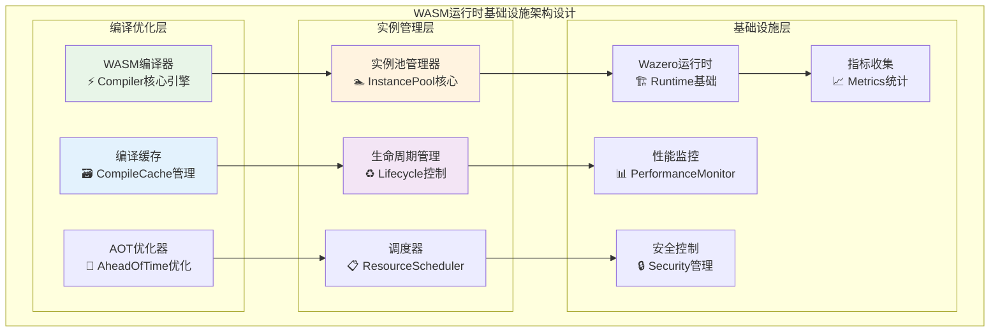
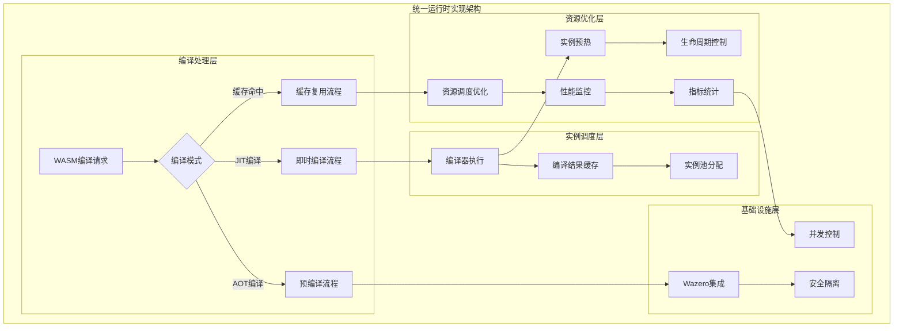
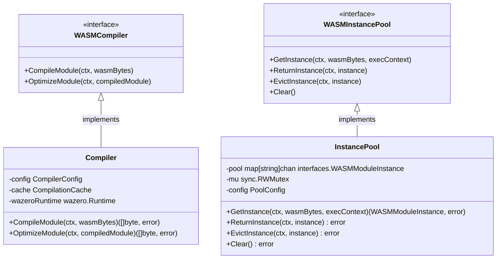

# WASM运行时基础设施（internal/core/engines/wasm/runtime）

【模块定位】
　　本模块是WES系统中WASM执行引擎的运行时基础设施层，负责WASM模块的编译优化和实例池管理。通过高性能的编译器和智能的实例池设计，提供WASM模块的高效执行环境，支撑ISPC执行即构建的性能需求，确保WASM执行的低延迟和高吞吐量。

【设计原则】
- **编译优化驱动**：基于wazero的JIT编译技术，实现WASM字节码的高性能编译
- **实例池化管理**：通过实例池技术实现WASM模块的高效复用和资源节约
- **资源生命周期管理**：精确控制WASM实例的创建、使用和回收生命周期
- **并发安全保证**：线程安全的实例池和编译器设计，支持高并发执行
- **性能监控优化**：实时监控编译和执行性能，持续优化系统表现

【核心职责】
1. **WASM模块编译**：将WASM字节码编译为高效的机器代码或中间表示
2. **编译缓存管理**：管理编译结果的缓存，避免重复编译开销
3. **实例池管理**：维护WASM模块实例池，提供高效的实例获取和回收
4. **资源优化调度**：智能调度WASM实例的分配和释放，优化资源使用
5. **性能指标收集**：收集编译和执行的性能指标，支持系统优化
6. **并发控制管理**：确保多线程环境下的资源安全访问和状态一致性

【实现架构】

　　采用**编译+池化双核心**的2层实现架构，确保WASM运行时的高性能和资源高效利用。



**架构层次说明：**

1. **编译优化层**：负责WASM字节码的高效编译和优化
   - JIT编译器的核心实现和优化策略
   - 编译结果的缓存管理和复用机制
   - Ahead-of-Time编译优化和预处理

2. **实例管理层**：负责WASM模块实例的生命周期管理
   - 实例池的创建、分配、回收和优化
   - 实例生命周期的精确控制和监控
   - 智能的资源调度和负载均衡算法

---

## 📁 **模块组织结构**

【内部模块架构】

```
internal/core/engines/wasm/runtime/
├── ⚡ compiler.go                 # WASM编译器实现
├── 🏊 instance_pool.go            # WASM实例池管理
└── 📋 README.md                   # 本文档
```

### 🎯 文件职责分工

| **文件** | **核心职责** | **对外接口** | **内部组件** | **复杂度** |
|---------|-------------|-------------|-------------|-----------|
| `compiler.go` | WASM模块编译优化 | WASMCompiler接口 | JIT编译器、缓存管理 | 高 |
| `instance_pool.go` | WASM实例池管理 | WASMInstancePool接口 | 实例池、生命周期管理 | 中等 |

---

## 🔄 **统一运行时实现**

【实现策略】

　　所有运行时组件均严格遵循**高性能+资源优化**架构模式，确保WASM执行的低延迟和高效率特征。



**关键实现要点：**

1. **编译性能优化**：
   - JIT编译的智能缓存和复用机制
   - 热点代码的编译优化和加速
   - 编译结果的持久化和跨会话复用

2. **实例池高效管理**：
   - 预热实例的智能创建和维护策略
   - 基于使用模式的动态池大小调整
   - 实例回收的内存清理和状态重置

3. **并发安全保证**：
   - 线程安全的实例池访问和管理
   - 编译过程的并发控制和同步
   - 资源竞争的避免和死锁预防

---

## 🏗️ **依赖注入架构**

【fx框架集成】

　　全面采用fx依赖注入框架，实现组件间的松耦合和生命周期自动管理。

```go
// 示例：运行时模块依赖注入配置
package runtime

import (
    "go.uber.org/fx"
    "github.com/weisyn/v1/internal/core/engines/interfaces"
)

// Module 运行时模块
var Module = fx.Module("wasm_runtime",
    // 导入核心组件
    fx.Provide(
        // 编译优化层
        NewCompiler,
        
        // 实例管理层
        NewInstancePool,
    ),
    
    // 导出内部接口
    fx.Provide(
        fx.Annotate(
            func(compiler *Compiler) interfaces.WASMCompiler {
                return compiler
            },
            fx.As(new(interfaces.WASMCompiler)),
        ),
        fx.Annotate(
            func(pool *InstancePool) interfaces.WASMInstancePool {
                return pool
            },
            fx.As(new(interfaces.WASMInstancePool)),
        ),
    ),
)
```

**依赖管理特点：**
- **组件协作**：编译器和实例池的协调工作和资源共享
- **配置驱动**：通过配置文件控制编译策略和池管理参数
- **监控集成**：自动注入性能监控和指标收集组件
- **测试支持**：支持Mock依赖的单元测试和集成测试

---

## 📊 **性能与监控**

【性能指标】

| **操作类型** | **优化重点** | **监控方式** |
|-------------|------------|------------|
| JIT编译 | 编译效率和缓存命中率 | 实时监控 |
| 实例创建 | 创建速度和资源使用 | 批量统计 |
| 实例获取 | 池化效率和访问延迟 | 关键路径监控 |
| 实例回收 | 清理完整性和内存回收 | 异步监控 |
| 编译缓存 | 缓存命中率和存储效率 | 实时监控 |

**性能优化策略：**
- **编译缓存优化**：LRU缓存策略和智能预加载机制
- **实例池调优**：基于负载模式的动态池大小管理
- **内存优化**：实例内存的高效分配和垃圾回收
- **并发优化**：多核并行编译和实例分配

---

## 🔗 **与公共接口的映射关系**

【接口实现映射】



**实现要点：**
- **接口契约严格遵循**：所有方法的参数、返回值和语义与接口定义完全一致
- **错误处理规范**：统一的错误类型定义和处理机制
- **性能监控集成**：每个关键操作都有对应的性能指标收集
- **并发安全保证**：所有公共方法都是线程安全的

---

## 🚀 **后续扩展规划**

【模块演进方向】

1. **编译技术升级**
   - WASM AOT编译支持
   - 多层编译优化策略
   - 跨平台编译优化

2. **实例池增强**
   - 智能预热策略优化
   - 分层实例池管理
   - 基于ML的负载预测

3. **性能优化深化**
   - GPU加速编译支持
   - 内存映射优化
   - NUMA感知的实例分配

4. **企业级特性**
   - 多租户实例隔离
   - 资源配额精确控制
   - 实例池监控和告警

---

## 📋 **开发指南**

【运行时开发规范】

1. **新增功能步骤**：
   - 在interfaces中定义相应的接口方法
   - 实现具体功能并保证线程安全
   - 添加完整的性能监控点
   - 编写单元测试和性能测试
   - 更新相关配置和文档

2. **代码质量要求**：
   - 遵循Go并发编程最佳实践
   - 100%的核心路径测试覆盖
   - 详细的性能基准测试
   - 内存泄漏检测和预防

3. **性能要求**：
   - 编译和实例管理延迟指标达标
   - 高并发场景下的稳定性
   - 内存和CPU使用效率优化
   - 长期运行的稳定性保证

【参考文档】
- [ISPC执行语义规范](../../../../_docs/specs/ispc/ISPC_ARCHITECTURE_AND_SEMANTICS.md)
- [ISPC实现指南](../../../../_docs/specs/ispc/ISPC_IMPLEMENTATION_GUIDE.md)
- [Wazero性能优化指南](https://github.com/tetratelabs/wazero/blob/main/PERFORMANCE.md)

---

> 📝 **文档说明**：本README基于ISPC规范和WES统一文档规范设计，专注于WASM运行时基础设施的性能优化和资源管理。

> 🔄 **维护指南**：本文档应随着运行时性能优化的演进及时更新，建议在每次性能优化或架构调整后更新相应章节。
