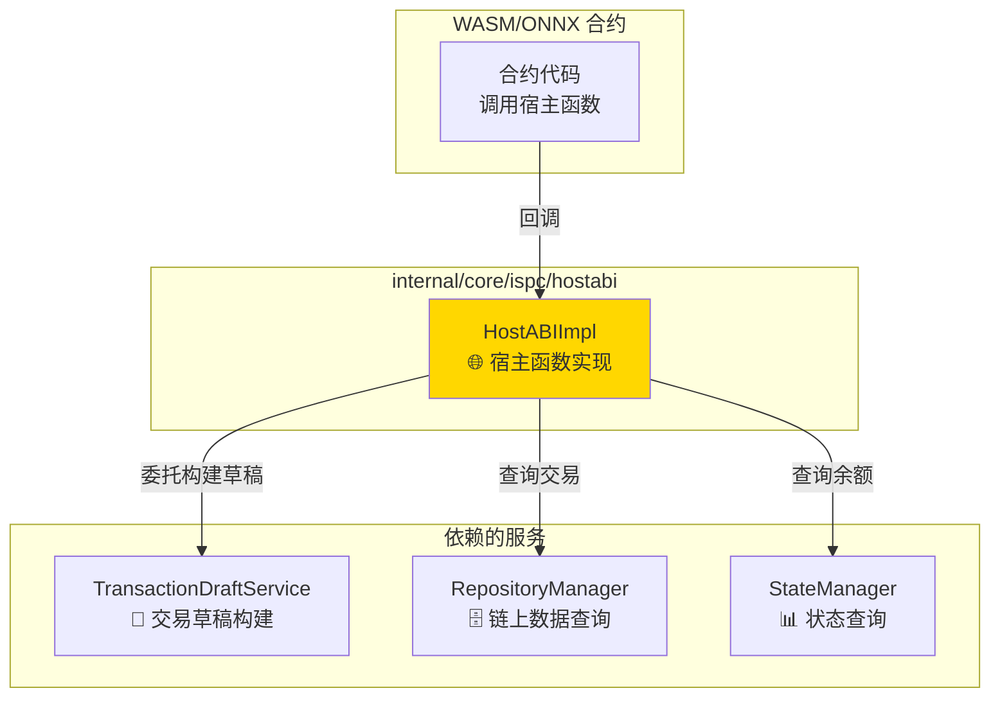
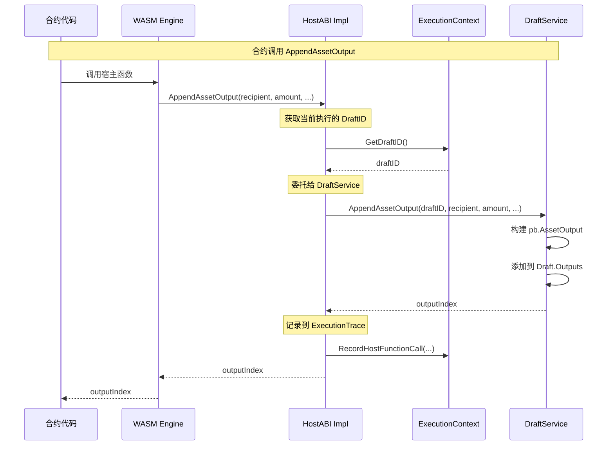
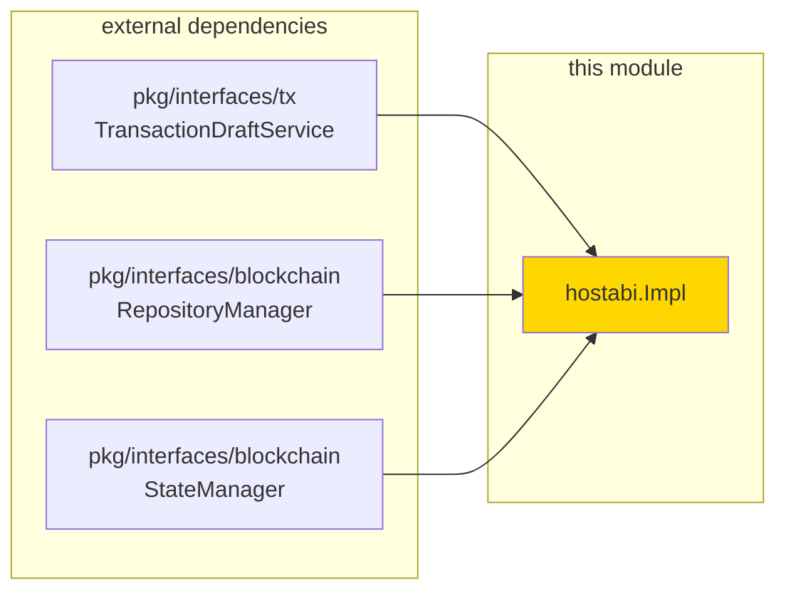

# ISPC HostABI 实现（internal/core/ispc/hostabi）

> **📌 模块类型**：`[X] 实现模块`

---

## 📍 模块定位

本模块实现 **ISPC 宿主函数业务语义**，提供引擎无关的 **HostABI（Host Application Binary Interface）**。

**解决什么问题**：
- 实现 `pkg/interfaces/ispc/hostabi.HostABI` 接口
- 提供只读查询能力（GetBalance, GetTransaction 等）
- 提供副作用操作能力（AppendAssetOutput, Transfer 等）
- **委托** TransactionDraftService 构建交易草稿

**不解决什么问题**（边界）：
- ❌ **不直接构建** TransactionDraft（已委托给 DraftService）
- ❌ 不实现 WASM ABI 编解码（由引擎层负责）
- ❌ 不暴露 UTXO 技术细节（提供账户抽象）
- ❌ 不管理执行上下文生命周期（由 context 层负责）

---

## 🎯 设计原则与核心约束

### 设计原则

| 原则 | 说明 | 价值 |
|------|------|------|
| **委托模式** | 委托 DraftService 构建草稿 | 职责清晰，易于测试 |
| **账户抽象** | 隐藏 UTXO 技术细节 | 降低开发门槛 |
| **引擎无关** | 统一的接口，不同引擎共享 | 避免重复实现 |
| **执行记录** | 所有操作记录到 ExecutionTrace | 支持 ZK 证明生成 |

### 核心约束

**严格遵守**：
- ✅ 必须实现 `pkg/interfaces/ispc/hostabi.HostABI` 接口
- ✅ 所有写操作必须委托给 TransactionDraftService
- ✅ 提供账户抽象，不暴露 UTXO 细节
- ✅ 所有操作记录到 ExecutionTrace

**严格禁止**：
- ❌ 不得直接操作 TransactionDraft
- ❌ 不得暴露 UTXO 技术细节给合约
- ❌ 不得实现 WASM/ONNX 特定逻辑
- ❌ 不得提供全局状态存储（违背 EUTXO 模型）

---

## 🏗️ 架构设计

### 宿主函数在架构中的桥梁作用



### 委托模式设计



### 核心设计决策

**为什么委托给 TransactionDraftService？**
- ✅ 职责清晰：HostABI 仅作为调用者，不涉及构建逻辑
- ✅ 复用性高：DraftService 可被其他模块使用（API、钱包等）
- ✅ 易于测试：DraftService 可独立测试
- ✅ 符合原始设计：与 `pkg/interfaces/blockchain` 保持一致

**为什么提供账户抽象？**
- ✅ 降低开发门槛：合约开发者无需理解 UTXO 模型
- ✅ 符合用户认知："我有多少钱？"比"我有哪些未花费输出？"更直观
- ✅ 避免 Cardano 陷阱：Plutus 暴露 UTXO 导致开发门槛极高

---

## 📋 HostABI 能力清单

### 1️⃣ 区块链上下文查询（只读）

**语义**：提供可验证的链上只读访问

| 函数名 | Go 签名 | 用途 | 实现状态 |
|--------|--------|------|---------|
| GetABIVersion | `() (uint32, error)` | 获取 Host ABI 版本号 | ✅ 已实现 |
| GetCallerAddress | `(ctx context.Context) ([]byte, error)` | 获取调用者地址（20字节） | ✅ 已实现 |
| GetContractAddress | `(ctx context.Context) ([]byte, error)` | 获取当前合约地址（20字节） | ✅ 已实现 |
| GetBlockHeight | `(ctx context.Context) (uint64, error)` | 获取当前区块高度 | ✅ 已实现 |
| GetBlockHash | `(ctx context.Context, height uint64) ([]byte, error)` | 获取指定高度的区块哈希 | ✅ 已实现 |
| GetBlockTimestamp | `(ctx context.Context) (uint64, error)` | 获取当前区块时间戳 | ✅ 已实现 |
| GetChainID | `(ctx context.Context) (string, error)` | 获取链标识符 | ✅ 已实现 |

**调用约定**：
- 所有查询基于 ExecutionContext 的固定高度视图
- 返回的地址/哈希为原始字节数组
- 查询结果记录到 ExecutionTrace

### 2️⃣ 账户查询（只读）- 账户抽象设计

**设计理念**：WES 对合约开发者提供账户抽象，隐藏 UTXO 技术细节

| 函数名 | Go 签名 | 用途 | 实现状态 |
|--------|--------|------|---------|
| GetBalance | `(ctx context.Context, address []byte, tokenID []byte) (uint64, error)` | 查询账户余额 | ✅ 已实现 |
| GetTransaction | `(ctx context.Context, txID []byte) (*pb.Transaction, uint64, bool, error)` | 查询交易详情 | ✅ 已实现 |

**为什么采用账户抽象**：
- 开发者只需关心："谁有多少钱？"
- 无需理解：UTXO 选择、找零、输入签名等技术细节
- 底层自动聚合地址的所有 UTXO

**对比**：

| Cardano Plutus（暴露 UTXO） | WES（账户抽象） |
|-----------------------------|----------------|
| 开发者需要理解 UTXO 模型 | 像传统账户一样使用 |
| 需要手动选择和构建 UTXO | 自动处理所有细节 |
| 开发门槛高，生态发展慢 | 开发门槛低，易于推广 |

### 3️⃣ 三层输出（Asset/Resource/State）

**语义**：记录合约意图到交易草稿，**委托** TransactionDraftService 构建

#### Asset 输出（价值载体）

| 函数名 | Go 签名 | 用途 | 实现状态 |
|--------|--------|------|---------|
| AppendAssetOutput | `(ctx, recipient, amount, tokenID, lockingConditions) (uint32, error)` | 追加资产输出 | ✅ 已实现 |
| AppendContractTokenOutput | `(ctx, recipient, amount, tokenID, metadata) (uint32, error)` | 追加合约代币输出（FT/NFT/SFT） | ✅ 已实现 |

#### Resource 输出（能力载体）

| 函数名 | Go 签名 | 用途 | 实现状态 |
|--------|--------|------|---------|
| AppendResourceOutput | `(ctx, contentHash, category, owner, lockingConditions, metadata) (uint32, error)` | 追加资源输出 | ✅ 已实现 |

**Category 映射**：
- `"wasm_contract"`, `"wasm"`, `"contract"` → WASM 合约
- `"onnx_model"`, `"onnx"`, `"aimodel"` → ONNX 模型
- `"document"`, `"data"`, `"static"` → 静态资源

#### State 输出（证据载体）

| 函数名 | Go 签名 | 用途 | 实现状态 |
|--------|--------|------|---------|
| AppendStateOutput | `(ctx, stateID, stateVersion, executionResultHash, publicInputs, parentStateHash) (uint32, error)` | 追加状态输出 | ✅ 已实现 |

### 4️⃣ 资产转账 - 账户抽象设计

**设计理念**：提供业务语义的转账接口，隐藏 UTXO 技术细节

| 函数名 | Go 签名 | 用途 | 实现状态 |
|--------|--------|------|---------|
| Transfer | `(ctx, from, to, amount, tokenID) error` | 执行资产转账（基础版） | ✅ 已实现 |
| TransferEx | `(ctx, from, to, amount, tokenID, lockingConditions) error` | 执行资产转账（扩展版） | ✅ 已实现 |

**账户抽象优势**：
- 开发者只需关心："谁给谁转多少钱"
- 无需理解：UTXO 选择算法、找零输出、输入签名等技术细节
- 底层自动处理所有资产管理逻辑

### 5️⃣ 代币生命周期

| 函数名 | Go 签名 | 用途 | 实现状态 |
|--------|--------|------|---------|
| AppendBurnIntent | `(ctx, tokenID, amount, burnProof) error` | 追加代币销毁意图 | ✅ 已实现 |
| AppendApproveIntent | `(ctx, tokenID, spender, amount, expiry) error` | 追加代币授权意图 | ✅ 已实现 |

### 6️⃣ 事件与日志

| 函数名 | Go 签名 | 用途 | 实现状态 |
|--------|--------|------|---------|
| EmitEvent | `(ctx, eventType, payload) error` | 发射事件（进链上） | ✅ 已实现 |
| LogDebug | `(ctx, message) error` | 调试日志（不进链上） | ✅ 已实现 |
| LogInfo | `(ctx, message) error` | 信息日志（不进链上） | ✅ 已实现 |
| LogWarn | `(ctx, message) error` | 警告日志（不进链上） | ✅ 已实现 |
| LogError | `(ctx, message) error` | 错误日志（不进链上） | ✅ 已实现 |

---

## 📊 核心机制

### 机制1：委托模式 - TransactionDraft 构建

**为什么需要**：分离宿主函数调用和交易构建逻辑

**核心思路**：

```go
// HostABIImpl 实现
type HostABIImpl struct {
    draftService tx.TransactionDraftService // 委托目标
    executionCtx *ExecutionContext          // 当前执行上下文
    repoManager  blockchain.RepositoryManager
    stateManager blockchain.StateManager
}

func (h *HostABIImpl) AppendAssetOutput(
    ctx context.Context, 
    recipient []byte, 
    amount uint64, 
    tokenID []byte,
    lockingConditions []*pb.LockingCondition,
) (uint32, error) {
    // 1. 获取当前执行的 DraftID
    draftID := h.executionCtx.GetDraftID()
    
    // 2. 委托给 TransactionDraftService
    outputIndex, err := h.draftService.AppendAssetOutput(
        draftID, recipient, amount, tokenID, lockingConditions)
    if err != nil {
        return 0, err
    }
    
    // 3. 记录到 ExecutionTrace
    h.executionCtx.RecordHostFunctionCall("AppendAssetOutput", ...)
    
    return outputIndex, nil
}
```

**关键约束**：
- HostABI 不直接操作 TransactionDraft
- 所有构建逻辑由 DraftService 完成
- HostABI 只负责参数传递和错误处理

### 机制2：账户抽象 - 隐藏 UTXO 细节

**为什么需要**：降低合约开发门槛

**核心思路**：
- GetBalance：自动聚合地址下的所有 UTXO
- Transfer：自动选择 UTXO、构建输入输出、计算找零
- 开发者只需关心："谁给谁转多少钱"

**实现示例**：

```go
func (h *HostABIImpl) GetBalance(
    ctx context.Context,
    address []byte,
    tokenID []byte,
) (uint64, error) {
    // 1. 查询地址的所有 UTXO
    utxos, err := h.stateManager.GetUTXOsByAddress(ctx, address, tokenID)
    if err != nil {
        return 0, err
    }
    
    // 2. 聚合余额
    var totalBalance uint64
    for _, utxo := range utxos {
        totalBalance += utxo.Amount
    }
    
    // 3. 记录到 ExecutionTrace
    h.executionCtx.RecordHostFunctionCall("GetBalance", ...)
    
    return totalBalance, nil
}

func (h *HostABIImpl) Transfer(
    ctx context.Context,
    from []byte,
    to []byte,
    amount uint64,
    tokenID []byte,
) error {
    // 1. 获取 DraftID
    draftID := h.executionCtx.GetDraftID()
    
    // 2. 委托给 DraftService（自动处理 UTXO 选择和找零）
    err := h.draftService.Transfer(draftID, from, to, amount, tokenID)
    if err != nil {
        return err
    }
    
    // 3. 记录到 ExecutionTrace
    h.executionCtx.RecordHostFunctionCall("Transfer", ...)
    
    return nil
}
```

**对比**：

| 暴露 UTXO（Cardano Plutus） | 账户抽象（WES） |
|---------------------------|----------------|
| 开发者需要理解 UTXO 模型 | 像传统账户一样使用 |
| 需要手动选择和构建 UTXO | 自动处理所有细节 |
| 开发门槛高，生态发展慢 | 开发门槛低，易于推广 |

---

## 🔗 依赖与协作

### 依赖关系图



### 依赖说明

| 依赖模块 | 依赖接口 | 用途 | 约束条件 |
|---------|---------|------|---------|
| pkg/interfaces/tx | TransactionDraftService | 构建交易草稿 | 必须提供有效的 DraftID |
| pkg/interfaces/blockchain | RepositoryManager | 查询链上数据 | 只读查询 |
| pkg/interfaces/blockchain | StateManager | 查询状态和余额 | 只读查询 |

---

## 📁 目录结构

```
internal/core/ispc/hostabi/
├── host_abi_impl.go           # 核心结构体和构造器
├── ports_context_read.go      # 区块链上下文只读
├── ports_query_utxo.go        # 账户查询
├── ports_outputs_asset.go     # 资产输出与转账
├── ports_outputs_resource.go  # 资源输出
├── ports_outputs_state.go     # 状态输出
├── ports_token_lifecycle.go   # 代币生命周期
├── ports_events_logging.go    # 事件与日志
├── errors.go                  # 错误定义
└── README.md                   # 本文档
```

### 组织原则

| 文件 | 职责 | 为什么这样组织 |
|------|------|---------------|
| host_abi_impl.go | 结构体定义和构造器 | 集中管理依赖注入 |
| ports_context_read.go | 链上上下文查询 | 只读操作，独立文件 |
| ports_query_utxo.go | 账户查询 | 账户抽象实现 |
| ports_outputs_*.go | 输出创建 | 按输出类型分文件 |
| ports_token_lifecycle.go | 代币操作 | 代币相关操作聚合 |
| ports_events_logging.go | 事件和日志 | 辅助功能独立 |

---

## ⚠️ 已知限制

| 限制 | 影响 | 规避方法 | 未来计划 |
|------|------|---------|---------|
| 账户抽象性能开销 | UTXO 聚合需要查询多个 UTXO | 使用索引优化查询 | 缓存余额信息 |
| 委托调用开销 | 多一层调用 | 可接受（约 0.1ms） | 无需优化 |
| ExecutionTrace 内存占用 | 大量调用时内存压力 | 限制 Trace 大小 | 压缩 Trace 数据 |

---

## 🔍 设计权衡记录

### 权衡1：为什么委托而不是直接构建？

**背景**：宿主函数需要操作交易草稿

**备选方案**：
1. 方案A：委托 DraftService - 优势：职责清晰，复用性高 - 劣势：多一层调用
2. 方案B：直接构建 - 优势：性能稍好 - 劣势：违反职责单一，难以测试

**选择**：选择了方案A

**理由**：
- ✅ 职责清晰：hostabi 只负责宿主函数逻辑
- ✅ 复用性高：DraftService 可被其他模块使用
- ✅ 易于测试：DraftService 可独立测试

**代价**：多一层调用开销（约 0.1ms）

### 权衡2：为什么提供账户抽象而不是暴露 UTXO？

**背景**：需要决定向合约开发者暴露什么抽象层次

**备选方案**：
1. 方案A：账户抽象 - 优势：开发门槛低 - 劣势：灵活性稍差
2. 方案B：暴露 UTXO - 优势：灵活性高 - 劣势：开发门槛极高

**选择**：选择了方案A

**理由**：
- ✅ 降低开发门槛：合约开发者无需理解 UTXO 模型
- ✅ 符合用户认知："我有多少钱？"更直观
- ✅ 避免 Cardano 陷阱：Plutus 暴露 UTXO 导致生态发展缓慢

**代价**：某些高级场景需要额外支持

---

## 🔗 与统一 ABI 层的关系

### HostABI 与合约 ABI 的职责划分

**HostABI 负责**：
- ✅ 提供「合约 ↔ ISPC」的宿主原语（17个最小原语）
- ✅ 提供区块链上下文查询（区块高度、时间戳等）
- ✅ 提供 UTXO 查询和交易构建原语

**HostABI 不负责**：
- ❌ 合约 ABI 解析与调用编码（由 `ABIService` + [统一 ABI 规范](../../../docs/components/core/ispc/abi-and-payload.md) 负责）
- ❌ Draft JSON 的字段定义（由统一 ABI 规范 + 协议 proto 负责）

### 依赖关系

```
合约代码
  ↓ 调用
HostABI（宿主原语）
  ↓ 使用
ABIService（合约 ABI 编解码）
  ↓ 遵循
统一 ABI 规范（docs/components/core/ispc/abi-and-payload.md）
```

**重要**：合约 SDK / Client SDK 不直接依赖 HostABI 实现，而是依赖统一 ABI 规范。

---

## 🔧 **架构边界与职责划分**

### HostABI 的职责边界

**HostABI 是 ISPC 执行层提供给智能合约的区块链宿主能力接口。**

**职责范围**：
- ✅ 提供区块链核心能力
- ✅ 支持"执行即构建"机制
- ✅ 确保链上操作的可验证性

**职责边界**：
- ❌ 不提供业务层的外部交互能力
- ❌ 不替代业务应用的基础设施
- ❌ 不混淆业务逻辑与区块链逻辑
- ❌ 不负责合约 ABI 编解码（由 ABIService + 统一 ABI 规范负责）

### 正确的架构分层

**三层架构模型**：
```
业务应用层: 业务逻辑、外部系统集成（数据库、HTTP、文件等）
    ↓ 调用 WASM 合约
WASM 合约: 链上业务逻辑，通过 HostABI 访问区块链能力
    ↓ 通过 HostABI
ISPC 执行层: 提供区块链宿主能力（链上下文、状态、UTXO、事件）
```

**关键原则**：
- 业务应用层直接处理外部交互（数据库、HTTP、文件等）
- WASM 合约只处理链上业务逻辑
- HostABI 只提供区块链核心能力

> 📖 **详细架构边界文档**：架构边界内容已整合到代码实现中，详见各服务实现文件。

---

## 📚 相关文档

- **HostABI 接口定义**：[pkg/interfaces/ispc/hostabi.go](../../../pkg/interfaces/ispc/hostabi.go) - 公共接口规范
- **ISPC 协调器实现**：[internal/core/ispc/README.md](../README.md) - 上层协调逻辑
- **TransactionDraftService 接口**：[pkg/interfaces/tx/draft.go](../../../pkg/interfaces/tx/draft.go) - 草稿服务接口
- **WASM 绑定层**：[internal/core/engines/wasm/host/](../../engines/wasm/host/) - WASM 特定绑定

---

## 📋 文档变更记录

| 日期 | 变更内容 | 原因 |
|------|---------|------|
| 2025-10-22 | 重构，补充委托模式和账户抽象设计 | 根据架构串联讨论成果重构 |
| 2025-10-22 | 补充与 TransactionDraftService 的协作关系 | 明确委托模式 |
| 2025-10-16 | 架构重构，委托给 TransactionDraftService | 职责清晰，符合原始设计 |

---

> 📝 **文档说明**：本文档遵循 `_docs/templates/README_TEMPLATE.md` v3.0 规范
> 
> 🎯 **核心理念**：少即是多，图胜千言，真实至上
