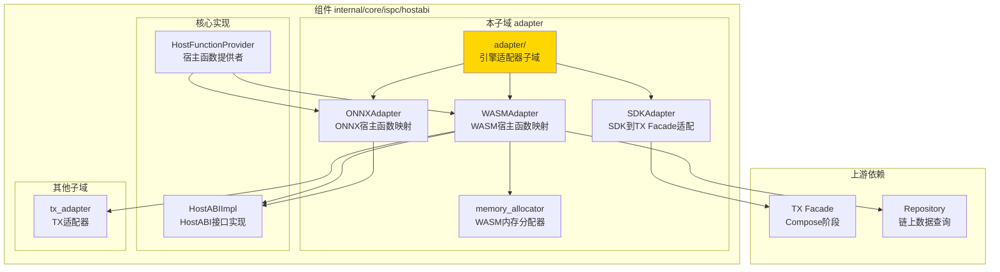
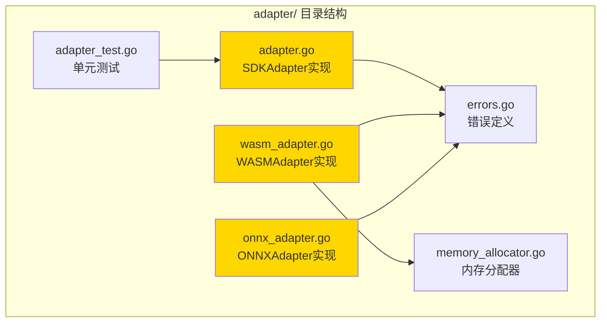

# Adapter - 引擎适配器子域

---

## 📌 版本信息

- **版本**：2.0
- **状态**：stable
- **最后更新**：2025-11-27
- **最后审核**：2025-11-27
- **所有者**：ISPC 团队
- **适用范围**：ISPC HostABI 引擎适配层

---

## 🎯 子域定位

**路径**：`internal/core/ispc/hostabi/adapter/`

**所属组件**：`hostabi`

**核心职责**：将 HostABI 的原语方法适配为不同执行引擎（WASM/ONNX）兼容的宿主函数映射，并提供 SDK 到 TX Facade 的适配

**在组件中的角色**：
- **引擎适配层**：为 WASM 和 ONNX 引擎构建宿主函数映射
- **SDK 桥接层**：连接合约 SDK 到 TX Facade 的 Compose 阶段
- **内存管理**：为 WASM 引擎提供内存分配器

---

## 🏗️ 架构设计

### 在组件中的位置

> **说明**：展示 adapter 子域在 hostabi 组件内部的位置和协作关系



**位置说明**：

| 关系类型 | 目标 | 关系说明 |
|---------|------|---------|
| **被调用** | HostFunctionProvider | 调用 WASMAdapter/ONNXAdapter 构建宿主函数映射 |
| **依赖** | HostABIImpl | 适配器使用 HostABI 的原语方法 |
| **依赖** | TX Facade | SDKAdapter 调用 Facade.Compose 创建交易草稿 |
| **依赖** | Repository | WASMAdapter 需要查询链上数据 |

---

### 内部组织

> **说明**：展示 adapter 子域内部的文件组织和类型关系



---

## 📁 目录结构

```
internal/core/ispc/hostabi/adapter/
├── README.md                    # 本文档
├── adapter.go                   # SDKAdapter - SDK到TX Facade适配
├── wasm_adapter.go              # WASMAdapter - WASM宿主函数映射
├── onnx_adapter.go              # ONNXAdapter - ONNX宿主函数映射
├── memory_allocator.go          # WASM内存分配器
├── errors.go                    # 错误定义
└── adapter_test.go              # 单元测试
```

---

## 🔧 核心实现

### 实现 1：`adapter.go` - SDKAdapter

**核心类型**：`SDKAdapter`

**职责**：连接合约 SDK 到 TX Facade 的 Compose 阶段，将 SDK draft JSON 转换为交易草稿

**关键字段**：

```go
type SDKAdapter struct {
    facade UnifiedTransactionFacade  // TX Facade接口（仅依赖Compose阶段）
}
```

**关键方法**：

| 方法名 | 职责 | 可见性 | 备注 |
|-------|------|-------|-----|
| `NewSDKAdapter()` | 构造函数 | Public | 用于依赖注入 |
| `BuildTransaction()` | 构建交易草稿 | Public | SDK入口，调用Facade.Compose |
| `parseSDKDraft()` | 解析SDK draft JSON | Private | 内部辅助方法 |
| `convertToTxIntents()` | 转换为TX intents | Private | 内部辅助方法 |
| `convertError()` | 错误转换 | Private | 转换为SDK友好错误 |

**设计要点**：
- M2 重构后只依赖 TX Facade 的 Compose 阶段
- Host 模式只负责创建 Draft，后续六阶段由外部环境完成
- 符合"执行即构建"的架构原则

---

### 实现 2：`wasm_adapter.go` - WASMAdapter

**核心类型**：`WASMAdapter`

**职责**：将 HostABI 的原语方法适配为 WASM 引擎兼容的闭包函数映射（24个函数）

**关键字段**：

```go
type WASMAdapter struct {
    logger         log.Logger
    chainQuery     persistence.ChainQuery
    blockQuery     persistence.BlockQuery
    eutxoQuery     persistence.UTXOQuery
    uresCAS        ures.CASStorage
    txQuery        persistence.TxQuery
    resourceQuery  persistence.ResourceQuery
    txHashClient   transaction.TransactionHashServiceClient
    addressManager crypto.AddressManager
    hashManager    crypto.HashManager
    txAdapter      interface{}  // TxAdapter类型（避免循环依赖）
    draftService   tx.TransactionDraftService
    getExecCtxFunc func(context.Context) ispcInterfaces.ExecutionContext
    
    // 函数依赖（避免循环导入）
    buildTxFromDraft func(...) (*TxReceipt, error)
    encodeTxReceipt  func(*TxReceipt) ([]byte, error)
    
    // 内存分配器管理（每个模块一个allocator）
    allocators map[string]*memoryAllocator
    allocMutex sync.RWMutex
}
```

**关键方法**：

| 方法名 | 职责 | 可见性 | 备注 |
|-------|------|-------|-----|
| `NewWASMAdapter()` | 构造函数 | Public | 用于依赖注入 |
| `BuildHostFunctions()` | 构建WASM宿主函数映射 | Public | 返回24个宿主函数 |
| `getOrCreateAllocator()` | 获取或创建内存分配器 | Private | 每个模块一个allocator |

**设计要点**：
- 所有宿主函数从 ctx 动态提取 ExecutionContext，确保状态隔离
- 提供24个完整的宿主函数，包括查询、输出、转账等
- 使用内存分配器管理 WASM 线性内存

---

### 实现 3：`onnx_adapter.go` - ONNXAdapter

**核心类型**：`ONNXAdapter`

**职责**：为 ONNX 模型提供最小的只读宿主函数集合（5个函数）

**关键字段**：

```go
type ONNXAdapter struct{}
```

**关键方法**：

| 方法名 | 职责 | 可见性 | 备注 |
|-------|------|-------|-----|
| `NewONNXAdapter()` | 构造函数 | Public | 无状态，直接创建 |
| `BuildHostFunctions()` | 构建ONNX宿主函数映射 | Public | 返回5个只读函数 |

**设计要点**：
- 只提供只读查询函数（5个最小原语）
- 不提供任何写操作
- 使用 Go 原生类型，便于 ONNX 引擎集成
- ONNX 模型推理主要用于链上 AI 计算

---

### 实现 4：`memory_allocator.go` - 内存分配器

**核心类型**：`memoryAllocator`

**职责**：为 WASM 引擎提供简单的 bump allocator，从线性内存高地址向下分配

**关键字段**：

```go
type memoryAllocator struct {
    currentTop uint32  // 当前可分配的顶部位置
    guardSize  uint32  // 保护区大小（避免与栈冲突，默认8KB）
    mutex      sync.Mutex
}
```

**关键方法**：

| 方法名 | 职责 | 可见性 | 备注 |
|-------|------|-------|-----|
| `allocate()` | 从WASM内存分配空间 | Public | 对齐到8字节边界 |
| `free()` | 释放内存（预留） | Public | 当前为bump allocator，不支持释放 |

**设计要点**：
- 从 WASM 线性内存的高地址向下分配，避免与栈冲突
- 对齐到 8 字节边界，提升性能
- 支持内存扩容（按页增长，每页64KB）

---

## 🔗 协作关系

### 依赖的接口

| 接口 | 来源 | 用途 |
|-----|------|-----|
| `UnifiedTransactionFacade` | `pkg/interfaces/tx/` | SDKAdapter 调用 Compose 阶段 |
| `publicispc.HostABI` | `pkg/interfaces/ispc/` | WASMAdapter/ONNXAdapter 使用原语方法 |
| `persistence.ChainQuery` | `pkg/interfaces/persistence/` | WASMAdapter 查询链上数据 |
| `persistence.UTXOQuery` | `pkg/interfaces/persistence/` | WASMAdapter 查询UTXO |
| `tx.TransactionDraftService` | `pkg/interfaces/tx/` | WASMAdapter 构建交易草稿 |

---

### 被依赖关系

**被以下组件使用**：
- `hostabi.HostFunctionProvider` - 调用 `WASMAdapter.BuildHostFunctions()` 和 `ONNXAdapter.BuildHostFunctions()` 构建宿主函数映射

**示例**：

```go
// 在 HostFunctionProvider 中使用
func (p *HostFunctionProvider) BuildWASMHostFunctions(ctx context.Context, hostABI publicispc.HostABI) (map[string]interface{}, error) {
    wasmAdapter := adapter.NewWASMAdapter(
        p.logger,
        p.eutxoQuery,
        // ... 其他依赖
    )
    return wasmAdapter.BuildHostFunctions(ctx, hostABI), nil
}
```

---

## 🧪 测试

### 测试覆盖

| 测试类型 | 文件 | 覆盖率目标 | 当前状态 |
|---------|------|-----------|---------|
| 单元测试 | `adapter_test.go` | ≥ 80% | 部分覆盖 |

---

### 测试示例

```go
func TestSDKAdapter_ParseSDKDraft(t *testing.T) {
    // Arrange
    adapter := &SDKAdapter{}
    validJSON := `{"outputs":[],"intents":[]}`
    
    // Act
    draft, err := adapter.parseSDKDraft([]byte(validJSON))
    
    // Assert
    assert.NoError(t, err)
    assert.NotNil(t, draft)
}
```

---

## 📊 关键设计决策

### 决策 1：分离 WASM 和 ONNX 适配器

**问题**：WASM 和 ONNX 引擎对宿主函数的需求不同

**方案**：分别实现 `WASMAdapter` 和 `ONNXAdapter`

**理由**：
- WASM 合约需要完整的24个宿主函数（查询+写操作）
- ONNX 模型只需要5个只读查询函数
- 分离实现避免不必要的依赖和复杂度

**权衡**：
- ✅ 优点：职责清晰，性能优化，易于维护
- ⚠️ 缺点：代码重复（但可接受，因为函数签名不同）

---

### 决策 2：SDKAdapter 只依赖 Compose 阶段

**问题**：如何简化 SDK 到 TX 模块的依赖关系

**方案**：SDKAdapter 只依赖 TX Facade 的 Compose 阶段，不依赖完整的交易构建流程

**理由**：
- Host 模式只负责创建 Draft（Compose 阶段）
- 后续六阶段流水线由 ISPC Coordinator 或外部环境完成
- 符合"执行即构建"的架构原则

**权衡**：
- ✅ 优点：依赖简化，职责清晰，符合 M2 重构目标
- ⚠️ 缺点：需要确保 Facade.Compose 接口稳定

---

### 决策 3：WASM 内存分配器使用 bump allocator

**问题**：如何管理 WASM 线性内存的分配

**方案**：使用简单的 bump allocator，从高地址向下分配

**理由**：
- WASM 合约执行是短生命周期的，不需要复杂的内存管理
- Bump allocator 实现简单，性能高
- 从高地址分配避免与栈冲突

**权衡**：
- ✅ 优点：实现简单，性能高，适合合约执行场景
- ⚠️ 缺点：不支持内存释放（但合约执行不需要）

---

## 📚 相关文档

- [HostABI 组件总览](../README.md)
- [HostFunctionProvider](../host_function_provider.go)
- [TX Facade](../../../../pkg/interfaces/tx/README.md)
- [接口与实现的组织架构](../../../../../docs/system/standards/principles/code-organization.md)

---

## 📝 变更历史

| 版本 | 日期 | 变更内容 | 作者 |
|-----|------|---------|------|
| 2.0 | 2025-11-27 | 根据模板规范重构文档 | - |
| 1.0 | - | 初始版本 | - |

---

## 🚧 待办事项

- [ ] 完善单元测试覆盖率
- [ ] 添加集成测试
- [ ] 优化内存分配器性能
- [ ] 完善错误处理机制

---
