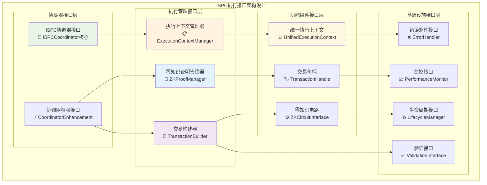
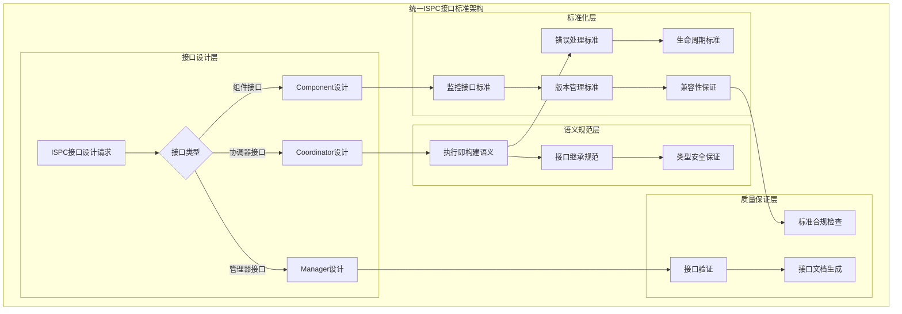
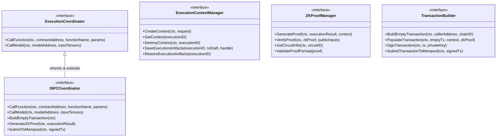

# ISPC执行接口层（internal/core/ispc/interfaces）

【模块定位】
　　本模块是WES系统中ISPC执行协调器的内部接口定义层，负责定义执行即构建的核心接口规范。通过统一的接口抽象和清晰的职责分离设计，提供ISPC执行语义的完整接口定义，支撑执行协调器的统一调度需求，确保执行即构建语义的一致性和可扩展性。

【设计原则】
- **执行即构建语义**：接口设计完全体现ISPC执行与交易构建一体化的核心理念
- **职责清晰分离**：协调器、上下文、交易构建、零知识证明的接口职责明确分离
- **继承增强设计**：内部接口继承公共接口，增加ISPC特有的内部能力
- **类型安全保证**：通过强类型定义确保接口调用的安全性和正确性
- **扩展性导向**：支持未来ISPC执行能力的无缝扩展和演进

【核心职责】
1. **ISPC协调器接口定义**：定义执行即构建的协调器完整内部接口规范
2. **执行上下文管理接口**：定义统一执行上下文的创建、管理和清理接口
3. **零知识证明管理接口**：定义ZK证明生成、验证和管理的标准接口
4. **交易构建器接口定义**：定义交易动态构建和提交的完整接口规范
5. **上下文继承与扩展机制**：定义Go context.Context与ISPC执行上下文的继承扩展标准
6. **接口版本管理**：定义接口的版本控制和向后兼容机制
7. **错误处理标准化**：定义统一的错误类型和处理接口规范

【实现架构】

　　采用**分层继承抽象**的4层实现架构，确保接口定义的完整性和ISPC语义的一致性。



**架构层次说明：**

1. **协调器接口层**：定义ISPC执行协调的最高层接口抽象
   - ISPC协调器的核心接口定义和语义规范
   - 协调器增强接口的扩展能力定义
   - 与公共接口的继承关系和兼容性保证

2. **执行管理接口层**：定义执行过程中的关键管理组件接口
   - 执行上下文的完整生命周期管理接口
   - 零知识证明生成和验证的标准接口
   - 交易构建过程的动态接口定义

3. **功能组件接口层**：定义执行过程中的核心数据结构接口
   - 统一执行上下文的结构和操作接口
   - 交易句柄的管理和操作接口规范
   - 零知识电路的抽象接口定义

---

## 📁 **模块组织结构**

【内部模块架构】

```
internal/core/ispc/interfaces/
├── 🎯 coordinator.go              # ISPC协调器接口定义（实现：coordinator/）
├── 📋 context.go                  # 执行上下文管理接口（实现：context/）
├── 🔌 hostabi.go                  # 宿主能力接口（公共别名，实现在：hostabi/）
├── 🔌 host_function_provider.go   # 宿主函数提供者内部接口（实现：hostabi.HostFunctionProvider）
├── 🔐 zkproof.go                  # 零知识证明管理接口（实现：zkproof/）
├── 🔨 transaction_builder.go      # 交易构建器接口定义（实现：transaction/）
└── 📋 README.md                   # 本文档
```

### 🎯 文件职责分工

| **文件** | **核心职责** | **对外接口** | **内部组件** | **复杂度** |
|---------|-------------|-------------|-------------|-----------|
| `coordinator.go` | ISPC协调器接口定义 | ISPCCoordinator | 协调器核心、增强接口 | 高 |
| `context.go` | 执行上下文管理接口 | ExecutionContextManager | 上下文管理、生命周期 | 中等 |
| `host_function_provider.go` | 宿主函数提供能力接口 | HostFunctionProvider | hostabi.HostFunctionProvider, engines.WASM/ONNX, coordinator | 中等 |
| `zkproof.go` | 零知识证明管理接口 | ZKProofManager | 证明生成、验证管理 | 高 |
| `transaction_builder.go` | 交易构建器接口 | TransactionBuilder | 交易构建、提交管理 | 高 |

---

## 🔄 **统一ISPC接口标准**

【实现策略】

　　所有接口定义均严格遵循**ISPC执行即构建**语义规范，确保接口设计的一致性和语义的完整性。



**关键实现要点：**

1. **执行即构建语义一致性**：
   - 所有接口设计都体现执行与构建的一体化
   - 统一的执行上下文传递和状态管理
   - 一致的错误处理和异常传播机制

2. **接口继承和扩展规范**：
   - 内部接口继承公共接口，增加ISPC特有能力
   - 清晰的接口版本管理和向后兼容保证
   - 标准化的接口扩展和演进机制

3. **类型安全和验证保证**：
   - 强类型的接口参数和返回值定义
   - 编译时和运行时的类型安全检查
   - 完整的接口契约验证和测试

4. **上下文继承与扩展机制**：
   - Go context.Context与ISPC ExecutionContext的分层设计
   - 外部上下文信息（超时、链路追踪、调用者身份）的继承机制
   - ISPC专用上下文信息（执行ID、阶段标识、交易草稿）的扩展机制
   - 分层上下文使用策略：网络I/O受外部控制，核心计算使用隔离上下文

---

## 🏗️ **依赖注入架构**

【fx框架集成】

　　全面采用fx依赖注入框架，实现接口定义的标准化和实现的松耦合。

```go
// 示例：执行接口层依赖注入配置
package interfaces

import (
    "go.uber.org/fx"
    "github.com/weisyn/v1/pkg/interfaces/ispc"
)

// Module 执行接口层模块
var Module = fx.Module("execution_interfaces",
    // 提供接口定义和规范
    fx.Provide(
        // 接口注册表
        NewExecutionInterfaceRegistry,
        
        // 接口验证器
        NewInterfaceValidator,
        
        // 类型安全检查器
        NewTypeSafetyChecker,
    ),
    
    // 导出接口规范
    fx.Provide(
        fx.Annotate(
            func(registry *ExecutionInterfaceRegistry) execution.InterfaceRegistry {
                return registry
            },
            fx.As(new(execution.InterfaceRegistry)),
        ),
    ),
)
```

**依赖管理特点：**
- **接口驱动设计**：通过接口定义驱动整个模块的架构设计
- **规范标准化**：统一的接口规范和标准定义
- **验证自动化**：自动的接口契约验证和类型检查
- **文档生成**：自动生成接口文档和使用指南

---

## 📊 **性能与监控**

【性能指标】

| **操作类型** | **目标延迟** | **吞吐量目标** | **正确性** | **监控方式** |
|-------------|-------------|---------------|----------|------------|
| 接口调用 | < 0.1ms | > 1M calls/s | 100% | 实时监控 |
| 类型检查 | < 0.01ms | > 10M checks/s | 100% | 编译时检查 |
| 契约验证 | < 1ms | > 100K validations/s | 100% | 运行时监控 |
| 错误处理 | < 0.1ms | > 1M errors/s | 100% | 异常监控 |

**性能优化策略：**
- **接口调用优化**：最小化接口调用的运行时开销
- **类型检查优化**：编译时类型检查和运行时优化
- **内存使用优化**：接口实例的内存池化管理
- **并发安全优化**：无锁的接口调用和状态管理

---

## 🔗 **与公共接口的映射关系**

【接口继承映射】



**实现要点：**
- **完整继承关系**：内部接口完整继承公共接口的所有方法
- **语义增强扩展**：在继承基础上增加ISPC特有的内部能力
- **接口契约保证**：所有继承的方法保持语义一致性
- **版本兼容管理**：接口演进过程中的向后兼容保证
- **上下文管理规范**：ExecutionContextManager接口严格遵循上下文继承与扩展机制
- **分层设计原则**：Go context.Context用于外部控制，ExecutionContext用于内部状态管理

---

## 🚀 **后续扩展规划**

【模块演进方向】

1. **接口能力扩展**
   - 分布式执行协调接口
   - 高级零知识证明接口
   - 企业级审计接口

2. **性能优化接口**
   - 批量操作接口支持
   - 异步执行接口优化
   - 流式处理接口

3. **企业级特性接口**
   - 多租户隔离接口
   - 权限管理接口
   - 合规监控接口

4. **智能化接口**
   - 自适应执行接口
   - ML辅助优化接口
   - 智能路由接口

---

## 📋 **开发指南**

【接口开发规范】

1. **新建接口步骤**：
   - 分析业务需求和语义要求
   - 设计接口结构和方法签名
   - 实现接口文档和契约定义
   - 添加类型安全检查和验证
   - 更新接口注册表和依赖配置

2. **代码质量要求**：
   - 遵循Go接口设计最佳实践
   - 100%的接口方法文档覆盖
   - 完整的接口契约定义和验证
   - 清晰的错误类型和处理机制

3. **语义一致性要求**：
   - 接口语义与ISPC执行即构建完全一致
   - 内部接口与公共接口的兼容性
   - 接口演进的向后兼容性保证
   - 跨模块接口调用的一致性

4. **上下文管理规范**：
   - CreateContext方法必须接收外部context.Context并继承其信息
   - 上下文继承策略：超时控制、链路追踪、调用者身份信息
   - 上下文扩展策略：执行ID、阶段标识、交易草稿等ISPC专用信息
   - 分层使用原则：网络I/O操作受外部context控制，核心计算使用隔离context

【参考文档】
- [ISPC执行语义规范](../../../_docs/specs/ispc/ISPC_ARCHITECTURE_AND_SEMANTICS.md)
- [ISPC实现指南](../../../_docs/specs/ispc/ISPC_IMPLEMENTATION_GUIDE.md)
- [WES架构设计文档](../../../_docs/architecture/README.md)

---

> 📝 **文档说明**：本README基于ISPC规范和WES统一文档规范设计，定义了执行协调器的内部接口标准。

> 🔄 **维护指南**：本文档应随着ISPC执行语义的演进及时更新，确保接口定义与语义规范的一致性。建议在每次接口扩展或语义调整后更新相应章节。
