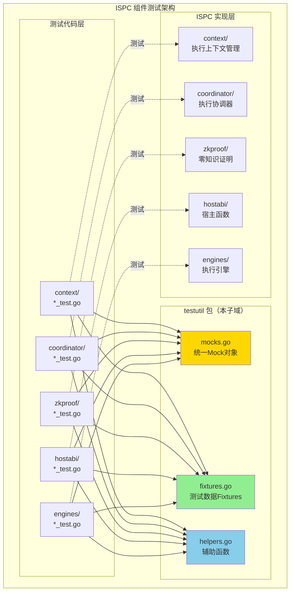
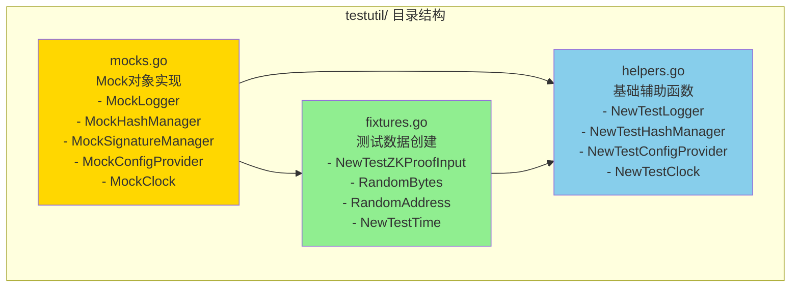
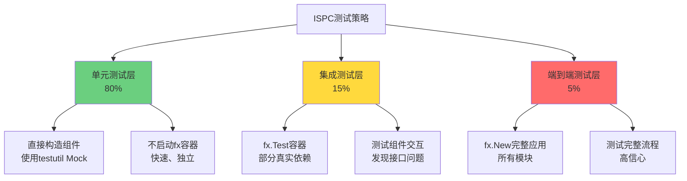

# ISPC 测试工具包 (testutil)

---

## 📌 版本信息

- **版本**：1.0
- **状态**：stable
- **最后更新**：2025-11-XX
- **最后审核**：2025-11-XX
- **所有者**：ISPC 开发团队
- **适用范围**：ISPC 组件内部的所有测试代码

---

## 🎯 子域定位

**路径**：`internal/core/ispc/testutil/`

**所属组件**：`ispc`

**核心职责**：为 ISPC 组件的测试提供统一的 Mock 对象、测试数据 Fixtures 和辅助函数，简化测试代码编写，避免重复定义 Mock 对象。

**在组件中的角色**：
- **测试基础设施层**：为所有 ISPC 子模块（context、coordinator、zkproof、hostabi、engines）提供统一的测试工具
- **Mock 对象统一管理**：集中管理所有 Mock 对象，避免每个测试文件重复定义
- **测试数据标准化**：提供标准化的测试数据创建函数，确保测试数据的一致性
- **依赖注入测试支持**：专门针对 fx 依赖注入框架的测试需求提供支持

---

## 🏗️ 架构设计

### 在组件中的位置

> **说明**：testutil 包为所有 ISPC 子模块的测试提供统一支持



**位置说明**：

| 关系类型 | 目标 | 关系说明 |
|---------|------|---------|
| **被依赖** | 所有 `*_test.go` 文件 | 测试文件导入 testutil 包，使用统一的 Mock 对象和 Fixtures |
| **不依赖** | ISPC 实现代码 | testutil 包不依赖任何 ISPC 实现代码，避免循环依赖 |

---

### 内部组织

> **说明**：testutil 包内部的文件组织和职责划分



**设计原则**：
- **mocks.go**：包含所有 Mock 对象的实现，不依赖任何 ISPC 实现代码
- **fixtures.go**：提供测试数据的创建函数，使用 mocks.go 中的 Mock 对象
- **helpers.go**：提供基础辅助函数，返回 mocks.go 中的 Mock 对象实例

---

## 📁 目录结构

```
internal/core/ispc/testutil/
├── README.md          # 本文档
├── mocks.go           # Mock对象实现（统一管理）
├── fixtures.go        # 测试数据Fixtures
└── helpers.go         # 基础辅助函数
```

---

## 🔧 核心实现

### 实现文件：`mocks.go`

**核心职责**：提供统一的 Mock 对象实现，避免每个测试文件重复定义。

**设计原则**：
- ✅ **最小实现**：基础 Mock 对象提供最小实现，所有方法返回空值或默认值
- ✅ **分层设计**：提供基础 Mock、可配置 Mock、行为 Mock 三种类型
- ✅ **无循环依赖**：不依赖任何 ISPC 实现代码，只依赖 `pkg/interfaces`

**关键 Mock 对象**：

| Mock 对象 | 实现的接口 | 使用场景 | 设计类型 |
|----------|-----------|---------|---------|
| `MockLogger` | `log.Logger` | 80%的测试用例 | 基础Mock（最小实现） |
| `BehavioralMockLogger` | `log.Logger` | 需要验证日志调用的测试（5%） | 行为Mock（记录调用） |
| `MockHashManager` | `crypto.HashManager` | 所有需要哈希计算的测试 | 基础Mock（使用真实SHA256） |
| `MockSignatureManager` | `crypto.SignatureManager` | 所有需要签名的测试 | 基础Mock（返回固定值） |
| `MockConfigProvider` | `config.Provider` | 80%的测试用例 | 基础Mock（返回nil） |
| `ConfigurableMockConfigProvider` | `config.Provider` | 需要特定配置值的测试（15%） | 可配置Mock |
| `MockClock` | `clock.Clock` | 需要确定性时间的测试 | 可配置Mock（支持时间推进） |

**示例代码**：

```go
// MockLogger - 基础Mock（最小实现）
type MockLogger struct{}

func (m *MockLogger) Debug(msg string) {}
func (m *MockLogger) Info(msg string) {}
// ... 其他方法都返回空值

// BehavioralMockLogger - 行为Mock（记录调用）
type BehavioralMockLogger struct {
    logs []string
    mutex sync.Mutex
}

func (m *BehavioralMockLogger) Info(msg string) {
    m.mutex.Lock()
    defer m.mutex.Unlock()
    m.logs = append(m.logs, "INFO: "+msg)
}

func (m *BehavioralMockLogger) GetLogs() []string {
    // 返回所有日志记录
}
```

---

### 实现文件：`fixtures.go`

**核心职责**：提供标准化的测试数据创建函数，确保测试数据的一致性。

**关键 Fixtures**：

| Fixture 函数 | 返回类型 | 用途 |
|-------------|---------|------|
| `NewTestZKProofInput()` | `*interfaces.ZKProofInput` | 创建标准的ZK证明输入 |
| `NewTestZKProofInputWithCircuit()` | `*interfaces.ZKProofInput` | 创建指定电路的ZK证明输入 |
| `NewTestZKProofInputWithExecutionTrace()` | `*interfaces.ZKProofInput` | 创建包含执行轨迹的ZK证明输入 |
| `RandomBytes(size int)` | `[]byte` | 生成随机字节数组 |
| `RandomAddress()` | `[]byte` | 生成随机地址（20字节） |
| `RandomPublicKey()` | `[]byte` | 生成随机公钥（33字节） |
| `RandomTxID()` | `[]byte` | 生成随机交易ID（32字节） |
| `RandomHash()` | `[]byte` | 生成随机哈希（32字节） |
| `NewTestTime()` | `time.Time` | 创建测试用的时间点 |
| `NewTestTimeWithOffset()` | `time.Time` | 创建带偏移的测试时间 |

**示例代码**：

```go
// 创建标准的ZK证明输入
input := testutil.NewTestZKProofInput()
// 返回：CircuitID="contract_execution", CircuitVersion=1, PublicInputs=[[]byte("test_public_input")]

// 创建指定电路的ZK证明输入
input := testutil.NewTestZKProofInputWithCircuit("ai_model_inference", 2)

// 创建包含执行轨迹的ZK证明输入
trace := []byte("execution_trace_data")
input := testutil.NewTestZKProofInputWithExecutionTrace(trace)
```

---

### 实现文件：`helpers.go`

**核心职责**：提供基础辅助函数，简化 Mock 对象的创建。

**⚠️ 重要约束**：为避免循环依赖，helpers.go **不包含**依赖具体 ISPC 组件的辅助函数（如 `NewTestZKProofManager`）。这些函数应该在各自的测试文件中定义，使用 testutil 中的 Mock 对象。

**关键辅助函数**：

| 辅助函数 | 返回类型 | 用途 |
|---------|---------|------|
| `NewTestLogger()` | `log.Logger` | 创建测试用的Logger（MockLogger） |
| `NewTestBehavioralLogger()` | `*BehavioralMockLogger` | 创建行为Logger（记录调用） |
| `NewTestHashManager()` | `crypto.HashManager` | 创建测试用的HashManager |
| `NewTestSignatureManager()` | `crypto.SignatureManager` | 创建测试用的SignatureManager |
| `NewTestConfigProvider()` | `config.Provider` | 创建测试用的ConfigProvider |
| `NewTestConfigurableConfigProvider()` | `*ConfigurableMockConfigProvider` | 创建可配置的ConfigProvider |
| `NewTestClock()` | `*MockClock` | 创建测试用的时钟（使用NewTestTime） |
| `NewTestClockWithTime(t time.Time)` | `*MockClock` | 创建带指定时间的测试时钟 |

**示例代码**：

```go
// 在测试文件中使用
import "github.com/weisyn/v1/internal/core/ispc/testutil"

func TestExample(t *testing.T) {
    // 使用testutil中的辅助函数创建Mock对象
    logger := testutil.NewTestLogger()
    hashManager := testutil.NewTestHashManager()
    configProvider := testutil.NewTestConfigProvider()
    
    // 创建被测试的组件（在测试文件中定义）
    manager := NewManager(hashManager, signatureManager, logger, configProvider)
    // ... 测试代码
}
```

---

## 🔗 协作关系

### 依赖的接口

| 接口 | 来源 | 用途 |
|-----|------|-----|
| `log.Logger` | `pkg/interfaces/infrastructure/log/` | MockLogger 实现日志接口 |
| `crypto.HashManager` | `pkg/interfaces/infrastructure/crypto/` | MockHashManager 实现哈希接口 |
| `crypto.SignatureManager` | `pkg/interfaces/infrastructure/crypto/` | MockSignatureManager 实现签名接口 |
| `config.Provider` | `pkg/interfaces/config/` | MockConfigProvider 实现配置接口 |
| `clock.Clock` | `pkg/interfaces/infrastructure/clock/` | MockClock 实现时钟接口（未来扩展） |

---

### 被依赖关系

**被以下测试文件使用**：
- `context/*_test.go` - 使用 MockLogger, MockConfigProvider, MockClock 等
- `coordinator/*_test.go` - 使用所有 Mock 对象
- `zkproof/*_test.go` - 使用 MockLogger, MockHashManager, MockSignatureManager, MockConfigProvider
- `hostabi/*_test.go` - 使用 MockLogger, MockHashManager 等
- `engines/*_test.go` - 使用 MockLogger, MockConfigProvider 等

**示例**：

```go
// 在 zkproof/manager_test.go 中使用
package zkproof

import (
    "testing"
    "github.com/weisyn/v1/internal/core/ispc/testutil"
)

func TestNewManager(t *testing.T) {
    // Arrange - 使用testutil中的Mock对象
    hashManager := testutil.NewTestHashManager()
    signatureManager := testutil.NewTestSignatureManager()
    logger := testutil.NewTestLogger()
    configProvider := testutil.NewTestConfigProvider()
    
    // Act
    manager := NewManager(hashManager, signatureManager, logger, configProvider)
    
    // Assert
    require.NotNil(t, manager)
}
```

---

## 🧪 测试指南

### ISPC 测试的特殊性

ISPC 组件广泛使用 **fx 依赖注入框架**，这给测试带来了特殊的挑战：

1. **依赖复杂**：每个组件依赖多个接口（Logger, ConfigProvider, HashManager 等）
2. **Mock 对象管理**：如果每个测试文件都重复定义 Mock，会导致代码重复和维护困难
3. **运行时依赖注入**：ISPC 使用 `fx.Invoke` 进行运行时依赖注入，测试时需要特殊处理

### 测试策略

遵循 `docs/system/standards/principles/testing-standards.md` 规范，采用**分层测试策略**：



### 单元测试模式（推荐）

**原则**：不启动 fx 容器，直接调用构造函数，使用 testutil 中的 Mock 对象。

**优点**：
- ✅ 快速（毫秒级）
- ✅ 独立（完全隔离）
- ✅ 易于调试
- ✅ 高覆盖率

**示例**：

```go
// zkproof/manager_test.go
package zkproof

import (
    "testing"
    "github.com/weisyn/v1/internal/core/ispc/testutil"
)

func TestManager_CreateContext(t *testing.T) {
    // Arrange - 使用testutil中的Mock对象
    hashManager := testutil.NewTestHashManager()
    signatureManager := testutil.NewTestSignatureManager()
    logger := testutil.NewTestLogger()
    configProvider := testutil.NewTestConfigProvider()
    
    manager := NewManager(hashManager, signatureManager, logger, configProvider)
    
    // Act
    ctx := context.Background()
    execCtx, err := manager.CreateContext(ctx, "test_execution", "caller")
    
    // Assert
    assert.NoError(t, err)
    assert.NotNil(t, execCtx)
}
```

### 集成测试模式（可选）

**原则**：使用 `fx.Test` 创建轻量级 fx 容器，部分使用真实依赖，部分使用 Mock。

**示例**：

```go
// integration_test.go
func TestManager_WithFXContainer(t *testing.T) {
    app := fx.New(
        fx.Provide(
            // 提供Mock依赖
            func() log.Logger { return testutil.NewTestLogger() },
            func() config.Provider { return testutil.NewTestConfigProvider() },
            
            // 提供被测试的组件
            zkproof.NewManager,
        ),
        fx.Invoke(func(manager *zkproof.Manager) {
            // Act - 在fx容器中测试
            // ...
        }),
    )
    
    err := app.Err()
    assert.NoError(t, err)
}
```

### Mock 对象选择指南

| 测试场景 | 推荐的 Mock 类型 | 示例 |
|---------|----------------|------|
| 不需要验证日志调用 | `MockLogger`（基础Mock） | 80%的测试用例 |
| 需要验证日志调用 | `BehavioralMockLogger`（行为Mock） | 错误处理测试 |
| 不需要特定配置值 | `MockConfigProvider`（基础Mock） | 80%的测试用例 |
| 需要特定配置值 | `ConfigurableMockConfigProvider`（可配置Mock） | 时钟配置测试 |
| 需要确定性时间 | `MockClock`（可配置Mock） | 超时测试、时间戳测试 |

---

## 📊 关键设计决策

### 决策 1：统一 Mock 对象管理

**问题**：ISPC 组件依赖多个接口（Logger, ConfigProvider, HashManager 等），如果每个测试文件都重复定义 Mock 对象，会导致：
- ❌ 代码重复（相同的 Mock 定义出现在多个文件中）
- ❌ 维护困难（接口变更时需要更新多处）
- ❌ 不一致（不同文件的 Mock 实现略有差异）

**方案**：创建统一的 `testutil` 包，集中管理所有 Mock 对象。

**理由**：
- ✅ 符合 DRY 原则（Don't Repeat Yourself）
- ✅ 遵循测试规范文档的最佳实践
- ✅ 参考 `internal/core/tx/testutil` 的成功模式
- ✅ 提高代码可维护性

**权衡**：
- ✅ 优点：代码复用、易于维护、统一标准
- ⚠️ 缺点：需要额外的包（但收益远大于成本）

---

### 决策 2：避免循环依赖

**问题**：testutil 包如果依赖 ISPC 实现代码（如 `zkproof.Manager`），会导致循环依赖：
- `testutil` → `zkproof` → `testutil`（循环）

**方案**：testutil 包**只依赖 `pkg/interfaces`**，不依赖任何 ISPC 实现代码。

**具体措施**：
- ✅ `mocks.go`：只实现 `pkg/interfaces` 中定义的接口
- ✅ `fixtures.go`：只使用 `internal/core/ispc/interfaces` 中的类型（接口定义）
- ✅ `helpers.go`：不包含依赖具体组件的辅助函数（如 `NewTestZKProofManager`）

**组件特定的测试辅助函数**：
- 应该在各自的测试文件中定义
- 使用 testutil 中的 Mock 对象
- 示例：`zkproof/manager_test.go` 中的 `createTestManager()` 函数

**权衡**：
- ✅ 优点：避免循环依赖、保持包独立性
- ⚠️ 缺点：需要在测试文件中定义组件特定的辅助函数（但这是合理的）

---

### 决策 3：分层 Mock 设计

**问题**：不同测试场景需要不同的 Mock 行为：
- 大多数测试只需要最小实现（返回空值）
- 少数测试需要验证调用（记录调用）
- 少数测试需要特定返回值（可配置）

**方案**：提供三种类型的 Mock：
1. **基础 Mock**（80%的测试用例）：最小实现，所有方法返回空值或默认值
2. **可配置 Mock**（15%的测试用例）：支持设置特定返回值
3. **行为 Mock**（5%的测试用例）：记录调用，用于验证交互

**示例**：

```go
// 基础Mock（最小实现）
type MockLogger struct{}
func (m *MockLogger) Info(msg string) {}

// 可配置Mock（支持设置返回值）
type ConfigurableMockConfigProvider struct {
    apiOptions *apiconfig.APIOptions
}
func (m *ConfigurableMockConfigProvider) GetAPI() *apiconfig.APIOptions {
    if m.apiOptions != nil {
        return m.apiOptions
    }
    return nil
}

// 行为Mock（记录调用）
type BehavioralMockLogger struct {
    logs []string
}
func (m *BehavioralMockLogger) Info(msg string) {
    m.logs = append(m.logs, "INFO: "+msg)
}
```

**权衡**：
- ✅ 优点：灵活、满足不同测试需求
- ⚠️ 缺点：需要维护多种 Mock 类型（但数量可控）

---

### 决策 4：使用真实 SHA256 算法

**问题**：MockHashManager 应该使用真实的 SHA256 算法还是返回固定值？

**方案**：使用真实的 SHA256 算法（`crypto/sha256`）。

**理由**：
- ✅ 确保哈希计算的正确性
- ✅ 测试更接近真实场景
- ✅ SHA256 计算很快，不影响测试性能
- ✅ 避免因 Mock 实现错误导致的测试失败

**权衡**：
- ✅ 优点：测试更可靠、发现真实问题
- ⚠️ 缺点：依赖标准库（但这是合理的）

---

## 📚 使用示例

### 示例 1：基础单元测试

```go
// zkproof/manager_test.go
package zkproof

import (
    "testing"
    "github.com/weisyn/v1/internal/core/ispc/testutil"
)

func TestNewManager(t *testing.T) {
    // Arrange - 使用testutil中的Mock对象
    hashManager := testutil.NewTestHashManager()
    signatureManager := testutil.NewTestSignatureManager()
    logger := testutil.NewTestLogger()
    configProvider := testutil.NewTestConfigProvider()
    
    // Act
    manager := NewManager(hashManager, signatureManager, logger, configProvider)
    
    // Assert
    require.NotNil(t, manager)
    require.NotNil(t, manager.prover)
    require.NotNil(t, manager.validator)
}
```

### 示例 2：使用测试数据 Fixtures

```go
// zkproof/prover_test.go
func TestProver_GenerateProof(t *testing.T) {
    // Arrange
    prover := createTestProver(t)
    input := testutil.NewTestZKProofInput() // 使用testutil中的Fixture
    
    // Act
    result, err := prover.GenerateProof(ctx, input)
    
    // Assert
    // ...
}
```

### 示例 3：使用可配置 Mock

```go
// zkproof/coordinator_test.go
func TestCoordinator_WithCustomConfig(t *testing.T) {
    // Arrange - 使用可配置的Mock
    configProvider := testutil.NewTestConfigurableConfigProvider()
    clockOptions := &clockconfig.ClockOptions{
        Type: "deterministic",
        DeterministicBaseUnix: 1000000,
    }
    configProvider.SetClock(clockOptions)
    
    // Act
    coordinator := NewCoordinator(..., configProvider)
    
    // Assert
    // ...
}
```

### 示例 4：使用行为 Mock 验证日志

```go
// zkproof/reliability_test.go
func TestReliabilityEnforcer_LogsError(t *testing.T) {
    // Arrange - 使用行为Mock记录日志调用
    logger := testutil.NewTestBehavioralLogger()
    enforcer := NewProofReliabilityEnforcer(logger, ...)
    
    // Act
    _, err := enforcer.GenerateProofWithRetry(ctx, invalidInput)
    
    // Assert
    require.Error(t, err)
    logs := logger.GetLogs()
    require.Contains(t, logs, "ERROR:") // 验证错误日志被记录
}
```

### 示例 5：组件特定的测试辅助函数

```go
// zkproof/manager_test.go
package zkproof

import (
    "testing"
    "github.com/weisyn/v1/internal/core/ispc/testutil"
)

// createTestManager 创建测试用的管理器
// ✅ 注意：这个函数在测试文件中定义，使用testutil中的Mock对象
func createTestManager(t *testing.T) *Manager {
    hashManager := testutil.NewTestHashManager()
    signatureManager := testutil.NewTestSignatureManager()
    logger := testutil.NewTestLogger()
    configProvider := testutil.NewTestConfigProvider()
    
    return NewManager(hashManager, signatureManager, logger, configProvider)
}
```

---

## 🚫 反模式

### 反模式 1：在 testutil 中定义组件特定的辅助函数

```go
❌ 错误做法（会导致循环依赖）：
// testutil/helpers.go
func NewTestZKProofManager(t *testing.T) *zkproof.Manager {
    // ❌ testutil 依赖 zkproof，会导致循环依赖
    return zkproof.NewManager(...)
}

✅ 正确做法（在测试文件中定义）：
// zkproof/manager_test.go
func createTestManager(t *testing.T) *Manager {
    // ✅ 使用 testutil 中的 Mock 对象
    hashManager := testutil.NewTestHashManager()
    return NewManager(hashManager, ...)
}
```

### 反模式 2：每个测试文件重复定义 Mock 对象

```go
❌ 错误做法（代码重复）：
// zkproof/manager_test.go
type mockHashManager struct{ ... }
type mockSignatureManager struct{ ... }
type mockConfigProvider struct{ ... }

// zkproof/validator_test.go
type mockHashManager struct{ ... }  // ❌ 重复定义
type mockSignatureManager struct{ ... }  // ❌ 重复定义

✅ 正确做法（使用 testutil）：
// 所有测试文件都使用
import "github.com/weisyn/v1/internal/core/ispc/testutil"

hashManager := testutil.NewTestHashManager()
```

### 反模式 3：在单元测试中启动完整的 fx 应用

```go
❌ 错误做法（太慢）：
func TestManager_CreateContext(t *testing.T) {
    // ❌ 启动完整的 fx 应用，太慢
    app := fx.New(
        crypto.Module(),
        storage.Module(),
        ispc.Module(),
        // ... 所有模块
    )
}

✅ 正确做法（直接构造）：
func TestManager_CreateContext(t *testing.T) {
    // ✅ 直接构造，快速
    manager := createTestManager(t)
    // ...
}
```

---

## ✅ 检查清单

### 编写测试时

- [ ] 是否使用了 testutil 包中的 Mock 对象？
- [ ] 是否避免了重复定义 Mock 对象？
- [ ] 是否使用了 testutil 中的测试数据 Fixtures？
- [ ] 组件特定的辅助函数是否在测试文件中定义？
- [ ] 是否避免了在 testutil 中依赖 ISPC 实现代码？

### 添加新的 Mock 对象时

- [ ] 是否实现了 `pkg/interfaces` 中定义的接口？
- [ ] 是否避免了依赖 ISPC 实现代码？
- [ ] 是否提供了基础 Mock 和可配置 Mock（如需要）？
- [ ] 是否在 `helpers.go` 中添加了创建函数？

### 添加新的 Fixture 时

- [ ] 是否使用了 testutil 中的 Mock 对象？
- [ ] 是否避免了依赖 ISPC 实现代码？
- [ ] 是否提供了清晰的函数命名和文档？

---

## 📚 相关文档

**测试规范**：
- [测试规范原则](../../../../docs/system/standards/principles/testing-standards.md) - 依赖注入测试指南、Mock 对象管理最佳实践

**参考实现**：
- [`internal/core/tx/testutil/mocks.go`](../../../tx/testutil/mocks.go) - TX 模块的 testutil 实现示例

**ISPC 组件文档**：
- [ISPC 组件总览](../README.md)
- [ISPC 内部接口](../interfaces/README.md)
- [ZKProof 子模块](../zkproof/README.md)
- [Context 子模块](../context/README.md)
- [Coordinator 子模块](../coordinator/README.md)

---

## 📝 变更历史

| 版本 | 日期 | 变更内容 | 作者 |
|-----|------|---------|------|
| 1.0 | 2025-11-XX | 初始版本，创建统一的 Mock 对象和 Fixtures | ISPC 开发团队 |

---

## 🚧 待办事项

- [ ] 添加更多 ISPC 特定的测试数据 Fixtures（如 `NewTestExecutionContext`）
- [ ] 添加 MockClock 的完整实现（当前为占位）
- [ ] 为其他 ISPC 子模块添加测试示例
- [ ] 创建集成测试示例文档

---

## 💡 最佳实践总结

1. **统一使用 testutil 包**：所有 ISPC 测试都应该使用 testutil 包中的 Mock 对象和 Fixtures
2. **避免循环依赖**：testutil 包不依赖任何 ISPC 实现代码
3. **组件特定的辅助函数**：在各自的测试文件中定义，使用 testutil 中的 Mock 对象
4. **分层测试策略**：80% 单元测试（直接构造），15% 集成测试（fx.Test），5% 端到端测试（fx.New）
5. **Mock 对象选择**：80% 使用基础 Mock，15% 使用可配置 Mock，5% 使用行为 Mock

---

**testutil 包是 ISPC 测试的基础设施，统一管理 Mock 对象，简化测试代码编写，提高测试代码的可维护性。**

