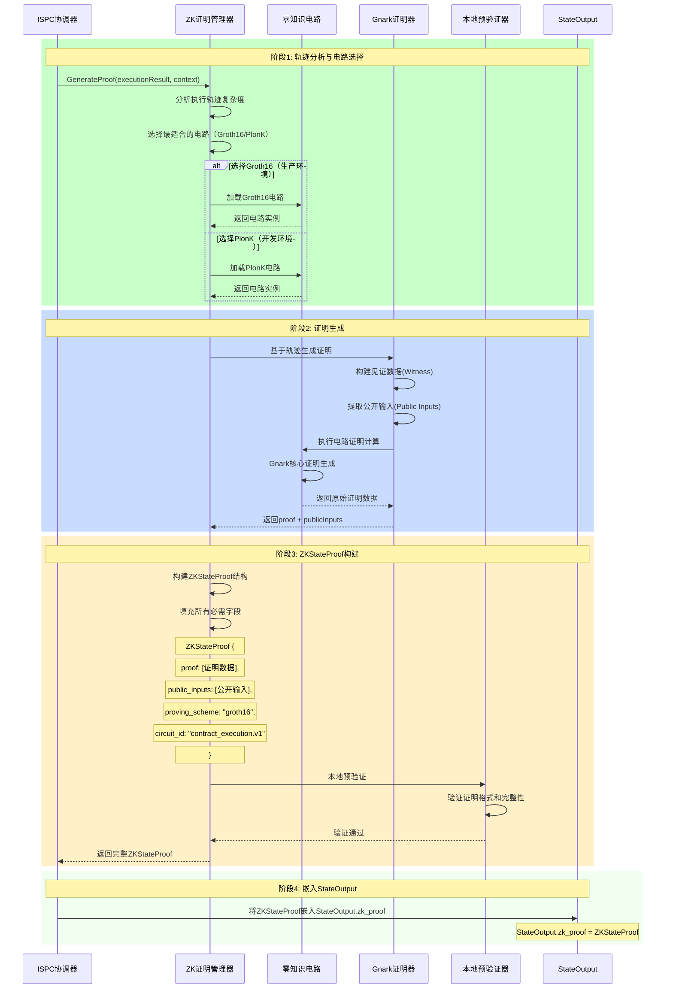
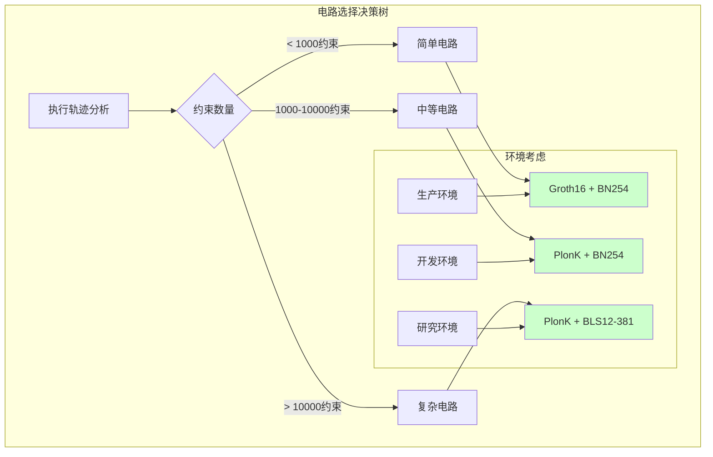

# WES ISPC零知识证明管理器（internal/core/ispc/zkproof）

> **零知识证明生成与管理**：为ISPC单次执行验证语义提供零知识证明生成和管理能力

**设计理念**: 通过基于Gnark的零知识证明系统，为ISPC执行即构建提供自动化的证明生成，支持单次执行+多点验证的网络语义。

---

## 📋 **核心职责**

### 🎯 **Manager职责边界**

```mermaid
graph TB
    subgraph "ZK证明Manager职责（仅负责生成）"
        A[执行轨迹分析] --> B[ZK证明生成]
        B --> C[ZKStateProof结构构建]
        C --> D[本地预验证]
        
        style A fill:#ccffcc
        style B fill:#ccffcc
        style C fill:#ccffcc
        style D fill:#ccffcc
    end
    
    subgraph "网络验证（非Manager职责）"
        E[验证节点验证]
        F[网络共识验证]
        G[区块确认验证]
        
        style E fill:#e6f3ff
        style F fill:#e6f3ff
        style G fill:#e6f3ff
    end
    
    Note right of E: 网络验证由验证节点负责<br/>Manager只负责生成证明
```

### **Manager职责说明**

1. **零知识证明生成**: 基于执行轨迹自动生成可验证的零知识证明
2. **ZKStateProof构建**: 构建符合transaction.proto规范的ZKStateProof结构
3. **电路管理**: 管理Groth16、PlonK等不同类型的零知识电路
4. **本地预验证**: 生成后进行本地预验证，确保证明格式正确
5. **性能优化**: 优化证明生成的性能和资源使用

**重要边界**: Manager仅负责证明生成，网络验证由验证节点处理（ISPC单次执行验证语义）

---

## 📁 **模块结构**

```
internal/core/ispc/zkproof/
├── README.md                    # 本文档
├── manager.go                   # ZK证明管理器（薄实现）
├── gnark_prover.go             # Gnark证明器实现
├── groth16_circuit.go          # Groth16电路实现
├── plonk_circuit.go            # PlonK电路实现
└── proof_validator.go          # 本地预验证器
```

### **文件职责分工**

| 文件 | 核心职责 | 复杂度 |
|------|----------|--------|
| `manager.go` | 统一管理和协调 | 中等 |
| `gnark_prover.go` | 核心证明生成 | 高 |
| `groth16_circuit.go` | Groth16电路 | 高 |
| `plonk_circuit.go` | PlonK电路 | 高 |
| `proof_validator.go` | 本地预验证 | 中等 |

---

## 🔧 **ZKStateProof字段映射**

### **transaction.proto结构映射**

Manager生成的证明直接映射到transaction.proto定义的ZKStateProof结构：

```protobuf
message ZKStateProof {
  bytes proof = 1;                    // ← Manager生成的证明数据
  repeated bytes public_inputs = 2;   // ← Manager提取的公开输入
  string proving_scheme = 3;          // ← Manager选择的证明方案
  string curve = 4;                   // ← Manager配置的椭圆曲线
  bytes verification_key_hash = 5;    // ← Manager计算的验证密钥哈希
  
  // 电路信息（Manager填充）
  string circuit_id = 10;             // ← Manager设置的电路标识
  uint32 circuit_version = 11;        // ← Manager管理的电路版本
  optional bytes circuit_commitment = 12;  // ← Manager生成的电路承诺
  
  // 性能信息（Manager可选填充）
  uint64 constraint_count = 20;       // ← Manager统计的约束数量
  optional uint64 proof_generation_time_ms = 21;  // ← Manager记录的生成时间
  
  // 业务扩展（Manager支持）
  map<string, string> custom_attributes = 30;     // ← Manager支持的自定义属性
}
```

### **字段映射实现**

```go
// Manager生成ZKStateProof的标准流程
func (m *Manager) GenerateProof(ctx context.Context, 
    executionResult *types.ExecutionResult, 
    context *interfaces.UnifiedExecutionContext) (*transaction.ZKStateProof, error) {
    
    // 1. 分析执行轨迹，选择电路
    circuit, err := m.selectCircuit(executionResult)
    if err != nil {
        return nil, err
    }
    
    // 2. 生成零知识证明
    proof, publicInputs, err := m.gnarkProver.GenerateProof(circuit, executionResult)
    if err != nil {
        return nil, err
    }
    
    // 3. 构建ZKStateProof结构
    zkStateProof := &transaction.ZKStateProof{
        Proof:                 proof,                    // 证明数据
        PublicInputs:         publicInputs,              // 公开输入
        ProvingScheme:        circuit.GetScheme(),       // "groth16" 或 "plonk"
        Curve:                circuit.GetCurve(),        // "bn254" 或 "bls12-381"
        VerificationKeyHash:  circuit.GetVKHash(),       // 验证密钥哈希
        
        // 电路信息
        CircuitId:           circuit.GetID(),            // 如 "contract_execution.v1"
        CircuitVersion:      circuit.GetVersion(),       // 如 1
        CircuitCommitment:   circuit.GetCommitment(),    // 电路承诺
        
        // 性能信息
        ConstraintCount:     circuit.GetConstraintCount(), // 约束数量
        ProofGenerationTimeMs: uint64(time.Since(startTime).Milliseconds()),
        
        // 自定义属性
        CustomAttributes: map[string]string{
            "execution_id":    context.ExecutionID,
            "business_type":   executionResult.BusinessType,
        },
    }
    
    // 4. 本地预验证
    if err := m.validateProofLocally(zkStateProof); err != nil {
        return nil, fmt.Errorf("local proof validation failed: %w", err)
    }
    
    return zkStateProof, nil
}
```

---

## 🔄 **零知识证明生成流程**

### **完整生成流程**



### **关键阶段说明**

#### **阶段1: 轨迹分析与电路选择**
- **轨迹复杂度分析**: 分析执行轨迹的约束数量和复杂度
- **电路智能选择**: 根据复杂度选择Groth16（高效）或PlonK（通用）
- **电路加载**: 加载对应的电路定义和可信设置

#### **阶段2: 证明生成**
- **见证数据构建**: 将执行轨迹转换为电路的见证数据
- **公开输入提取**: 提取需要公开验证的状态哈希等参数
- **Gnark证明计算**: 调用Gnark库进行核心证明计算

#### **阶段3: ZKStateProof构建**
- **结构映射**: 将Gnark生成的证明映射到ZKStateProof结构
- **字段完整性**: 确保所有必需字段都正确填充
- **本地预验证**: 验证生成证明的格式和基本正确性

#### **阶段4: 嵌入StateOutput**
- **协调器负责**: 由协调器将ZKStateProof嵌入到StateOutput.zk_proof
- **交易集成**: 证明作为交易结构的组成部分上链存储

---

## 🚫 **单次执行验证语义**

### **Manager vs 网络验证的职责分工**

```mermaid
graph LR
    subgraph "Manager职责（执行节点）"
        A[轨迹捕获]
        B[证明生成]
        C[ZKStateProof构建]
        D[本地预验证]
        
        A --> B --> C --> D
        
        style A fill:#ccffcc
        style B fill:#ccffcc
        style C fill:#ccffcc
        style D fill:#ccffcc
    end
    
    subgraph "网络验证职责（验证节点）"
        E[接收StateOutput.zk_proof]
        F[验证ZKStateProof]
        G[确认计算正确性]
        H[参与网络共识]
        
        E --> F --> G --> H
        
        style E fill:#e6f3ff
        style F fill:#e6f3ff
        style G fill:#e6f3ff
        style H fill:#e6f3ff
    end
    
    D -.->|提交到网络| E
    
    Note bottom of Manager: 执行节点：执行一次业务逻辑<br/>生成一次零知识证明
    Note bottom of 网络验证职责: 验证节点：不重复执行业务逻辑<br/>仅验证零知识证明
```

### **核心优势**

- ✅ **外部副作用只发生一次**: 业务逻辑仅在执行节点运行一次
- ✅ **验证效率极高**: 验证节点仅需验证证明，比重复执行快1000倍
- ✅ **网络资源节约**: 避免N个节点重复执行相同业务逻辑
- ✅ **传统系统零改造**: 业务系统无需考虑可重入性设计

---

## 🏗️ **架构设计**

### **Manager核心架构**

```go
type Manager struct {
    // 证明生成组件
    gnarkProver     interfaces.GnarkProver
    
    // 电路管理
    circuitRegistry map[string]interfaces.ZKCircuit
    groth16Circuit  interfaces.Groth16Circuit
    plonkCircuit    interfaces.PlonKCircuit
    
    // 本地验证
    localValidator  interfaces.ProofValidator
    
    // 配置和监控
    config         *ZKProofConfig
    metrics        interfaces.MetricsCollector
}

// ZK证明生成的核心接口
type ZKProofManager interface {
    // 核心方法：生成ZKStateProof
    GenerateProof(ctx context.Context, 
        executionResult *types.ExecutionResult, 
        context *interfaces.UnifiedExecutionContext) (*transaction.ZKStateProof, error)
        
    // 辅助方法：本地预验证
    ValidateProofLocally(proof *transaction.ZKStateProof) error
    
    // 管理方法：电路信息获取
    GetCircuitInfo(circuitID string) (*types.CircuitInfo, error)
}
```

### **电路选择策略**



---

## 📊 **性能特征**

### **证明生成性能指标**

| 电路类型 | 约束数量 | 生成时间 | 证明大小 | 验证时间 |
|---------|---------|---------|---------|---------|
| **简单Groth16** | < 1K | 100-500ms | ~256B | < 5ms |
| **中等PlonK** | 1K-10K | 1-5s | ~512B | < 20ms |
| **复杂PlonK** | > 10K | 5-30s | ~1KB | < 50ms |

### **内存使用优化**

- **电路缓存**: 预加载常用电路，避免重复编译
- **见证复用**: 复用见证数据结构，减少内存分配
- **批量处理**: 支持批量证明生成，提升整体效率
- **流式处理**: 大型轨迹的流式处理，控制内存峰值

---

## 🔗 **依赖关系**

### **Gnark库集成**

```go
// Gnark零知识证明库依赖
import (
    "github.com/consensys/gnark/backend/groth16"
    "github.com/consensys/gnark/backend/plonk"
    "github.com/consensys/gnark/frontend"
    "github.com/consensys/gnark/frontend/cs/r1cs"
    "github.com/consensys/gnark/frontend/cs/scs"
)

// Manager对Gnark的封装使用
type GnarkProver struct {
    groth16Backend groth16.Backend
    plonkBackend   plonk.Backend
    circuitCache   map[string]frontend.Circuit
}
```

### **内部接口依赖**

```go
// 依赖的内部接口
internal/core/ispc/interfaces/zkproof.go     // ZK证明管理接口
internal/core/ispc/interfaces/context.go    // 执行上下文接口
```

---

## 🏗️ **依赖注入配置**

### **fx框架集成**

```go
package zkproof

import (
    "go.uber.org/fx"
    "github.com/weisyn/v1/internal/core/ispc/interfaces"
)

// Module ZK证明管理器模块
var Module = fx.Module("execution_zkproof",
    fx.Provide(
        // 核心组件
        NewManager,
        NewGnarkProver,
        
        // 电路实现
        NewGroth16Circuit,
        NewPlonKCircuit,
        
        // 本地验证
        NewProofValidator,
    ),
    
    // 导出内部接口
    fx.Provide(
        fx.Annotate(
            func(manager *Manager) interfaces.ZKProofManager {
                return manager
            },
            fx.As(new(interfaces.ZKProofManager)),
        ),
    ),
)
```

---

## 📚 **相关文档**

- [ISPC核心规范](/_docs/specs/ispc/INTRINSIC_SELF_PROVING_COMPUTING_SPECIFICATION.md)
- [ISPC架构语义](/_docs/specs/ispc/ISPC_ARCHITECTURE_AND_SEMANTICS.md)
- [交易协议定义](/pb/blockchain/block/transaction/transaction.proto)
- [ZK状态证明规范](/_docs/specs/zk/ZK_STATE_PROOF_SPEC.md)
- [Gnark零知识证明库](https://github.com/ConsenSys/gnark)

---

*WES ISPC零知识证明管理器 - 单次执行验证语义的核心技术保障*