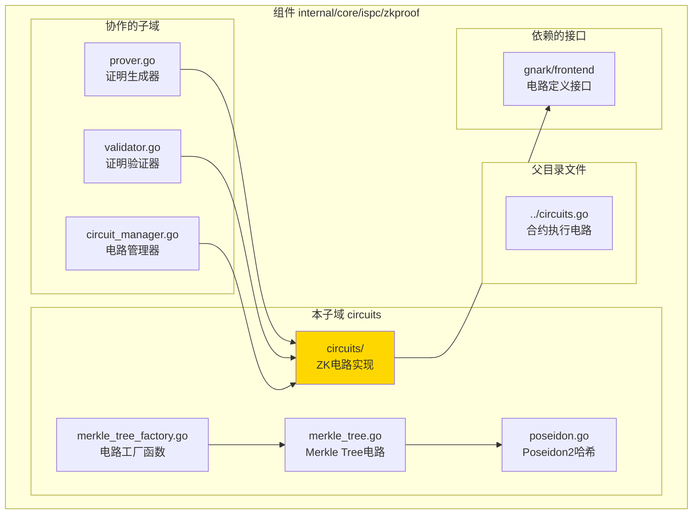
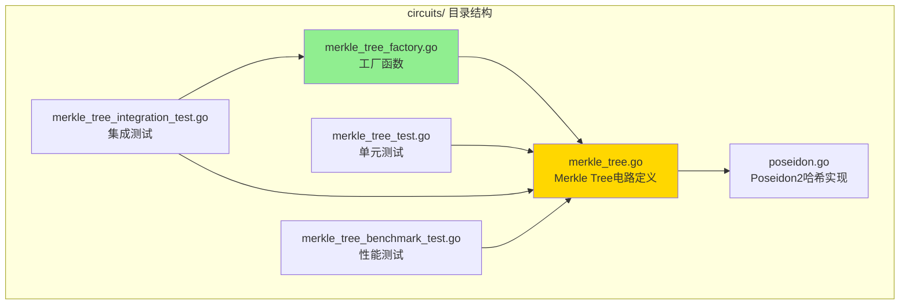

# circuits - ZK电路实现子域

---

## 📌 版本信息

- **版本**：1.0
- **状态**：stable
- **最后更新**：2025-11-27
- **最后审核**：2025-11-27
- **所有者**：ISPC 核心团队
- **适用范围**：ISPC 零知识证明模块中的 ZK 电路实现

---

## 🎯 子域定位

**路径**：`internal/core/ispc/zkproof/circuits/`

**所属组件**：`ispc/zkproof`

**核心职责**：提供各种类型的零知识证明电路实现，包括合约执行电路、AI模型推理电路和Merkle Tree增量验证电路。

**在组件中的角色**：
- **电路定义层**：定义 gnark 电路结构和约束逻辑
- **电路工厂层**：提供工厂函数确保电路正确初始化（解决 gnark 数组长度问题）
- **哈希函数层**：提供 ZK 友好的 Poseidon2 哈希函数实现

---

## 🏗️ 架构设计

### 在组件中的位置

> **说明**：展示 circuits 子域在 zkproof 组件内部的位置和协作关系



**位置说明**：

| 关系类型 | 目标 | 关系说明 |
|---------|------|---------|
| **被使用** | `prover.go` | Prover 使用电路生成 ZK 证明 |
| **被使用** | `validator.go` | Validator 使用电路验证 ZK 证明 |
| **被使用** | `circuit_manager.go` | CircuitManager 管理和缓存电路实例 |
| **依赖** | `gnark/frontend` | 实现 gnark 的 Circuit 接口 |

---

### 内部组织

> **说明**：展示 circuits 子域内部的文件组织和类型关系



---

## 📁 目录结构

```
internal/core/ispc/zkproof/circuits/
├── README.md                              # 本文档
├── merkle_tree.go                         # Merkle Tree增量验证电路定义
├── merkle_tree_factory.go                 # Merkle Tree电路工厂函数 ⭐
├── poseidon.go                            # Poseidon2哈希函数实现
├── MERKLE_TREE_CIRCUIT_USAGE.md          # Merkle Tree电路使用指南
│
├── merkle_tree_test.go                    # Merkle Tree电路单元测试
├── merkle_tree_integration_test.go        # Merkle Tree电路集成测试
└── merkle_tree_benchmark_test.go          # Merkle Tree电路性能测试

注意：合约执行电路（ContractExecutionCircuit）和AI模型推理电路（AIModelInferenceCircuit）
定义在父目录的 circuits.go 文件中，不在本子域内。
```

---

## 🔧 核心实现

### 实现文件：`merkle_tree.go`

**核心类型**：`MerklePathCircuit`、`BatchMerklePathCircuit`、`IncrementalUpdateCircuit`

**职责**：实现 Merkle Tree 增量验证的 ZK 证明电路，支持只验证变更路径而非整个树。

**关键字段**：

```go
type MerklePathCircuit struct {
    RootHash       frontend.Variable `gnark:",public"` // Merkle根哈希
    LeafData       frontend.Variable                    // 叶子节点数据
    LeafIndex      frontend.Variable                    // 叶子节点索引
    SiblingHashes  []frontend.Variable                 // 兄弟节点哈希列表
    PathDirections []frontend.Variable                 // 路径方向列表（0=左，1=右）
    MaxDepth       int                                 // 最大树深度
}
```

**关键方法**：

| 方法名 | 职责 | 可见性 | 备注 |
|-------|------|-------|-----|
| `Define(api frontend.API)` | 定义电路约束 | Public | 实现 gnark Circuit 接口 |
| `HashLeaf(leafData)` | 计算叶子节点哈希 | Public | 使用 Poseidon2 |
| `HashNode(left, right)` | 计算内部节点哈希 | Public | 使用 Poseidon2 |

---

### 实现文件：`merkle_tree_factory.go` ⭐

**核心函数**：`NewMerklePathCircuit`、`NewBatchMerklePathCircuit`、`NewIncrementalUpdateCircuit`

**职责**：提供工厂函数来正确创建 Merkle Tree 电路实例，确保数组长度在编译时固定。

**关键常量**：

```go
const (
    MaxMerkleTreeDepth = 20      // 最大树深度（支持最多 2^20 = 1,048,576 个叶子节点）
    DefaultMerkleTreeDepth = 10   // 默认树深度
)
```

**关键函数**：

| 函数名 | 职责 | 参数 | 返回值 |
|-------|------|-----|-------|
| `NewMerklePathCircuit(depth)` | 创建单个路径验证电路 | `depth int` | `*MerklePathCircuit, error` |
| `NewBatchMerklePathCircuit(pathCount, depth)` | 创建批量路径验证电路 | `pathCount, depth int` | `*BatchMerklePathCircuit, error` |
| `NewIncrementalUpdateCircuit(pathCount, depth)` | 创建增量更新验证电路 | `pathCount, depth int` | `*IncrementalUpdateCircuit, error` |

**⚠️ 关键BUG修复说明**：
- **问题**：在 gnark 中，数组长度必须在电路定义时固定。如果 `SiblingHashes` 在定义时长度为 0，循环不会执行，导致哈希计算失败。
- **解决方案**：通过工厂函数确保数组长度在创建电路实例时正确分配。

---

### 实现文件：`poseidon.go`

**核心类型**：`PoseidonHasher`

**职责**：提供 Poseidon2 哈希函数，用于 Merkle Tree 电路中的哈希计算。

**关键方法**：

| 方法名 | 职责 | 参数 | 返回值 |
|-------|------|-----|-------|
| `Hash2(left, right)` | 计算2输入的Poseidon2哈希 | `left, right frontend.Variable` | `frontend.Variable` |
| `HashLeaf(leafData)` | 计算叶子节点的Poseidon2哈希 | `leafData frontend.Variable` | `frontend.Variable` |
| `HashNode(left, right)` | 计算内部节点的Poseidon2哈希 | `left, right frontend.Variable` | `frontend.Variable` |

**性能优势**：
- 约束数量约为 200（相比 SHA256 的 ~2000 约束，减少 90%）
- ZK 友好的哈希函数，专为零知识证明优化

---

### 其他电路实现

**注意**：合约执行电路（`ContractExecutionCircuit`）和 AI 模型推理电路（`AIModelInferenceCircuit`）定义在父目录的 `circuits.go` 文件中，不在本子域内。

**相关文件**：`../circuits.go`

**核心类型**：
- `ContractExecutionCircuit` - 合约执行电路
- `AIModelInferenceCircuit` - AI 模型推理电路
- `GenericExecutionCircuit` - 通用执行电路

**关键设计决策**：
- 采用恒等验证，确保公开输入和私有输入的有效性
- 不强制特定计算关系（链下 SHA256 + 链上签名验证，已提供足够安全保证）

---

## 🔗 协作关系

### 依赖的接口

| 接口 | 来源 | 用途 |
|-----|------|-----|
| `frontend.Circuit` | `github.com/consensys/gnark/frontend` | 定义电路接口 |
| `frontend.API` | `github.com/consensys/gnark/frontend` | 电路约束 API |
| `poseidon2` | `github.com/consensys/gnark/std/hash/poseidon2` | Poseidon2 哈希实现 |

---

### 被依赖关系

**被以下模块使用**：
- `prover.go` - Prover 使用电路生成 ZK 证明
- `validator.go` - Validator 使用电路验证 ZK 证明
- `circuit_manager.go` - CircuitManager 管理和缓存电路实例

**示例**：

```go
// 在 prover 中使用
import "github.com/weisyn/v1/internal/core/ispc/zkproof/circuits"

func GenerateProof() {
    // 使用工厂函数创建电路
    circuit, err := circuits.NewMerklePathCircuit(depth)
    if err != nil {
        return err
    }
    
    // 编译电路
    compiledCircuit, err := frontend.Compile(curve, builder, circuit)
    // ...
}
```

---

## 🧪 测试

### 测试覆盖

| 测试类型 | 文件 | 覆盖率目标 | 当前状态 |
|---------|------|-----------|---------|
| 单元测试 | `merkle_tree_test.go` | ≥ 80% | ✅ 通过 |
| 集成测试 | `merkle_tree_integration_test.go` | 核心场景 | ✅ 通过 |
| 性能测试 | `merkle_tree_benchmark_test.go` | 关键路径 | ✅ 通过 |

---

### 测试示例

```go
func TestMerklePathCircuit(t *testing.T) {
    assert := test.NewAssert(t)
    
    // 创建测试数据
    leaf0Data := big.NewInt(0)
    leaf1Data := big.NewInt(1)
    
    // 计算哈希和根
    leaf0Hash := computePoseidon2LeafHash(leaf0Data)
    leaf1Hash := computePoseidon2LeafHash(leaf1Data)
    rootHash := computePoseidon2Hash(leaf0Hash, leaf1Hash)
    
    // 使用工厂函数创建电路
    circuit, err := NewMerklePathCircuit(1)
    require.NoError(t, err)
    
    // 创建 witness
    witness := &MerklePathCircuit{
        RootHash:       rootHash,
        LeafData:       leaf0Data,
        LeafIndex:      0,
        SiblingHashes:  []frontend.Variable{leaf1Hash},
        PathDirections: []frontend.Variable{0},
        MaxDepth:       1,
    }
    
    // 运行测试
    assert.CheckCircuit(circuit, test.WithValidAssignment(witness))
}
```

---

## 📊 关键设计决策

### 决策 1：使用切片而非固定长度数组

**问题**：gnark 要求数组长度在编译时固定，但需要支持不同深度的路径（1-20层）。

**方案**：使用切片 `[]frontend.Variable`，通过工厂函数确保数组长度在创建电路实例时正确分配。

**理由**：
- 灵活性：支持不同深度的路径
- 可维护性：避免为每个深度创建不同的电路类型
- 安全性：工厂函数确保数组长度正确初始化

**权衡**：
- ✅ 优点：代码简洁，易于维护
- ⚠️ 缺点：必须使用工厂函数，不能直接实例化

---

### 决策 2：使用 Poseidon2 而非 SHA256

**问题**：SHA256 在 ZK 电路中约束数量巨大（~2000 约束），影响证明生成性能。

**方案**：使用 Poseidon2 哈希函数，专为 ZK 证明优化。

**理由**：
- 性能：约束数量减少 90%（约 200 约束 vs ~2000 约束）
- ZK 友好：专为零知识证明设计
- 安全性：密码学安全性已得到验证

**权衡**：
- ✅ 优点：大幅提升性能
- ⚠️ 缺点：需要 BLS12-377 曲线支持

---

### 决策 3：提供工厂函数而非直接实例化

**问题**：gnark 中数组长度为 0 会导致循环不执行，这是一个容易出错的陷阱。

**方案**：提供工厂函数 `NewMerklePathCircuit`、`NewBatchMerklePathCircuit` 等，确保数组长度正确初始化。

**理由**：
- 安全性：防止数组长度为 0 的 BUG
- 易用性：提供清晰的 API
- 可维护性：集中管理电路创建逻辑

**权衡**：
- ✅ 优点：防止常见错误，提供清晰的 API
- ⚠️ 缺点：增加了一层抽象

---

## 📚 相关文档

- [ZK证明模块总览](../README.md)
- [Merkle Tree电路使用指南](./MERKLE_TREE_CIRCUIT_USAGE.md)
- [代码组织规范](../../../../../docs/system/standards/principles/code-organization.md)
- [文档规范](../../../../../docs/system/standards/principles/documentation.md)

---

## 📝 变更历史

| 版本 | 日期 | 变更内容 | 作者 |
|-----|------|---------|------|
| 1.0 | 2025-11-27 | 初始版本，包含 Merkle Tree 电路、Poseidon2 哈希和工厂函数 | ISPC 核心团队 |

---

## 🚧 待办事项

- [ ] 考虑支持固定长度数组 `[n]frontend.Variable` 作为替代方案
- [ ] 优化 Poseidon2 哈希函数的性能
- [ ] 添加更多电路类型的单元测试
- [ ] 完善电路版本管理支持

---

## ⚠️ 重要注意事项

### 必须使用工厂函数

**❌ 错误做法**：
```go
// 直接实例化会导致数组长度为 0，循环不会执行
circuit := &MerklePathCircuit{}
```

**✅ 正确做法**：
```go
// 使用工厂函数确保数组长度正确初始化
circuit, err := NewMerklePathCircuit(depth)
if err != nil {
    return err
}
```

### 最大深度限制

- **MaxMerkleTreeDepth = 20**：最大支持深度（支持最多 2^20 = 1,048,576 个叶子节点）
- 如果路径深度超过最大限制，工厂函数会返回错误

### 曲线要求

- Merkle Tree 电路使用 Poseidon2 哈希，需要 **BLS12-377** 曲线支持
- 合约执行电路使用 Groth16，支持 **BN254** 和 **BLS12-377** 曲线

