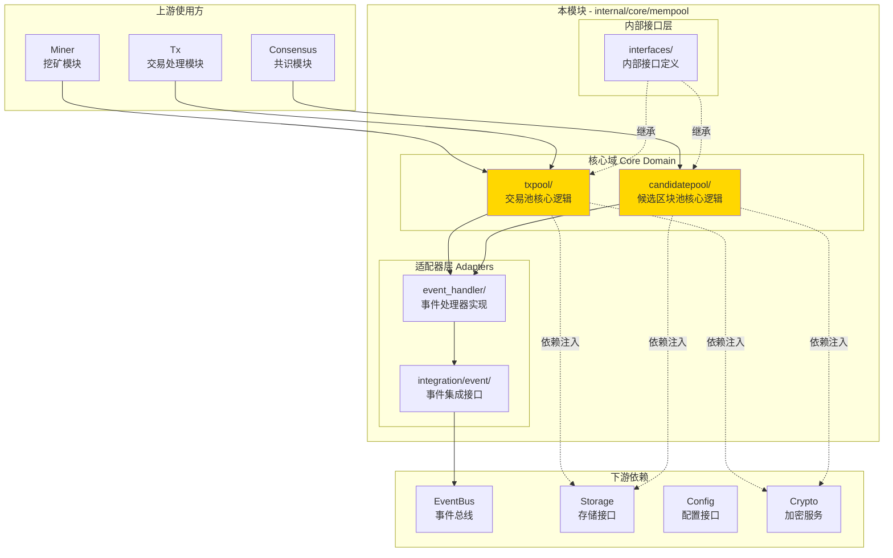
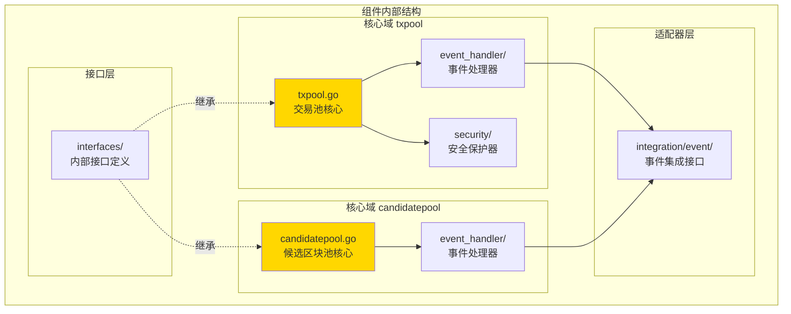
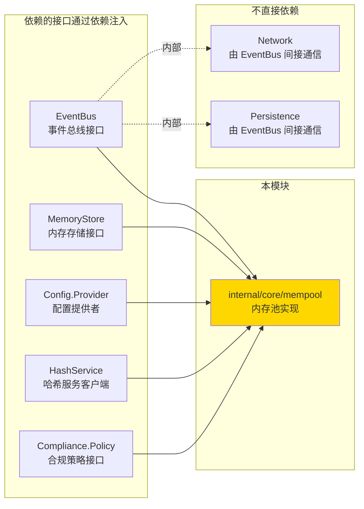
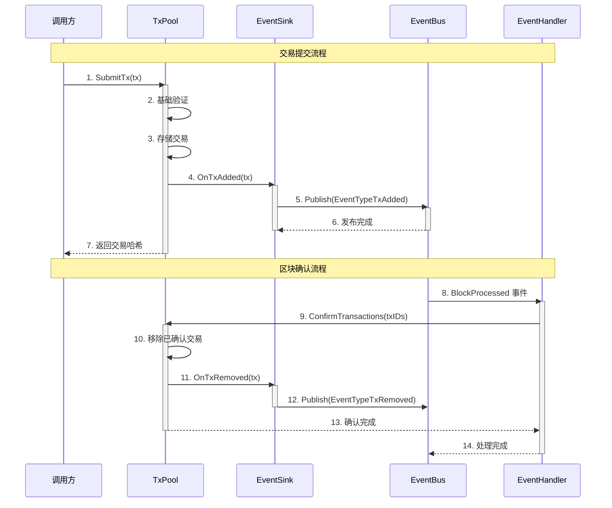

# Mempool - 实现

---

## 📌 版本信息

- **版本**：1.0
- **状态**：stable
- **最后更新**：2025-11-XX
- **最后审核**：2025-11-XX
- **所有者**：mempool 团队
- **适用范围**：WES 区块链系统的内存池层实现

---

## 🎯 实现定位

**路径**：`internal/core/mempool/`

**目的**：提供内存池组件的具体实现，实现内部接口，并通过 `module.go` 配置依赖注入。

**核心原则**：
- ✅ 实现内部接口（而不是直接实现公共接口）
- ✅ 通过 `module.go` 统一管理依赖注入
- ✅ 保持实现与接口分离
- ✅ 遵循 SOLID 原则
- ✅ 事件驱动架构：通过事件总线实现松耦合集成

**解决什么问题**：
- **交易临时存储**：为待处理交易提供高效的临时存储和快速访问
- **候选区块管理**：为挖矿模块提供候选区块的存储和检索服务
- **优先级调度**：基于费用、时间等因素的智能交易排序和选择
- **资源保护**：防止恶意节点通过大量交易填满内存池

**不解决什么问题**（边界）：
- ❌ 交易业务验证（签名、余额、UTXO等） - 由 `tx` 组件负责
- ❌ 区块验证和共识逻辑 - 由 `consensus` 组件负责
- ❌ 网络传输 - 由 `network` 组件负责
- ❌ 数据持久化 - 由 `persistence` 组件负责

---

## 🏗️ 架构设计

### 整体架构

> **说明**：展示内存池组件的整体架构，包括核心域和适配器层



**架构说明**：

| 层级 | 组件 | 职责 | 关键机制 |
|-----|------|------|---------|
| **核心域** | `txpool/` | 交易池的存储、优先级、生命周期管理 | 优先级队列、依赖关系管理 |
| **核心域** | `candidatepool/` | 候选区块的存储、检索、清理 | 按高度索引、超时清理 |
| **适配器** | `integration/event/` | 定义事件订阅和发布接口 | 事件适配接口 |
| **适配器** | `event_handler/` | 实现事件处理器，发布和订阅事件 | 事件下沉模式 |
| **依赖** | `EventBus` | 全局事件总线 | 事件驱动通信 |
| **依赖** | `Storage` | 内存存储接口 | 临时数据存储 |
| **依赖** | `Crypto` | 哈希和签名服务 | 数据验证 |

---

### 内部结构

> **说明**：展示组件内部的子模块组织和协作关系



**子域说明**：

| 子域 | 核心组件 | 职责 | 协作关系 |
|-----|---------|------|---------|
| **txpool/** | `TxPool`, `event_handler`, `security` | 交易池的存储、优先级、事件、安全保护 | 核心逻辑通过事件处理器发布事件 |
| **candidatepool/** | `CandidatePool`, `event_handler` | 候选区块池的存储、检索、事件 | 核心逻辑通过事件处理器发布事件 |
| **integration/event/** | `MempoolEventSubscriber`, `TxPoolEventSubscriber`, `CandidatePoolEventSubscriber` | 定义事件订阅接口 | 被 `event_handler` 实现 |
| **interfaces/** | `InternalTxPool`, `InternalCandidatePool` | 内部接口定义 | 被核心实现继承 |

---

### 依赖关系

> **说明**：展示本组件依赖的外部组件接口



**依赖说明**：

| 依赖模块 | 依赖接口 | 用途 | 约束条件 |
|---------|---------|------|---------|
| **infrastructure/event** | `EventBus` | 事件发布和订阅 | 可选依赖 |
| **infrastructure/storage** | `MemoryStore` | 临时数据存储 | 可选依赖 |
| **config** | `Provider` | 配置获取 | 必需依赖 |
| **infrastructure/crypto** | `HashService` | 交易和区块哈希计算 | 必需依赖（gRPC 客户端） |
| **compliance** | `Policy` | 合规策略检查 | 可选依赖 |

---

### 核心流程

> **说明**：展示交易提交和区块确认的关键业务流程



**流程说明**：
1. **交易提交（步骤 1-7）**：调用方提交交易 → 交易池验证和存储 → 发布交易添加事件
2. **区块确认（步骤 8-14）**：事件总线发布区块处理完成事件 → 事件处理器调用交易池确认 → 交易池清理已确认交易 → 发布交易移除事件

---

## 📐 目录结构

```
internal/core/mempool/
├── README.md                    # 本文档（实现总览）
├── module.go                    # 依赖注入配置 ⭐
│
├── interfaces/                  # 内部接口层
│   ├── README.md               # 内部接口说明
│   ├── txpool.go               # InternalTxPool 接口
│   └── candidatepool.go        # InternalCandidatePool 接口
│
├── txpool/                     # 交易池子域
│   ├── README.md               # 交易池说明
│   ├── txpool.go               # 交易池核心实现
│   ├── txpool_validator.go     # 交易验证器
│   ├── priority.go             # 优先级管理
│   ├── eviction.go             # 清理策略
│   ├── confirmation.go         # 确认管理
│   ├── tx_dependency.go       # 依赖关系管理
│   ├── events.go               # 事件接口定义
│   ├── event_handler/          # 事件处理器
│   │   ├── README.md
│   │   ├── event_sink.go        # 事件发布下沉
│   │   └── txpool_event_handler.go  # 事件订阅处理
│   └── security/               # 安全保护
│       ├── README.md
│       └── protector.go        # 交易池保护器
│
├── candidatepool/              # 候选区块池子域
│   ├── README.md               # 候选区块池说明
│   ├── candidatepool.go        # 候选区块池核心实现
│   ├── candidatepool_validator.go  # 区块验证器
│   ├── candidatepool_methods.go    # 辅助方法
│   ├── events.go               # 事件接口定义
│   └── event_handler/          # 事件处理器
│       ├── README.md
│       ├── event_sink.go       # 事件发布下沉
│       └── candidatepool_event_handler.go  # 事件订阅处理
│
└── integration/                # 集成适配层
    ├── README.md               # 集成层说明
    └── event/                  # 事件集成
        ├── README.md           # 事件集成说明
        ├── subscribe_handlers.go  # 事件订阅接口定义
        └── mempool_event_handler.go  # 组件级事件处理器
```

---

## 🔧 核心实现文件

### 实现 1：`txpool/txpool.go`

**实现对象**：`TxPool`

**实现的内部接口**：`interfaces.InternalTxPool`

**职责**：提供交易池的核心实现，包括交易的存储、优先级排序、生命周期管理和事件发布。

**关键字段**：

```go
type TxPool struct {
    // 分层验证组件
    basicValidator BasicTxValidator
    protector *poolsec.TxPoolProtector
    
    // 存储字段
    txs map[string]*TxWrapper
    pendingQueue *PriorityQueue
    
    // 基础设施
    logger log.Logger
    eventSink TxEventSink
    mu sync.RWMutex
    
    // 依赖服务
    hashService transaction.TransactionHashServiceClient
    compliancePolicy complianceIfaces.Policy
    persistentStore storage.BadgerStore
}
```

**关键方法**：

| 方法名 | 职责 | 来源接口 | 备注 |
|-------|------|---------|-----|
| `SubmitTx()` | 提交交易到交易池 | 公共接口 | 实现交易入池逻辑 |
| `GetTransactionsForMining()` | 获取挖矿交易列表 | 公共接口 | 按优先级排序 |
| `ConfirmTransactions()` | 确认交易 | 公共接口 | 清理已确认交易 |
| `UpdateTransactionStatus()` | 更新交易状态 | ExtendedTxPool | 内部扩展接口 |

**实现要点**：
- 使用优先级队列实现高效的交易排序
- 通过事件下沉模式发布事件，避免直接依赖事件总线
- 支持合规策略和持久化存储（可选）

---

### 实现 2：`candidatepool/candidatepool.go`

**实现对象**：`CandidatePool`

**实现的内部接口**：`interfaces.InternalCandidatePool`

**职责**：提供候选区块池的核心实现，包括候选区块的存储、检索、生命周期管理和事件发布。

**关键字段**：

```go
type CandidatePool struct {
    // 验证组件
    basicValidator BasicCandidateValidator
    
    // 存储字段
    candidates map[string]*types.CandidateBlock
    candidatesByHeight map[uint64][]*types.CandidateBlock
    
    // 基础设施
    logger log.Logger
    eventSink CandidateEventSink
    mu sync.RWMutex
    
    // 依赖服务
    hashService core.BlockHashServiceClient
    chainStateCache ChainStateProvider
}
```

**关键方法**：

| 方法名 | 职责 | 来源接口 | 备注 |
|-------|------|---------|-----|
| `AddCandidate()` | 添加候选区块 | 公共接口 | 验证并存储候选区块 |
| `GetCandidatesForHeight()` | 获取指定高度的候选区块 | 公共接口 | 支持超时等待 |
| `ClearExpiredCandidates()` | 清理过期候选区块 | 公共接口 | 自动清理机制 |

---

## ⚙️ 依赖注入配置（module.go）⭐

**文件**：`module.go`

**职责**：
- 将具体实现绑定到公共接口
- 配置组件的依赖关系
- 管理组件生命周期
- 配置事件集成（订阅和发布）

**关键配置**：

```go
// Module 返回统一的内存池模块
func Module() fx.Option {
    return fx.Module("mempool",
        // 提供内部接口实例
        mlProvideServices(),
        
        // 生命周期管理
        fx.Invoke(fx.Annotate(func(
            lc fx.Lifecycle,
            logger log.Logger,
            candidatePool mempoolIfaces.CandidatePool,
        ) {
            lc.Append(fx.Hook{
                OnStart: func(ctx context.Context) error {
                    logger.Info("🌊 内存池模块启动")
                    return nil
                },
                OnStop: func(ctx context.Context) error {
                    // 停止候选区块池
                    return nil
                },
            })
        })),
        
        // 事件集成配置
        fx.Invoke(fx.Annotate(func(
            logger log.Logger,
            eventBus event.EventBus,
            txPool mempoolIfaces.TxPool,
            candidatePool mempoolIfaces.CandidatePool,
            extendedTxPool txpool.ExtendedTxPool,
        ) error {
            // 设置事件发布下沉
            setupEventSinks(eventBus, logger, extendedTxPool, candidatePool)
            
            // 创建并注册事件处理器
            // ...
            return nil
        })),
    )
}

// mlProvideServices 提供内存池服务
func mlProvideServices() fx.Option {
    return fx.Options(
        // 提供内部接口实例（通过 ProvideServicesInternal）
        fx.Provide(ProvideServicesInternal),
        
        // 绑定内部接口到公共接口（TxPool - 命名）
        fx.Provide(fx.Annotate(
            func(tx interfaces.InternalTxPool) mempoolIfaces.TxPool {
                return tx // 内部接口自动实现公共接口
            },
            fx.ParamTags(`name:"internal_tx_pool"`),
            fx.ResultTags(`name:"tx_pool"`),
        )),
        
        // 绑定内部接口到公共接口（CandidatePool）
        fx.Provide(fx.Annotate(
            func(cp interfaces.InternalCandidatePool) mempoolIfaces.CandidatePool {
                return cp
            },
            fx.ParamTags(`name:"internal_candidate_pool"`),
            fx.ResultTags(`name:"candidate_pool"`),
        )),
        
        // 提供 ExtendedTxPool（用于事件集成）
        fx.Provide(fx.Annotate(
            func(tx interfaces.InternalTxPool) txpool.ExtendedTxPool {
                if ext, ok := tx.(txpool.ExtendedTxPool); ok {
                    return ext
                }
                return nil
            },
            fx.ParamTags(`name:"internal_tx_pool"`),
        )),
    )
}
```

**配置说明**：

| 配置项 | 说明 | 备注 |
|-------|------|-----|
| `ProvideServicesInternal` | 提供内部接口实例 | 返回 `InternalServicesOutput` 结构体 |
| `fx.Annotate` | 类型转换和标签绑定 | 绑定内部接口到公共接口 |
| `fx.ResultTags` | 结果标签 | 用于依赖注入时的标签识别 |
| `fx.ParamTags` | 参数标签 | 用于指定依赖注入时的标签匹配 |
| `fx.Invoke` | 调用初始化函数 | 配置事件集成和生命周期管理 |

**依赖注入示意图**：

```
module.go 配置
    ↓ fx.Provide(ProvideServicesInternal)
InternalServicesOutput (内部接口实例)
    ↓ fx.Annotate + fx.ResultTags
mempoolIfaces.TxPool (公共接口)
    ↓ 供其他组件使用
调用方获得接口实例
```

**绑定路径**：
```
公共接口 (pkg/interfaces/mempool.TxPool)
    ↓ 继承
内部接口 (internal/core/mempool/interfaces.InternalTxPool)
    ↓ 实现
具体实现 (internal/core/mempool/txpool.TxPool)
    ↓ 装配
module.go (通过 fx.Annotate 绑定)
```

---

## 🔄 架构层次关系

```
pkg/interfaces/mempool/              ← 公共接口（对外契约）
    ↓ 嵌入/继承
internal/core/mempool/interfaces/    ← 内部接口（扩展方法）
    ↓ 实现
internal/core/mempool/              ← 您在这里（具体实现）
    ├── txpool/                     ← 交易池实现
    ├── candidatepool/              ← 候选区块池实现
    └── integration/                ← 集成适配层
    ↓ 装配
internal/core/mempool/module.go     ← 依赖注入配置
    ↓ 提供
其他组件通过公共接口调用
```

**关键约束**：
- ✅ 实现 → 实现内部接口（`interfaces.InternalTxPool`）
- ✅ module.go → 绑定到公共接口（`mempoolIfaces.TxPool`）
- ❌ 禁止：实现 → 直接实现公共接口

---

## 📊 实现细节

### 关键设计决策

**决策 1：双池协同设计**

- **问题**：如何同时支持交易和候选区块的管理？
- **方案**：分离设计 `txpool` 和 `candidatepool` 两个独立的子域，各自专注自己的职责。
- **理由**：
  - 职责分离：交易和候选区块有不同的生命周期和管理需求
  - 性能优化：可以针对不同场景优化存储和检索策略
  - 可维护性：代码结构清晰，易于理解和维护
- **权衡**：
  - ✅ 优点：职责清晰、性能优化、易于维护
  - ⚠️ 缺点：需要协调两个池的状态

---

**决策 2：事件驱动架构**

- **问题**：如何实现与其他模块的松耦合集成？
- **方案**：通过事件总线实现事件驱动的通信，内存池只发布和订阅事件，不直接调用其他模块。
- **理由**：
  - 松耦合：减少模块间的直接依赖
  - 可扩展：易于添加新的事件订阅者
  - 可测试：可以 Mock 事件总线进行测试
- **权衡**：
  - ✅ 优点：松耦合、可扩展、可测试
  - ⚠️ 缺点：事件传递可能有延迟

---

**决策 3：事件下沉模式**

- **问题**：如何将内部事件发布到全局事件总线？
- **方案**：使用事件下沉（Event Sink）模式，核心逻辑通过 `TxEventSink` 接口发布事件，而不是直接依赖事件总线。
- **理由**：
  - 解耦：核心逻辑不依赖事件总线
  - 灵活：可以选择性地启用事件发布
  - 可测试：可以注入 Mock 实现
- **权衡**：
  - ✅ 优点：解耦、灵活、可测试
  - ⚠️ 缺点：增加了一层抽象

---

**决策 4：分层验证策略**

- **问题**：验证逻辑应该放在哪里？
- **方案**：内存池只做基础安全验证（格式、哈希、大小），业务验证（签名、余额、UTXO）委托给上层模块。
- **理由**：
  - 性能：基础验证快速且无需外部依赖
  - 职责分离：业务验证由专门的验证器负责
  - 可扩展：可以灵活添加新的验证规则
- **权衡**：
  - ✅ 优点：性能好、职责清晰、可扩展
  - ⚠️ 缺点：需要上层模块配合

---

### 性能优化

| 优化点 | 方案 | 效果 |
|-------|------|-----|
| **交易存储** | 使用哈希表 + 优先级队列组合 | O(1) 插入查找，O(log n) 排序 |
| **并发访问** | 读写锁 + 分段锁 | 支持高并发读写 |
| **内存管理** | 对象池 + LRU 缓存 | 减少 GC 压力，提高命中率 |
| **事件发布** | 异步事件发布 | 不阻塞核心操作 |

---

### 错误处理

**错误定义**：各子域有独立的错误定义文件

**错误处理原则**：
- ✅ 使用明确的错误类型（如 `ErrTxPoolFull`、`ErrCandidateNotFound`）
- ✅ 包含足够的上下文信息（如交易哈希、区块高度）
- ✅ 区分可恢复和不可恢复错误

---

### 并发安全

| 字段/方法 | 是否并发安全 | 保护机制 |
|----------|------------|---------|
| `txs` (交易映射) | ✅ 是 | `sync.RWMutex` |
| `candidates` (候选区块映射) | ✅ 是 | `sync.RWMutex` |
| `SubmitTx()` | ✅ 是 | 锁保护 |
| `GetTransactionsForMining()` | ✅ 是 | 读锁保护 |

---

## 🧪 测试

**测试文件**：各子域有独立的测试文件

**测试覆盖**：

| 测试类型 | 覆盖率目标 | 当前状态 |
|---------|-----------|---------|
| 单元测试 | ≥ 80% | 已实现部分测试 |
| 集成测试 | 核心场景 | 待完善 |
| 压力测试 | 关键路径 | `txpool_stress_test.go` |

---

## 📚 相关文档

- [公共接口目录](../../../pkg/interfaces/mempool/README.md)
- [内部接口目录](./interfaces/README.md)
- [交易池实现](./txpool/README.md)
- [候选区块池实现](./candidatepool/README.md)
- [事件集成层](./integration/event/README.md)
- [代码组织规范](../../../docs/system/standards/principles/code-organization.md)

---

## 🔍 关键依赖

| 依赖接口 | 用途 | 来源 |
|---------|------|-----|
| `EventBus` | 事件发布和订阅 | `pkg/interfaces/infrastructure/event` |
| `MemoryStore` | 临时数据存储 | `pkg/interfaces/infrastructure/storage` |
| `Config.Provider` | 配置获取 | `pkg/interfaces/config` |
| `HashService` | 哈希计算 | gRPC 客户端（`pb/blockchain/block/transaction`） |
| `Compliance.Policy` | 合规策略检查 | `pkg/interfaces/compliance` |

---

## 📝 变更历史

| 版本 | 日期 | 变更内容 | 作者 |
|-----|------|---------|------|
| 1.0 | 2025-11-XX | 初始版本，符合代码组织规范 | mempool 团队 |

---
