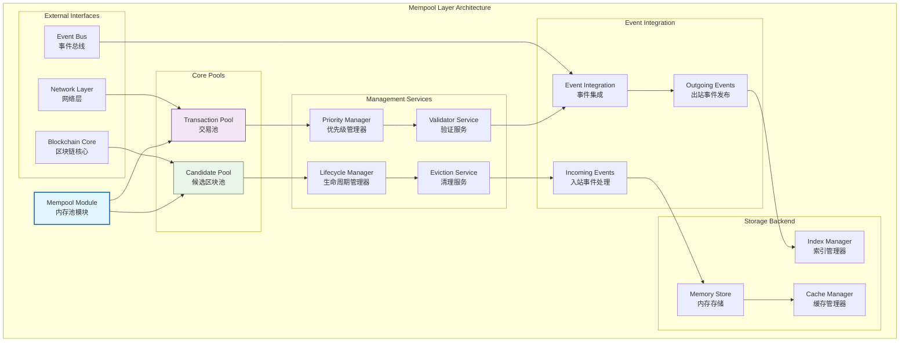
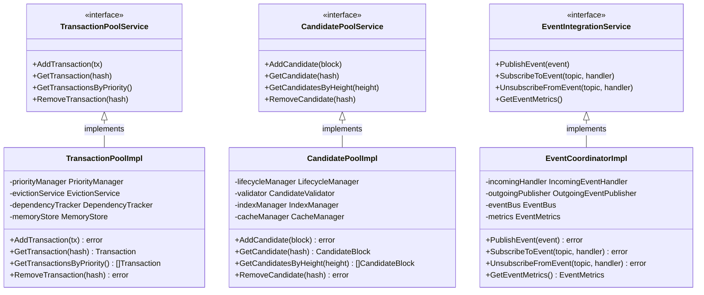

# 内存池层（internal/core/mempool）

【模块定位】
　　本目录实现WES区块链的内存池层，作为七层架构的第三层，负责交易和候选区块的临时存储、调度与管理。内存池层连接网络层和区块链核心层，为交易处理和区块挖矿提供高效的缓存和优先级管理服务。

【设计原则】
- 分层验证策略：基础安全验证在内存池，业务验证委托上层
- 双池协同设计：交易池和候选区块池的独立设计与协同工作
- 事件驱动集成：通过事件总线实现与其他模块的松耦合集成
- 高性能缓存：优化的内存管理和快速检索算法
- 优先级调度：基于费用和时间的智能优先级排序
- 生命周期管理：完整的数据生命周期管理和清理机制

【核心职责】
1. **交易临时存储**：待处理交易的接收、验证、存储和排序管理
2. **候选区块管理**：候选区块的存储、检索和生命周期控制
3. **优先级调度**：基于费用、时间等因素的智能排序和选择
4. **基础安全验证**：交易格式、哈希、大小等基础验证
5. **事件集成服务**：与事件总线的集成和事件驱动通信
6. **资源管理优化**：内存使用优化和垃圾回收机制

【内存池设计理念：双池协同缓存模式】
本内存池层采用"双池协同缓存"设计模式，通过交易池和候选区块池的分离设计，实现交易处理和区块挖矿的并行优化。这种设计的核心思想是"分离关注点，协同优化"。

## 内存池架构设计



**架构层次说明**：
　　内存池层采用分层模块化设计，通过四个核心层次实现交易和区块的高效管理。**Core Pools层**（紫/绿色）提供交易池和候选区块池的核心功能，**Management Services层**（橙色）负责优先级、生命周期、验证和清理服务，**Event Integration层**（灰色）实现与事件总线的集成，**Storage Backend层**（黄色）提供底层的存储和索引支持。

**设计特点**：
　　双池独立设计确保交易处理和区块挖矿的并行性能，事件驱动架构实现与其他模块的松耦合集成，分层验证策略平衡了性能和安全性，智能优先级管理提供公平而高效的资源调度。

## 目录结构与组件职责

| 目录 | 核心组件 | 主要职责 |
|------|----------|----------|
| **module.go** | `MempoolModule` | Fx模块装配和依赖注入管理 |
| **txpool/** | `TransactionPool` | 交易的临时存储和优先级管理 |
| **candidatepool/** | `CandidatePool` | 候选区块的存储和生命周期管理 |
| **integration/event/** | `EventIntegration` | 事件集成和消息传递 |
| **integration/event/incoming/** | `IncomingEvents` | 入站事件的订阅和处理 |
| **integration/event/outgoing/** | `OutgoingEvents` | 出站事件的发布和分发 |

## 核心功能实现

### 🔄 交易池核心能力
　　交易池作为内存池的主要组件，承担着待处理交易的全生命周期管理。从交易接收开始，交易池首先执行基础安全验证，包括交易格式检查、哈希验证、大小限制等。验证通过的交易将根据费用和时间戳进行优先级排序，存储在高效的内存数据结构中。

　　在交易调度方面，交易池实现了智能的优先级算法，综合考虑交易费用、等待时间、交易依赖关系等因素。高优先级交易优先被挖矿模块选择，同时维护公平性避免低费用交易被长期搁置。交易池还实现了依赖关系管理，确保有依赖关系的交易按正确顺序处理。

### 🎯 候选区块池管理
　　候选区块池专门管理来自矿工的候选区块，为共识算法提供候选区块的临时存储服务。每个候选区块在进入池中时都会经过基础验证，包括区块头格式、默克尔根验证、时间戳检查等。候选区块按高度和时间戳进行组织，支持快速检索和筛选。

　　候选区块池实现了高效的生命周期管理，自动清理过期或无效的候选区块，避免内存泄漏。同时支持按高度范围查询、按矿工地址过滤等多种检索模式，为共识算法的区块选择提供灵活的数据访问接口。

### 🔗 事件集成架构
　　事件集成模块实现了内存池与其他系统组件的松耦合通信。通过事件总线，内存池可以订阅来自网络层的新交易事件、区块链核心的区块确认事件等，同时发布交易状态变更、候选区块更新等事件供其他模块消费。

　　入站事件处理采用异步模式，避免外部事件阻塞内存池的核心操作。出站事件发布使用标准化的事件格式，确保事件消费者能够可靠地处理各种状态变更通知。事件集成还包含错误处理和重试机制，保障事件传递的可靠性。

## 性能优化策略

### 内存管理优化
　　内存池实现了多层次的内存优化策略。在数据结构层面，使用高效的哈希表和优先队列组合，实现O(1)的插入查找和O(log n)的优先级排序。在内存分配方面，采用对象池技术复用频繁创建的对象，减少垃圾回收压力。

　　缓存管理采用LRU策略，将频繁访问的交易和区块保持在快速访问的缓存中。同时实现了智能的预取机制，根据访问模式预加载可能需要的数据。内存使用监控确保内存池不会消耗过多系统资源，在接近限制时主动清理低优先级数据。

### 并发控制机制
　　内存池支持高并发访问，采用细粒度锁和无锁数据结构提升并发性能。读写分离设计允许多个读操作并行执行，写操作采用分段锁减少锁竞争。关键路径使用无锁队列和原子操作，确保高频操作的低延迟。

　　批量操作优化减少了锁的获取释放开销，多个小操作可以合并为一个大的原子操作。异步处理将耗时的验证和网络操作移到后台线程，避免阻塞主要的数据访问路径。

## 验证与安全机制

### 分层验证策略
　　内存池实现了分层验证架构，将验证责任合理分配到不同层次。基础安全验证在内存池层完成，包括数据格式验证、哈希一致性检查、大小限制验证等。这些验证操作快速且无需外部依赖，可以高效过滤明显无效的数据。

　　业务逻辑验证委托给上层模块处理，如签名验证、余额检查、UTXO有效性等。这种分离避免了内存池对区块链状态的直接依赖，降低了系统复杂度，同时保证了验证的完整性。验证结果通过缓存机制复用，避免重复验证开销。

### 安全防护措施
　　内存池实现了多重安全防护机制。重复提交检测通过哈希表快速识别重复交易，避免资源浪费。大小限制防止单个超大交易或区块消耗过多内存。频率限制防止恶意节点通过大量无效提交进行拒绝服务攻击。

　　输入验证确保所有外部输入都经过严格检查，防止格式化字符串攻击、缓冲区溢出等安全问题。错误处理确保异常情况不会导致内存池崩溃或状态不一致。日志记录提供安全事件的审计跟踪。

## 监控与调试支持

### 性能指标监控
　　内存池提供丰富的性能指标监控，包括交易处理吞吐量、平均延迟、内存使用量、命中率等关键指标。实时监控帮助运维团队及时发现性能瓶颈和异常情况。历史数据分析支持容量规划和性能调优。

　　指标采集采用高效的无锁计数器，避免监控本身影响系统性能。指标数据通过标准接口暴露，支持与主流监控系统集成。告警机制在关键指标超过阈值时及时通知，支持自动化运维。

### 调试工具集成
　　内存池提供了完整的调试工具支持。状态查询接口允许实时查看内存池的内部状态，包括交易数量、优先级分布、内存使用情况等。事务追踪功能可以跟踪单个交易的完整处理流程，帮助诊断问题。

　　日志系统记录详细的操作日志，支持不同级别的日志输出。性能分析工具可以识别热点代码路径和性能瓶颈。测试工具支持模拟各种异常情况，验证系统的健壮性。

---

## 🏗️ **依赖注入架构**

【fx框架集成】

　　全面采用fx依赖注入框架，实现组件间的松耦合和生命周期自动管理。

```go
// 示例：内存池模块依赖注入配置
package mempool

import (
    "go.uber.org/fx"
    "github.com/weisyn/v1/pkg/interfaces/mempool"
)

// Module 内存池模块
var Module = fx.Module("mempool",
    // 导入核心组件
    fx.Provide(
        // 交易池组件
        txpool.NewTransactionPool,
        txpool.NewPriorityManager,
        txpool.NewEvictionService,
        txpool.NewDependencyTracker,
        
        // 候选区块池组件
        candidatepool.NewCandidatePool,
        candidatepool.NewLifecycleManager,
        candidatepool.NewValidator,
        
        // 事件集成组件
        integration.NewEventCoordinator,
        integration.NewIncomingEventHandler,
        integration.NewOutgoingEventPublisher,
        
        // 存储后端组件
        NewMemoryStore,
        NewIndexManager,
        NewCacheManager,
    ),
    
    // 导出公共接口
    fx.Provide(
        fx.Annotate(
            func(pool *txpool.TransactionPool) mempool.TransactionPoolService {
                return pool
            },
            fx.As(new(mempool.TransactionPoolService)),
        ),
        fx.Annotate(
            func(pool *candidatepool.CandidatePool) mempool.CandidatePoolService {
                return pool
            },
            fx.As(new(mempool.CandidatePoolService)),
        ),
        // ... 其他接口导出
    ),
    
    // 生命周期管理
    fx.Invoke(InitializeMempoolServices),
    fx.Invoke(RegisterEventHandlers),
)

// 内存池服务初始化
func InitializeMempoolServices(
    txPool *txpool.TransactionPool,
    candidatePool *candidatepool.CandidatePool,
    config *MempoolConfig,
) error {
    // 初始化交易池
    if err := txPool.Initialize(config.TxPool); err != nil {
        return err
    }
    
    // 初始化候选区块池
    if err := candidatePool.Initialize(config.CandidatePool); err != nil {
        return err
    }
    
    return nil
}

// 事件处理器注册
func RegisterEventHandlers(
    eventCoordinator *integration.EventCoordinator,
    incomingHandler *integration.IncomingEventHandler,
    outgoingPublisher *integration.OutgoingEventPublisher,
) error {
    // 注册入站事件处理器
    if err := eventCoordinator.RegisterIncomingHandler(incomingHandler); err != nil {
        return err
    }
    
    // 注册出站事件发布器
    if err := eventCoordinator.RegisterOutgoingPublisher(outgoingPublisher); err != nil {
        return err
    }
    
    return nil
}
```

**依赖管理特点：**
- **自动生命周期**：组件启动和停止由fx自动管理
- **接口导向**：通过接口而非具体类型进行依赖
- **层次清晰**：明确的依赖方向，避免循环依赖
- **测试友好**：支持依赖注入的单元测试

---

## 📊 **性能与监控**

【性能指标】

| **操作类型** | **目标延迟** | **吞吐量目标** | **命中率** | **监控方式** |
|-------------|-------------|---------------|-----------|------------|
| 交易添加 | < 1ms | > 5000 TPS | N/A | 实时监控 |
| 交易查询 | < 0.5ms | > 10000 QPS | > 95% | 批量统计 |
| 优先级排序 | < 5ms | > 1000 SPS | N/A | 关键路径监控 |
| 候选区块添加 | < 2ms | > 500 CPS | N/A | 异步监控 |
| 事件处理 | < 0.2ms | > 20000 EPS | N/A | 实时监控 |

**性能优化策略：**
- **内存优化**：对象池、内存复用、垃圾回收优化
- **并发优化**：细粒度锁、无锁数据结构、读写分离
- **缓存优化**：LRU策略、智能预取、多级缓存
- **批量优化**：批量操作、异步处理、合并写入

---

## 🔗 **与公共接口的映射关系**

【接口实现映射】



**实现要点：**
- **接口契约**：严格遵循公共接口的方法签名和语义
- **错误处理**：标准化的错误返回和异常处理机制
- **日志记录**：完善的操作日志和性能指标记录
- **测试覆盖**：每个接口方法都有对应的单元测试和集成测试

---

## 🚀 **后续扩展规划**

【模块演进方向】

1. **性能优化提升**
   - 实现更高效的优先级算法
   - 优化内存使用和垃圾回收
   - 添加智能预取和缓存策略

2. **功能扩展完善**
   - 支持更复杂的交易依赖关系
   - 添加动态优先级调整机制
   - 实现更灵活的清理策略

3. **安全性增强**
   - 加强防刷和防攻击机制
   - 实现更严格的验证策略
   - 添加异常检测和自动恢复

4. **监控运维增强**
   - 提供更详细的性能监控
   - 实现自动化的容量规划
   - 添加智能告警和诊断工具

---

## 📋 **开发指南**

【子模块开发规范】

1. **新建子模块步骤**：
   - 在interfaces/中定义内部接口
   - 创建子模块目录和基础文件
   - 实现核心业务逻辑
   - 添加完整的单元测试
   - 更新fx依赖注入配置

2. **代码质量要求**：
   - 遵循Go语言最佳实践
   - 100%的接口方法测试覆盖
   - 完善的错误处理机制
   - 清晰的代码注释和文档

3. **性能要求**：
   - 关键路径延迟指标达标
   - 内存使用合理，避免泄漏
   - 并发安全的数据访问
   - 合理的资源清理机制

【参考文档】
- [交易池实现](txpool/README.md)
- [候选区块池实现](candidatepool/README.md)
- [事件集成架构](integration/README.md)
- [WES架构设计文档](../../../docs/architecture/)

---

> 📝 **模板说明**：本README模板基于WES v0.0.1统一文档规范设计，使用时请根据具体模块需求替换相应的占位符内容，并确保所有章节都有实质性的技术内容。

> 🔄 **维护指南**：本文档应随着模块功能的演进及时更新，确保文档与代码实现的一致性。建议在每次重大功能变更后更新相应章节。