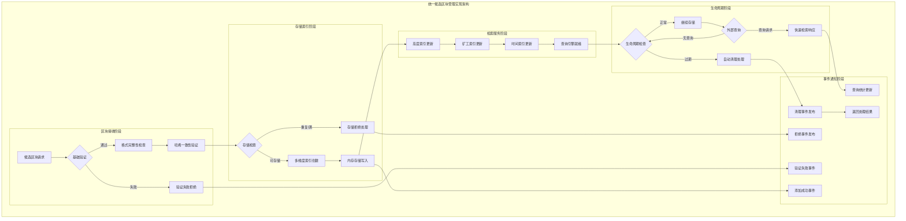
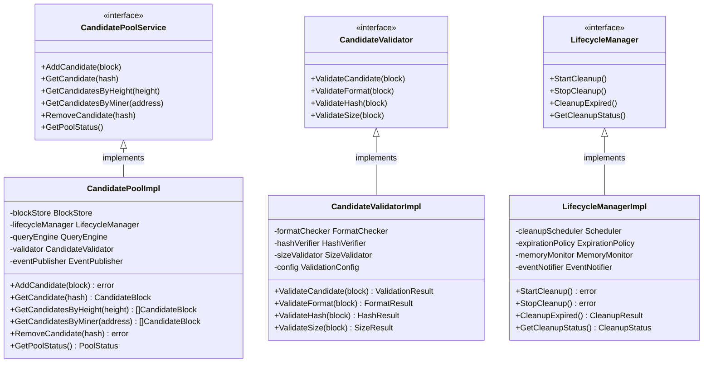

# 候选区块池（internal/core/mempool/candidatepool）

【模块定位】
　　本目录实现WES区块链的候选区块池，专门为基于PoW扩展的共识机制设计的候选区块管理系统。作为内存池层的核心组件之一，候选区块池负责候选区块的临时存储、验证、检索和生命周期管理，为共识算法提供高效的候选区块访问服务。

【设计原则】
- 验证与存储解耦：候选区块池专注存储管理，验证逻辑独立设计
- 高效检索优化：支持按高度、时间戳、矿工等多维度快速检索
- 生命周期自动化：自动清理过期和无效候选区块
- 并发安全保障：支持多线程并发访问和操作
- 事件驱动通知：候选区块状态变更的实时事件通知
- 可扩展架构：支持不同共识算法的候选区块管理需求

【核心职责】
1. **候选区块存储**：候选区块的安全存储和快速访问管理
2. **多维度检索**：按高度、时间、矿工地址等条件的高效查询
3. **生命周期管理**：候选区块的自动清理和过期处理
4. **基础验证服务**：候选区块格式和基础数据的验证
5. **事件通知机制**：候选区块状态变更的事件发布
6. **并发访问控制**：多线程环境下的安全访问管理

【候选区块池设计理念：分层管理存储模式】
本候选区块池采用"分层管理存储"设计模式，通过职责分离和依赖注入实现高度可维护和可扩展的候选区块处理框架。这种设计的核心思想是"存储专精，验证分离"。

## 候选区块池架构设计

```mermaid
graph TB
    subgraph "CandidatePool Architecture"
        CANDIDATEPOOL_SERVICE["CandidatePool Service<br/>候选区块池服务"]
        
        subgraph "Core Management"
            BLOCK_STORE["Block Store<br/>区块存储管理器"]
            LIFECYCLE_MANAGER["Lifecycle Manager<br/>生命周期管理器"]
            INDEX_MANAGER["Index Manager<br/>索引管理器"]
            QUERY_ENGINE["Query Engine<br/>查询引擎"]
        end
        
        subgraph "Validation Layer"
            CANDIDATE_VALIDATOR["Candidate Validator<br/>候选区块验证器"]
            FORMAT_CHECKER["Format Checker<br/>格式检查器"]
            HASH_VERIFIER["Hash Verifier<br/>哈希验证器"]
            SIZE_VALIDATOR["Size Validator<br/>大小验证器"]
        end
        
        subgraph "Storage Backend"
            MEMORY_STORAGE["Memory Storage<br/>内存存储"]
            HEIGHT_INDEX["Height Index<br/>高度索引"]
            MINER_INDEX["Miner Index<br/>矿工索引"]
            TIME_INDEX["Time Index<br/>时间索引"]
        end
        
        subgraph "Event System"
            EVENT_PUBLISHER["Event Publisher<br/>事件发布器"]
            STATE_NOTIFIER["State Notifier<br/>状态通知器"]
            LIFECYCLE_EVENTS["Lifecycle Events<br/>生命周期事件"]
        end
    end
    
    CANDIDATEPOOL_SERVICE --> BLOCK_STORE
    CANDIDATEPOOL_SERVICE --> LIFECYCLE_MANAGER
    
    BLOCK_STORE --> INDEX_MANAGER
    LIFECYCLE_MANAGER --> QUERY_ENGINE
    
    INDEX_MANAGER --> CANDIDATE_VALIDATOR
    QUERY_ENGINE --> FORMAT_CHECKER
    CANDIDATE_VALIDATOR --> HASH_VERIFIER
    FORMAT_CHECKER --> SIZE_VALIDATOR
    
    HASH_VERIFIER --> MEMORY_STORAGE
    SIZE_VALIDATOR --> HEIGHT_INDEX
    MEMORY_STORAGE --> MINER_INDEX
    HEIGHT_INDEX --> TIME_INDEX
    
    MINER_INDEX --> EVENT_PUBLISHER
    TIME_INDEX --> STATE_NOTIFIER
    EVENT_PUBLISHER --> LIFECYCLE_EVENTS
    
    style CANDIDATEPOOL_SERVICE fill:#e1f5fe,stroke:#01579b,stroke-width:2px
    style BLOCK_STORE fill:#f3e5f5,stroke:#4a148c
    style CANDIDATE_VALIDATOR fill:#e8f5e8,stroke:#2e7d32
```



## 目录结构与实现

| 文件 | 核心组件 | 功能描述 |
|------|----------|----------|
| **candidatepool.go** | `CandidatePool` | 候选区块池的主要实现和接口 |
| **candidatepool_validator.go** | `CandidateValidator` | 候选区块的验证逻辑实现 |
| **candidatepool_methods.go** | `PoolMethods` | 池操作方法的具体实现 |
| **events.go** | `EventManager` | 事件管理和发布机制 |
| **events_test.go** | `EventTests` | 事件系统的单元测试 |

## 核心功能实现

### 🏗️ 候选区块存储管理
　　候选区块存储管理是候选区块池的核心功能，负责候选区块的安全存储和高效访问。存储管理器采用高性能的内存数据结构，结合多级索引机制，实现候选区块的快速插入、查询和删除操作。

### 🚀 改进亮点

#### 解决"候选区块池已满"问题
　　通过智能清理机制，有效解决候选区块池被过时区块占满的问题：
- **问题根因**：低于当前链高度的候选区块未被及时清理
- **解决方案**：基于高度的智能清理 + 激进清理机制
- **效果**：显著提高候选区块池的利用效率，减少"池已满"错误

　　在数据组织方面，候选区块按照区块高度进行主要分组，每个高度下可以存储多个来自不同矿工的候选区块。同时维护按时间戳排序的辅助索引，支持时间相关的查询和清理操作。存储管理器还实现了智能的内存管理，通过对象池和缓存机制优化内存使用效率。

### 🔍 多维度检索引擎
　　多维度检索引擎为共识算法和挖矿模块提供灵活的候选区块查询能力。检索引擎支持按区块高度范围查询，这是共识算法最常用的访问模式。同时支持按矿工地址过滤，用于分析特定矿工的候选区块提交情况。

　　时间维度查询支持按时间戳范围检索候选区块，用于时间相关的分析和清理操作。复合查询支持多个条件的组合，如查询特定高度范围内特定时间段的候选区块。查询引擎还实现了结果分页和排序功能，支持大结果集的高效处理。

### ⏰ 生命周期自动化管理
　　生命周期管理器负责候选区块的自动化清理和过期处理，确保候选区块池不会无限增长导致内存泄漏。生命周期管理采用多策略清理机制，包括基于时间的过期清理、基于区块高度的智能清理、基于内存使用量的压力清理等。

### 🔄 多层清理机制

#### 1. 基于时间的清理
　　定期扫描候选区块池，清理超过配置时间阈值（默认10分钟）的候选区块，防止过期区块长期占用池空间。

#### 2. 基于高度的智能清理 ⭐ **核心特性**
　　根据当前链高度智能清理过时的候选区块。清理逻辑：
- **清理条件**：候选区块高度 < (当前链高度 - 保留深度)
- **保留深度**：默认保留3个高度深度的候选区块，应对短期分叉
- **自动触发**：在添加新区块和定期维护时自动执行

#### 3. 激进清理机制
　　当池满且标准清理无效时，按时间顺序清理最旧的候选区块（默认清理25%），确保新的有效候选区块能够进入池中。

## 验证与安全机制

### 分层验证架构
　　候选区块验证采用分层架构，将不同类型的验证逻辑进行合理分离。基础格式验证检查候选区块的数据结构是否符合协议规范，包括字段完整性、数据类型正确性等。哈希一致性验证确保区块头哈希和交易默克尔根的正确性。

　　大小限制验证防止过大的候选区块消耗过多资源，包括区块总大小、交易数量等限制。时间戳验证确保候选区块的时间戳在合理范围内，防止时间攻击。重复检测验证防止相同的候选区块被重复添加。

### 并发安全保障
　　候选区块池实现了完整的并发安全机制，支持多线程环境下的安全操作。核心数据结构采用线程安全设计，通过细粒度锁和无锁数据结构提升并发性能。读写分离设计允许多个读操作并行执行，写操作采用独占锁保证数据一致性。

---

## 📁 **模块组织结构**

【内部模块架构】

```
internal/core/mempool/candidatepool/
├── 📋 candidatepool.go                  # 候选区块池核心实现和接口
├── 🔧 candidatepool_validator.go        # 候选区块验证逻辑实现
├── 📊 candidatepool_methods.go          # 池操作方法的具体实现
├── 📢 events.go                         # 事件管理和发布机制
├── 📝 README.md                         # 本文档
└── 📊 tests/                            # 测试文件目录
    ├── events_test.go                   # 事件系统单元测试
    ├── candidatepool_test.go            # 候选区块池单元测试
    ├── validator_test.go                # 验证器测试
    └── integration_test.go              # 集成测试套件
```

### **🎯 子模块职责分工**

| **文件模块** | **核心职责** | **对外接口** | **内部组件** | **复杂度** |
|-------------|-------------|-------------|-------------|-----------|
| `candidatepool.go` | 候选区块池的主要实现和接口 | CandidatePool | 存储管理、生命周期控制、查询引擎 | 高 |
| `candidatepool_validator.go` | 候选区块验证逻辑实现 | CandidateValidator | 格式检查、哈希验证、大小验证 | 中 |
| `candidatepool_methods.go` | 池操作方法的具体实现 | PoolMethods | 增删查改、索引管理、缓存控制 | 中 |
| `events.go` | 事件管理和发布机制 | EventManager | 事件发布、状态通知、生命周期事件 | 中 |
| `tests/` | 候选区块池功能测试验证 | 测试工具和框架 | 单元测试、集成测试、性能测试 | 中 |

---

## 🔄 **统一候选区块管理实现**

【实现策略】

　　所有候选区块管理组件均严格遵循**分层管理存储**架构模式，确保候选区块的高效存储、快速检索和自动化生命周期管理。



**关键实现要点：**

1. **统一验证流程**：
   - 分层的候选区块验证机制
   - 格式、哈希、大小的完整性检查
   - 快速失败的验证策略

2. **高效索引管理**：
   - 多维度索引的统一创建和维护
   - 基于高度、矿工、时间的快速检索
   - 智能的索引更新和优化

3. **自动化生命周期**：
   - 基于时间、高度、内存压力的清理策略
   - 渐进式清理避免性能影响
   - 完整的清理事件通知

---

## 🏗️ **依赖注入架构**

【fx框架集成】

　　全面采用fx依赖注入框架，实现候选区块池组件间的松耦合和生命周期自动管理。

**依赖注入设计**：
- **核心组件装配**：自动装配候选区块池、验证器、生命周期管理器、查询引擎
- **存储后端注入**：统一注入内存存储、索引管理器、缓存管理器
- **事件系统集成**：通过接口注入事件发布器、状态通知器、生命周期事件
- **生命周期管理**：自动管理候选区块池的初始化、运行和清理

**核心组件依赖关系**：
- CandidatePool依赖BlockStore、LifecycleManager、QueryEngine、EventPublisher
- CandidateValidator依赖FormatChecker、HashVerifier、SizeValidator
- LifecycleManager依赖配置参数、监控接口、清理策略
- 所有组件共享Logger、Config、MetricsCollector等基础服务

---

## 📊 **性能与监控**

【性能指标】

| **操作类型** | **目标延迟** | **吞吐量目标** | **成功率** | **监控方式** |
|-------------|-------------|---------------|-----------|------------|
| 候选区块添加 | < 2ms | > 500 CPS | > 98% | 实时监控 |
| 按高度查询 | < 1ms | > 2000 QPS | > 99% | 批量统计 |
| 按矿工查询 | < 1.5ms | > 1500 QPS | > 95% | 异步监控 |
| 生命周期清理 | < 10ms | > 100 CPS | > 97% | 关键路径监控 |
| 事件发布 | < 0.5ms | > 5000 EPS | > 99% | 异步监控 |

**性能优化策略：**
- **存储优化**：内存池化、对象复用、智能缓存
- **索引优化**：多级索引、惰性更新、压缩存储
- **查询优化**：结果缓存、预取机制、并行查询
- **清理优化**：渐进式清理、批量操作、异步处理

---

## 🔗 **与公共接口的映射关系**

【接口实现映射】



**实现要点：**
- **接口契约**：严格遵循候选区块池接口定义和语义约定
- **错误处理**：分层的错误处理和候选区块异常恢复机制
- **日志记录**：详细的候选区块操作日志和性能指标记录
- **测试覆盖**：全面的候选区块池测试、验证测试和性能基准测试

---

## 🚀 **后续扩展规划**

【模块演进方向】

1. **存储能力增强**
   - 支持更大规模的候选区块存储
   - 实现分布式候选区块池架构
   - 添加持久化存储支持和灾难恢复

2. **查询性能提升**
   - 实现更高效的多维度查询算法
   - 优化复杂查询的执行计划
   - 添加查询结果的智能预缓存

3. **生命周期管理优化**
   - 实现更智能的清理策略
   - 添加基于预测的主动清理
   - 优化内存使用和垃圾回收

4. **集成能力扩展**
   - 支持更多类型的外部事件集成
   - 实现与其他共识算法的适配
   - 添加跨节点的候选区块同步

---

## 📋 **开发指南**

【候选区块池开发规范】

1. **新组件接入步骤**：
   - 定义候选区块池组件接口和服务契约
   - 实现核心存储逻辑和查询功能
   - 添加验证规则和生命周期管理功能
   - 完成组件测试和候选区块池集成测试

2. **代码质量要求**：
   - 遵循Go语言最佳实践和项目编码规范
   - 实现完整的错误处理和异常恢复机制
   - 提供详细的代码注释和技术文档
   - 保证100%的核心功能测试覆盖率

3. **性能要求**：
   - 关键路径延迟指标必须达到设计目标
   - 内存使用效率和并发安全的数据访问
   - 实现合理的缓存策略和资源清理
   - 支持高频候选区块操作和查询需求

【参考文档】
- [主内存池层](../README.md)
- [交易池实现](../txpool/README.md)
- [事件集成架构](../integration/README.md)
- [WES架构设计文档](../../../../docs/architecture/)

---

> 📝 **模板说明**：本README模板基于WES v0.0.1统一文档规范设计，使用时请根据具体模块需求替换相应的占位符内容，并确保所有章节都有实质性的技术内容。

> 🔄 **维护指南**：本文档应随着模块功能的演进及时更新，确保文档与代码实现的一致性。建议在每次重大功能变更后更新相应章节。

## 🔗 **相关文档**