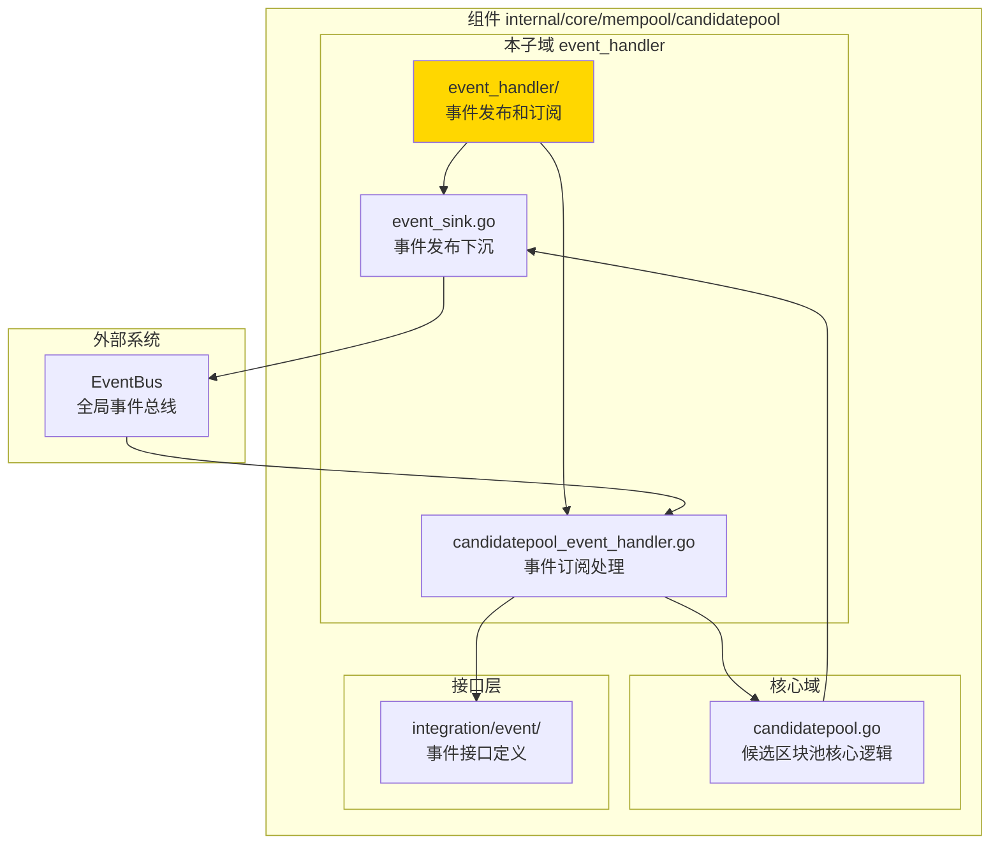
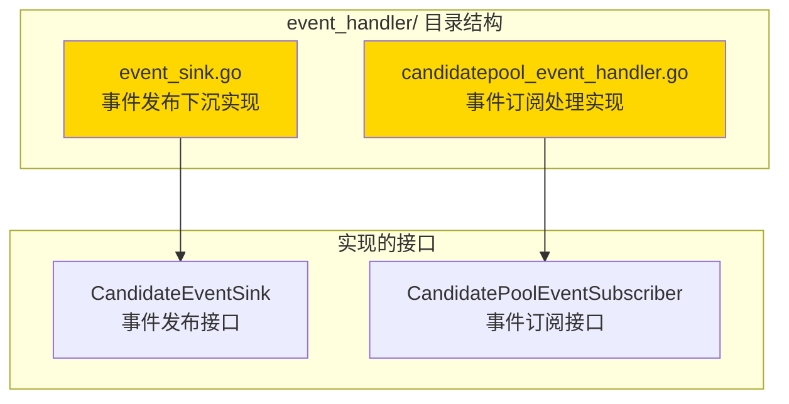

# 候选区块池事件处理器 - 实现子域

---

## 📌 版本信息

- **版本**：1.0
- **状态**：stable
- **最后更新**：2025-11-XX
- **最后审核**：2025-11-XX
- **所有者**：mempool 团队
- **适用范围**：候选区块池的事件发布和订阅处理

---

## 🎯 子域定位

**路径**：`internal/core/mempool/candidatepool/event_handler/`

**所属组件**：`mempool`

**核心职责**：实现候选区块池的事件发布下沉（Event Sink）和事件订阅处理（Event Handler），负责将候选区块池的内部事件转换为标准化的事件总线消息，并处理外部事件对候选区块池的影响。

**在组件中的角色**：
- **事件发布**：将候选区块池的内部事件（候选区块添加、移除等）发布到全局事件总线
- **事件订阅**：订阅外部事件（区块确认、链重组等），清理过时的候选区块
- **事件适配**：实现 `integration/event` 层定义的事件接口

---

## 🏗️ 架构设计

### 在组件中的位置

> **说明**：展示事件处理器在候选区块池组件内部的位置和协作关系



**位置说明**：

| 关系类型 | 目标 | 关系说明 |
|---------|------|---------|
| **实现** | `integration/event/CandidatePoolEventSubscriber` | 实现事件订阅接口，处理外部事件 |
| **发布** | `EventBus` | 将候选区块池内部事件发布到全局事件总线 |
| **协作** | `candidatepool.go` | 接收候选区块池内部事件，并向候选区块池发送控制指令 |

---

### 内部组织

> **说明**：展示事件处理器内部的文件组织和类型关系



---

## 📁 目录结构

```
internal/core/mempool/candidatepool/event_handler/
├── README.md                        # 本文档
├── event_sink.go                    # 事件发布下沉实现（candidateSink）
└── candidatepool_event_handler.go   # 事件订阅处理实现（CandidatePoolEventHandler）
```

---

## 🔧 核心实现

### 实现文件：`event_sink.go`

**核心类型**：`candidateSink`

**职责**：实现 `candidatepool.CandidateEventSink` 接口，将候选区块池的内部事件转换为标准化的事件总线消息并发布。

**关键字段**：

```go
type candidateSink struct {
    eventBus event.EventBus  // 事件总线接口
    logger   log.Logger      // 日志记录器
}
```

**关键方法**：

| 方法名 | 职责 | 可见性 | 备注 |
|-------|------|-------|-----|
| `OnCandidateAdded()` | 发布候选区块添加事件 | Public | 实现 CandidateEventSink 接口 |
| `OnCandidateRemoved()` | 发布候选区块移除事件 | Public | 实现 CandidateEventSink 接口 |
| `OnCandidateExpired()` | 发布候选区块过期事件 | Public | 实现 CandidateEventSink 接口 |
| `OnPoolCleared()` | 发布候选区块池清空事件 | Public | 实现 CandidateEventSink 接口 |
| `OnPoolStateChanged()` | 发布候选区块池状态变化事件 | Public | 实现 CandidateEventSink 接口 |

**事件映射**：
- `OnCandidateAdded` → `eventconstants.EventTypeCandidateAdded`
- `OnCandidateRemoved` → `eventconstants.EventTypeCandidateRemoved`
- `OnCandidateExpired` → `eventconstants.EventTypeCandidateExpired`
- `OnPoolCleared` → `eventconstants.EventTypeCandidatePoolCleared`
- `OnPoolStateChanged` → `eventconstants.EventTypeMempoolSizeChanged`

---

### 实现文件：`candidatepool_event_handler.go`

**核心类型**：`CandidatePoolEventHandler`

**职责**：实现 `integration/event.CandidatePoolEventSubscriber` 接口，订阅外部事件并调整候选区块池策略。

**关键字段**：

```go
type CandidatePoolEventHandler struct {
    logger         log.Logger                    // 日志记录器
    candidatePool  mempoolIfaces.CandidatePool   // 候选区块池接口
    eventBus       event.EventBus                // 事件总线（用于发布衍生事件）
}
```

**关键方法**：

| 方法名 | 职责 | 可见性 | 备注 |
|-------|------|-------|-----|
| `HandleBlockProcessed()` | 处理区块处理完成事件 | Public | 实现 CandidatePoolEventSubscriber 接口 |
| `HandleChainReorganized()` | 处理链重组事件 | Public | 实现 CandidatePoolEventSubscriber 接口 |

**事件处理逻辑**：
- **区块处理完成**：清理已确认高度的候选区块
- **链重组**：清理无效的候选区块，准备接收新区块

---

## 🔗 协作关系

### 依赖的接口

| 接口 | 来源 | 用途 |
|-----|------|-----|
| `CandidateEventSink` | `internal/core/mempool/candidatepool/events.go` | 定义事件发布接口 |
| `CandidatePoolEventSubscriber` | `internal/core/mempool/integration/event/subscribe_handlers.go` | 定义事件订阅接口 |
| `EventBus` | `pkg/interfaces/infrastructure/event` | 全局事件总线 |
| `CandidatePool` | `pkg/interfaces/mempool` | 候选区块池接口（用于调整策略） |

---

### 被依赖关系

**被以下模块使用**：
- `internal/core/mempool/module.go` - 在依赖注入时创建和配置事件处理器
- `internal/core/mempool/candidatepool/candidatepool.go` - 注入 `candidateSink` 用于发布事件

**示例**：

```go
// 在 module.go 中配置
setupEventSinks(eventBus, logger, extendedTxPool, candidatePool)

// 在 candidatepool.go 中使用
pool.eventSink.OnCandidateAdded(candidateBlock)
```

---

## 🧪 测试

### 测试覆盖

| 测试类型 | 文件 | 覆盖率目标 | 当前状态 |
|---------|------|-----------|---------|
| 单元测试 | 暂无 | ≥ 80% | 待实现 |

---

## 📊 关键设计决策

### 决策 1：事件发布下沉模式

**问题**：如何将候选区块池的内部事件发布到全局事件总线？

**方案**：使用事件下沉（Event Sink）模式，候选区块池不直接依赖事件总线，而是通过 `CandidateEventSink` 接口发布事件。

**理由**：
- 降低耦合：候选区块池核心逻辑不依赖事件总线
- 易于测试：可以注入 Mock 实现
- 灵活配置：可以选择性地启用事件发布

**权衡**：
- ✅ 优点：解耦、可测试、灵活
- ⚠️ 缺点：增加了一层抽象

---

### 决策 2：自动清理过时候选区块

**问题**：如何处理已确认区块的候选区块？

**方案**：订阅区块处理完成事件，自动清理已确认高度的候选区块。

**理由**：
- 及时清理：避免内存泄漏
- 自动化：无需手动管理
- 事件驱动：响应式设计

---

## 📚 相关文档

- [候选区块池总览](../README.md)
- [事件集成层](../../integration/event/README.md)
- [内存池组件总览](../../README.md)
- [接口与实现的组织架构](../../../../../docs/system/standards/principles/code-organization.md)

---

## 📝 变更历史

| 版本 | 日期 | 变更内容 | 作者 |
|-----|------|---------|------|
| 1.0 | 2025-11-XX | 初始版本 | mempool 团队 |

---

