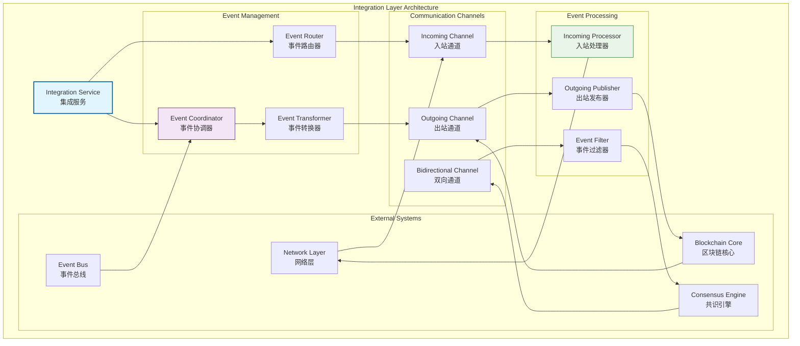
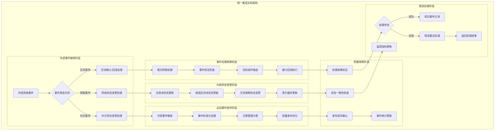
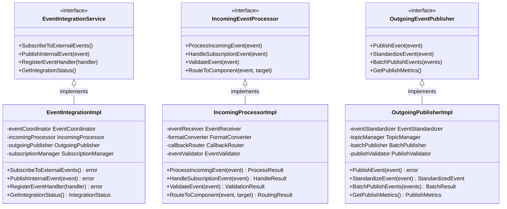

# 集成层（internal/core/mempool/integration）

【模块定位】
　　本目录实现内存池的集成层，负责内存池与外部系统的集成和通信。集成层通过事件驱动架构实现与其他模块的松耦合集成，确保内存池能够高效地与网络层、区块链核心、共识算法等系统组件协同工作。

【设计原则】
- 事件驱动架构：基于事件总线的异步通信模式
- 松耦合集成：最小化与外部系统的直接依赖
- 双向通信支持：入站事件订阅和出站事件发布的统一管理
- 可扩展接口：支持新的集成需求和通信模式
- 错误隔离机制：集成错误不影响内存池核心功能
- 性能优化设计：高效的事件处理和消息传递

【核心职责】
1. **事件集成管理**：统一管理内存池的事件集成和通信
2. **入站事件处理**：订阅和处理来自外部系统的事件
3. **出站事件发布**：发布内存池内部状态变更事件
4. **通信协调服务**：协调不同类型的集成通信
5. **错误处理机制**：集成过程中的错误处理和恢复
6. **性能监控优化**：集成性能的监控和优化

【集成层设计理念：事件驱动通信模式】
本集成层采用"事件驱动通信"设计模式，通过标准化的事件接口实现内存池与外部系统的解耦集成。这种设计的核心思想是"事件连接，服务解耦"。

## 集成架构设计



## 目录结构与功能

| 目录 | 核心功能 | 主要职责 |
|------|----------|----------|
| **event/** | `EventIntegration` | 事件集成的核心实现和管理 |
| **event/incoming/** | `IncomingEvents` | 入站事件的订阅和处理 |
| **event/outgoing/** | `OutgoingEvents` | 出站事件的发布和分发 |

## 核心集成功能

### 🔄 事件驱动集成架构
　　集成层的核心是事件驱动架构，通过标准化的事件接口实现内存池与外部系统的松耦合集成。事件协调器负责管理所有的事件流，确保事件的正确路由和处理。

　　事件路由器根据事件类型和目标系统进行智能路由，支持一对一、一对多、多对一等多种路由模式。事件转换器负责在不同系统间进行事件格式转换，确保事件的兼容性和一致性。

　　集成架构支持同步和异步两种事件处理模式。同步模式用于需要立即响应的关键事件，异步模式用于大部分状态通知事件，提高系统整体性能。

### 📥 入站事件处理机制
　　入站事件处理负责接收和处理来自外部系统的事件。主要包括来自网络层的新交易事件、来自区块链核心的区块确认事件、来自共识引擎的状态变更事件等。

　　入站处理器采用多线程异步处理模式，避免外部事件阻塞内存池的核心操作。事件队列提供缓冲机制，在高并发情况下平滑处理事件峰值。事件去重机制防止重复事件的多次处理。

　　错误处理机制确保单个事件的处理失败不会影响其他事件的处理。重试机制对暂时性错误进行自动重试，持久化机制确保重要事件不会因系统重启而丢失。

### 📤 出站事件发布服务
　　出站事件发布负责将内存池的内部状态变更发布给外部系统。主要包括交易状态变更事件、候选区块状态事件、内存池容量变更事件、性能指标事件等。

　　发布服务采用异步发布模式，避免事件发布影响内存池的主要操作性能。事件聚合机制将相关的小事件合并为大事件，减少事件总量。事件优先级机制确保重要事件能够优先发布。

　　订阅者管理维护事件订阅者列表，支持动态订阅和取消订阅。事件持久化确保重要事件在订阅者暂时不可用时能够重新发送。

## 通信协调机制

### 双向通信支持
　　集成层支持与外部系统的双向通信，既能接收外部事件，也能发布内部事件。双向通道提供统一的通信接口，简化外部系统的集成工作。

　　通信协调器负责管理多个通信通道，确保不同通道间的协调和一致性。消息关联机制支持请求-响应模式的通信，自动关联请求和响应消息。

　　流量控制机制防止通信过载，通过背压机制在下游处理能力不足时主动降低事件发布频率。负载均衡机制在有多个可用通道时智能分配通信负载。

### 错误隔离与恢复
　　集成层实现了完整的错误隔离机制，确保集成错误不会影响内存池的核心功能。错误分类机制将错误分为临时错误、永久错误、系统错误等不同类型。

　　临时错误采用自动重试机制，使用指数退避算法避免重试风暴。永久错误记录到错误日志中，供后续分析和处理。系统错误触发告警机制，及时通知运维团队。

　　恢复机制在系统恢复正常后自动重新建立连接和订阅关系。健康检查机制定期检查集成状态，及时发现和处理异常情况。

## 性能优化策略

### 高效事件处理
　　集成层采用多项性能优化策略确保高效的事件处理。事件池技术复用事件对象，减少内存分配开销。批量处理机制将多个小事件合并处理，提高处理效率。

　　并行处理支持多个独立事件的并行处理，充分利用多核处理能力。优先级队列确保重要事件能够优先处理。缓存机制将频繁访问的事件数据保持在快速缓存中。

　　异步IO避免阻塞等待，提高系统吞吐量。压缩传输减少网络带宽使用，特别是对大事件的传输优化。

### 监控与调优
　　集成层提供全面的性能监控能力，包括事件处理延迟、吞吐量、错误率、队列长度等关键指标。实时监控帮助及时发现性能瓶颈和异常情况。

　　性能分析工具可以识别热点代码和性能瓶颈，指导优化工作。容量规划工具基于历史数据预测未来的处理能力需求。自动调优机制根据实际负载动态调整处理参数。

　　告警系统在关键指标异常时及时通知，支持自动化运维响应。日志系统记录详细的处理日志，支持问题诊断和性能分析。

---

## 📁 **模块组织结构**

【内部模块架构】

```
internal/core/mempool/integration/
├── 📢 event/                           # 事件系统集成目录
│   ├── 📥 incoming/                     # 入站事件处理
│   │   ├── fx_wiring.go                # 生命周期集成和订阅管理
│   │   └── README.md                   # 入站事件处理文档
│   ├── 📤 outgoing/                     # 出站事件发布
│   │   ├── fx_wiring.go                # 依赖注入和接口注入
│   │   └── README.md                   # 出站事件发布文档
│   └── README.md                        # 事件系统总文档
├── 📝 README.md                         # 本文档
└── 📊 tests/                            # 测试文件目录
    ├── event_integration_test.go        # 事件集成测试
    ├── incoming_events_test.go          # 入站事件测试
    ├── outgoing_events_test.go          # 出站事件测试
    └── integration_test.go              # 完整集成测试
```

### **🎯 子模块职责分工**

| **目录模块** | **核心职责** | **对外接口** | **内部组件** | **复杂度** |
|-------------|-------------|-------------|-------------|-----------|
| `event/` | 事件驱动集成的核心实现和管理 | EventIntegration | 协调器、路由器、转换器 | 高 |
| `event/incoming/` | 入站事件的订阅和处理 | IncomingEvents | 订阅管理、接收处理、格式转换 | 中 |
| `event/outgoing/` | 出站事件的发布和分发 | OutgoingEvents | 发布器、标准化器、批量处理 | 中 |
| `tests/` | 集成功能测试验证 | 测试工具和框架 | 单元测试、集成测试、端到端测试 | 中 |

---

## 🔄 **统一集成实现**

【实现策略】

　　所有集成组件均严格遵循**事件驱动通信**架构模式，确保内存池与外部系统的松耦合、高效率、可靠性集成。



**关键实现要点：**

1. **统一事件处理流程**：
   - 标准化的事件接收、转换、路由机制
   - 一致的事件验证和错误处理策略
   - 完整的事件生命周期管理

2. **高效集成通信**：
   - 异步事件处理避免阻塞主要操作
   - 智能的事件聚合和批量发布优化
   - 基于优先级的事件处理调度

3. **可靠性保障机制**：
   - 事件处理的错误隔离和自动重试
   - 完整的事件审计和状态监控
   - 优雅的启停和资源清理机制

---

## 🏗️ **依赖注入架构**

【fx框架集成】

　　全面采用fx依赖注入框架，实现集成层组件间的松耦合和生命周期自动管理。

**依赖注入设计**：
- **集成组件装配**：自动装配事件协调器、路由器、转换器、发布器
- **通信通道注入**：统一注入入站通道、出站通道、双向通道管理器
- **处理器系统集成**：通过接口注入入站处理器、出站发布器、事件过滤器
- **生命周期管理**：自动管理集成服务的初始化、订阅建立和优雅关闭

**核心组件依赖关系**：
- EventIntegration依赖EventCoordinator、EventRouter、EventTransformer
- IncomingProcessor依赖SubscriptionManager、EventReceiver、CallbackRouter
- OutgoingPublisher依赖EventStandardizer、TopicManager、BatchPublisher
- 所有组件共享EventBus、Logger、Config、ErrorHandler等基础服务

---

## 📊 **性能与监控**

【性能指标】

| **操作类型** | **目标延迟** | **吞吐量目标** | **成功率** | **监控方式** |
|-------------|-------------|---------------|-----------|------------|
| 入站事件处理 | < 2ms | > 8000 EPS | > 99% | 实时监控 |
| 出站事件发布 | < 1ms | > 10000 PPS | > 99.5% | 批量统计 |
| 事件路由分发 | < 0.5ms | > 15000 RPS | > 99% | 异步监控 |
| 格式转换 | < 0.3ms | > 20000 CPS | > 98% | 关键路径监控 |
| 订阅管理 | < 5ms | > 500 SMS | > 97% | 定时监控 |
| 错误重试 | < 10ms | > 200 RRS | > 95% | 异常监控 |

**性能优化策略：**
- **处理优化**：异步处理、事件队列缓冲、并行处理
- **通信优化**：连接复用、压缩传输、智能批量
- **发布优化**：事件聚合、延迟发布、优先级调度
- **资源优化**：对象池化、内存复用、垃圾回收优化

---

## 🔗 **与公共接口的映射关系**

【接口实现映射】



**实现要点：**
- **接口契约**：严格遵循事件集成接口定义和通信规范
- **错误处理**：分层的错误处理和集成异常恢复机制
- **日志记录**：详细的集成操作日志和性能指标记录
- **测试覆盖**：全面的集成测试、事件处理测试和通信测试

---

## 🚀 **后续扩展规划**

【模块演进方向】

1. **集成能力增强**
   - 支持更多类型的外部系统集成
   - 实现跨链事件的集成和同步
   - 添加智能的事件过滤和路由

2. **性能优化改进**
   - 实现更高效的事件处理算法
   - 优化大规模事件的处理性能
   - 添加预测性的负载均衡

3. **可靠性提升**
   - 增强事件处理的容错能力
   - 实现更智能的错误恢复机制
   - 添加事件处理的幂等性保障

4. **监控运维增强**
   - 提供可视化的集成监控面板
   - 实现智能的集成状态告警
   - 添加自动化的集成诊断工具

---

## 📋 **开发指南**

【集成层开发规范】

1. **新集成组件接入步骤**：
   - 定义集成组件接口和通信契约
   - 实现核心事件处理逻辑和路由功能
   - 添加错误处理和监控统计功能
   - 完成组件测试和集成层测试

2. **代码质量要求**：
   - 遵循Go语言最佳实践和项目编码规范
   - 实现完整的错误处理和异常恢复机制
   - 提供详细的代码注释和技术文档
   - 保证100%的核心功能测试覆盖率

3. **性能要求**：
   - 关键路径延迟指标必须达到设计目标
   - 内存使用效率和并发安全的数据访问
   - 实现合理的缓存策略和资源清理
   - 支持高频事件处理和通信需求

【参考文档】
- [主内存池层](../README.md)
- [事件系统总览](event/README.md)
- [入站事件处理](event/incoming/README.md)
- [出站事件发布](event/outgoing/README.md)
- [WES架构设计文档](../../../../docs/architecture/)

---

> 📝 **模板说明**：本README模板基于WES v0.0.1统一文档规范设计，使用时请根据具体模块需求替换相应的占位符内容，并确保所有章节都有实质性的技术内容。

> 🔄 **维护指南**：本文档应随着模块功能的演进及时更新，确保文档与代码实现的一致性。建议在每次重大功能变更后更新相应章节。

## 🔗 **相关文档**
