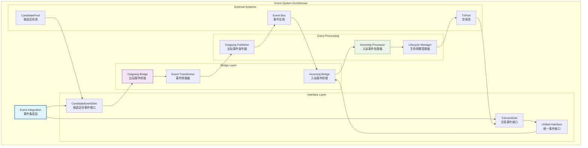

# 事件系统（internal/core/mempool/integration/event）

【模块定位】
　　本目录实现内存池的事件系统集成，负责内存池与事件总线的双向通信。通过下沉接口和桥接实现的架构模式，实现内存池组件与外部系统的事件驱动集成，确保交易池和候选区块池能够及时响应外部事件并发布状态变更通知。

【设计原则】
- 下沉接口模式：在各子模块定义专用的事件接口
- 桥接实现架构：通过桥接层连接内部事件和外部事件总线
- 双向事件流：同时支持入站事件订阅和出站事件发布
- 生命周期管理：在应用生命周期中自动管理事件订阅
- 解耦设计理念：事件集成不影响内存池核心功能
- 标准化接口：统一的事件格式和处理规范

【核心职责】
1. **事件接口下沉**：在子模块中定义专用的事件接口
2. **桥接层实现**：连接内部事件和外部事件总线
3. **入站事件订阅**：订阅外部系统的相关事件
4. **出站事件发布**：发布内存池的状态变更事件
5. **生命周期集成**：在应用启动停止时管理事件订阅
6. **事件格式标准化**：统一的事件消息格式和规范

【事件系统设计理念：下沉桥接模式】
本事件系统采用"下沉桥接"设计模式，通过在各子模块下沉专用事件接口，再通过桥接层统一集成到事件总线。这种设计的核心思想是"接口下沉，实现上浮"。

## 事件系统架构设计

## 目录结构与设计

| 目录 | 核心功能 | 设计模式 |
|------|----------|----------|
| **incoming/** | `IncomingEvents` | 入站事件订阅和生命周期管理 |
| **outgoing/** | `OutgoingEvents` | 出站事件桥接和发布服务 |

## 事件接口设计

### 下沉接口模式
　　事件系统采用下沉接口模式，在各个子模块中定义专用的事件接口。交易池模块定义`TxEventSink`接口，包含交易状态变更、优先级调整、生命周期事件等专用事件。候选区块池模块定义`CandidateEventSink`接口，包含候选区块添加、移除、状态变更等事件。

　　下沉接口的优势在于接口与业务逻辑紧密结合，事件定义更加精确和类型安全。每个子模块可以独立定义自己的事件类型，避免通用事件接口的复杂性。接口版本化管理确保事件定义的向后兼容性。

### 统一事件格式
　　虽然各子模块定义专用接口，但所有事件都遵循统一的格式规范。事件包含标准的元数据字段：事件类型、时间戳、来源模块、事件ID、数据载荷等。统一格式确保不同模块的事件能够被统一处理和路由。

　　事件载荷采用结构化数据格式，支持复杂的事件数据传递。事件关联机制支持相关事件的关联跟踪，便于事件链分析。事件优先级机制确保重要事件能够优先处理。

## 桥接层实现

### 出站事件桥接
　　出站事件桥接负责将内部事件发布到外部事件总线。桥接层实现各子模块的事件接口，当子模块触发事件时，桥接层将事件转换为标准格式并发布到事件总线。

　　桥接实现采用异步发布模式，避免事件发布阻塞业务逻辑。事件缓冲机制在高并发情况下提供平滑处理。事件去重机制防止重复事件的多次发布。批量发布优化将多个相关事件合并发布，提高效率。

### 入站事件桥接
　　入站事件桥接负责订阅外部事件并回调内部接口。桥接层在应用启动时自动订阅相关的外部事件，如新区块确认事件、网络状态变更事件等。当接收到外部事件时，桥接层将事件转换为内部格式并调用相应的内部接口。

　　订阅管理采用生命周期绑定模式，在应用启动时建立订阅，在应用停止时清理订阅。错误处理机制确保单个事件处理失败不会影响整个订阅。重连机制在连接断开时自动重新建立订阅关系。

## 生命周期管理

### 自动化订阅管理
　　事件系统实现了自动化的生命周期管理，通过fx框架的OnStart和OnStop钩子函数自动管理事件订阅。在应用启动时，系统自动建立所有必要的事件订阅关系。在应用停止时，系统自动清理所有订阅和资源。

　　订阅健康检查定期检查订阅状态，确保订阅关系的有效性。订阅恢复机制在检测到订阅异常时自动重新建立。订阅监控提供实时的订阅状态信息，支持运维监控。

### 优雅启停机制
　　生命周期管理实现了优雅的启停机制。启动过程采用分阶段初始化，确保依赖关系的正确建立。停止过程采用优雅关闭，等待正在处理的事件完成后再关闭连接。

　　资源清理机制确保应用停止时所有资源都得到正确释放。超时机制防止启停过程无限等待。状态监控提供启停过程的详细状态信息，便于问题诊断。

## 事件处理优化

### 高性能事件处理
　　事件系统采用多项性能优化策略确保高效的事件处理。异步处理模式避免事件处理阻塞主线程。事件队列提供缓冲机制，平滑处理事件峰值。并行处理支持多个独立事件的并行处理。

　　事件池技术复用事件对象，减少内存分配开销。批量处理机制将多个小事件合并处理。压缩传输减少大事件的传输开销。缓存机制将频繁访问的事件数据保持在快速缓存中。

### 可靠性保障
　　事件系统实现了完整的可靠性保障机制。事件持久化确保重要事件不会因系统重启而丢失。重试机制对临时性错误进行自动重试。错误隔离确保单个事件的处理错误不会影响其他事件。

　　事件顺序保证确保相关事件按正确顺序处理。事件幂等性设计确保重复事件的多次处理不会产生副作用。监控告警机制在事件处理异常时及时通知运维团队。

---

## 🔗 相关文档

- **集成层主文档**：`../README.md` - 集成层的整体架构和设计
- **入站事件处理**：`incoming/README.md` - 外部事件的订阅和处理机制
- **出站事件发布**：`outgoing/README.md` - 内部事件的桥接和发布服务
- **主内存池层**：`../../README.md` - 内存池层的整体架构