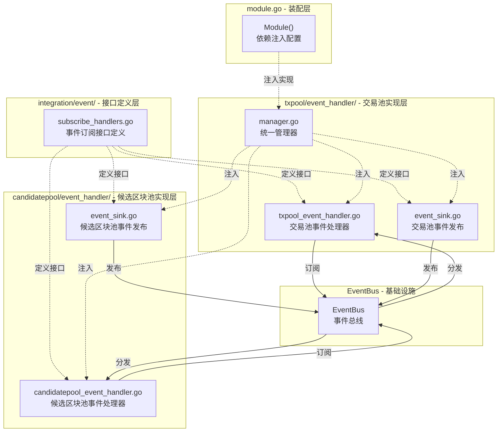

# 事件系统（internal/core/mempool/integration/event）

【模块定位】
　　本目录定义内存池组件的事件订阅接口，遵循代码组织规范，只定义接口不包含实现。事件订阅实现由各子组件的 `event_handler` 模块完成：
- 交易池事件处理器：`txpool/event_handler/`
- 候选区块池事件处理器：`candidatepool/event_handler/`

【设计原则】
- 接口定义：只定义事件订阅接口，不包含实现
- 标准化：使用 `pkg/constants/events` 中的全局事件常量
- 职责分离：接口定义与实现分离，符合代码组织规范
- 类型安全：使用强类型事件常量和数据结构

【核心职责】
1. **事件订阅接口定义**：定义 `MempoolEventSubscriber`、`TxPoolEventSubscriber`、`CandidatePoolEventSubscriber` 接口
2. **事件订阅注册**：提供 `EventSubscriptionRegistry` 统一管理事件订阅
3. **接口标准化**：确保事件订阅接口符合系统标准

## 目录结构

```
integration/event/
├── subscribe_handlers.go  # 事件订阅接口定义和注册器
└── README.md              # 本文档
```

**符合代码组织规范**：
- ✅ 只包含接口定义文件（`subscribe_handlers.go`）
- ✅ 不包含子目录（`incoming/`、`outgoing/` 已移除）
- ✅ 实现位于各子组件的 `event_handler/` 目录（`txpool/event_handler/`、`candidatepool/event_handler/`）

## 事件订阅接口

### MempoolEventSubscriber
内存池通用事件订阅接口，处理系统级别的内存池相关事件：
- `HandleSystemStopping` - 系统停止事件
- `HandleNetworkQualityChanged` - 网络质量变化事件
- `HandleBlockProcessed` - 区块处理完成事件
- `HandleChainReorganized` - 链重组事件
- `HandleConsensusResultBroadcast` - 共识结果广播事件

### TxPoolEventSubscriber
交易池事件订阅接口，处理交易池相关事件：
- `HandleResourceExhausted` - 资源耗尽事件
- `HandleMemoryPressure` - 内存压力事件
- `HandleTransactionReceived` - 交易接收事件
- `HandleTransactionFailed` - 交易失败事件
- `HandleForkDetected` - 分叉检测事件

### CandidatePoolEventSubscriber
候选区块池事件订阅接口，处理候选区块池相关事件：
- `HandleBlockProduced` - 区块生产事件
- `HandleConsensusStateChanged` - 共识状态变化事件
- `HandleResourceExhausted` - 资源耗尽事件
- `HandleStorageSpaceLow` - 存储空间不足事件
- `HandleSystemStopping` - 系统停止事件

## 事件发布

事件发布实现位于各子组件的 `event_handler/` 目录：
- `txpool/event_handler/event_sink.go` - 实现 `TxEventSink` 接口，发布交易池事件
- `candidatepool/event_handler/event_sink.go` - 实现 `CandidateEventSink` 接口，发布候选区块池事件
- `module.go` - 提供 `setupEventSinks` 和 `createMempoolEventHandlers` 辅助函数

## 架构关系



## 使用方式

### 事件订阅（入站）

在 `module.go` 中通过 `EventSubscriptionRegistry` 注册事件订阅：

```go
import txpooleventhandler "github.com/weisyn/v1/internal/core/mempool/txpool/event_handler"

// 创建事件处理器
mempoolHandler, txPoolHandler, candidatePoolHandler := createMempoolEventHandlers(
    logger, eventBus, txPool, candidatePool,
)

// 创建事件订阅注册器
registry := eventintegration.NewEventSubscriptionRegistry(eventBus, logger)
registry.RegisterEventSubscriptions(
    mempoolHandler,
    txPoolHandler,
    candidatePoolHandler,
)
```

### 事件发布（出站）

在 `module.go` 中通过 `SetupEventSinks` 注入事件发布实现：

```go
setupEventSinks(eventBus, logger, extendedTxPool, candidatePool)
```

---

## 🔗 相关文档

- **交易池事件处理器**：`../../txpool/event_handler/` - 交易池事件处理器实现
- **候选区块池事件处理器**：`../../candidatepool/event_handler/` - 候选区块池事件处理器实现
- **集成层主文档**：`../README.md` - 集成层的整体架构和设计
- **主内存池层**：`../../README.md` - 内存池层的整体架构
- **代码组织规范**：`../../../../docs/system/standards/principles/code-organization.md`
