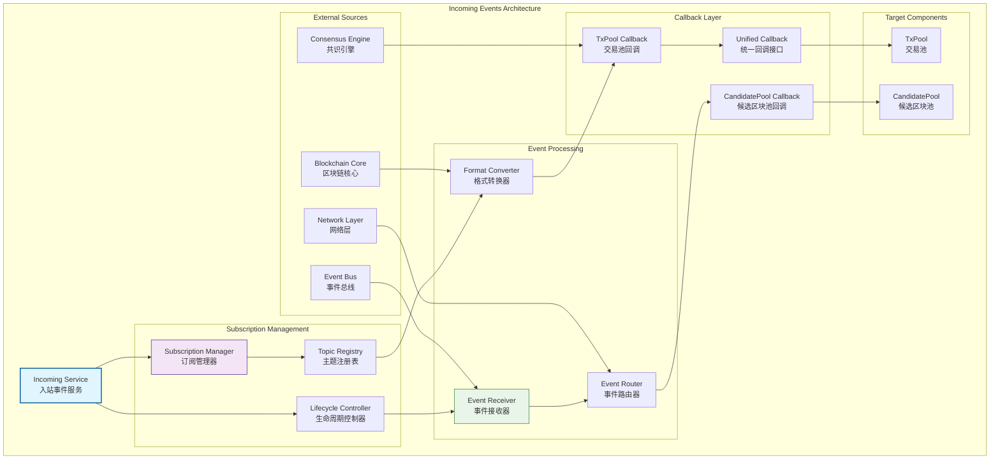

# 入站事件处理（internal/core/mempool/integration/event/incoming）

【模块定位】
　　本目录实现内存池的入站事件处理，负责订阅外部系统事件并将其路由到内存池的相应组件。通过生命周期管理和事件回调机制，确保内存池能够及时响应外部系统的状态变更，保持数据的一致性和实时性。

【设计原则】
- 生命周期绑定：事件订阅与应用生命周期紧密绑定
- 路由转换专职：专注事件路由和格式转换，不混入业务逻辑
- 接口回调模式：通过公开接口回调更新内存池状态
- 错误隔离机制：单个事件处理错误不影响整体订阅
- 可扩展架构：支持新的外部事件类型的订阅
- 低耦合设计：最小化与外部系统的直接依赖

【核心职责】
1. **事件订阅管理**：在应用启动时建立外部事件订阅
2. **事件接收处理**：接收外部事件并进行初步处理
3. **格式转换服务**：将外部事件格式转换为内部格式
4. **接口回调路由**：将事件路由到相应的内存池组件接口
5. **生命周期管理**：在应用停止时清理订阅和资源
6. **错误处理机制**：处理事件订阅和处理过程中的错误

【入站事件设计理念：订阅路由转换模式】
本入站事件处理采用"订阅路由转换"设计模式，专注于外部事件的订阅、路由和格式转换，保持与业务逻辑的分离。这种设计的核心思想是"事件桥接，逻辑分离"。

## 入站事件架构设计

## 核心文件实现

| 文件 | 核心功能 | 实现职责 |
|------|----------|----------|
| **fx_wiring.go** | `LifecycleIntegration` | Fx生命周期集成和事件订阅管理 |

## 核心功能实现

### 🔄 生命周期集成管理
　　入站事件处理的核心是与应用生命周期的紧密集成。通过fx框架的OnStart和OnStop钩子函数，实现事件订阅的自动化管理。在应用启动阶段，系统自动建立所有必要的外部事件订阅关系。

　　订阅建立过程采用渐进式初始化，确保依赖的外部系统已经准备就绪。订阅健康检查验证订阅关系的有效性，确保事件能够正常接收。在应用停止阶段，系统优雅地清理所有订阅关系和相关资源。

　　生命周期管理还包含异常恢复机制，在检测到订阅异常时自动重新建立订阅关系。超时控制防止启停过程无限等待。状态监控提供生命周期过程的详细状态信息。

### 📥 外部事件订阅处理
　　外部事件订阅涵盖多个关键的系统事件类型。区块确认事件通知内存池有新区块被确认，需要清理已确认的交易。区块回滚事件通知有区块被回滚，需要重新添加相关交易到池中。

　　链重组事件通知区块链发生了重组，需要重新评估交易和候选区块的有效性。网络状态变更事件通知网络连接状态的变化，可能影响交易传播策略。共识状态变更事件通知共识算法状态的变化，影响候选区块的处理策略。

　　事件订阅采用主题模式，每种事件类型对应特定的主题。主题命名遵循标准化格式，便于管理和扩展。订阅过滤机制支持只订阅感兴趣的事件子集，减少不必要的处理开销。

### 🔀 事件路由与转换
　　事件路由器负责将接收到的外部事件路由到正确的内存池组件。路由决策基于事件类型和目标组件的映射关系。区块相关事件主要路由到候选区块池，交易相关事件主要路由到交易池。

　　格式转换器负责将外部事件格式转换为内存池内部格式。外部事件通常采用通用格式，需要转换为各组件专用的格式。转换过程包含数据提取、格式适配、类型转换等步骤。

　　事件验证确保接收到的事件数据的有效性和完整性。无效事件会被过滤掉，避免影响内存池的正常运行。事件去重机制防止相同事件的重复处理。

## 回调接口设计

### 组件专用回调
　　回调接口设计采用组件专用模式，为交易池和候选区块池分别设计专用的回调接口。交易池回调接口包含交易确认、交易回滚、优先级调整等方法。候选区块池回调接口包含区块确认、区块无效、状态更新等方法。

　　专用回调接口的优势在于类型安全和语义明确。每个组件只需要实现自己关心的回调方法，避免不必要的复杂性。接口版本化管理确保回调接口的向后兼容性。

### 统一回调管理
　　虽然采用专用回调接口，但系统提供统一的回调管理机制。回调注册器维护所有回调接口的注册信息。回调分发器根据事件类型自动分发到相应的回调接口。

　　回调执行采用异步模式，避免回调处理阻塞事件接收。回调队列提供缓冲机制，在高并发情况下平滑处理回调。回调错误处理确保单个回调失败不会影响其他回调的执行。

## 错误处理与恢复

### 错误分类处理
　　入站事件处理实现了完整的错误处理机制。连接错误表示与外部系统的连接异常，需要重新建立连接。订阅错误表示事件订阅失败，需要重新订阅。处理错误表示事件处理过程中的异常。

　　临时错误采用自动重试机制，使用指数退避算法避免重试风暴。永久错误记录到错误日志中，并可能触发告警。系统错误可能需要人工干预来解决。

### 自动恢复机制
　　自动恢复机制在检测到异常时尝试自动恢复正常状态。连接恢复机制在连接断开时自动重新建立连接。订阅恢复机制在订阅失效时自动重新订阅。

　　健康检查机制定期检查入站事件处理的健康状态，及时发现异常情况。监控告警机制在检测到持续异常时通知运维团队。恢复日志记录所有恢复操作，支持问题诊断和分析。

## 性能优化策略

### 高效事件处理
　　入站事件处理采用多项性能优化策略确保高效运行。异步处理模式避免事件处理阻塞主线程。事件队列提供缓冲机制，平滑处理事件峰值。并行处理支持多个独立事件的并行处理。

　　事件缓存将频繁访问的事件数据保持在快速缓存中。批量处理机制将多个相关事件合并处理。压缩传输减少网络带宽使用。预取机制根据模式预加载可能需要的数据。

### 监控与调优
　　系统提供全面的性能监控能力，包括事件接收延迟、处理吞吐量、错误率、队列长度等关键指标。实时监控帮助及时发现性能瓶颈和异常情况。

　　性能分析工具可以识别热点代码和性能瓶颈。自动调优机制根据实际负载动态调整处理参数。容量规划工具基于历史数据预测未来的处理能力需求。

---

## 🔗 相关文档

- **事件系统总览**：`../README.md` - 事件系统的总体设计和架构
- **出站事件发布**：`../outgoing/README.md` - 内部事件的桥接和发布服务
- **集成层主文档**：`../../README.md` - 集成层的整体架构设计
- **主内存池层**：`../../../README.md` - 内存池层的整体架构