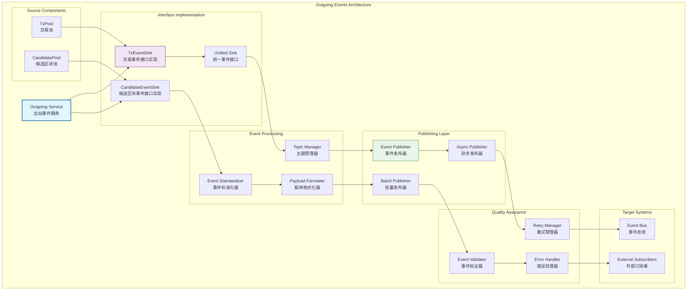

# 出站事件发布（internal/core/mempool/integration/event/outgoing）

【模块定位】
　　本目录实现内存池的出站事件发布，负责将内存池内部事件标准化后发布到统一的事件总线。通过实现下沉接口和事件桥接，确保交易池和候选区块池的状态变更能够及时通知外部系统，实现事件驱动的系统集成。

【设计原则】
- 下沉接口实现：实现各子模块定义的事件接口
- 标准化发布：统一的事件主题和载荷格式
- 桥接层设计：连接内部事件和外部事件总线
- 异步发布模式：避免事件发布阻塞内部操作
- 可扩展架构：支持新的事件类型和格式
- 版本化管理：事件格式的版本化管理和兼容性

【核心职责】
1. **下沉接口实现**：实现TxEventSink和CandidateEventSink接口
2. **事件标准化**：将内部事件转换为标准格式
3. **统一主题管理**：维护标准化的事件主题命名
4. **事件发布服务**：将标准化事件发布到事件总线
5. **依赖注入集成**：通过Fx框架注入到池实例
6. **错误处理机制**：处理事件发布过程中的错误

【出站事件设计理念：桥接发布模式】
本出站事件发布采用"桥接发布"设计模式，通过实现下沉接口将内部事件桥接到外部事件总线。这种设计的核心思想是"内部触发，外部发布"。

## 出站事件架构设计

## 核心文件实现

| 文件 | 核心功能 | 实现职责 |
|------|----------|----------|
| **fx_wiring.go** | `EventOutgoingSetup` | Fx依赖注入和事件接口注入 |

## 标准化事件定义

### 交易池事件规范
　　交易池事件采用统一的命名规范和数据格式。事件主题遵循`mempool.tx.{action}.v1`的命名模式，确保事件类型的清晰识别和版本管理。

**核心交易事件类型**：
- **交易添加事件** (`mempool.tx.added.v1`)：新交易成功添加到交易池时触发，载荷包含完整的交易包装器信息
- **交易移除事件** (`mempool.tx.removed.v1`)：交易从池中移除时触发，包含交易信息和移除原因
- **交易确认事件** (`mempool.tx.confirmed.v1`)：交易被包含在确认区块中时触发，包含交易信息和区块高度
- **交易状态变更事件** (`mempool.tx.status_changed.v1`)：交易状态发生变化时触发，如优先级调整

### 候选区块池事件规范
　　候选区块池事件同样采用标准化命名和格式。事件主题遵循`mempool.candidate.{action}.v1`的命名模式。

**核心候选区块事件类型**：
- **候选区块添加事件** (`mempool.candidate.added.v1`)：新候选区块添加到池中时触发
- **候选区块移除事件** (`mempool.candidate.removed.v1`)：候选区块被移除时触发，包含移除原因
- **候选区块过期事件** (`mempool.candidate.expired.v1`)：候选区块因超时而过期时触发
- **池清理事件** (`mempool.candidate.pool_cleared.v1`)：候选区块池执行批量清理时触发
- **清理完成事件** (`mempool.candidate.cleanup_completed.v1`)：自动化清理过程完成时触发

## 接口实现架构

### 下沉接口桥接实现
　　出站事件发布通过实现各子模块定义的下沉接口来接收内部事件。`TxEventSink`接口实现负责接收交易池的所有事件通知，`CandidateEventSink`接口实现负责接收候选区块池的事件通知。

　　接口实现采用桥接模式，将接收到的内部事件转换为标准格式并发布到事件总线。这种设计确保了内部组件与外部事件系统的解耦，内部组件只需要调用接口方法，不需要直接操作事件总线。

### 依赖注入集成机制
　　通过Fx框架的依赖注入机制，在系统启动时自动将事件接口实现注入到相应的池实例中。注入过程在`SetupEventOutgoing`函数中完成，确保所有必要的事件发布能力都得到正确配置。

　　注入机制支持条件注入，只有在事件总线可用的情况下才进行注入，避免在没有事件总线的环境中产生错误。注入验证确保接口实现正确注入到目标组件中。

## 事件处理优化

### 异步发布机制
　　事件发布采用异步模式，避免事件发布操作阻塞内存池的核心功能。异步发布器维护事件队列，在后台线程中处理事件发布。队列缓冲机制在高并发情况下提供平滑处理。

　　批量发布优化将多个相关事件合并发布，减少与事件总线的交互次数。事件聚合机制将短时间内的相似事件进行合并，减少事件总量。优先级机制确保重要事件能够优先发布。

### 标准化处理流程
　　事件标准化器负责将内部事件格式转换为外部标准格式。标准化过程包括数据提取、格式转换、元数据添加等步骤。载荷格式化器确保事件载荷符合预定义的格式规范。

　　版本管理确保事件格式的向后兼容性。新版本事件格式不会破坏现有订阅者的功能。格式验证确保发布的事件符合格式规范，避免格式错误导致的处理问题。

## 质量保障机制

### 事件验证与过滤
　　事件验证器对所有待发布事件进行验证，确保事件数据的有效性和完整性。验证包括数据类型检查、必填字段验证、格式规范检查等。无效事件会被过滤掉，并记录到错误日志中。

　　事件过滤机制支持基于规则的事件过滤，可以过滤掉不必要的重复事件或低优先级事件。过滤规则支持动态配置，可以根据系统状态调整过滤策略。

### 错误处理与重试
　　错误处理机制对事件发布过程中的各种错误进行分类处理。临时错误采用自动重试机制，使用指数退避算法避免重试风暴。永久错误记录到错误日志中，并可能触发告警。

　　重试管理器维护重试队列，对失败的事件进行重新发布。重试次数限制防止无限重试。重试统计提供重试成功率等指标，支持系统调优。

## 性能监控优化

### 发布性能监控
　　系统提供全面的事件发布性能监控，包括发布延迟、吞吐量、成功率、队列长度等关键指标。实时监控帮助及时发现性能瓶颈和异常情况。

　　性能分析工具可以识别发布热点和瓶颈，指导优化工作。容量规划工具基于历史数据预测未来的发布能力需求。自动调优机制根据实际负载动态调整发布参数。

### 资源使用优化
　　出站事件发布采用多项资源优化策略。对象池技术复用事件对象，减少内存分配开销。内存管理确保事件队列不会消耗过多内存。连接复用减少与事件总线的连接开销。

　　压缩传输减少大事件的传输开销。缓存机制将频繁访问的配置和元数据保持在快速缓存中。垃圾回收优化减少GC对发布性能的影响。

---

## 🔗 相关文档

- **事件系统总览**：`../README.md` - 事件系统的总体设计和架构
- **入站事件处理**：`../incoming/README.md` - 外部事件的订阅和处理机制
- **集成层主文档**：`../../README.md` - 集成层的整体架构设计
- **主内存池层**：`../../../README.md` - 内存池层的整体架构