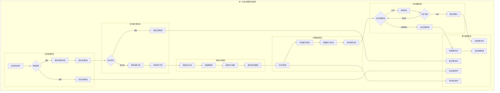
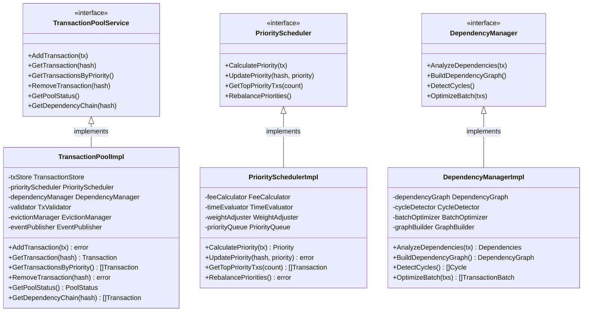

# 交易池（internal/core/mempool/txpool）

【模块定位】
　　本目录实现WES区块链的交易池，作为内存池层的核心组件，负责待处理交易的全生命周期管理。交易池采用验证与存储解耦的现代化架构设计，通过智能优先级调度和高效内存管理，为挖矿模块和交易处理提供企业级的交易管理服务。

【设计原则】
- 职责分离架构：交易池专注存储调度，验证器专注验证逻辑
- 智能优先级调度：基于费用、时间、依赖关系的多维度排序
- 高并发安全设计：支持大规模并发交易提交和处理
- 事件驱动通知：交易状态变更的实时事件发布
- 依赖关系管理：复杂交易依赖链的自动处理和优化
- 内存优化管理：高效的内存使用和自动清理机制

【核心职责】
1. **交易临时存储**：待处理交易的安全存储和快速访问
2. **优先级智能调度**：基于多因素的交易优先级排序
3. **依赖关系处理**：交易间依赖关系的分析和管理
4. **基础验证服务**：交易格式和基础数据的快速验证
5. **生命周期管理**：交易从提交到确认的完整生命周期
6. **事件通知机制**：交易状态变更的事件发布和通知

【交易池设计理念：智能调度存储模式】
本交易池采用"智能调度存储"设计模式，通过职责分离和依赖注入实现高度可维护和可扩展的交易处理框架。这种设计的核心思想是"存储高效，调度智能"。

## 交易池架构设计

```mermaid
graph TB
    subgraph "TxPool Architecture"
        TXPOOL_SERVICE["TxPool Service<br/>交易池服务"]
        
        subgraph "Core Management"
            TX_STORE["Transaction Store<br/>交易存储管理器"]
            PRIORITY_SCHEDULER["Priority Scheduler<br/>优先级调度器"]
            DEPENDENCY_MANAGER["Dependency Manager<br/>依赖关系管理器"]
            LIFECYCLE_CONTROLLER["Lifecycle Controller<br/>生命周期控制器"]
        end
        
        subgraph "Validation Layer"
            TX_VALIDATOR["Transaction Validator<br/>交易验证器"]
            FORMAT_VALIDATOR["Format Validator<br/>格式验证器"]
            SIGNATURE_CHECKER["Signature Checker<br/>签名检查器"]
        end
        
        subgraph "Storage Backend"
            MEMORY_POOL["Memory Pool<br/>内存池"]
            PRIORITY_QUEUE["Priority Queue<br/>优先级队列"]
            DEPENDENCY_GRAPH["Dependency Graph<br/>依赖关系图"]
            TX_INDEX["Transaction Index<br/>交易索引"]
        end
        
        subgraph "Event System"
            EVENT_PUBLISHER["Event Publisher<br/>事件发布器"]
            STATE_TRACKER["State Tracker<br/>状态跟踪器"]
        end
    end
    
    TXPOOL_SERVICE --> TX_STORE
    TXPOOL_SERVICE --> PRIORITY_SCHEDULER
    
    TX_STORE --> DEPENDENCY_MANAGER
    PRIORITY_SCHEDULER --> LIFECYCLE_CONTROLLER
    
    DEPENDENCY_MANAGER --> TX_VALIDATOR
    LIFECYCLE_CONTROLLER --> FORMAT_VALIDATOR
    TX_VALIDATOR --> SIGNATURE_CHECKER
    
    FORMAT_VALIDATOR --> MEMORY_POOL
    SIGNATURE_CHECKER --> PRIORITY_QUEUE
    MEMORY_POOL --> DEPENDENCY_GRAPH
    PRIORITY_QUEUE --> TX_INDEX
    
    DEPENDENCY_GRAPH --> EVENT_PUBLISHER
    TX_INDEX --> STATE_TRACKER
    
    style TXPOOL_SERVICE fill:#e1f5fe,stroke:#01579b,stroke-width:2px
    style TX_STORE fill:#f3e5f5,stroke:#4a148c
    style TX_VALIDATOR fill:#e8f5e8,stroke:#2e7d32
```



## 目录结构与实现

| 文件 | 核心组件 | 功能描述 |
|------|----------|----------|
| **txpool.go** | `TxPool` | 交易池的主要实现和核心接口 |
| **txpool_validator.go** | `TxValidator` | 交易验证逻辑的具体实现 |
| **priority.go** | `PriorityManager` | 优先级调度和排序算法 |
| **tx_dependency.go** | `DependencyManager` | 交易依赖关系分析和管理 |
| **eviction.go** | `EvictionManager` | 交易清理和内存管理策略 |
| **confirmation.go** | `ConfirmationTracker` | 交易确认状态跟踪 |
| **events.go** | `EventManager` | 事件管理和通知机制 |
| **txpool_errors.go** | `ErrorHandler` | 错误处理和分类管理 |

## 核心功能实现

### 🔄 智能优先级调度系统
　　智能优先级调度系统是交易池的核心创新，负责根据多维度因素对待处理交易进行智能排序。调度系统综合考虑交易费用、等待时间、交易大小、发送者信誉等因素，计算出综合优先级评分。

　　费用因素采用动态权重算法，高费用交易获得更高优先级，但同时防止低费用交易被无限期延迟。时间因素确保等待时间较长的交易能够逐步提升优先级，实现公平调度。调度系统还实现了自适应调整机制，根据网络拥堵程度和历史处理数据动态调整各因素的权重。

### 🕸️ 复杂依赖关系管理
　　依赖关系管理器负责处理交易间的复杂依赖关系，确保有依赖的交易按正确顺序处理。管理器构建交易依赖图，分析交易的输入输出关系，识别必须按序执行的交易链。

　　依赖分析采用图算法，能够检测循环依赖、识别依赖链长度、计算并行处理的可能性。对于长依赖链，管理器会进行优化重排，尽可能减少等待时间。依赖关系管理还包含智能批量处理机制，将相关联的交易组合成批次，提高处理效率。

### 🔧 自适应清理策略
　　自适应清理策略负责交易池的内存管理和资源优化，防止无效交易长期占用系统资源。清理策略包含多个层次：时间过期清理、内存压力清理、无效交易清理和低优先级清理。

　　时间过期策略会定期清理超过最大等待时间的交易，避免过期交易无限期占用内存。内存压力策略在系统内存接近限制时主动清理低优先级交易，为新交易腾出空间。清理策略采用渐进式清理机制，避免大批量清理影响系统性能。

## 验证与安全机制

### 分层验证体系
　　交易验证采用分层体系，合理分配验证责任以平衡性能和安全性。基础格式验证在交易池层完成，包括交易结构检查、字段完整性验证、数据类型检查等快速验证项目。

　　签名验证检查交易的数字签名有效性，确保交易来源的真实性。余额验证检查发送者账户是否有足够余额支付交易费用和转账金额。业务逻辑验证委托给上层模块处理，这种分层避免了交易池对复杂业务逻辑的依赖。

### 并发安全保障
　　交易池实现了全面的并发安全机制，支持高并发环境下的稳定运行。核心数据结构采用线程安全设计，通过读写锁、原子操作和无锁数据结构确保数据一致性。

　　操作原子性通过事务机制保证，复杂操作被封装为原子事务。死锁预防机制通过锁排序和超时机制避免死锁发生。并发性能监控提供实时的并发状态信息，帮助识别瓶颈和优化机会。

## 事件驱动通知

### 交易生命周期事件
　　交易池实现了完整的事件驱动通知机制，跟踪交易从提交到确认的完整生命周期。交易接收事件在新交易进入池时发布，验证完成事件在交易通过各项验证后发布，优先级变更事件在交易优先级发生变化时发布。

　　选择事件在交易被挖矿模块选中时发布，确认事件在交易被包含在确认区块中时发布，移除事件在交易因各种原因被清理时发布。这些事件为外部系统提供了完整的交易状态跟踪能力。

### 性能和状态事件
　　性能事件提供交易池运行状态的实时监控信息。容量事件在交易池达到特定容量阈值时发布，性能事件在关键性能指标变化时发布。错误事件在发生验证失败、系统错误等异常情况时发布，统计事件定期发布交易池的统计信息。

---

## 📁 **模块组织结构**

【内部模块架构】

```
internal/core/mempool/txpool/
├── 📋 txpool.go                        # 交易池核心实现和接口
├── 🔧 txpool_validator.go               # 交易验证逻辑的具体实现
├── 🎯 priority.go                       # 优先级调度和排序算法
├── 🕸️ tx_dependency.go                  # 交易依赖关系分析和管理
├── 🧹 eviction.go                       # 交易清理和内存管理策略
├── ✅ confirmation.go                   # 交易确认状态跟踪
├── 📢 events.go                         # 事件管理和通知机制
├── ❌ txpool_errors.go                  # 错误处理和分类管理
├── 📝 README.md                         # 本文档
└── 📊 tests/                            # 测试文件目录
    ├── txpool_test.go                   # 交易池核心功能测试
    ├── priority_test.go                 # 优先级调度测试
    ├── dependency_test.go               # 依赖关系管理测试
    ├── eviction_test.go                 # 清理策略测试
    ├── events_test.go                   # 事件系统测试
    └── integration_test.go              # 集成测试套件
```

### **🎯 子模块职责分工**

| **文件模块** | **核心职责** | **对外接口** | **内部组件** | **复杂度** |
|-------------|-------------|-------------|-------------|-----------|
| `txpool.go` | 交易池主要实现和核心接口 | TxPool | 存储管理、调度控制、生命周期管理 | 高 |
| `txpool_validator.go` | 交易验证逻辑实现 | TxValidator | 格式验证、签名检查、业务验证 | 中 |
| `priority.go` | 优先级调度和排序算法 | PriorityManager | 费用权重、时间因子、智能评分 | 高 |
| `tx_dependency.go` | 交易依赖关系分析和管理 | DependencyManager | 依赖图构建、循环检测、批量优化 | 高 |
| `eviction.go` | 交易清理和内存管理策略 | EvictionManager | 过期清理、压力清理、渐进式清理 | 中 |
| `confirmation.go` | 交易确认状态跟踪 | ConfirmationTracker | 状态追踪、确认通知、历史记录 | 中 |
| `events.go` | 事件管理和通知机制 | EventManager | 生命周期事件、状态变更、性能事件 | 中 |
| `txpool_errors.go` | 错误处理和分类管理 | ErrorHandler | 错误分类、异常恢复、日志记录 | 低 |
| `tests/` | 交易池功能测试验证 | 测试工具和框架 | 单元测试、集成测试、性能测试 | 中 |

---

## 🔄 **统一交易池管理实现**

【实现策略】

　　所有交易池管理组件均严格遵循**智能调度存储**架构模式，确保交易的高效存储、智能排序和完整生命周期管理。



**关键实现要点：**

1. **统一验证流程**：
   - 分层的交易验证机制
   - 格式、签名、业务的完整性检查
   - 快速失败的验证策略

2. **智能优先级调度**：
   - 多维度的优先级评分算法
   - 费用、时间、依赖关系的综合考虑
   - 自适应的权重调整机制

3. **完整依赖关系管理**：
   - 交易依赖图的构建和维护
   - 循环依赖检测和处理
   - 批量相关交易的优化调度

---

## 🏗️ **依赖注入架构**

【fx框架集成】

　　全面采用fx依赖注入框架，实现交易池组件间的松耦合和生命周期自动管理。

**依赖注入设计**：
- **核心组件装配**：自动装配交易池、验证器、优先级管理器、依赖关系管理器
- **调度系统注入**：统一注入优先级调度器、清理管理器、确认跟踪器
- **事件系统集成**：通过接口注入事件发布器、状态跟踪器、通知管理器
- **生命周期管理**：自动管理交易池的初始化、运行和优雅关闭

**核心组件依赖关系**：
- TxPool依赖TxValidator、PriorityManager、DependencyManager、EvictionManager
- PriorityManager依赖费用计算器、时间评估器、权重调整器
- DependencyManager依赖图构建器、循环检测器、批量优化器
- 所有组件共享Logger、Config、MetricsCollector、ErrorHandler等基础服务

---

## 📊 **性能与监控**

【性能指标】

| **操作类型** | **目标延迟** | **吞吐量目标** | **成功率** | **监控方式** |
|-------------|-------------|---------------|-----------|------------|
| 交易添加 | < 1ms | > 5000 TPS | > 99% | 实时监控 |
| 交易查询 | < 0.5ms | > 10000 QPS | > 99.5% | 批量统计 |
| 优先级排序 | < 5ms | > 1000 SPS | > 98% | 关键路径监控 |
| 依赖关系分析 | < 3ms | > 2000 DPS | > 95% | 异步监控 |
| 交易清理 | < 10ms | > 500 CPS | > 97% | 定时监控 |
| 事件发布 | < 0.2ms | > 20000 EPS | > 99% | 异步监控 |

**性能优化策略：**
- **存储优化**：内存池化、对象复用、读写分离
- **调度优化**：优先级缓存、批量排序、懒加载更新
- **依赖优化**：图算法优化、并行分析、增量更新
- **清理优化**：渐进式清理、异步处理、批量操作

---

## 🔗 **与公共接口的映射关系**

【接口实现映射】



**实现要点：**
- **接口契约**：严格遵循交易池接口定义和语义约定
- **错误处理**：分层的错误处理和交易异常恢复机制
- **日志记录**：详细的交易操作日志和性能指标记录
- **测试覆盖**：全面的交易池测试、优先级测试和依赖关系测试

---

## 🚀 **后续扩展规划**

【模块演进方向】

1. **调度算法增强**
   - 实现更智能的优先级评分算法
   - 添加机器学习驱动的费用预测
   - 优化多维度权重的动态调整

2. **依赖关系优化**
   - 支持更复杂的交易依赖模式
   - 实现分布式依赖关系分析
   - 添加依赖关系的可视化分析

3. **性能提升改进**
   - 实现GPU加速的优先级计算
   - 优化大规模交易的内存使用
   - 添加预测性的缓存和预取

4. **监控运维增强**
   - 提供可视化的交易池监控面板
   - 实现智能的容量规划和告警
   - 添加自动化的性能调优建议

---

## 📋 **开发指南**

【交易池开发规范】

1. **新组件接入步骤**：
   - 定义交易池组件接口和服务契约
   - 实现核心交易管理逻辑和调度功能
   - 添加优先级计算和依赖关系管理功能
   - 完成组件测试和交易池集成测试

2. **代码质量要求**：
   - 遵循Go语言最佳实践和项目编码规范
   - 实现完整的错误处理和异常恢复机制
   - 提供详细的代码注释和技术文档
   - 保证100%的核心功能测试覆盖率

3. **性能要求**：
   - 关键路径延迟指标必须达到设计目标
   - 内存使用效率和并发安全的数据访问
   - 实现合理的缓存策略和资源清理
   - 支持高频交易操作和查询需求

【参考文档】
- [主内存池层](../README.md)
- [候选区块池](../candidatepool/README.md)
- [事件集成架构](../integration/README.md)
- [WES架构设计文档](../../../../docs/architecture/)

---

> 📝 **模板说明**：本README模板基于WES v0.0.1统一文档规范设计，使用时请根据具体模块需求替换相应的占位符内容，并确保所有章节都有实质性的技术内容。

> 🔄 **维护指南**：本文档应随着模块功能的演进及时更新，确保文档与代码实现的一致性。建议在每次重大功能变更后更新相应章节。

## 🔗 **相关文档**