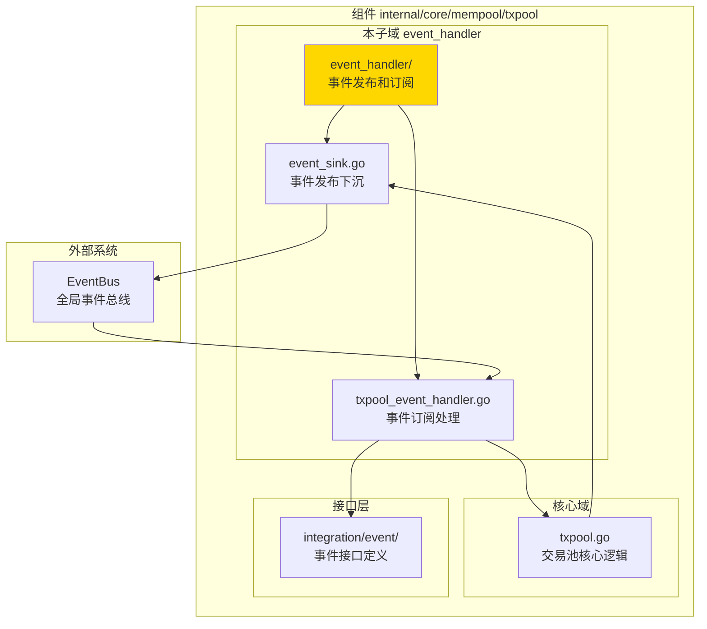
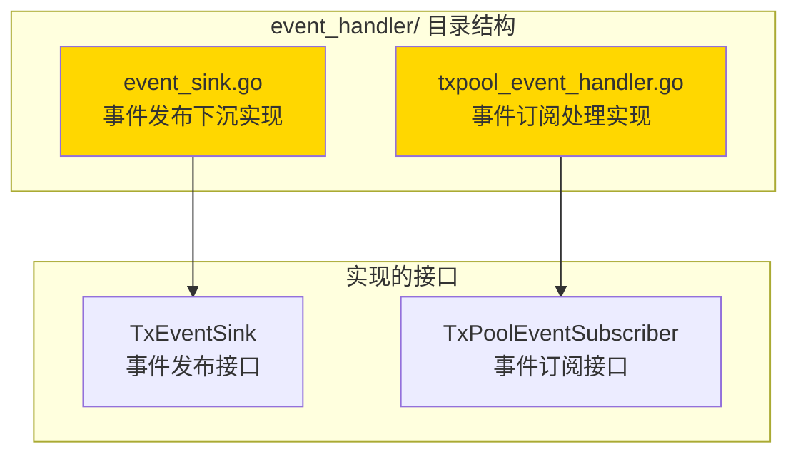

# 交易池事件处理器 - 实现子域

---

## 📌 版本信息

- **版本**：1.0
- **状态**：stable
- **最后更新**：2025-11-XX
- **最后审核**：2025-11-XX
- **所有者**：mempool 团队
- **适用范围**：交易池的事件发布和订阅处理

---

## 🎯 子域定位

**路径**：`internal/core/mempool/txpool/event_handler/`

**所属组件**：`mempool`

**核心职责**：实现交易池的事件发布下沉（Event Sink）和事件订阅处理（Event Handler），负责将交易池的内部事件转换为标准化的事件总线消息，并处理外部事件对交易池的影响。

**在组件中的角色**：
- **事件发布**：将交易池的内部事件（交易添加、移除、确认等）发布到全局事件总线
- **事件订阅**：订阅外部事件（资源耗尽、内存压力等），调整交易池策略
- **事件适配**：实现 `integration/event` 层定义的事件接口

---

## 🏗️ 架构设计

### 在组件中的位置

> **说明**：展示事件处理器在交易池组件内部的位置和协作关系



**位置说明**：

| 关系类型 | 目标 | 关系说明 |
|---------|------|---------|
| **实现** | `integration/event/TxPoolEventSubscriber` | 实现事件订阅接口，处理外部事件 |
| **发布** | `EventBus` | 将交易池内部事件发布到全局事件总线 |
| **协作** | `txpool.go` | 接收交易池内部事件，并向交易池发送控制指令 |

---

### 内部组织

> **说明**：展示事件处理器内部的文件组织和类型关系



---

## 📁 目录结构

```
internal/core/mempool/txpool/event_handler/
├── README.md                    # 本文档
├── event_sink.go                # 事件发布下沉实现（txSink）
└── txpool_event_handler.go      # 事件订阅处理实现（TxPoolEventHandler）
```

---

## 🔧 核心实现

### 实现文件：`event_sink.go`

**核心类型**：`txSink`

**职责**：实现 `txpool.TxEventSink` 接口，将交易池的内部事件转换为标准化的事件总线消息并发布。

**关键字段**：

```go
type txSink struct {
    eventBus event.EventBus  // 事件总线接口
    logger   log.Logger      // 日志记录器
}
```

**关键方法**：

| 方法名 | 职责 | 可见性 | 备注 |
|-------|------|-------|-----|
| `OnTxAdded()` | 发布交易添加事件 | Public | 实现 TxEventSink 接口 |
| `OnTxRemoved()` | 发布交易移除事件 | Public | 实现 TxEventSink 接口 |
| `OnTxConfirmed()` | 发布交易确认事件 | Public | 实现 TxEventSink 接口 |
| `OnTxExpired()` | 发布交易过期事件 | Public | 实现 TxEventSink 接口 |
| `OnPoolStateChanged()` | 发布交易池状态变化事件 | Public | 实现 TxEventSink 接口 |

**事件映射**：
- `OnTxAdded` → `eventconstants.EventTypeTxAdded`
- `OnTxRemoved` → `eventconstants.EventTypeTxRemoved`
- `OnTxConfirmed` → `eventconstants.EventTypeTxConfirmed`
- `OnTxExpired` → `eventconstants.EventTypeTxExpired`
- `OnPoolStateChanged` → `eventconstants.EventTypeMempoolSizeChanged`

---

### 实现文件：`txpool_event_handler.go`

**核心类型**：`TxPoolEventHandler`

**职责**：实现 `integration/event.TxPoolEventSubscriber` 接口，订阅外部事件并调整交易池策略。

**关键字段**：

```go
type TxPoolEventHandler struct {
    logger   log.Logger              // 日志记录器
    txPool   mempoolIfaces.TxPool    // 交易池接口
    eventBus event.EventBus          // 事件总线（用于发布衍生事件）
}
```

**关键方法**：

| 方法名 | 职责 | 可见性 | 备注 |
|-------|------|-------|-----|
| `HandleResourceExhausted()` | 处理资源耗尽事件 | Public | 实现 TxPoolEventSubscriber 接口 |
| `HandleMemoryPressureHigh()` | 处理内存压力高事件 | Public | 实现 TxPoolEventSubscriber 接口 |
| `HandleMemoryPressureNormal()` | 处理内存压力正常事件 | Public | 实现 TxPoolEventSubscriber 接口 |

**事件处理逻辑**：
- **资源耗尽**：根据资源类型（内存、CPU）调整交易池策略
- **内存压力高**：触发交易清理，优先移除低优先级交易
- **内存压力正常**：恢复正常处理模式

---

## 🔗 协作关系

### 依赖的接口

| 接口 | 来源 | 用途 |
|-----|------|-----|
| `TxEventSink` | `internal/core/mempool/txpool/events.go` | 定义事件发布接口 |
| `TxPoolEventSubscriber` | `internal/core/mempool/integration/event/subscribe_handlers.go` | 定义事件订阅接口 |
| `EventBus` | `pkg/interfaces/infrastructure/event` | 全局事件总线 |
| `TxPool` | `pkg/interfaces/mempool` | 交易池接口（用于调整策略） |

---

### 被依赖关系

**被以下模块使用**：
- `internal/core/mempool/module.go` - 在依赖注入时创建和配置事件处理器
- `internal/core/mempool/txpool/txpool.go` - 注入 `txSink` 用于发布事件

**示例**：

```go
// 在 module.go 中配置
setupEventSinks(eventBus, logger, extendedTxPool, candidatePool)

// 在 txpool.go 中使用
pool.eventSink.OnTxAdded(txWrapper)
```

---

## 🧪 测试

### 测试覆盖

| 测试类型 | 文件 | 覆盖率目标 | 当前状态 |
|---------|------|-----------|---------|
| 单元测试 | 暂无 | ≥ 80% | 待实现 |

---

## 📊 关键设计决策

### 决策 1：事件发布下沉模式

**问题**：如何将交易池的内部事件发布到全局事件总线？

**方案**：使用事件下沉（Event Sink）模式，交易池不直接依赖事件总线，而是通过 `TxEventSink` 接口发布事件。

**理由**：
- 降低耦合：交易池核心逻辑不依赖事件总线
- 易于测试：可以注入 Mock 实现
- 灵活配置：可以选择性地启用事件发布

**权衡**：
- ✅ 优点：解耦、可测试、灵活
- ⚠️ 缺点：增加了一层抽象

---

### 决策 2：使用全局事件常量

**问题**：事件类型如何定义？

**方案**：使用 `pkg/constants/events` 中定义的全局事件常量，而不是硬编码字符串。

**理由**：
- 类型安全：编译期检查
- 一致性：统一的事件命名规范
- 可维护性：集中管理事件类型

---

## 📚 相关文档

- [交易池总览](../README.md)
- [事件集成层](../../integration/event/README.md)
- [内存池组件总览](../../README.md)
- [接口与实现的组织架构](../../../../../docs/system/standards/principles/code-organization.md)

---

## 📝 变更历史

| 版本 | 日期 | 变更内容 | 作者 |
|-----|------|---------|------|
| 1.0 | 2025-11-XX | 初始版本 | mempool 团队 |

---

