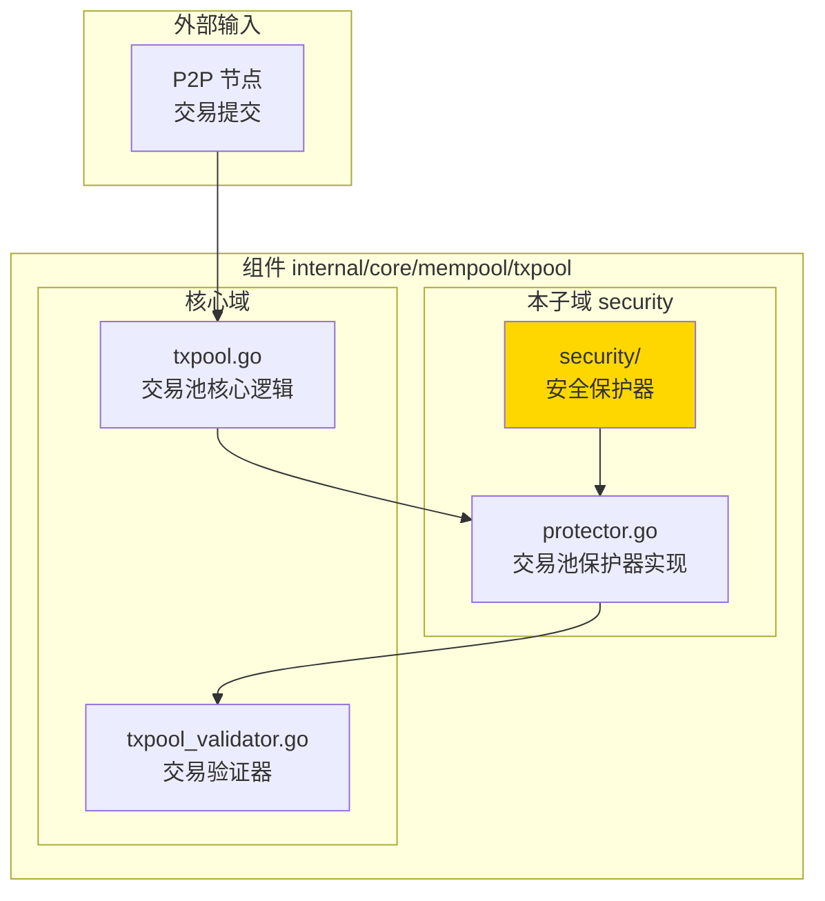
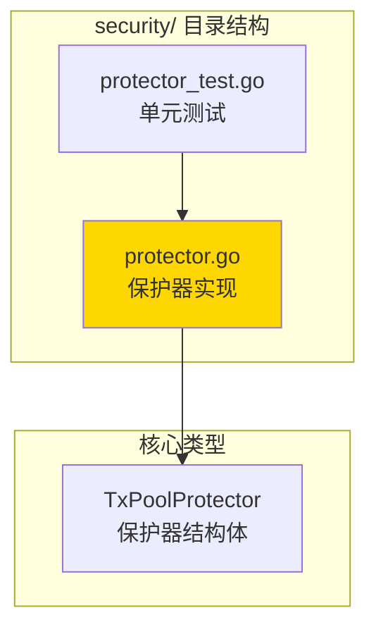

# 交易池安全保护器 - 实现子域

---

## 📌 版本信息

- **版本**：1.0
- **状态**：stable
- **最后更新**：2025-11-XX
- **最后审核**：2025-11-XX
- **所有者**：mempool 团队
- **适用范围**：交易池的容量和安全保护

---

## 🎯 子域定位

**路径**：`internal/core/mempool/txpool/security/`

**所属组件**：`mempool`

**核心职责**：提供交易池的容量保护和安全控制，防止恶意节点通过大量交易填满交易池，确保交易池的稳定运行。

**在组件中的角色**：
- **容量保护**：限制单节点和全局交易数量，防止交易池被填满
- **安全控制**：防止 DDoS 攻击和资源耗尽攻击
- **配额管理**：为每个节点分配交易配额，公平分配资源

---

## 🏗️ 架构设计

### 在组件中的位置

> **说明**：展示安全保护器在交易池组件内部的位置和协作关系



**位置说明**：

| 关系类型 | 目标 | 关系说明 |
|---------|------|---------|
| **保护** | `txpool.go` | 在交易入池前检查容量限制 |
| **协作** | `txpool_validator.go` | 作为验证流程的一部分 |

---

### 内部组织

> **说明**：展示安全保护器内部的文件组织和类型关系



---

## 📁 目录结构

```
internal/core/mempool/txpool/security/
├── README.md                    # 本文档
├── protector.go                 # 交易池保护器实现
└── protector_test.go            # 单元测试
```

---

## 🔧 核心实现

### 实现文件：`protector.go`

**核心类型**：`TxPoolProtector`

**职责**：保护交易池不被恶意节点填满，通过限制单节点和全局交易数量来防止资源耗尽攻击。

**关键字段**：

```go
type TxPoolProtector struct {
    mu            sync.RWMutex    // 读写锁，保护并发访问
    txCount       map[string]int  // 每个节点的交易计数（peerID -> count）
    maxTxsPerPeer int             // 单节点最大交易数
    maxTxsTotal   int             // 全局最大交易数
}
```

**关键方法**：

| 方法名 | 职责 | 可见性 | 备注 |
|-------|------|-------|-----|
| `NewTxPoolProtector()` | 创建保护器实例 | Public | 构造函数 |
| `CheckTransaction()` | 检查交易是否允许入池 | Public | 检查单节点和全局限制 |
| `AddTransaction()` | 记录交易添加 | Public | 更新交易计数 |
| `RemoveTransaction()` | 记录交易移除 | Public | 更新交易计数 |
| `GetTxCount()` | 获取节点交易数 | Public | 查询接口 |
| `Reset()` | 重置所有计数 | Public | 清理接口 |

**保护机制**：
1. **单节点限制**：每个节点最多提交 `maxTxsPerPeer` 个交易
2. **全局限制**：交易池最多容纳 `maxTxsTotal` 个交易
3. **动态跟踪**：实时跟踪每个节点的交易数量

---

## 🔗 协作关系

### 依赖的接口

| 接口 | 来源 | 用途 |
|-----|------|-----|
| 无 | - | 独立实现，不依赖外部接口 |

---

### 被依赖关系

**被以下模块使用**：
- `internal/core/mempool/txpool/txpool.go` - 在交易入池前调用 `CheckTransaction()` 检查容量

**示例**：

```go
// 在 txpool.go 中使用
if err := p.protector.CheckTransaction(peerID); err != nil {
    return nil, fmt.Errorf("交易池保护器拒绝: %w", err)
}

// 交易添加后更新计数
p.protector.AddTransaction(peerID)
```

---

## 🧪 测试

### 测试覆盖

| 测试类型 | 文件 | 覆盖率目标 | 当前状态 |
|---------|------|-----------|---------|
| 单元测试 | `protector_test.go` | ≥ 80% | 已实现 |

**测试场景**：
- 单节点交易数限制测试
- 全局交易数限制测试
- 并发安全性测试
- 交易添加/移除计数测试

---

## 📊 关键设计决策

### 决策 1：基于节点 ID 的配额管理

**问题**：如何防止单个节点填满交易池？

**方案**：为每个节点（peerID）分配独立的交易配额，限制单节点最大交易数。

**理由**：
- 公平性：每个节点都有平等的配额
- 安全性：防止恶意节点独占资源
- 简单性：实现简单，开销低

**权衡**：
- ✅ 优点：简单、有效、公平
- ⚠️ 缺点：节点 ID 可能被伪造（需要在上层验证）

---

### 决策 2：双重限制机制

**问题**：如何同时防止单节点攻击和全局资源耗尽？

**方案**：同时实施单节点限制和全局限制，双重保护。

**理由**：
- 单节点限制：防止单个恶意节点攻击
- 全局限制：防止多个节点联合攻击
- 双重保护：提高安全性

---

## 📚 相关文档

- [交易池总览](../README.md)
- [内存池组件总览](../../README.md)
- [接口与实现的组织架构](../../../../../docs/system/standards/principles/code-organization.md)

---

## 📝 变更历史

| 版本 | 日期 | 变更内容 | 作者 |
|-----|------|---------|------|
| 1.0 | 2025-11-XX | 初始版本 | mempool 团队 |

---

