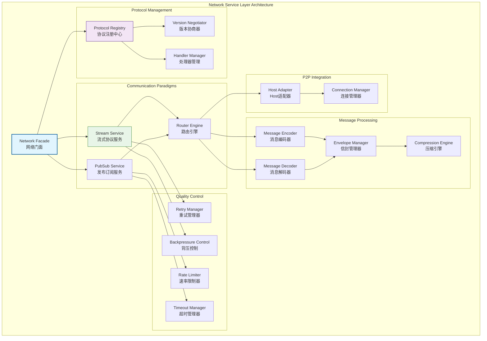
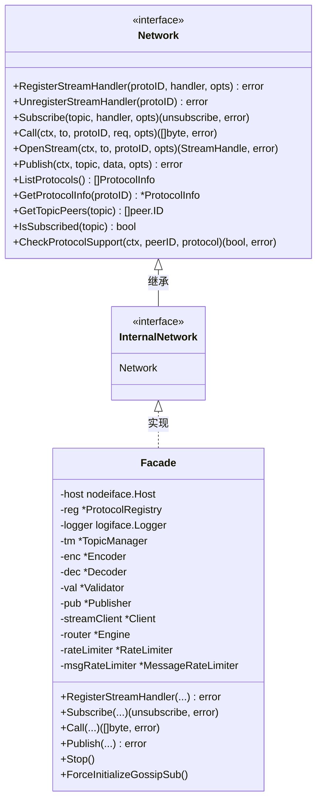

# 网络服务层（internal/core/network）

【模块定位】
　　本目录实现WES区块链的网络服务层，作为七层架构的第二层，负责网络消息的编解码、分发和协议管理。提供流式协议和订阅协议两种通信范式，为上层域提供统一的网络通信服务。

【设计原则】
- 协议抽象优先：基于协议ID的流式和订阅协议抽象
- 边界清晰分离：与P2P基础设施层严格解耦，仅消费Host服务
- 消息范式统一：支持流式（请求-响应）和订阅（发布-订阅）两种模式
- 版本化管理：协议ID和Topic的严格版本化隔离
- 可靠性保证：超时、重试、背压、并发控制的应用层实现
- 事件驱动集成：与系统EventBus的轻量级集成

【核心职责】
1. **协议注册管理**：基于协议ID注册流式和订阅处理器
2. **消息编解码**：长度前缀、压缩、签名、校验的统一处理
3. **通信范式支持**：流式协议和订阅协议的完整实现
4. **可靠性控制**：应用层的超时、重试、背压策略
5. **版本协商**：协议版本的自动协商和兼容性处理
6. **事件桥接**：网络事件与系统事件总线的集成

【网络层设计理念：协议抽象统一模式】
本网络层采用"协议抽象统一"设计模式，通过协议ID将复杂的网络通信抽象为标准的流式和订阅接口。这种设计的核心思想是"协议无关，消息优先"。

## 网络架构设计



**架构层次说明**：
- **Network Facade**（蓝色）：网络门面，统一的网络服务入口
- **Protocol Management**（紫色）：协议管理层，负责协议注册和版本协商
- **Communication Paradigms**（绿色）：通信范式层，提供流式和订阅服务
- **Message Processing**（橙色）：消息处理层，负责编解码和封装
- **Quality Control**（黄色）：质量控制层，提供可靠性保证
- **P2P Integration**（灰色）：P2P集成层，与底层P2P服务对接

**设计特点**：
- 协议抽象：通过协议ID抽象具体的网络协议
- 双范式支持：流式协议和订阅协议的统一管理
- 质量保证：完整的可靠性和性能控制机制
- 边界清晰：与P2P层的清晰边界和最小依赖

---

## 📁 **模块组织结构**

【网络层模块架构】

```
internal/core/network/
├── 📋 module.go                        # fx依赖注入模块配置
├── 🏗️ interfaces/                      # 内部接口层
│   └── network.go                      # 内部网络接口定义（InternalNetwork）
├── 🎭 facade/                          # 网络统一门面实现
│   ├── README.md                       # 门面子域文档
│   └── service.go                      # Network 门面服务（实现 InternalNetwork）
├── 📋 registry/                        # 协议注册和管理实现
│   ├── README.md                       # 协议注册子域文档
│   ├── service.go                      # 协议注册服务门面
│   ├── registry.go                     # 协议注册表实现
│   ├── negotiation.go                  # 版本协商引擎
│   ├── compatibility.go                # 兼容性检查器
│   ├── handler.go                      # 处理器管理器
│   └── errors.go                       # 注册错误处理
├── 🌊 stream/                          # 流式协议完整实现
│   ├── README.md                       # 流式协议子域文档
│   ├── service.go                      # 流式服务门面
│   ├── client.go                       # 流式客户端实现
│   ├── dispatcher.go                   # 流分发器
│   ├── codec.go                        # 消息编解码器
│   ├── backpressure.go                 # 背压控制器
│   ├── retry.go                        # 重试引擎
│   ├── options.go                      # 流式选项配置
│   └── errors.go                       # 流相关错误处理
├── 📡 pubsub/                          # 发布订阅协议实现
│   ├── README.md                       # 发布订阅子域文档
│   ├── service.go                      # 发布订阅服务门面
│   ├── topic_manager.go                # 主题管理器
│   ├── publisher.go                    # 消息发布器
│   ├── validator.go                    # 消息验证器
│   ├── encoding.go                     # 编解码适配器
│   └── errors.go                       # PubSub错误处理
├── 🔀 router/                          # 消息路由和分发引擎
│   ├── README.md                       # 路由引擎子域文档
│   ├── service.go                      # 路由服务门面
│   ├── engine.go                       # 路由引擎实现
│   ├── table.go                        # 路由表管理
│   ├── quality.go                      # 网络质量分析
│   ├── dedup_store.go                  # 消息去重存储
│   ├── rate_limit.go                   # 速率限制器
│   └── errors.go                       # 路由错误处理
├── 🔒 security/                        # 安全组件实现
│   ├── README.md                       # 安全组件子域文档
│   ├── rate_limiter.go                 # 连接速率限制器
│   ├── message_rate_limiter.go         # 消息速率限制器
│   ├── rate_limiter_test.go            # 速率限制器测试
│   └── message_rate_limiter_test.go   # 消息速率限制器测试
├── 📚 examples/                        # 网络协议使用示例
│   ├── README.md                       # 示例文档
│   ├── protocols.go                    # 协议规范示例
│   ├── block_sync.go                   # 区块同步示例
│   └── tx_propagation.go              # 交易传播示例
└── 📝 README.md                        # 本文档
```
// 示例：网络服务层依赖注入配置
package network

import (
    "go.uber.org/fx"
    "github.com/weisyn/v1/internal/core/network/facade"
    "github.com/weisyn/v1/pkg/interfaces/network"
)

// Module 网络服务层模块
func Module() fx.Option {
    return fx.Module("network",
        // 提供网络服务
        fx.Provide(ProvideServices),
        
        // 生命周期管理
        fx.Invoke(func(lc fx.Lifecycle, logger logiface.Logger, networkService network.Network) {
            lc.Append(fx.Hook{
                OnStart: func(ctx context.Context) error {
                    logger.Info("🌐 网络模块启动")
                    return nil
                },
                OnStop: func(ctx context.Context) error {
                    logger.Info("🌐 网络模块停止")
                    if f, ok := networkService.(*facade.Facade); ok {
                        f.Stop()
                    }
                    return nil
                },
            })
        }),
    )
}

// ProvideServices 提供网络服务
func ProvideServices(params ModuleParams) (ModuleOutput, error) {
    // 创建网络门面实例
    f := facade.NewFacade(
        params.Host,
        logger,
        networkConfig,
        params.HashManager,
        params.SigManager,
    )
    
    return ModuleOutput{
        NetworkService: f,
        Network:        f,
    }, nil
}
```

**依赖管理特点：**
- **自动生命周期**：组件启动和停止由fx自动管理
- **接口导向**：通过接口而非具体类型进行依赖
- **层次清晰**：明确的依赖方向，避免循环依赖
- **测试友好**：支持依赖注入的单元测试

---

## 📊 **性能与监控**

【性能指标】

| **操作类型** | **目标延迟** | **吞吐量目标** | **成功率** | **监控方式** |
|-------------|-------------|---------------|-----------|------------|
| 流式协议调用 | < 50ms | > 2000 RPS | > 95% | 实时监控 |
| 消息编解码 | < 1ms | > 10000 OPS | > 99% | 批量统计 |
| 协议注册 | < 10ms | > 500 OPS | > 98% | 关键路径监控 |
| 订阅消息分发 | < 5ms | > 5000 MPS | > 97% | 异步监控 |
| 连接管理 | < 100ms | > 1000 CPS | > 90% | 实时监控 |

**性能优化策略：**
- **协议优化**：协议版本缓存、协商结果复用、智能路由选择
- **消息优化**：批量编解码、压缩算法选择、零拷贝传输
- **连接优化**：连接池管理、复用策略、负载均衡
- **缓存优化**：协议信息缓存、路由表缓存、状态缓存

---

## 🔗 **与公共接口的映射关系**

【接口实现映射】



**实现要点：**
- **接口契约**：严格遵循公共接口的方法签名和语义
- **错误处理**：标准化的错误返回和异常处理机制
- **日志记录**：完善的操作日志和性能指标记录
- **测试覆盖**：每个接口方法都有对应的单元测试和集成测试

---

## 🚀 **后续扩展规划**

【模块演进方向】

1. **协议能力增强**
   - 支持更多协议类型（HTTP、gRPC等）
   - 实现协议自动发现和协商
   - 添加协议版本管理和升级机制

2. **性能优化提升**
   - 实现零拷贝数据传输
   - 优化网络I/O和并发处理
   - 添加智能负载均衡策略

3. **可靠性增强**
   - 实现更强的故障检测和恢复
   - 添加网络分区容错机制
   - 增强连接稳定性和重连策略

4. **监控运维增强**
   - 提供更详细的网络监控指标
   - 实现网络拓扑可视化
   - 添加智能网络诊断工具

---

## 📋 **开发指南**

【子模块开发规范】

1. **新建子模块步骤**：
   - 在interfaces/中定义内部接口
   - 创建子模块目录和基础文件
   - 实现核心业务逻辑
   - 添加完整的单元测试
   - 更新fx依赖注入配置

2. **代码质量要求**：
   - 遵循Go语言最佳实践
   - 100%的接口方法测试覆盖
   - 完善的错误处理机制
   - 清晰的代码注释和文档

3. **性能要求**：
   - 关键路径延迟指标达标
   - 内存使用合理，避免泄漏
   - 并发安全的数据访问
   - 合理的资源清理机制

## 🔧 **重构与改进历史**

### 速率限制器真实接入

**问题**：`RateLimiter` 和 `MessageRateLimiter` 仅被测试引用，未在网络层真实路径中生效。

**修复**：
- 在 Facade 结构中添加两个限制器字段
- 在 NewFacade 构造时初始化限制器
- 在流连接处理中接入 RateLimiter（连接数限制）
- 在 gossipsub 消息接收中接入 MessageRateLimiter（消息速率限制）
- 在 Facade Stop 时停止限制器

**修复位置**：
- `internal/core/network/impl/network_facade.go`

**影响**：实现了连接和消息的速率限制保护，提升网络层安全性。

### 组件重构

**重构内容**：
- 移除 `internal/` 目录，将工具函数整合到对应模块
- 重新组织目录结构，提升代码可维护性
- 保持功能完整性，确保所有公共接口正确实现

**重构位置**：
- `internal/core/network/impl/` → `internal/core/network/`

> 📖 **详细重构记录**：重构内容已整合到代码实现中，详见各服务实现文件。

---

【参考文档】
- [网络门面实现](facade/) - Network 主实现
- [协议注册实现](registry/) - 协议注册和管理
- [流式协议实现](stream/) - 流式通信服务
- [发布订阅实现](pubsub/) - PubSub 服务
- [路由引擎实现](router/) - 消息路由引擎
- [安全组件实现](security/) - 速率限制器
- [网络协议示例](examples/)
- [网络接口规范](../../pkg/interfaces/network/)
- [WES架构设计文档](../../../docs/)

---

> 📝 **模板说明**：本README模板基于WES v0.0.1统一文档规范设计，使用时请根据具体模块需求替换相应的占位符内容，并确保所有章节都有实质性的技术内容。

> 🔄 **维护指南**：本文档应随着模块功能的演进及时更新，确保文档与代码实现的一致性。建议在每次重大功能变更后更新相应章节。