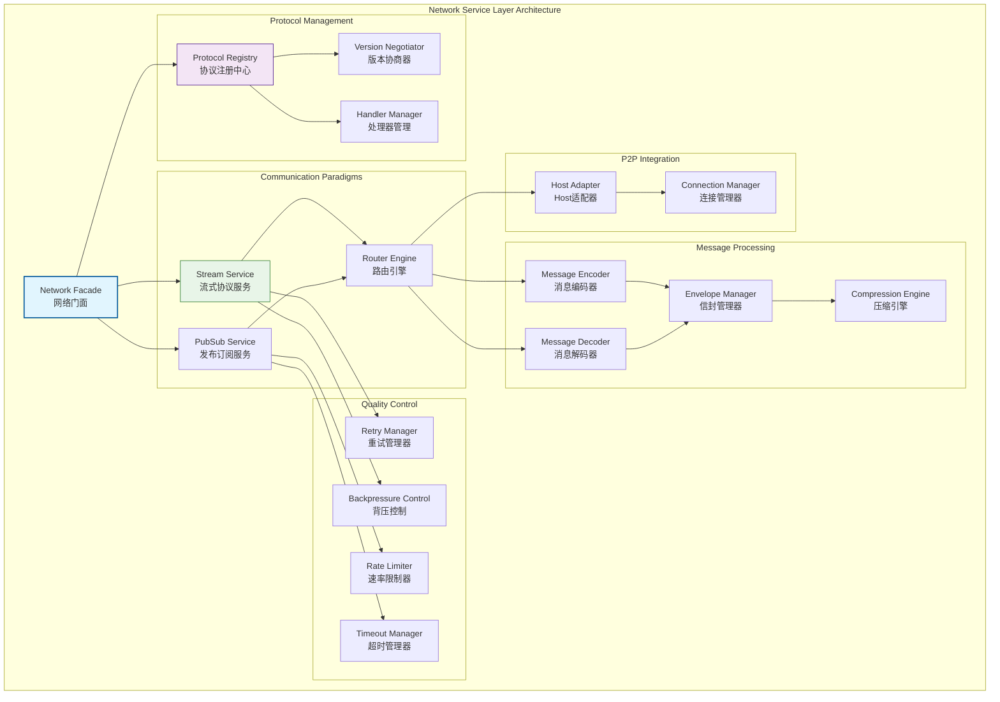
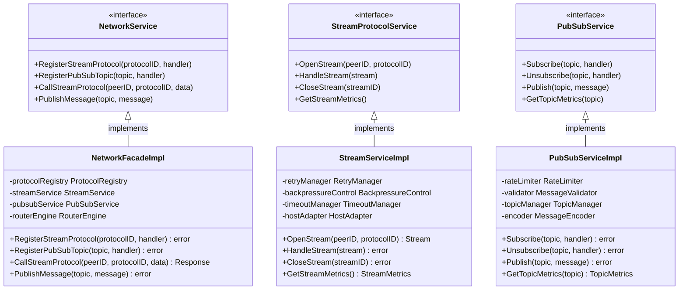

# 网络服务层（internal/core/network）

【模块定位】
　　本目录实现WES区块链的网络服务层，作为七层架构的第二层，负责网络消息的编解码、分发和协议管理。提供流式协议和订阅协议两种通信范式，为上层域提供统一的网络通信服务。

【设计原则】
- 协议抽象优先：基于协议ID的流式和订阅协议抽象
- 边界清晰分离：与P2P基础设施层严格解耦，仅消费Host服务
- 消息范式统一：支持流式（请求-响应）和订阅（发布-订阅）两种模式
- 版本化管理：协议ID和Topic的严格版本化隔离
- 可靠性保证：超时、重试、背压、并发控制的应用层实现
- 事件驱动集成：与系统EventBus的轻量级集成

【核心职责】
1. **协议注册管理**：基于协议ID注册流式和订阅处理器
2. **消息编解码**：长度前缀、压缩、签名、校验的统一处理
3. **通信范式支持**：流式协议和订阅协议的完整实现
4. **可靠性控制**：应用层的超时、重试、背压策略
5. **版本协商**：协议版本的自动协商和兼容性处理
6. **事件桥接**：网络事件与系统事件总线的集成

【网络层设计理念：协议抽象统一模式】
本网络层采用"协议抽象统一"设计模式，通过协议ID将复杂的网络通信抽象为标准的流式和订阅接口。这种设计的核心思想是"协议无关，消息优先"。

## 网络架构设计



**架构层次说明**：
- **Network Facade**（蓝色）：网络门面，统一的网络服务入口
- **Protocol Management**（紫色）：协议管理层，负责协议注册和版本协商
- **Communication Paradigms**（绿色）：通信范式层，提供流式和订阅服务
- **Message Processing**（橙色）：消息处理层，负责编解码和封装
- **Quality Control**（黄色）：质量控制层，提供可靠性保证
- **P2P Integration**（灰色）：P2P集成层，与底层P2P服务对接

**设计特点**：
- 协议抽象：通过协议ID抽象具体的网络协议
- 双范式支持：流式协议和订阅协议的统一管理
- 质量保证：完整的可靠性和性能控制机制
- 边界清晰：与P2P层的清晰边界和最小依赖

---

## 📁 **模块组织结构**

【网络层模块架构】

```
internal/core/network/
├── 📋 module.go                        # fx依赖注入模块配置
├── 🏗️ impl/                            # 网络服务具体实现层
│   ├── network_facade.go                # 网络统一门面实现
│   ├── 🔧 internal/                     # 内部工具和公共组件
│   │   ├── envelope.go                  # 消息封装管理器
│   │   ├── encode.go                    # 多格式编解码引擎
│   │   ├── compress.go                  # 自适应压缩算法
│   │   ├── sign.go                      # 消息签名验证服务
│   │   ├── id.go                        # 多类型ID生成器
│   │   ├── context.go                   # 网络上下文管理
│   │   ├── limits.go                    # 限制和阈值管理
│   │   └── errors.go                    # 统一错误处理
│   ├── 📋 registry/                     # 协议注册和管理实现
│   │   ├── service.go                   # 协议注册服务门面
│   │   ├── registry.go                  # 协议注册表实现
│   │   ├── negotiation.go               # 版本协商引擎
│   │   ├── compatibility.go             # 兼容性检查器
│   │   ├── handler.go                   # 处理器管理器
│   │   └── errors.go                    # 注册错误处理
│   ├── 🌊 stream/                       # 流式协议完整实现
│   │   ├── service.go                   # 流式服务门面
│   │   ├── client.go                    # 流式客户端实现
│   │   ├── dispatcher.go                # 流分发器
│   │   ├── codec.go                     # 消息编解码器
│   │   ├── backpressure.go              # 背压控制器
│   │   ├── retry.go                     # 重试引擎
│   │   └── errors.go                    # 流相关错误处理
│   ├── 📡 pubsub/                       # 发布订阅协议实现
│   │   ├── service.go                   # 发布订阅服务门面
│   │   ├── topic_manager.go             # 主题管理器
│   │   ├── publisher.go                 # 消息发布器
│   │   ├── validator.go                 # 消息验证器
│   │   ├── encoding.go                  # 编解码适配器
│   │   └── errors.go                    # PubSub错误处理
│   └── 🔀 router/                       # 消息路由和分发引擎
│       ├── service.go                   # 路由服务门面
│       ├── engine.go                    # 路由引擎实现
│       ├── table.go                     # 路由表管理
│       ├── quality.go                   # 网络质量分析
│       ├── dedup_store.go               # 消息去重存储
│       ├── rate_limit.go                # 速率限制器
│       └── errors.go                    # 路由错误处理
├── 📚 examples/                         # 网络协议使用示例
│   ├── protocols.go                     # 协议规范示例
│   ├── block_sync.go                    # 区块同步示例
│   ├── tx_propagation.go                # 交易传播示例
│   ├── consensus_communication.go       # 共识通信示例
│   ├── error_handling_examples.go       # 错误处理示例
│   ├── performance_optimization.go      # 性能优化示例
│   └── security_patterns.go             # 安全模式示例
├── 📝 README.md                         # 本文档
└── 📊 tests/                            # 测试文件目录
    ├── network_service_test.go          # 网络服务测试
    ├── integration_test.go              # 集成测试套件
    ├── performance_test.go              # 性能基准测试
    └── mock_test.go                     # 测试模拟工具
```

### **🎯 子模块职责分工**

| **模块目录** | **核心职责** | **对外接口** | **内部组件** | **复杂度** |
|-------------|-------------|-------------|-------------|-----------|
| `module.go` | fx依赖注入模块配置 | NetworkModule | 依赖管理、生命周期管理、配置加载 | 低 |
| `impl/network_facade.go` | 网络统一门面实现 | NetworkService | 门面协调、请求分发、状态管理 | 高 |
| `impl/internal/` | 内部工具和公共组件 | 工具集合 | 编解码、压缩、签名、ID生成 | 中 |
| `impl/registry/` | 协议注册和管理实现 | RegistryService | 协议注册、版本协商、处理器管理 | 高 |
| `impl/stream/` | 流式协议完整实现 | StreamService | 流式通信、背压控制、重试机制 | 高 |
| `impl/pubsub/` | 发布订阅协议实现 | PubSubService | 消息发布、主题管理、订阅控制 | 中 |
| `impl/router/` | 消息路由和分发引擎 | RouterService | 智能路由、质量分析、去重控制 | 高 |
| `examples/` | 网络协议使用示例 | 示例集合 | 协议示例、最佳实践、测试模板 | 中 |
| `tests/` | 网络层功能测试验证 | 测试工具和框架 | 单元测试、集成测试、性能测试 | 中 |

---

## 核心通信范式

### 🌊 流式协议 (Stream Protocol)
**适用场景**：请求-响应、批量传输、点对点控制

**协议特性**：
- 长度前缀帧和双向半关闭
- 超时重试和并发上限控制
- 协商压缩和版本兼容
- 请求关联和状态跟踪

**协议命名**：`/<org>/<domain>/<feature>/<vN>`
- 示例：`/weisyn/block/sync/v1.0.0`
- 严格版本化，最小协商机制

### 📡 订阅协议 (PubSub Protocol)
**适用场景**：广播、去中心化分发、松耦合通知

**协议特性**：
- Topic命名和版本管理
- 消息验证（签名/速率/大小）
- 基础防刷和去重机制
- 异步消息分发

**Topic命名**：`<org>.<domain>.<event>.<vN>`
- 示例：`weisyn.tx.broadcast.v1`
- 层次化命名，明确领域划分

## 消息封装规范

### 统一信封格式
- **版本标识**：消息格式版本号
- **内容类型**：payload的数据类型
- **关联ID**：请求响应的关联标识
- **认证信息**：签名或认证令牌
- **有效载荷**：具体的业务数据

### 编解码策略
- **二进制优先**：使用Protocol Buffers进行序列化
- **压缩优化**：基于消息大小的自适应压缩
- **校验保护**：消息完整性和签名验证
- **错误恢复**：编解码错误的优雅处理

## 质量控制机制

### 可靠性保证
- **超时管理**：请求超时和重试策略
- **并发控制**：连接数和请求数限制
- **背压机制**：流量控制和队列管理
- **错误处理**：网络错误的分类和恢复

### 性能优化
- **连接复用**：高效的连接池管理
- **批量处理**：消息的批量发送和接收
- **缓存机制**：协议信息和路由的缓存
- **异步处理**：非阻塞的消息处理模式

### 监控和诊断
- **指标收集**：网络层关键指标监控
- **链路追踪**：消息传输的完整链路跟踪
- **错误统计**：网络错误的分类统计
- **性能分析**：网络性能的瓶颈分析

## 与P2P层的边界

### 最小依赖原则
- **Host服务消费**：仅消费P2P层提供的Host服务
- **连接请求委托**：通过`EnsureConnected`请求连接建立
- **发现委托**：节点发现完全委托给P2P层
- **资源管理委托**：连接和资源管理委托给P2P层

### 清晰职责划分
**Network层负责**：
- 协议注册和消息分发
- 消息编解码和封装
- 应用层的可靠性控制
- 协议版本协商

**P2P层负责**：
- Host构建和连接管理
- NAT穿越和中继服务
- 节点发现和引导
- 底层传输优化

## 事件集成机制

### EventBus集成
- **消息接收事件**：网络消息到达的事件通知
- **处理失败事件**：消息处理失败的事件报告
- **连接状态事件**：网络连接状态变化事件
- **协议升级事件**：协议版本升级的事件通知

### 轻量级设计
- **最小耦合**：与EventBus的最小化耦合
- **异步处理**：事件的异步发送和处理
- **可选集成**：事件集成的可选配置
- **性能优先**：事件处理不影响网络性能

---

## 🏗️ **依赖注入架构**

【fx框架集成】

　　全面采用fx依赖注入框架，实现组件间的松耦合和生命周期自动管理。

```go
// 示例：网络服务层依赖注入配置
package network

import (
    "go.uber.org/fx"
    "github.com/weisyn/v1/pkg/interfaces/network"
)

// Module 网络服务层模块
var Module = fx.Module("network",
    // 导入核心组件
    fx.Provide(
        // 协议管理组件
        registry.NewProtocolRegistry,
        registry.NewVersionNegotiator,
        registry.NewHandlerManager,
        
        // 通信范式组件
        stream.NewStreamService,
        pubsub.NewPubSubService,
        router.NewRouterEngine,
        
        // 消息处理组件
        internal.NewMessageEncoder,
        internal.NewMessageDecoder,
        internal.NewEnvelopeManager,
        internal.NewCompressionEngine,
        
        // 质量控制组件
        stream.NewRetryManager,
        stream.NewBackpressureControl,
        pubsub.NewRateLimiter,
        pubsub.NewTimeoutManager,
        
        // P2P集成组件
        NewHostAdapter,
        NewConnectionManager,
        
        // 网络门面
        NewNetworkFacade,
    ),
    
    // 导出公共接口
    fx.Provide(
        fx.Annotate(
            func(facade *NetworkFacade) network.NetworkService {
                return facade
            },
            fx.As(new(network.NetworkService)),
        ),
        fx.Annotate(
            func(streamSvc *stream.StreamService) network.StreamProtocolService {
                return streamSvc
            },
            fx.As(new(network.StreamProtocolService)),
        ),
        fx.Annotate(
            func(pubsubSvc *pubsub.PubSubService) network.PubSubService {
                return pubsubSvc
            },
            fx.As(new(network.PubSubService)),
        ),
        // ... 其他接口导出
    ),
    
    // 生命周期管理
    fx.Invoke(InitializeNetworkServices),
    fx.Invoke(RegisterDefaultProtocols),
)

// 网络服务初始化
func InitializeNetworkServices(
    facade *NetworkFacade,
    hostAdapter *HostAdapter,
    config *NetworkConfig,
) error {
    // 初始化P2P主机适配器
    if err := hostAdapter.Initialize(config.P2P); err != nil {
        return err
    }
    
    // 启动网络服务
    if err := facade.Start(); err != nil {
        return err
    }
    
    return nil
}

// 默认协议注册
func RegisterDefaultProtocols(
    registry *registry.ProtocolRegistry,
    streamService *stream.StreamService,
    pubsubService *pubsub.PubSubService,
) error {
    // 注册默认流式协议处理器
    defaultStreamHandler := func(stream network.Stream) error {
        // 默认流式协议处理逻辑
        return nil
    }
    
    if err := registry.RegisterStreamProtocol("default", defaultStreamHandler); err != nil {
        return err
    }
    
    // 注册默认订阅主题处理器
    defaultTopicHandler := func(msg network.Message) error {
        // 默认订阅消息处理逻辑
        return nil
    }
    
    if err := registry.RegisterPubSubTopic("default", defaultTopicHandler); err != nil {
        return err
    }
    
    return nil
}
```

**依赖管理特点：**
- **自动生命周期**：组件启动和停止由fx自动管理
- **接口导向**：通过接口而非具体类型进行依赖
- **层次清晰**：明确的依赖方向，避免循环依赖
- **测试友好**：支持依赖注入的单元测试

---

## 📊 **性能与监控**

【性能指标】

| **操作类型** | **目标延迟** | **吞吐量目标** | **成功率** | **监控方式** |
|-------------|-------------|---------------|-----------|------------|
| 流式协议调用 | < 50ms | > 2000 RPS | > 95% | 实时监控 |
| 消息编解码 | < 1ms | > 10000 OPS | > 99% | 批量统计 |
| 协议注册 | < 10ms | > 500 OPS | > 98% | 关键路径监控 |
| 订阅消息分发 | < 5ms | > 5000 MPS | > 97% | 异步监控 |
| 连接管理 | < 100ms | > 1000 CPS | > 90% | 实时监控 |

**性能优化策略：**
- **协议优化**：协议版本缓存、协商结果复用、智能路由选择
- **消息优化**：批量编解码、压缩算法选择、零拷贝传输
- **连接优化**：连接池管理、复用策略、负载均衡
- **缓存优化**：协议信息缓存、路由表缓存、状态缓存

---

## 🔗 **与公共接口的映射关系**

【接口实现映射】



**实现要点：**
- **接口契约**：严格遵循公共接口的方法签名和语义
- **错误处理**：标准化的错误返回和异常处理机制
- **日志记录**：完善的操作日志和性能指标记录
- **测试覆盖**：每个接口方法都有对应的单元测试和集成测试

---

## 🚀 **后续扩展规划**

【模块演进方向】

1. **协议能力增强**
   - 支持更多协议类型（HTTP、gRPC等）
   - 实现协议自动发现和协商
   - 添加协议版本管理和升级机制

2. **性能优化提升**
   - 实现零拷贝数据传输
   - 优化网络I/O和并发处理
   - 添加智能负载均衡策略

3. **可靠性增强**
   - 实现更强的故障检测和恢复
   - 添加网络分区容错机制
   - 增强连接稳定性和重连策略

4. **监控运维增强**
   - 提供更详细的网络监控指标
   - 实现网络拓扑可视化
   - 添加智能网络诊断工具

---

## 📋 **开发指南**

【子模块开发规范】

1. **新建子模块步骤**：
   - 在interfaces/中定义内部接口
   - 创建子模块目录和基础文件
   - 实现核心业务逻辑
   - 添加完整的单元测试
   - 更新fx依赖注入配置

2. **代码质量要求**：
   - 遵循Go语言最佳实践
   - 100%的接口方法测试覆盖
   - 完善的错误处理机制
   - 清晰的代码注释和文档

3. **性能要求**：
   - 关键路径延迟指标达标
   - 内存使用合理，避免泄漏
   - 并发安全的数据访问
   - 合理的资源清理机制

【参考文档】
- [网络实现层](impl/README.md)
- [网络协议示例](examples/README.md)
- [网络接口规范](../../pkg/interfaces/network/)
- [WES架构设计文档](../../../docs/architecture/)

---

> 📝 **模板说明**：本README模板基于WES v0.0.1统一文档规范设计，使用时请根据具体模块需求替换相应的占位符内容，并确保所有章节都有实质性的技术内容。

> 🔄 **维护指南**：本文档应随着模块功能的演进及时更新，确保文档与代码实现的一致性。建议在每次重大功能变更后更新相应章节。