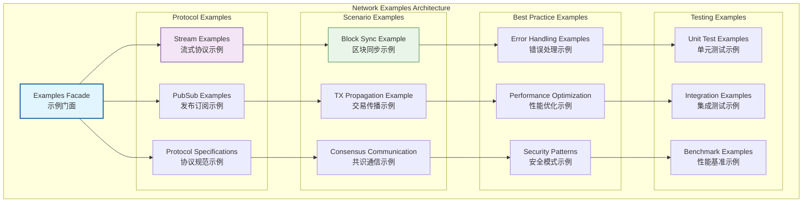
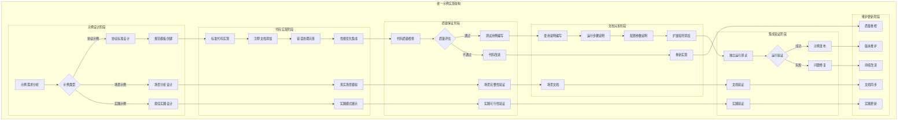
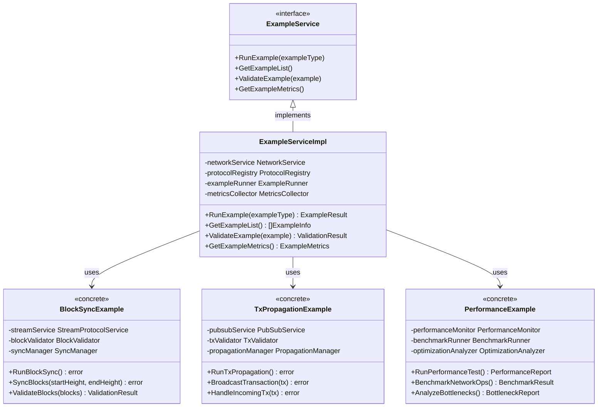

# 网络示例层（internal/core/network/examples）

【模块定位】
　　本目录实现WES网络层的示例应用集合，作为网络功能的教学演示和最佳实践展示中心。通过具体的区块链通信场景展示网络接口的正确使用方法、性能优化技巧和错误处理模式，为开发者提供可直接参考的代码模板。

【设计原则】
- 示例驱动教学：通过具体实现展示网络功能的标准使用模式
- 生产级质量：演示真实生产环境的错误处理和性能优化
- 场景完整覆盖：涵盖区块链网络通信的典型应用场景
- 代码模板化：提供可直接扩展到实际项目的标准模板
- 规范标准展示：严格遵循协议命名和消息格式规范
- 架构边界清晰：明确展示不同通信模式的适用边界

【核心职责】
1. **标准示例实现**：提供网络接口使用的标准化示例代码
2. **最佳实践演示**：展示生产级网络编程的完整实现模式
3. **协议规范标准**：演示协议命名、消息格式的标准化规范
4. **场景应用指导**：针对典型区块链场景的具体实现指南
5. **性能优化展示**：展示网络性能优化的实用技巧和方法
6. **错误处理范例**：提供健壮的错误处理和异常恢复机制

【示例层设计理念：生产级模板模式】
本示例层采用"生产级模板"设计模式，通过真实的区块链通信场景提供可直接应用的代码模板。这种设计的核心思想是"示例即标准，模板即实践"。

## 🏗️ **实现架构**

【示例应用架构】



**架构层次说明**：
- **Examples Facade**（蓝色）：示例门面，统一的示例访问入口
- **Protocol Examples**（紫色）：协议示例层，展示不同协议的使用方法
- **Scenario Examples**（绿色）：场景示例层，演示具体的区块链应用场景
- **Best Practice Examples**（橙色）：最佳实践层，展示高质量的实现模式
- **Testing Examples**（灰色）：测试示例层，提供完整的测试模板

**示例特点**：
- 完整性：每个示例都是可独立运行的完整实现
- 实用性：直接反映真实生产环境的使用场景
- 标准化：严格遵循项目的编码和架构规范
- 教学性：丰富的注释和文档说明

---

## 📁 **模块组织结构**

【内部模块架构】

```
internal/core/network/examples/
├── 📋 protocols.go                     # 协议规范和命名标准示例
├── 🌊 block_sync.go                    # 区块同步流式协议示例
├── 📡 tx_propagation.go                # 交易传播发布订阅示例
├── 🔗 consensus_communication.go       # 共识通信综合示例
├── 🚨 error_handling_examples.go       # 错误处理最佳实践示例
├── ⚡ performance_optimization.go       # 性能优化技巧示例
├── 🔐 security_patterns.go             # 安全模式实现示例
├── 📝 README.md                        # 本文档
└── 📊 tests/                           # 测试示例目录
    ├── unit_test_examples.go           # 单元测试模板示例
    ├── integration_examples.go         # 集成测试示例
    ├── benchmark_examples.go           # 性能基准测试示例
    └── mock_examples.go                # 测试双工具示例
```

### **🎯 子模块职责分工**

| **文件模块** | **核心职责** | **示例类型** | **应用场景** | **复杂度** |
|-------------|-------------|-------------|-------------|-----------|
| `protocols.go` | 协议规范和命名标准示例 | 规范展示 | 协议命名、消息格式标准 | 低 |
| `block_sync.go` | 区块同步流式协议示例 | 流式协议 | 区块数据同步、批量传输 | 高 |
| `tx_propagation.go` | 交易传播发布订阅示例 | 发布订阅 | 交易广播、事件通知 | 中 |
| `consensus_communication.go` | 共识通信综合示例 | 综合应用 | 共识消息、状态同步 | 高 |
| `error_handling_examples.go` | 错误处理最佳实践示例 | 最佳实践 | 异常处理、错误恢复 | 中 |
| `performance_optimization.go` | 性能优化技巧示例 | 性能优化 | 优化策略、监控方法 | 中 |
| `security_patterns.go` | 安全模式实现示例 | 安全实践 | 加密通信、身份验证 | 中 |
| `tests/` | 测试示例模板集合 | 测试模板 | 单元测试、集成测试、基准测试 | 中 |

---

## 🔄 **统一示例实现**

【实现策略】

　　所有示例代码均严格遵循**生产级模板**架构模式，确保示例的实用性、完整性和标准化。



**关键实现要点：**

1. **生产级质量**：
   - 完整的错误处理和异常恢复机制
   - 真实的性能优化和监控集成
   - 标准化的代码结构和注释规范

2. **场景完整性**：
   - 端到端的完整实现流程展示
   - 真实业务场景的模拟和演示
   - 多种使用模式的覆盖和对比

3. **模板标准化**：
   - 统一的代码风格和架构模式
   - 可直接复用的代码模板结构
   - 标准化的配置和扩展机制

---

## 🏗️ **依赖注入架构**

【fx框架集成】

　　全面采用fx依赖注入框架，实现示例代码的标准化和可复用性。

**依赖注入设计**：
- **示例组件装配**：自动装配示例所需的网络服务、协议注册、消息处理组件
- **模拟环境注入**：统一注入测试环境、模拟服务、配置管理组件
- **监控集成系统**：通过接口注入日志记录、性能监控、错误跟踪组件
- **生命周期管理**：自动管理示例的初始化、运行和清理过程

**核心组件依赖关系**：
- 所有示例统一依赖NetworkService、ProtocolRegistry、Logger
- 流式协议示例依赖StreamProtocolService、ConnectionManager
- 发布订阅示例依赖PubSubService、TopicManager、MessageValidator
- 错误处理示例依赖ErrorHandler、RetryManager、CircuitBreaker
- 性能示例依赖MetricsCollector、PerformanceMonitor、Profiler

---

## 📊 **性能与监控**

【性能指标】

| **示例类型** | **运行延迟** | **资源消耗** | **完成率** | **监控方式** |
|-------------|-------------|-------------|-----------|------------|
| 协议规范示例 | < 100ms | < 10MB | > 99% | 基础监控 |
| 区块同步示例 | < 5s | < 100MB | > 95% | 详细监控 |
| 交易传播示例 | < 2s | < 50MB | > 98% | 实时监控 |
| 共识通信示例 | < 10s | < 200MB | > 90% | 综合监控 |
| 错误处理示例 | < 1s | < 20MB | > 99% | 异常监控 |
| 性能优化示例 | < 3s | < 80MB | > 95% | 性能监控 |

**性能优化策略：**
- **示例优化**：代码简化、依赖最小化、启动加速
- **资源优化**：内存控制、CPU使用优化、网络带宽管理
- **运行优化**：并发处理、批量操作、缓存机制
- **监控优化**：轻量级监控、关键指标跟踪、异常检测

---

## 🔗 **与公共接口的映射关系**

【接口实现映射】



**实现要点：**
- **接口契约**：严格遵循示例服务接口定义和运行规范
- **错误处理**：完整的错误分类、日志记录和异常恢复
- **日志记录**：详细的示例运行日志和性能指标记录
- **测试覆盖**：全面的示例功能测试和集成验证

---

## 🚀 **后续扩展规划**

【模块演进方向】

1. **示例内容增强**
   - 添加更多区块链场景的示例应用
   - 实现跨链通信的示例和最佳实践
   - 增加高级网络优化的示例代码

2. **交互体验提升**
   - 实现交互式的示例运行界面
   - 添加示例代码的可视化执行过程
   - 提供在线的示例代码编辑和运行

3. **教学功能增强**
   - 实现分步骤的示例代码讲解
   - 添加示例代码的视频教程制作
   - 提供示例的技术原理解析文档

4. **集成工具增强**
   - 提供示例代码的自动生成工具
   - 实现示例的自动化测试和验证
   - 添加示例性能的持续监控系统

---

## 📋 **开发指南**

【示例开发规范】

1. **新示例开发步骤**：
   - 确定示例场景和教学目标，设计示例架构
   - 实现完整的示例代码和错误处理逻辑
   - 添加详细的注释和使用说明文档
   - 完成示例测试和集成验证工作

2. **代码质量要求**：
   - 遵循Go语言最佳实践和项目编码规范
   - 实现生产级的错误处理和异常恢复机制
   - 提供丰富的代码注释和技术说明文档
   - 保证示例代码的可独立运行和测试

3. **教学质量要求**：
   - 示例场景必须贴近真实的业务使用情况
   - 代码实现应体现最佳实践和性能优化
   - 文档说明应详细易懂且具有指导价值
   - 支持读者基于示例进行扩展和定制

【参考文档】
- [主网络层](../README.md)
- [实现层](../impl/README.md)
- [网络接口规范](../../../pkg/interfaces/network/)
- [WES架构设计文档](../../../../docs/architecture/)

---

> 📝 **模板说明**：本README模板基于WES v0.0.1统一文档规范设计，使用时请根据具体模块需求替换相应的占位符内容，并确保所有章节都有实质性的技术内容。

> 🔄 **维护指南**：本文档应随着模块功能的演进及时更新，确保文档与代码实现的一致性。建议在每次重大功能变更后更新相应章节。

## 示例文件结构

| 文件 | 通信模式 | 应用场景 |
|------|----------|----------|
| **protocols.go** | `协议规范` | 协议命名和消息格式标准 |
| **block_sync.go** | `流式协议` | 区块同步和批量数据传输 |
| **tx_propagation.go** | `订阅协议` | 交易广播和事件通知 |

## 核心示例场景

### 🌊 区块同步示例 (block_sync.go)
**应用场景**：节点间的区块数据同步和批量传输

**示例特点**：
- 流式协议的请求-响应模式
- 大数据量的分批传输处理
- 连接超时和重试机制
- 数据完整性验证

**协议规范**：`/weisyn/block/sync/v1.0.0`

### 📡 交易传播示例 (tx_propagation.go)
**应用场景**：交易的网络广播和事件通知

**示例特点**：
- 发布订阅的异步通信模式
- 消息去重和质量控制
- 订阅者管理和故障处理
- 广播策略和性能优化

**Topic规范**：`weisyn.tx.broadcast.v1`

### 📋 协议规范示例 (protocols.go)
**规范内容**：协议命名和消息格式的标准定义

**规范特点**：
- 流式协议命名：`/<org>/<domain>/<feature>/<vN>`
- 订阅Topic命名：`<org>.<domain>.<event>.<vN>`
- 消息格式标准：统一的Envelope封装格式
- 版本兼容管理：向前兼容的版本升级策略

## 使用模式展示

### 流式通信模式
- **连接建立**：协议协商和连接建立流程
- **数据传输**：请求发送和响应接收处理
- **错误处理**：网络错误的分类处理和重试
- **资源清理**：连接关闭和资源释放

### 订阅通信模式
- **主题订阅**：订阅感兴趣的主题和事件
- **消息处理**：异步消息的接收和处理
- **质量控制**：消息验证和去重处理
- **生命周期**：订阅的创建、维护和清理

### 性能优化示例
- **批量处理**：批量消息的高效处理
- **连接复用**：网络连接的复用和管理
- **缓存策略**：数据缓存和预取机制
- **并发控制**：并发访问的控制和优化

## 扩展指南

### 自定义协议开发
- **协议定义**：新协议的命名和格式定义
- **处理器实现**：协议处理器的实现模板
- **注册集成**：协议的注册和集成流程
- **测试验证**：协议功能的测试和验证

### 最佳实践建议
- **错误处理**：完善的错误处理和恢复机制
- **性能监控**：网络性能的监控和优化
- **安全考虑**：网络安全的设计和实现
- **可维护性**：代码的可维护性和可扩展性

---

## 🔗 相关文档

- **主网络层**：`../README.md` - 网络层整体架构
- **实现层**：`../impl/README.md` - 网络实现层详细说明
- **接口定义**：`../../../pkg/interfaces/network/` - 网络接口规范
- **配置说明**：`../../../config/network/` - 网络配置管理
