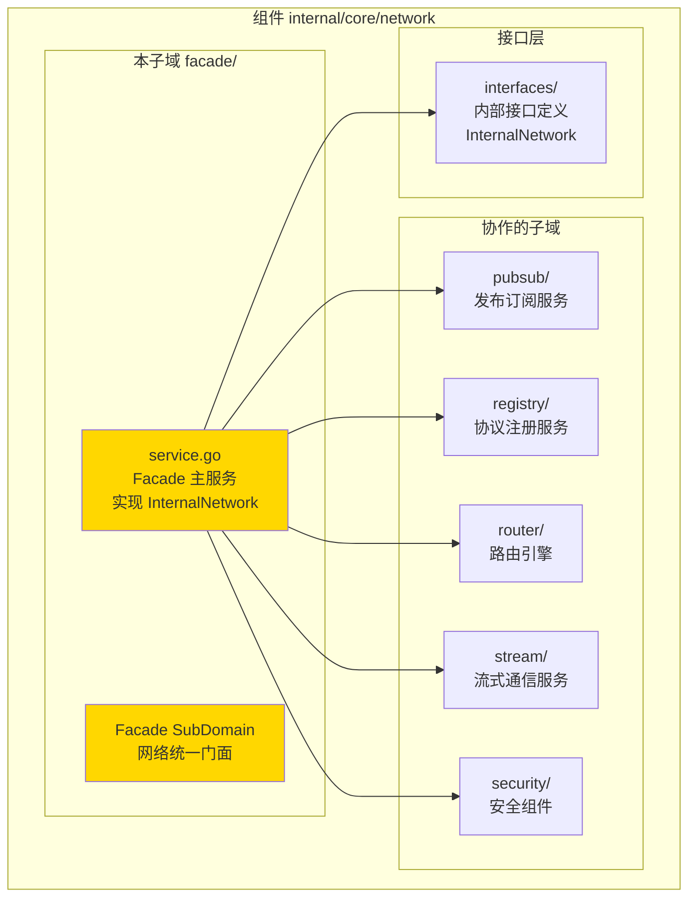
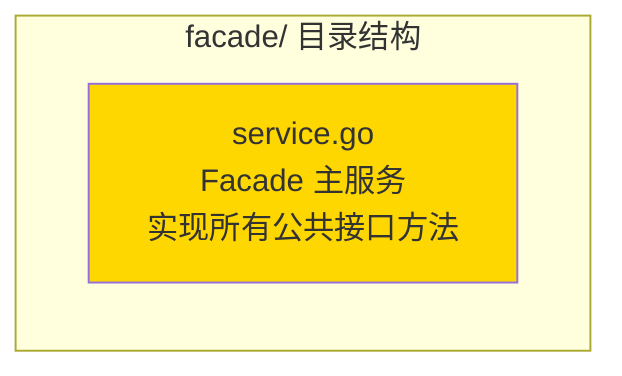

# Facade - 网络门面子域

---

## 📌 版本信息

- **版本**：1.0
- **状态**：stable
- **最后更新**：2025-11-30
- **最后审核**：2025-11-30
- **所有者**：WES Network 开发组
- **适用范围**：WES Network 组件门面实现子域

---

## 🎯 子域定位

**路径**：`internal/core/network/facade/`

**所属组件**：`network`

**核心职责**：实现网络统一门面（Network Facade），聚合协议注册、流式发送与订阅发布能力，作为 Network 组件的统一入口。

**在组件中的角色**：
- Network 组件的统一门面实现
- 实现 `interfaces.InternalNetwork` 接口
- 协调内部各子域（pubsub、registry、router、stream、security）完成网络通信
- 不包含生命周期管理（Start/Stop），由上层 DI 管理

---

## 🏗️ 架构设计

### 在组件中的位置

> **说明**：展示此子域在组件内部的位置和协作关系



**位置说明**：

| 关系类型 | 目标 | 关系说明 |
|---------|------|---------|
| **实现** | interfaces/ | 实现 `InternalNetwork` 接口，继承公共接口 `network.Network` |
| **协调** | pubsub/ | 调用 PubSub 服务进行主题订阅和消息发布 |
| **协调** | registry/ | 调用协议注册服务进行协议注册和查找 |
| **协调** | router/ | 调用路由引擎进行消息路由和分发 |
| **协调** | stream/ | 调用流式服务进行请求-响应和长流通信 |
| **协调** | security/ | 调用安全组件进行速率限制和流量控制 |

---

### 内部组织

> **说明**：展示此子域内部的文件组织和类型关系



---

## 📁 目录结构

```
internal/core/network/facade/
├── README.md                    # 本文档
└── service.go                   # Facade 主服务实现
```

---

## 🔧 核心实现

### 实现文件：`service.go`

**核心类型**：`Facade`

**职责**：网络统一门面实现，聚合协议注册、流式发送与订阅发布能力

**实现的接口**：`interfaces.InternalNetwork`（继承 `network.Network`）

**关键字段**：

```go
type Facade struct {
    host   nodeiface.Host            // P2P宿主，用于连通性保障与流操作
    reg    *regimpl.ProtocolRegistry  // 协议注册表
    logger logiface.Logger           // 结构化日志器
    
    // PubSub 组件
    tm    *pubimpl.TopicManager
    enc   *pubimpl.Encoder
    dec   *pubimpl.Decoder
    val   *pubimpl.Validator
    pub   *pubimpl.Publisher
    
    // Stream 组件
    streamClient *stcodec.Client
    
    // Router 组件
    router *routerimpl.Engine
    
    // Security 组件
    rateLimiter     *netsec.RateLimiter
    msgRateLimiter  *netsec.MessageRateLimiter
    
    // 内部状态
    subs  map[string]iface.SubscribeHandler
    // ...
}
```

**关键方法**：

| 方法名 | 职责 | 可见性 | 备注 |
|-------|------|-------|-----|
| `NewFacade()` | 构造函数 | Public | 用于依赖注入 |
| `RegisterStreamHandler()` | 注册流式协议处理器 | Public | 实现公共接口 |
| `UnregisterStreamHandler()` | 注销流式协议处理器 | Public | 实现公共接口 |
| `Subscribe()` | 订阅指定主题 | Public | 实现公共接口 |
| `Call()` | 流式请求-响应 | Public | 实现公共接口 |
| `OpenStream()` | 打开长流 | Public | 实现公共接口 |
| `Publish()` | 发布消息到主题 | Public | 实现公共接口 |
| `ListProtocols()` | 列出已注册协议 | Public | 实现公共接口 |
| `GetProtocolInfo()` | 获取协议信息 | Public | 实现公共接口 |
| `GetTopicPeers()` | 获取主题节点列表 | Public | 实现公共接口 |
| `IsSubscribed()` | 检查是否已订阅 | Public | 实现公共接口 |
| `CheckProtocolSupport()` | 检查协议支持 | Public | 实现公共接口 |
| `Stop()` | 停止网络服务 | Public | 供 module.go 使用 |
| `ForceInitializeGossipSub()` | 强制初始化 GossipSub | Public | 供 module.go 使用 |
| `InitializeGossipSub()` | 初始化 GossipSub | Public | 公开方法 |

---

## 🔗 协作关系

### 依赖的接口

| 接口 | 来源 | 用途 |
|-----|------|-----|
| `InternalNetwork` | `internal/core/network/interfaces/` | 实现的内部接口 |
| `nodeiface.Host` | `pkg/interfaces/infrastructure/node/` | P2P 宿主服务 |
| `logiface.Logger` | `pkg/interfaces/infrastructure/log/` | 日志记录 |
| `cryptoi.HashManager` | `pkg/interfaces/infrastructure/crypto/` | 哈希计算 |
| `cryptoi.SignatureManager` | `pkg/interfaces/infrastructure/crypto/` | 签名验证 |

### 被依赖关系

**被以下模块使用**：
- `module.go` - 通过依赖注入创建 Facade 实例，绑定到公共接口

**示例**：

```go
// 在 module.go 中使用
import "github.com/weisyn/v1/internal/core/network/facade"

func ProvideServices(params ModuleParams) (ModuleOutput, error) {
    f := facade.NewFacade(
        params.Host,
        logger,
        networkConfig,
        params.HashManager,
        params.SigManager,
    )
    return ModuleOutput{
        NetworkService: f,
        Network:        f,
    }, nil
}
```

---

## 🧪 测试

### 测试覆盖

| 测试类型 | 文件 | 覆盖率目标 | 当前状态 |
|---------|------|-----------|---------|
| 单元测试 | `facade_test.go` | ≥ 80% | 待添加 |
| 集成测试 | `../integration/` | 核心场景 | 待添加 |

---

## 📊 关键设计决策

### 决策 1：门面模式

**问题**：如何统一管理多个子域（pubsub、registry、router、stream）？

**方案**：采用门面模式，Facade 作为统一入口，协调各子域完成网络通信

**理由**：
- 简化外部调用：外部只需调用 Facade，无需了解内部子域
- 职责清晰：Facade 负责协调，各子域负责具体实现
- 易于测试：可以 mock 各子域进行单元测试

**权衡**：
- ✅ 优点：接口统一、职责清晰、易于维护
- ⚠️ 缺点：Facade 可能成为瓶颈（但网络通信本身是异步的，影响不大）

---

### 决策 2：不包含生命周期管理

**问题**：Facade 是否应该包含 Start/Stop 方法？

**方案**：Facade 提供 `Stop()` 和 `ForceInitializeGossipSub()` 供 module.go 使用，但不包含 Start 方法

**理由**：
- 遵循接口设计原则：公共接口 `network.Network` 不包含生命周期方法
- 生命周期由 DI 框架管理：fx 框架负责组件的启动和停止
- 简化接口：避免生命周期管理的复杂性

---

## 📚 相关文档

- [组件总览](../README.md)
- [内部接口](../interfaces/README.md)
- [公共接口](../../../../pkg/interfaces/network/README.md)
- [代码组织规范](../../../../docs/system/standards/principles/code-organization.md)

---

## 📝 变更历史

| 版本 | 日期 | 变更内容 | 作者 |
|-----|------|---------|------|
| 1.0 | 2025-11-30 | 初始版本，从 `impl/network_facade.go` 重构而来 | WES Network 开发组 |

---

## 🚧 待办事项

- [ ] 添加单元测试
- [ ] 添加集成测试
- [ ] 优化错误处理
- [ ] 添加性能监控指标

---

