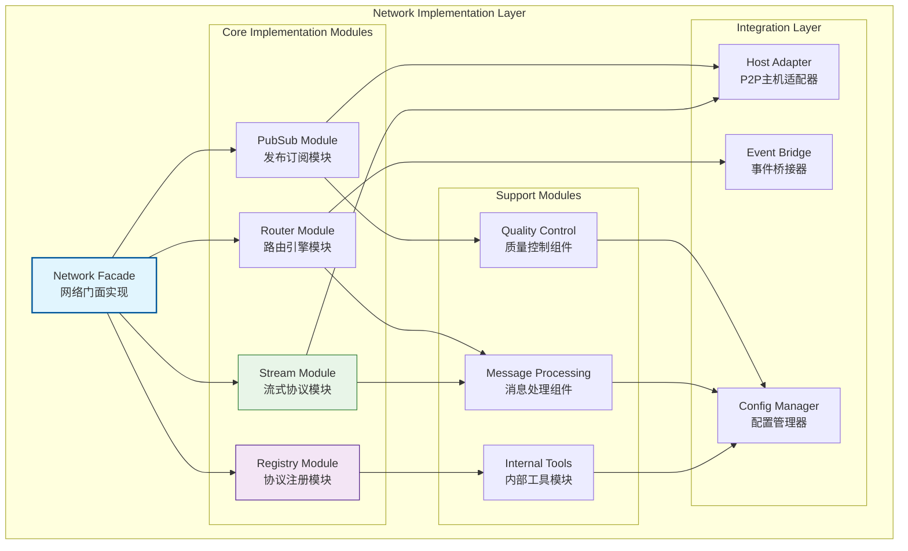
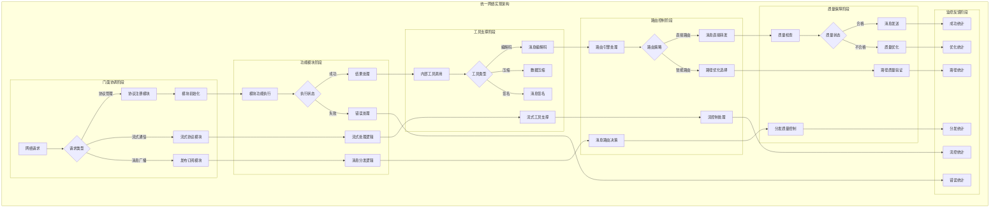
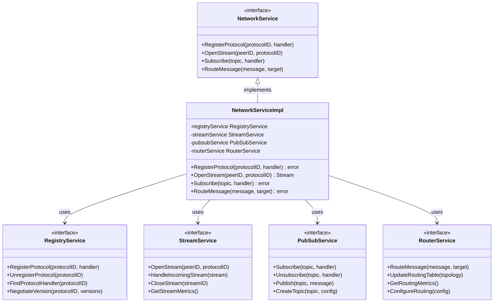

# 网络实现层（internal/core/network/impl）

【模块定位】
　　本目录是WES网络服务层的具体实现，包含协议注册、消息路由、流式通信和发布订阅等核心功能的完整实现。通过模块化设计，将复杂的网络功能分解为独立的子模块，实现高内聚低耦合的架构。

【设计原则】
- 模块化分离：将网络功能分解为独立的专业模块
- 接口驱动设计：严格遵循pkg/interfaces/network定义的接口
- 职责单一原则：每个子模块专注特定的网络功能
- 可扩展架构：支持新协议和功能的轻松扩展
- 性能优化优先：在保证功能的前提下优化性能
- 错误处理完善：提供完整的错误处理和恢复机制

【核心职责】
1. **协议管理实现**：协议注册、版本协商、处理器管理的具体实现
2. **通信范式实现**：流式协议和订阅协议的完整实现
3. **消息处理实现**：消息编解码、压缩、签名的具体实现
4. **路由引擎实现**：消息路由、去重、质量控制的实现
5. **可靠性控制实现**：超时、重试、背压机制的实现
6. **P2P集成实现**：与底层P2P服务的适配和集成

【实现层设计理念：分层模块化模式】
本实现层采用"分层模块化"设计模式，将网络功能按职责分解为独立模块，每个模块内部实现完整的功能逻辑。这种设计的核心思想是"功能内聚，模块独立"。

## 实现架构设计



**架构层次说明**：
- **Network Facade**（蓝色）：网络门面实现，统一的外部接口
- **Core Implementation Modules**（绿/紫色）：核心实现模块，专业功能实现
- **Support Modules**（橙色）：支撑模块，提供公共服务和工具
- **Integration Layer**（灰色）：集成层，与外部系统的适配

**实现特点**：
- 模块独立：每个模块可以独立开发和测试
- 接口一致：所有模块遵循统一的接口规范
- 功能完整：每个模块提供完整的功能实现
- 易于扩展：新功能可以通过新模块轻松添加

---

## 📁 **模块组织结构**

【内部模块架构】

```
internal/core/network/impl/
├── 🎯 network_facade.go                # 网络服务的统一门面实现
├── 🔧 internal/                        # 内部工具和公共组件
│   ├── envelope.go                     # 消息封装管理器
│   ├── encode.go                       # 多格式编解码引擎
│   ├── compress.go                     # 自适应压缩算法
│   ├── sign.go                         # 消息签名验证服务
│   ├── id.go                           # 多类型ID生成器
│   ├── context.go                      # 网络上下文管理
│   ├── limits.go                       # 限制和阈值管理
│   └── errors.go                       # 统一错误处理
├── 📋 registry/                        # 协议注册和管理实现
│   ├── service.go                      # 协议注册服务门面
│   ├── registry.go                     # 协议注册表实现
│   ├── negotiation.go                  # 版本协商引擎
│   ├── compatibility.go                # 兼容性检查器
│   ├── handler.go                      # 处理器管理器
│   └── errors.go                       # 注册错误处理
├── 🌊 stream/                          # 流式协议完整实现
│   ├── service.go                      # 流式服务门面
│   ├── client.go                       # 流式客户端实现
│   ├── dispatcher.go                   # 流分发器
│   ├── codec.go                        # 消息编解码器
│   ├── backpressure.go                 # 背压控制器
│   ├── retry.go                        # 重试引擎
│   └── errors.go                       # 流相关错误处理
├── 📡 pubsub/                          # 发布订阅协议实现
│   ├── service.go                      # 发布订阅服务门面
│   ├── topic_manager.go                # 主题管理器
│   ├── publisher.go                    # 消息发布器
│   ├── validator.go                    # 消息验证器
│   ├── encoding.go                     # 编解码适配器
│   └── errors.go                       # PubSub错误处理
├── 🔀 router/                          # 消息路由和分发引擎
│   ├── service.go                      # 路由服务门面
│   ├── engine.go                       # 路由引擎实现
│   ├── table.go                        # 路由表管理
│   ├── quality.go                      # 网络质量分析
│   ├── dedup_store.go                  # 消息去重存储
│   ├── rate_limit.go                   # 速率限制器
│   └── errors.go                       # 路由错误处理
├── 📝 README.md                        # 本文档
└── 📊 tests/                           # 测试文件目录
    ├── network_facade_test.go          # 网络门面测试
    ├── integration_test.go             # 模块集成测试
    ├── performance_test.go             # 性能基准测试
    └── mock_test.go                    # 测试模拟工具
```

### **🎯 子模块职责分工**

| **模块目录** | **核心职责** | **对外接口** | **内部组件** | **复杂度** |
|-------------|-------------|-------------|-------------|-----------|
| `network_facade.go` | 网络服务的统一门面实现 | NetworkService | 门面协调、生命周期管理、配置分发 | 高 |
| `internal/` | 内部工具和公共组件 | 工具集合 | 编解码、压缩、签名、ID生成 | 中 |
| `registry/` | 协议注册和管理实现 | RegistryService | 注册表、协商引擎、兼容性检查 | 高 |
| `stream/` | 流式协议完整实现 | StreamService | 客户端、分发器、背压控制 | 高 |
| `pubsub/` | 发布订阅协议实现 | PubSubService | 主题管理、发布器、验证器 | 中 |
| `router/` | 消息路由和分发引擎 | RouterService | 路由引擎、质量分析、去重控制 | 高 |
| `tests/` | 实现层功能测试验证 | 测试工具和框架 | 单元测试、集成测试、性能测试 | 中 |

---

## 🔄 **统一网络实现**

【实现策略】

　　所有网络实现模块均严格遵循**分层模块化**架构模式，确保网络功能的标准化实现、高性能优化和可扩展设计。



**关键实现要点：**

1. **统一门面管理**：
   - 标准化的请求处理和模块协调机制
   - 完整的生命周期管理和资源调度策略
   - 统一的错误处理和状态管理体系

2. **模块化功能实现**：
   - 独立的功能模块和清晰的职责边界
   - 标准化的模块间通信和数据交换
   - 完整的模块测试和质量保障机制

3. **工具链整合优化**：
   - 统一的内部工具集和公共组件库
   - 高效的工具调用和资源复用机制
   - 智能的工具选择和性能优化策略

---

## 🏗️ **依赖注入架构**

【fx框架集成】

　　全面采用fx依赖注入框架，实现网络实现层组件间的松耦合和生命周期自动管理。

**依赖注入设计**：
- **核心模块装配**：自动装配网络门面、协议注册、流式服务、发布订阅、路由引擎
- **工具组件注入**：统一注入内部工具、编解码器、压缩引擎、签名服务、ID生成器
- **集成适配注入**：通过接口注入P2P适配器、事件桥接器、配置管理器
- **生命周期管理**：自动管理所有模块的初始化、协调运行和优雅关闭

**核心组件依赖关系**：
- NetworkFacade依赖RegistryService、StreamService、PubSubService、RouterService
- 所有实现模块依赖InternalTools、MessageProcessor、QualityController
- 流式和发布订阅模块依赖HostAdapter、EventBridge、ConnectionManager
- 路由引擎依赖QualityAnalyzer、DedupFilter、RateLimiter、LoadBalancer
- 所有组件共享Logger、Config、MetricsCollector、ErrorHandler等基础服务

---

## 📊 **性能与监控**

【性能指标】

| **操作类型** | **目标延迟** | **吞吐量目标** | **成功率** | **监控方式** |
|-------------|-------------|---------------|-----------|------------|
| 门面请求处理 | < 0.5ms | > 100000 RPS | > 99.9% | 实时监控 |
| 协议注册操作 | < 10ms | > 1000 RPS | > 98% | 定时监控 |
| 流式协议通信 | < 50ms | > 2000 RPS | > 99% | 高频监控 |
| 消息发布订阅 | < 20ms | > 5000 PPS | > 99% | 批量统计 |
| 路由引擎处理 | < 5ms | > 10000 RPS | > 99.5% | 关键路径监控 |
| 内部工具调用 | < 1ms | > 50000 OPS | > 99.9% | 异步监控 |

**性能优化策略：**
- **门面优化**：请求分发优化、模块协调加速、状态缓存管理
- **模块优化**：功能专业化、数据结构优化、算法性能提升
- **工具优化**：工具复用、批量处理、零拷贝操作
- **集成优化**：适配器优化、连接复用、异步处理

---

## 🔗 **与公共接口的映射关系**

【接口实现映射】



**实现要点：**
- **接口契约**：严格遵循网络服务接口定义和通信语义
- **错误处理**：分层的错误处理和网络异常恢复机制
- **日志记录**：详细的网络操作日志和性能指标记录
- **测试覆盖**：全面的网络功能测试、模块集成测试和性能基准测试

---

## 🚀 **后续扩展规划**

【模块演进方向】

1. **架构能力增强**
   - 实现更灵活的模块热插拔和动态加载
   - 添加分布式网络服务的集群协调功能
   - 支持多租户网络资源的隔离和管理

2. **性能优化提升**
   - 实现基于DPDK的用户态网络优化
   - 添加GPU加速的网络计算和数据处理
   - 优化大规模并发的内存管理和连接池

3. **协议能力扩展**
   - 支持更多标准网络协议的适配集成
   - 实现自定义协议的快速开发框架
   - 添加协议兼容性的自动测试和验证

4. **运维监控增强**
   - 提供实时的网络服务监控和可视化面板
   - 实现智能的网络异常检测和自动修复
   - 添加网络性能的持续优化建议系统

---

## 📋 **开发指南**

【网络实现开发规范】

1. **新模块开发步骤**：
   - 确定模块定位和核心职责，设计模块架构
   - 定义模块接口和与其他模块的交互契约
   - 实现核心功能逻辑和完整的错误处理机制
   - 添加完整的单元测试和与其他模块的集成测试

2. **代码质量要求**：
   - 严格遵循Go语言最佳实践和项目编码规范
   - 实现生产级的错误处理和异常恢复机制
   - 提供详细的代码注释和模块技术文档
   - 保证核心功能100%的测试覆盖率

3. **性能要求**：
   - 关键路径延迟指标必须达到或超越设计目标
   - 内存使用效率和并发安全的数据访问
   - 实现合理的缓存策略和及时的资源清理
   - 支持高频网络操作和大规模并发需求

4. **集成要求**：
   - 模块必须通过fx依赖注入框架集成
   - 与其他模块的交互仅通过定义的接口进行
   - 支持模块的独立启动、运行和优雅关闭
   - 提供完整的模块监控指标和状态报告

【参考文档】
- [主网络层](../README.md)
- [网络接口规范](../../../pkg/interfaces/network/)
- [内部工具模块](internal/README.md)
- [协议注册模块](registry/README.md)
- [流式协议模块](stream/README.md)
- [发布订阅模块](pubsub/README.md)
- [路由引擎模块](router/README.md)
- [网络示例应用](../examples/README.md)
- [WES架构设计文档](../../../../docs/architecture/)

---

> 📝 **模板说明**：本README模板基于WES v0.0.1统一文档规范设计，使用时请根据具体模块需求替换相应的占位符内容，并确保所有章节都有实质性的技术内容。

> 🔄 **维护指南**：本文档应随着模块功能的演进及时更新，确保文档与代码实现的一致性。建议在每次重大功能变更后更新相应章节。

## 🔗 **相关文档**

- **主网络层**：`../README.md` - 网络层整体架构和设计
- **内部工具**：`internal/README.md` - 公共工具和基础组件
- **协议注册**：`registry/README.md` - 协议注册和管理
- **流式协议**：`stream/README.md` - 流式协议实现
- **发布订阅**：`pubsub/README.md` - 发布订阅实现
- **路由引擎**：`router/README.md` - 消息路由和分发
- **使用示例**：`../examples/README.md` - 网络功能使用示例
