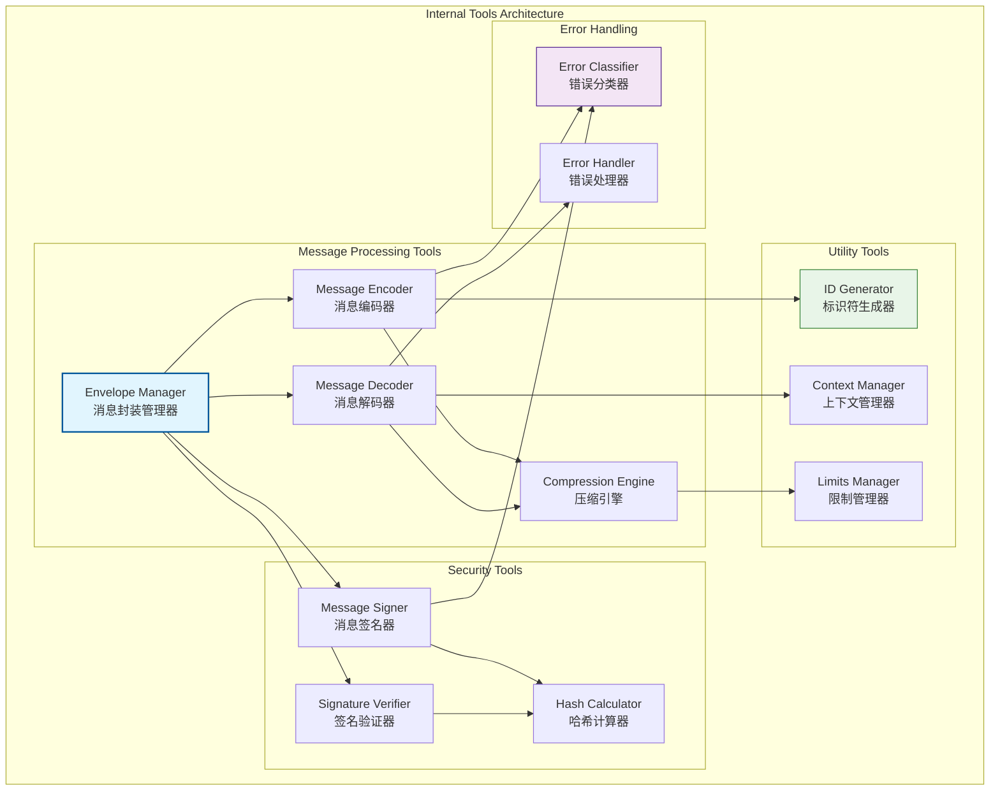
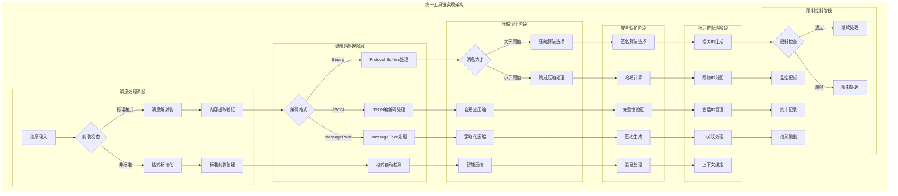
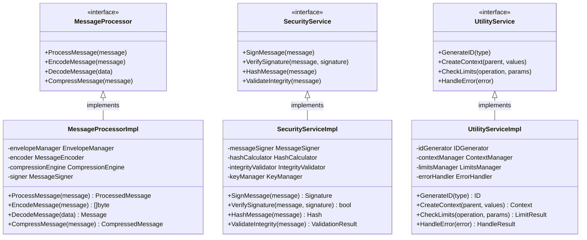

# 内部工具层（internal/core/network/impl/internal）

【模块定位】
　　本目录实现网络层的内部工具与公共组件，为网络实现层提供统一的消息封装、编解码、压缩、签名等基础能力。作为网络层的基础设施，确保所有网络模块使用一致的消息处理和工具服务。

【设计原则】
- 工具职责单一：每个工具组件专注特定功能
- 统一抽象接口：提供一致的工具使用接口
- 高性能优化：关键路径的性能优化和零拷贝
- 可配置策略：支持算法和策略的灵活配置
- 错误处理完善：完整的错误分类和处理机制
- 线程安全保证：所有工具组件的并发安全

【核心职责】
1. **消息封装管理**：统一的消息封装格式和元数据管理
2. **编解码服务**：高效的消息序列化和反序列化
3. **压缩算法支持**：自适应压缩策略和多算法支持
4. **安全机制实现**：消息签名、验证、完整性检查
5. **标识符管理**：各类ID的生成、验证、关联管理
6. **限制和控制**：网络层的各类阈值和限制管理

【工具层设计理念：统一基础设施模式】
本工具层采用"统一基础设施"设计模式，为网络层提供标准化的基础服务和工具组件。这种设计的核心思想是"工具统一，服务标准"。

## 工具架构设计



## 目录结构

| 文件 | 组件 | 职责描述 |
|------|------|----------|
| **envelope.go** | `EnvelopeManager` | 统一消息封装和元数据管理 |
| **encode.go** | `MessageEncoder` | 多格式消息编解码引擎 |
| **compress.go** | `CompressionEngine` | 自适应压缩算法管理 |
| **sign.go** | `MessageSigner` | 消息签名和验证服务 |
| **id.go** | `IDGenerator` | 多类型标识符生成器 |
| **context.go** | `ContextManager` | 网络层上下文管理 |
| **limits.go** | `LimitsManager` | 网络限制和阈值管理 |
| **errors.go** | `ErrorHandler` | 统一错误分类和处理 |
| **types.go** | `TypeDefinitions` | 内部类型和常量定义 |

## 核心工具能力

### 📦 消息封装 (Envelope Manager)
**核心功能**：
- 标准消息格式：version、contentType、correlationId、auth、payload
- 元数据与载荷分离的设计模式
- 向前兼容的版本升级支持
- 可扩展的自定义头字段机制

### 🔄 编解码引擎 (Message Encoder)
**编解码能力**：
- 多格式支持：Binary(PB)、JSON、MessagePack
- 零拷贝优化和流式处理
- 大消息的分块编解码
- 错误恢复和部分损坏消息处理

### 🗜️ 压缩引擎 (Compression Engine)
**压缩策略**：
- 自适应算法选择：基于消息大小和类型
- 多算法支持：GZIP、LZ4、ZSTD等
- 性能与压缩比的动态平衡
- 可配置的压缩触发阈值

### 🔐 消息签名器 (Message Signer)
**安全机制**：
- 多签名模式：对称密钥、非对称密钥、哈希校验
- 批量签名处理和验证缓存
- 密钥轮换和版本管理
- 灵活的验证策略配置

### 🆔 标识符生成器 (ID Generator)
**ID管理能力**：
- 多类型ID：correlationId、traceId、sessionId
- 分布式环境的唯一性保证
- 高性能ID生成算法
- ID关联关系管理

### 📋 上下文管理器 (Context Manager)
**上下文服务**：
- 网络层专用的上下文键值对
- 跨网络边界的上下文传播
- 层次化超时控制机制
- 优雅的操作取消和清理

### ⚖️ 限制管理器 (Limits Manager)
**限制控制**：
- 多维限制：消息大小、并发度、速率
- 运行时动态配置调整
- 限制使用情况监控告警
- 超限情况的优雅降级

### 🚨 错误处理器 (Error Handler)
**错误管理**：
- 网络错误的标准分类体系
- 错误信息的链式包装和上下文
- 标准化错误码和恢复机制
- 可恢复错误的自动重试

## 工具协作模式

### 消息处理管道
- **封装阶段**：创建标准消息封装格式
- **编码阶段**：选择合适的编码格式
- **压缩阶段**：应用自适应压缩策略
- **签名阶段**：添加消息完整性保护

### 性能优化策略
- **零拷贝设计**：关键路径的内存优化
- **对象池机制**：频繁分配对象的复用
- **批量处理**：签名验证的批量优化
- **缓存机制**：计算结果的智能缓存

### 配置和扩展
- **策略可配置**：算法和参数的运行时配置
- **插件机制**：新算法和工具的插件化扩展
- **监控集成**：性能和错误指标的监控
- **调试支持**：开发和调试的辅助工具

---

## 📁 **模块组织结构**

【内部模块架构】

```
internal/core/network/impl/internal/
├── 📦 envelope.go                      # 消息封装管理器和元数据处理
├── 🔄 encode.go                        # 多格式消息编解码引擎
├── 🗜️ compress.go                       # 自适应压缩算法管理
├── 🔐 sign.go                          # 消息签名和验证服务
├── 🆔 id.go                            # 多类型标识符生成器
├── 📋 context.go                       # 网络层上下文管理
├── ⚖️ limits.go                        # 网络限制和阈值管理
├── 🚨 errors.go                        # 统一错误分类和处理
├── 📊 types.go                         # 内部类型和常量定义
├── 📝 README.md                        # 本文档
└── 📊 tests/                           # 测试文件目录
    ├── envelope_test.go                # 消息封装测试
    ├── encode_test.go                  # 编解码引擎测试
    ├── compress_test.go                # 压缩算法测试
    ├── sign_test.go                    # 签名验证测试
    ├── id_test.go                      # ID生成器测试
    ├── context_test.go                 # 上下文管理测试
    ├── limits_test.go                  # 限制管理测试
    └── integration_test.go             # 集成测试套件
```

### **🎯 子模块职责分工**

| **文件模块** | **核心职责** | **对外接口** | **内部组件** | **复杂度** |
|-------------|-------------|-------------|-------------|-----------|
| `envelope.go` | 消息封装管理器和元数据处理 | EnvelopeManager | 封装格式、版本兼容、元数据管理 | 中 |
| `encode.go` | 多格式消息编解码引擎 | MessageEncoder | 编解码、流处理、错误恢复 | 高 |
| `compress.go` | 自适应压缩算法管理 | CompressionEngine | 多算法、策略选择、性能平衡 | 中 |
| `sign.go` | 消息签名和验证服务 | MessageSigner | 多签名、批量处理、密钥管理 | 高 |
| `id.go` | 多类型标识符生成器 | IDGenerator | 唯一性、高性能、关联管理 | 中 |
| `context.go` | 网络层上下文管理 | ContextManager | 键值对、传播、超时控制 | 中 |
| `limits.go` | 网络限制和阈值管理 | LimitsManager | 多维限制、动态调整、监控告警 | 中 |
| `errors.go` | 统一错误分类和处理 | ErrorHandler | 错误分类、链式包装、恢复机制 | 低 |
| `types.go` | 内部类型和常量定义 | TypeDefinitions | 类型定义、常量管理、结构体 | 低 |
| `tests/` | 工具组件功能测试验证 | 测试工具和框架 | 单元测试、集成测试、性能测试 | 中 |

---

## 🔄 **统一工具链实现**

【实现策略】

　　所有工具链组件均严格遵循**统一基础设施**架构模式，确保网络层工具的标准化、高性能和可复用性。



**关键实现要点：**

1. **统一处理流程**：
   - 标准化的消息封装、解封装和格式转换
   - 一致的编解码策略和错误处理机制
   - 完整的工具链协作和数据流管理

2. **智能算法选择**：
   - 自适应的压缩算法和性能优化策略
   - 基于消息特征的编码格式自动选择
   - 动态的限制调整和负载均衡机制

3. **高性能优化**：
   - 零拷贝的数据处理和内存管理
   - 批量处理和对象池化的资源优化
   - 缓存机制和预计算的性能提升

---

## 🏗️ **依赖注入架构**

【fx框架集成】

　　全面采用fx依赖注入框架，实现工具链组件间的松耦合和生命周期自动管理。

**依赖注入设计**：
- **基础工具装配**：自动装配消息封装器、编解码器、压缩引擎、签名器
- **安全服务注入**：统一注入签名验证器、哈希计算器、完整性检查器
- **管理组件集成**：通过接口注入ID生成器、上下文管理器、限制管理器
- **生命周期管理**：自动管理工具链的初始化、配置加载和资源清理

**核心组件依赖关系**：
- EnvelopeManager依赖MessageEncoder、MessageSigner、IDGenerator
- CompressionEngine依赖LimitsManager、PerformanceMonitor、AlgorithmSelector
- MessageSigner依赖HashCalculator、KeyManager、CacheManager
- 所有组件共享ErrorHandler、Logger、Config、MetricsCollector等基础服务

---

## 📊 **性能与监控**

【性能指标】

| **操作类型** | **目标延迟** | **吞吐量目标** | **成功率** | **监控方式** |
|-------------|-------------|---------------|-----------|------------|
| 消息封装 | < 0.1ms | > 50000 OPS | > 99.9% | 实时监控 |
| 编解码处理 | < 1ms | > 20000 OPS | > 99.5% | 批量统计 |
| 压缩处理 | < 5ms | > 5000 CPS | > 98% | 关键路径监控 |
| 签名验证 | < 3ms | > 8000 SPS | > 99% | 异步监控 |
| ID生成 | < 0.05ms | > 100000 IPS | > 99.9% | 高频监控 |
| 限制检查 | < 0.2ms | > 30000 LPS | > 99.5% | 定时监控 |

**性能优化策略：**
- **处理优化**：零拷贝数据处理、流式编解码、批量操作
- **算法优化**：自适应压缩、缓存签名验证、高效ID生成
- **内存优化**：对象池化、内存复用、智能垃圾回收
- **并发优化**：无锁数据结构、并行处理、异步操作

---

## 🔗 **与公共接口的映射关系**

【接口实现映射】



**实现要点：**
- **接口契约**：严格遵循工具链接口定义和处理语义
- **错误处理**：分层的错误处理和工具链异常恢复机制
- **日志记录**：详细的工具操作日志和性能指标记录
- **测试覆盖**：全面的工具链测试、性能测试和压力测试

---

## 🚀 **后续扩展规划**

【模块演进方向】

1. **工具能力增强**
   - 支持更多编解码格式（Avro、Thrift等）
   - 实现更智能的压缩算法自动选择
   - 添加量子安全的签名和加密算法

2. **性能优化提升**
   - 实现GPU加速的编解码和压缩处理
   - 优化大规模并发的内存管理
   - 添加预测性的缓存和预计算机制

3. **安全能力增强**
   - 实现零知识证明的消息验证
   - 添加同态加密的隐私保护功能
   - 增强密钥管理和轮换机制

4. **监控运维增强**
   - 提供可视化的工具链性能监控面板
   - 实现智能的性能异常检测和告警
   - 添加自动化的工具链调优建议系统

---

## 📋 **开发指南**

【工具链开发规范】

1. **新工具接入步骤**：
   - 定义工具组件接口和处理契约
   - 实现核心工具逻辑和算法功能
   - 添加性能优化和错误处理功能
   - 完成工具测试和工具链集成测试

2. **代码质量要求**：
   - 遵循Go语言最佳实践和项目编码规范
   - 实现完整的错误处理和异常恢复机制
   - 提供详细的代码注释和技术文档
   - 保证100%的核心功能测试覆盖率

3. **性能要求**：
   - 关键路径延迟指标必须达到设计目标
   - 内存使用效率和并发安全的数据访问
   - 实现合理的缓存策略和资源清理
   - 支持高频工具操作和处理需求

【参考文档】
- [实现层主文档](../README.md)
- [流式协议模块](../stream/README.md)
- [发布订阅模块](../pubsub/README.md)
- [路由引擎模块](../router/README.md)
- [WES架构设计文档](../../../../../docs/architecture/)

---

> 📝 **模板说明**：本README模板基于WES v0.0.1统一文档规范设计，使用时请根据具体模块需求替换相应的占位符内容，并确保所有章节都有实质性的技术内容。

> 🔄 **维护指南**：本文档应随着模块功能的演进及时更新，确保文档与代码实现的一致性。建议在每次重大功能变更后更新相应章节。

## 🔗 **相关文档**

- **实现层主文档**：`../README.md` - 网络实现层整体架构
- **发布订阅模块**：`../pubsub/README.md` - PubSub实现
- **流式协议模块**：`../stream/README.md` - Stream实现
- **路由引擎模块**：`../router/README.md` - Router实现
