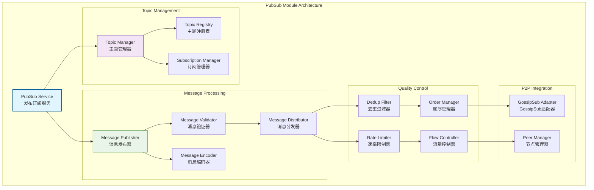
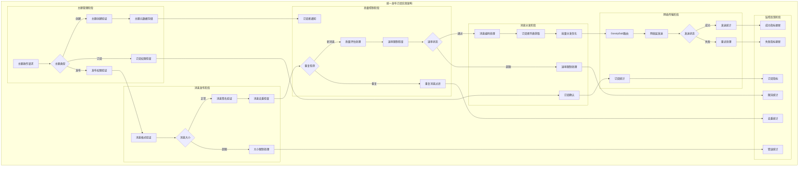
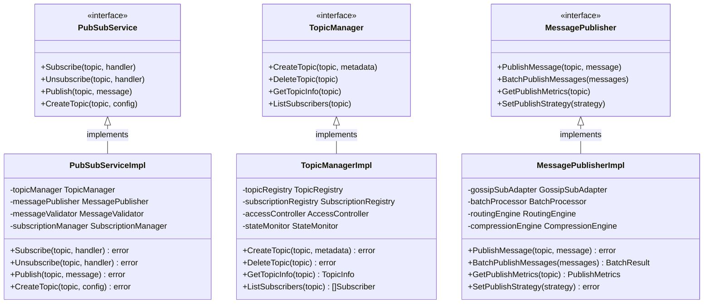

# 发布订阅模块（internal/core/network/impl/pubsub）

【模块定位】
　　本目录实现WES网络层的发布订阅协议，提供高效的分布式消息广播和订阅服务。支持Topic的层次化管理、消息的质量保障和订阅者的生命周期管理，为区块链网络提供松耦合的异步通信能力。

【设计原则】
- 异步消息优先：基于异步消息传递的松耦合通信
- Topic层次化管理：支持层次化的主题命名和管理
- 质量保障机制：提供消息验证、去重、顺序保证
- 可扩展订阅：灵活的订阅模式和过滤机制
- 性能优化优先：高效的消息分发和处理
- 故障容错设计：订阅者故障的容错和恢复

【核心职责】
1. **Topic管理**：层次化主题的创建、订阅、退订管理
2. **消息发布**：高效的消息广播和批量发布优化
3. **消息订阅**：灵活的订阅模式和消息分发
4. **质量保障**：消息验证、去重、顺序保证机制
5. **生命周期管理**：订阅者和主题的完整生命周期
6. **性能优化**：消息处理的性能优化和流量控制

【PubSub设计理念：异步消息广播模式】
本PubSub模块采用"异步消息广播"设计模式，通过Topic实现发布者和订阅者的解耦，支持一对多的消息分发。这种设计的核心思想是"松耦合通信，异步分发"。

## PubSub架构设计



## 目录结构

| 文件 | 组件 | 职责描述 |
|------|------|----------|
| **service.go** | `PubSubService` | 发布订阅服务的统一门面 |
| **topic_manager.go** | `TopicManager` | 主题生命周期和订阅管理 |
| **publisher.go** | `MessagePublisher` | 消息发布和广播处理 |
| **validator.go** | `MessageValidator` | 消息验证和质量检查 |
| **encoding.go** | `MessageEncoder` | 消息编解码适配器 |
| **errors.go** | `ErrorHandler` | PubSub特定错误处理 |

## 核心组件能力

### 📡 发布订阅服务 (PubSub Service)
**服务能力**：
- 统一的发布订阅接口实现
- 内部组件的协调和管理
- 生命周期控制和资源管理
- 配置加载和参数分发

### 📋 主题管理器 (Topic Manager)
**管理功能**：
- 层次化主题的创建和删除
- 订阅者的注册和注销管理
- 主题状态的维护和监控
- 订阅路由表的构建和更新

### 📤 消息发布器 (Message Publisher)
**发布能力**：
- 高效的消息广播和分发
- 批量消息的处理和优化
- 消息压缩和编码优化
- 发布策略和路由选择

### 🔍 消息验证器 (Message Validator)
**验证机制**：
- 消息内容的格式验证
- 签名和完整性检查
- 消息大小和速率限制
- 恶意消息的检测和过滤

### 🔄 消息编码器 (Message Encoder)
**编码服务**：
- 主题消息的格式转换
- 多种编码格式的支持
- 兼容性处理和版本适配
- 编解码性能优化

### 🚨 错误处理器 (Error Handler)
**错误管理**：
- PubSub特定错误的分类
- 发布订阅错误的处理策略
- 错误恢复和重试机制
- 错误监控和报告

## 🔗 模块交互

### 依赖关系
```
PubSub Module → P2P Infrastructure
   ↓               (GossipSub 集成)
   ↓
   ↓    → Registry Module
   ↓               (主题处理器注册)
   ↓
   ↓    → Internal Utils
   ↓               (Envelope/编解码/签名)
   ↓
   ↓    → Router Module
   ↓               (消息路由决策)
```

### 服务消费
```
应用层模块 → PubSub Service
    ↓
    ├── 区块广播        (新区块发布)
    ├── 交易池同步      (交易广播)
    ├── 状态同步        (状态更新通知)
    └── 共识消息        (共识协议消息)
```

## 🎨 设计原则

### 主题命名规范
- **层次结构**：`/weisyn/{category}/{subcategory}/{version}` 格式
- **版本兼容**：支持多版本主题并存，平滑升级
- **权限控制**：基于主题的发布订阅权限管理
- **模式匹配**：支持通配符订阅和正则匹配

### 扩展性设计
- **水平扩展**：支持大规模节点的发布订阅
- **负载均衡**：多发布者负载分担，热点主题优化
- **容错处理**：节点故障时的订阅恢复和重路由
- **动态配置**：运行时调整订阅策略和验证规则

## 🛡️ 安全特性

### 消息安全
- **身份验证**：发布者身份验证和权限检查
- **消息完整性**：消息哈希验证，防篡改保护
- **访问控制**：基于主题的细粒度权限控制
- **DoS 防护**：发布频率限制，消息大小限制

### 隐私保护
- **订阅隐私**：订阅信息不泄露给未授权节点
- **内容加密**：敏感主题的端到端加密
- **元数据保护**：最小化主题元数据暴露

## 🚀 性能优化

### GossipSub 集成
- **智能路由**：基于网络拓扑的最优路由选择
- **消息缓存**：热点消息缓存，减少重复传输
- **连接优化**：主题相关的连接优先级管理
- **带宽控制**：自适应带宽分配和流量控制

### 消息优化
- **批量处理**：小消息批量打包，减少网络开销
- **压缩策略**：基于主题特性的自适应压缩
- **预取机制**：热点主题的消息预取和缓存
- **异步处理**：全异步消息处理，提升吞吐量

### 监控指标
- **发布指标**：发布成功率，发布延迟，消息大小分布
- **订阅指标**：订阅数量，消息接收率，处理延迟
- **网络指标**：传播延迟，网络扇出度，连接质量
- **验证指标**：验证通过率，错误类型分布，性能影响

---

## 📁 **模块组织结构**

【内部模块架构】

```
internal/core/network/impl/pubsub/
├── 📡 service.go                       # 发布订阅服务的统一门面
├── 📋 topic_manager.go                  # 主题生命周期和订阅管理
├── 📤 publisher.go                      # 消息发布和广播处理
├── 🔍 validator.go                      # 消息验证和质量检查
├── 🔄 encoding.go                       # 消息编解码适配器
├── 🚨 errors.go                         # PubSub特定错误处理
├── 📝 README.md                         # 本文档
└── 📊 tests/                            # 测试文件目录
    ├── service_test.go                  # 发布订阅服务测试
    ├── topic_manager_test.go            # 主题管理器测试
    ├── publisher_test.go                # 消息发布器测试
    ├── validator_test.go                # 消息验证器测试
    ├── encoding_test.go                 # 编解码适配器测试
    └── integration_test.go              # 集成测试套件
```

### **🎯 子模块职责分工**

| **文件模块** | **核心职责** | **对外接口** | **内部组件** | **复杂度** |
|-------------|-------------|-------------|-------------|-----------|
| `service.go` | 发布订阅服务的统一门面 | PubSubService | 门面协调、生命周期管理、配置分发 | 高 |
| `topic_manager.go` | 主题生命周期和订阅管理 | TopicManager | 主题创建、订阅管理、状态监控 | 高 |
| `publisher.go` | 消息发布和广播处理 | MessagePublisher | 消息广播、批量优化、路由选择 | 中 |
| `validator.go` | 消息验证和质量检查 | MessageValidator | 格式验证、签名检查、恶意检测 | 中 |
| `encoding.go` | 消息编解码适配器 | MessageEncoder | 格式转换、兼容性处理、性能优化 | 中 |
| `errors.go` | PubSub特定错误处理 | ErrorHandler | 错误分类、恢复策略、监控统计 | 低 |
| `tests/` | 发布订阅功能测试验证 | 测试工具和框架 | 单元测试、集成测试、性能测试 | 中 |

---

## 🔄 **统一发布订阅实现**

【实现策略】

　　所有发布订阅组件均严格遵循**异步消息广播**架构模式，确保消息的高效分发、质量保障和松耦合通信。



**关键实现要点：**

1. **统一主题管理**：
   - 层次化的主题命名和权限管理机制
   - 完整的订阅生命周期和状态跟踪
   - 高效的主题索引和快速查找服务

2. **智能消息分发**：
   - 基于GossipSub的智能路由和传播策略
   - 异步批量分发和性能优化机制
   - 完整的消息去重和质量控制

3. **可靠质量保障**：
   - 多层次的消息验证和安全检查
   - 自适应的速率限制和流量控制
   - 完整的监控统计和异常处理

---

## 🏗️ **依赖注入架构**

【fx框架集成】

　　全面采用fx依赖注入框架，实现发布订阅组件间的松耦合和生命周期自动管理。

**依赖注入设计**：
- **核心服务装配**：自动装配发布订阅服务、主题管理器、消息发布器、验证器
- **质量控制注入**：统一注入消息验证器、去重过滤器、速率限制器
- **网络集成系统**：通过接口注入GossipSub适配器、节点管理器、路由引擎
- **生命周期管理**：自动管理PubSub服务的初始化、主题创建和优雅关闭

**核心组件依赖关系**：
- PubSubService依赖TopicManager、MessagePublisher、MessageValidator
- TopicManager依赖SubscriptionManager、TopicRegistry、StateMonitor
- MessagePublisher依赖GossipSubAdapter、BatchProcessor、EventBus
- 所有组件共享PeerManager、Logger、Config、MetricsCollector等基础服务

---

## 📊 **性能与监控**

【性能指标】

| **操作类型** | **目标延迟** | **吞吐量目标** | **成功率** | **监控方式** |
|-------------|-------------|---------------|-----------|------------|
| 主题创建 | < 20ms | > 1000 TPS | > 98% | 实时监控 |
| 消息发布 | < 10ms | > 5000 PPS | > 99% | 高频监控 |
| 消息订阅 | < 5ms | > 8000 SPS | > 99.5% | 批量统计 |
| 消息验证 | < 3ms | > 10000 VPS | > 97% | 关键路径监控 |
| 消息分发 | < 15ms | > 3000 DPS | > 95% | 异步监控 |
| 去重处理 | < 1ms | > 20000 FPS | > 99% | 定时监控 |

**性能优化策略：**
- **发布优化**：批量发布、异步分发、智能路由选择
- **订阅优化**：订阅者缓存、快速查找、状态预计算
- **传输优化**：消息聚合、压缩传输、连接复用
- **存储优化**：内存池化、对象复用、垃圾回收优化

---

## 🔗 **与公共接口的映射关系**

【接口实现映射】



**实现要点：**
- **接口契约**：严格遵循发布订阅接口定义和消息传递语义
- **错误处理**：分层的错误处理和发布订阅异常恢复机制
- **日志记录**：详细的发布订阅操作日志和性能指标记录
- **测试覆盖**：全面的PubSub测试、主题管理测试和消息传递测试

---

## 🚀 **后续扩展规划**

【模块演进方向】

1. **协议能力增强**
   - 支持更复杂的主题层次结构和权限模型
   - 实现跨链的主题同步和消息传递
   - 添加智能的消息过滤和路由策略

2. **性能优化提升**
   - 实现GPU加速的消息编解码和分发
   - 优化大规模订阅的内存和网络使用
   - 添加预测性的负载均衡和流量调度

3. **可靠性增强**
   - 实现更强的消息持久化和恢复机制
   - 添加分区容错和故障转移功能
   - 增强订阅者的健康检查和自动恢复

4. **监控运维增强**
   - 提供可视化的发布订阅监控面板
   - 实现智能的主题使用分析和优化建议
   - 添加自动化的PubSub性能调优工具

---

## 📋 **开发指南**

【发布订阅开发规范】

1. **新主题接入步骤**：
   - 定义主题命名和权限模型，遵循层次化规范
   - 实现主题相关的消息格式和验证规则
   - 添加订阅处理器和消息分发逻辑
   - 完成主题测试和发布订阅集成测试

2. **代码质量要求**：
   - 遵循Go语言最佳实践和项目编码规范
   - 实现完整的错误处理和异常恢复机制
   - 提供详细的代码注释和技术文档
   - 保证100%的核心功能测试覆盖率

3. **性能要求**：
   - 关键路径延迟指标必须达到设计目标
   - 内存使用效率和并发安全的数据访问
   - 实现合理的缓存策略和资源清理
   - 支持高频发布订阅操作和消息传递需求

【参考文档】
- [实现层主文档](../README.md)
- [流式协议模块](../stream/README.md)
- [协议注册模块](../registry/README.md)
- [路由引擎模块](../router/README.md)
- [WES架构设计文档](../../../../../docs/architecture/)

---

> 📝 **模板说明**：本README模板基于WES v0.0.1统一文档规范设计，使用时请根据具体模块需求替换相应的占位符内容，并确保所有章节都有实质性的技术内容。

> 🔄 **维护指南**：本文档应随着模块功能的演进及时更新，确保文档与代码实现的一致性。建议在每次重大功能变更后更新相应章节。

## 🔧 **配置管理**

### 主题配置
- **订阅限制**：每节点最大订阅数，主题订阅者上限
- **消息限制**：消息大小上限，发布频率限制
- **验证配置**：签名要求，内容过滤规则
- **路由配置**：传播策略，冗余度设置

### 性能调优
- **缓存配置**：消息缓存大小，过期时间
- **连接配置**：GossipSub 参数，Mesh 维护策略
- **压缩配置**：压缩算法选择，阈值设置
- **批量配置**：批量大小，聚合时间窗口

