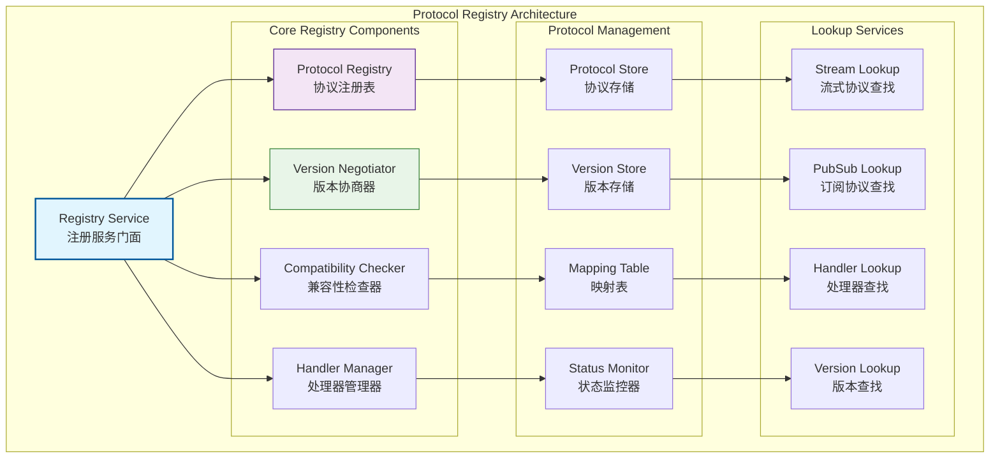
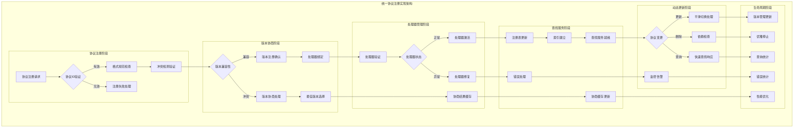
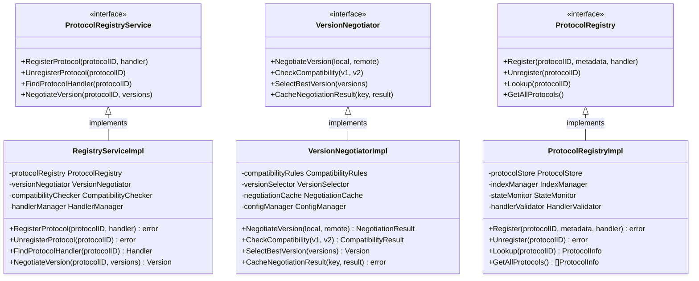

# Registry - 协议注册子域

【模块定位】
　　本目录实现WES网络层的协议注册与版本协商管理，作为网络协议的统一管理中心，负责协议的生命周期管理、版本兼容性检查和协议处理器的动态分发。为流式协议和订阅协议提供统一的注册和查找服务。

【设计原则】
- 协议生命周期管理：完整的协议注册、查找、注销生命周期
- 版本兼容性保证：严格的版本协商和兼容性检查机制
- 动态协议支持：支持运行时的协议动态注册和更新
- 统一命名规范：标准化的协议命名和版本管理规范
- 高效查找性能：优化的协议查找和匹配算法
- 处理器解耦：协议注册与具体处理器实现的解耦

【核心职责】
1. **协议注册管理**：动态注册和注销网络协议处理器
2. **版本协商服务**：连接建立时的协议版本匹配和协商
3. **兼容性检查**：协议版本间的向前和向后兼容性验证
4. **处理器分发**：为上层模块提供协议处理器查找服务
5. **协议命名规范**：维护标准化的协议命名和版本体系
6. **协议状态管理**：协议的启用、禁用和状态监控

【协议注册设计理念：统一协议管理模式】
本协议注册模块采用"统一协议管理"设计模式，通过协议ID实现协议的标准化管理和版本化控制。这种设计的核心思想是"协议统一，版本分离"。

## 协议注册架构设计



**架构层次说明**：
- **Registry Service**（蓝色）：注册服务门面，统一的协议管理入口
- **Core Registry Components**（紫/绿色）：核心注册组件，专业功能实现
- **Protocol Management**（橙色）：协议管理层，负责协议数据存储和状态
- **Lookup Services**（灰色）：查找服务层，提供高效的协议查找能力

**注册特点**：
- 统一管理：所有协议通过统一注册表管理
- 版本控制：严格的版本协商和兼容性检查
- 动态支持：支持运行时协议的注册和更新
- 高效查找：优化的协议查找和匹配算法

## 目录结构

| 文件 | 组件 | 职责描述 |
|------|------|----------|
| **service.go** | `RegistryService` | 协议注册服务的统一门面 |
| **registry.go** | `ProtocolRegistry` | 协议注册表的核心实现 |
| **negotiation.go** | `VersionNegotiator` | 版本协商引擎 |
| **compatibility.go** | `CompatibilityChecker` | 兼容性检查器 |
| **handler.go** | `HandlerManager` | 处理器生命周期管理 |
| **errors.go** | `ErrorHandler` | 注册相关错误处理 |

## 核心组件能力

### 📋 注册服务门面 (Registry Service)
**服务能力**：
- 统一的协议注册和管理接口
- 内部组件的协调和调度
- 协议生命周期的控制和监控
- 配置加载和参数验证

### 📚 协议注册表 (Protocol Registry)
**注册功能**：
- 协议ID到处理器的映射管理
- 协议元数据的存储和检索
- 协议状态的维护和监控
- 协议查找的高效索引

### 🔄 版本协商器 (Version Negotiator)
**协商能力**：
- 连接建立时的版本匹配
- 最佳协议版本的自动选择
- 协议降级和升级策略
- 协商结果的缓存和优化

### 🔍 兼容性检查器 (Compatibility Checker)
**检查机制**：
- 向前和向后兼容性验证
- 协议版本间的差异分析
- 不兼容变更的检测和报告
- 兼容性规则的配置和管理

### 🎯 处理器管理器 (Handler Manager)
**管理功能**：
- 协议处理器的注册和注销
- 处理器生命周期的管理
- 处理器状态的监控和诊断
- 处理器分发的负载均衡

### 🚨 错误处理器 (Error Handler)
**错误管理**：
- 协议注册错误的分类和处理
- 版本协商失败的错误恢复
- 兼容性检查错误的报告
- 错误监控和统计分析

## 协议命名规范

### 流式协议命名
- **格式**：`/<org>/<domain>/<feature>/<version>`
- **示例**：`/weisyn/block/sync/v1.0.0`、`/weisyn/tx/request/v1.2.0`
- **版本策略**：语义化版本控制，支持major.minor.patch格式

### 订阅协议命名
- **格式**：`<org>.<domain>.<event>.<version>`
- **示例**：`weisyn.block.announce.v1`、`weisyn.tx.broadcast.v2`
- **事件分类**：按业务领域和事件类型分层命名

### 版本兼容性规则
- **向后兼容**：minor和patch版本更新保持向后兼容
- **向前兼容**：支持新版本客户端与旧版本服务端通信
- **破坏性变更**：major版本变更可以包含破坏性变更
- **协商策略**：自动选择双方都支持的最高版本

## 协议生命周期管理

### 注册阶段
- **协议验证**：协议ID格式和版本号的验证
- **冲突检查**：重复协议注册的检测和处理
- **处理器绑定**：协议与处理器的绑定和验证
- **状态初始化**：协议状态的初始化和监控

### 查找阶段
- **快速索引**：基于哈希表的O(1)协议查找
- **版本匹配**：最佳版本的自动匹配和选择
- **缓存优化**：频繁查找协议的缓存机制
- **负载均衡**：多处理器实例的负载均衡分发

### 更新阶段
- **动态更新**：运行时协议的动态更新和替换
- **平滑切换**：新旧协议版本的平滑切换
- **影响评估**：协议更新的影响范围评估
- **回滚机制**：协议更新失败的回滚和恢复

### 注销阶段
- **依赖检查**：协议注销前的依赖关系检查
- **优雅停止**：正在处理请求的优雅停止
- **资源清理**：协议相关资源的完全清理
- **状态更新**：协议状态的最终更新和通知

## 性能优化策略

### 查找优化
- **索引结构**：多级索引和哈希表的组合使用
- **缓存机制**：LRU缓存和预取策略
- **并发访问**：读写锁和无锁数据结构
- **批量操作**：批量协议注册和查找

### 内存优化
- **对象池**：协议对象和处理器对象的复用
- **内存压缩**：协议元数据的压缩存储
- **垃圾回收**：及时的资源回收和内存清理
- **内存监控**：内存使用情况的监控和告警

### 并发控制
- **无锁设计**：关键路径的无锁数据结构
- **分段锁**：大协议表的分段锁机制
- **读写分离**：读操作和写操作的分离优化
- **异步处理**：非关键操作的异步处理

---

## 📁 **模块组织结构**

【内部模块架构】

```
internal/core/network/impl/registry/
├── 📋 service.go                       # 协议注册服务的统一门面
├── 📚 registry.go                      # 协议注册表的核心实现
├── 🔄 negotiation.go                   # 版本协商引擎和算法
├── 🔍 compatibility.go                 # 兼容性检查器和验证
├── 🎯 handler.go                       # 处理器生命周期管理
├── 🚨 errors.go                        # 注册相关错误处理
├── 📝 README.md                        # 本文档
└── 📊 tests/                           # 测试文件目录
    ├── service_test.go                 # 注册服务测试
    ├── registry_test.go                # 注册表功能测试
    ├── negotiation_test.go             # 版本协商测试
    ├── compatibility_test.go           # 兼容性检查测试
    ├── handler_test.go                 # 处理器管理测试
    └── integration_test.go             # 集成测试套件
```

### **🎯 子模块职责分工**

| **文件模块** | **核心职责** | **对外接口** | **内部组件** | **复杂度** |
|-------------|-------------|-------------|-------------|-----------|
| `service.go` | 协议注册服务的统一门面 | RegistryService | 门面协调、生命周期管理、配置分发 | 高 |
| `registry.go` | 协议注册表的核心实现 | ProtocolRegistry | 注册映射、元数据存储、状态监控 | 高 |
| `negotiation.go` | 版本协商引擎和算法 | VersionNegotiator | 版本匹配、协商策略、自动选择 | 中 |
| `compatibility.go` | 兼容性检查器和验证 | CompatibilityChecker | 兼容性验证、差异分析、规则管理 | 中 |
| `handler.go` | 处理器生命周期管理 | HandlerManager | 处理器注册、状态监控、负载均衡 | 中 |
| `errors.go` | 注册相关错误处理 | ErrorHandler | 错误分类、恢复策略、监控统计 | 低 |
| `tests/` | 协议注册功能测试验证 | 测试工具和框架 | 单元测试、集成测试、性能测试 | 中 |

---

## 🔄 **统一协议注册实现**

【实现策略】

　　所有协议注册组件均严格遵循**统一协议管理**架构模式，确保协议的标准化管理、版本化控制和动态支持。



**关键实现要点：**

1. **统一注册流程**：
   - 标准化的协议ID验证和格式规范检查
   - 完整的冲突检测和版本兼容性验证机制
   - 自动化的处理器绑定和生命周期管理

2. **智能版本协商**：
   - 基于语义版本的自动协商和最佳匹配
   - 向前向后兼容的版本选择策略
   - 协商结果的缓存和性能优化

3. **高效查找服务**：
   - O(1)的协议查找和多维度索引
   - 动态更新的注册表和实时状态监控
   - 负载均衡的处理器分发和故障转移

---

## 🏗️ **依赖注入架构**

【fx框架集成】

　　全面采用fx依赖注入框架，实现协议注册组件间的松耦合和生命周期自动管理。

**依赖注入设计**：
- **核心注册装配**：自动装配协议注册服务、注册表、版本协商器、兼容性检查器
- **管理系统注入**：统一注入处理器管理器、状态监控器、缓存管理器
- **查找服务集成**：通过接口注入快速查找、索引管理、负载均衡器
- **生命周期管理**：自动管理注册服务的初始化、协议加载和优雅关闭

**核心组件依赖关系**：
- RegistryService依赖ProtocolRegistry、VersionNegotiator、CompatibilityChecker
- ProtocolRegistry依赖HandlerManager、IndexManager、StateMonitor
- VersionNegotiator依赖CompatibilityChecker、CacheManager、ConfigManager
- 所有组件共享ErrorHandler、Logger、Config、MetricsCollector等基础服务

---

## 📊 **性能与监控**

【性能指标】

| **操作类型** | **目标延迟** | **吞吐量目标** | **成功率** | **监控方式** |
|-------------|-------------|---------------|-----------|------------|
| 协议注册 | < 10ms | > 1000 RPS | > 98% | 实时监控 |
| 协议查找 | < 1ms | > 20000 QPS | > 99.5% | 高频监控 |
| 版本协商 | < 5ms | > 5000 NPS | > 95% | 批量统计 |
| 兼容性检查 | < 3ms | > 8000 CPS | > 97% | 关键路径监控 |
| 处理器管理 | < 20ms | > 2000 HPS | > 99% | 异步监控 |
| 协议更新 | < 50ms | > 500 UPS | > 95% | 定时监控 |

**性能优化策略：**
- **注册优化**：批量注册、并行验证、索引预构建
- **查找优化**：多级缓存、预取机制、无锁查找
- **协商优化**：结果缓存、策略预计算、智能匹配
- **存储优化**：压缩存储、内存池化、分片管理

---

## 🔗 **与公共接口的映射关系**

【接口实现映射】



**实现要点：**
- **接口契约**：严格遵循协议注册接口定义和管理语义
- **错误处理**：分层的错误处理和注册异常恢复机制
- **日志记录**：详细的注册操作日志和性能指标记录
- **测试覆盖**：全面的协议注册测试、版本协商测试和兼容性测试

---

## 🚀 **后续扩展规划**

【模块演进方向】

1. **注册能力增强**
   - 支持更复杂的协议依赖关系管理
   - 实现协议的动态热更新和热部署
   - 添加协议模板和自动代码生成功能

2. **版本管理优化**
   - 实现更智能的版本兼容性分析
   - 添加自动化的版本迁移和升级工具
   - 优化版本协商的性能和准确性

3. **扩展性增强**
   - 支持分布式的协议注册表和同步
   - 实现协议注册的可视化管理界面
   - 添加协议使用统计和分析功能

4. **监控运维增强**
   - 提供实时的协议注册状态监控面板
   - 实现智能的协议健康检查和告警
   - 添加自动化的协议注册诊断和修复

---

## 📋 **开发指南**

【协议注册开发规范】

1. **新协议接入步骤**：
   - 定义协议ID和版本号，遵循命名规范
   - 实现协议处理器接口和核心处理逻辑
   - 添加版本兼容性规则和测试用例
   - 完成协议注册和集成测试验证

2. **代码质量要求**：
   - 遵循Go语言最佳实践和项目编码规范
   - 实现完整的错误处理和异常恢复机制
   - 提供详细的代码注释和技术文档
   - 保证100%的核心功能测试覆盖率

3. **性能要求**：
   - 关键路径延迟指标必须达到设计目标
   - 内存使用效率和并发安全的数据访问
   - 实现合理的缓存策略和资源清理
   - 支持高频协议注册和查找需求

【参考文档】
- [实现层主文档](../README.md)
- [流式协议模块](../stream/README.md)
- [发布订阅模块](../pubsub/README.md)
- [路由引擎模块](../router/README.md)
- [WES架构设计文档](../../../../../docs/architecture/)

---

> 📝 **模板说明**：本README模板基于WES v0.0.1统一文档规范设计，使用时请根据具体模块需求替换相应的占位符内容，并确保所有章节都有实质性的技术内容。

> 🔄 **维护指南**：本文档应随着模块功能的演进及时更新，确保文档与代码实现的一致性。建议在每次重大功能变更后更新相应章节。

## 🔗 **相关文档**

- **实现层主文档**：`../README.md` - 网络实现层整体架构
- **流式协议模块**：`../stream/README.md` - 流式协议实现
- **发布订阅模块**：`../pubsub/README.md` - 发布订阅实现
- **路由引擎模块**：`../router/README.md` - 路由引擎实现