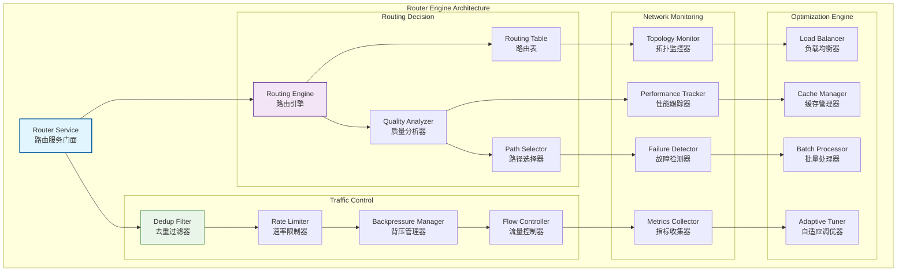
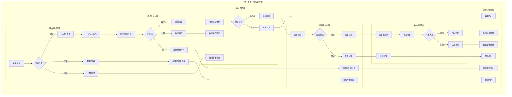
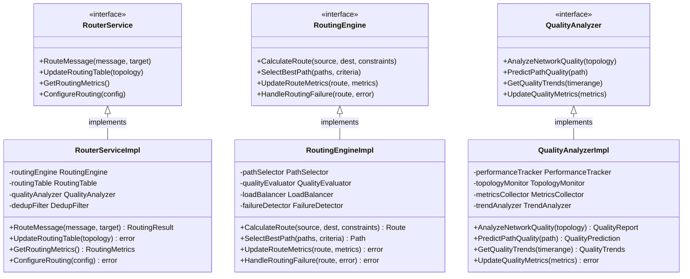

# Router - 路由引擎子域

【模块定位】
　　本目录实现WES网络层的智能消息路由与流量控制引擎，负责网络消息的智能路由决策、负载均衡分发和流量质量控制。为流式协议和订阅协议提供高效的消息路由和传输优化服务。

【设计原则】
- 智能路由优先：基于多维度指标的最优路径选择
- 流量控制保护：完善的去重、限流、背压管理机制
- 动态适应能力：实时感知网络变化并动态调整策略
- 高性能传输：优化的消息处理和路由算法
- 故障容错设计：网络故障时的快速恢复和重路由
- 质量保障机制：消息传输的质量监控和保障

【核心职责】
1. **智能路由决策**：基于网络状态的最优路径选择和负载均衡
2. **流量控制管理**：消息去重、速率限制和背压管理
3. **网络拓扑感知**：实时感知网络拓扑变化并调整路由策略
4. **故障检测恢复**：网络故障的快速检测和自动恢复机制
5. **消息质量保障**：消息传输的完整性和可靠性保证
6. **性能监控优化**：路由性能的监控分析和持续优化

【路由引擎设计理念：智能自适应路由模式】
本路由引擎采用"智能自适应路由"设计模式，通过实时网络状态感知和多维度路由决策，实现消息的最优路径传输。这种设计的核心思想是"智能路由，动态优化"。

## 路由引擎架构设计



**架构层次说明**：
- **Router Service**（蓝色）：路由服务门面，统一的路由管理入口
- **Routing Decision**（紫色）：路由决策层，智能路径选择和质量分析
- **Traffic Control**（绿色）：流量控制层，消息去重和流量管理
- **Network Monitoring**（橙色）：网络监控层，拓扑感知和性能跟踪
- **Optimization Engine**（灰色）：优化引擎层，负载均衡和自适应调优

**路由特点**：
- 智能决策：基于实时网络状态的智能路由决策
- 流量保护：完善的消息去重和流量控制机制
- 动态适应：网络变化的实时感知和策略调整
- 性能优化：多层次的性能优化和负载均衡

## 目录结构

| 文件 | 组件 | 职责描述 |
|------|------|----------|
| **service.go** | `RouterService` | 路由引擎服务的统一门面 |
| **engine.go** | `RoutingEngine` | 核心路由引擎和决策逻辑 |
| **table.go** | `RoutingTable` | 路由表管理和查找服务 |
| **quality.go** | `QualityAnalyzer` | 网络质量分析和评估 |
| **dedup_store.go** | `DedupFilter` | 消息去重存储和过滤 |
| **rate_limit.go** | `RateLimiter` | 速率限制和流量控制 |
| **errors.go** | `ErrorHandler` | 路由相关错误处理 |

## 核心组件能力

### 🎯 路由服务门面 (Router Service)
**服务能力**：
- 统一的路由决策和管理接口
- 内部组件的协调和调度
- 路由策略的配置和优化
- 路由状态的监控和诊断

### 🧠 路由引擎 (Routing Engine)
**决策能力**：
- 多维度网络指标的综合分析
- 最优路径的智能选择算法
- 动态路由策略的实时调整
- 路由决策的缓存和优化

### 📊 路由表 (Routing Table)
**管理功能**：
- 网络拓扑的实时维护和更新
- 路由信息的高效存储和检索
- 路由变更的增量更新机制
- 路由表的持久化和恢复

### 📈 质量分析器 (Quality Analyzer)
**分析能力**：
- 网络延迟、带宽、丢包率监控
- 节点可靠性和稳定性评估
- 链路质量的实时分析和预测
- 质量指标的历史趋势分析

### 🔄 去重过滤器 (Dedup Filter)
**去重机制**：
- 基于消息指纹的重复检测
- 高效的去重缓存和存储
- 循环消息的检测和阻断
- 去重策略的配置和优化

### ⚡ 速率限制器 (Rate Limiter)
**限流控制**：
- 多层次的速率限制策略
- 令牌桶和滑动窗口算法
- 动态限流阈值的调整
- 限流异常的监控和告警

### 🚨 错误处理器 (Error Handler)
**错误管理**：
- 路由错误的分类和处理
- 网络故障的快速检测和报告
- 错误恢复和重试机制
- 错误统计和趋势分析

## 智能路由算法

### 路径选择策略
- **多指标权重**：延迟、带宽、可靠性的加权评分
- **动态调整**：根据网络状态动态调整权重系数
- **历史学习**：基于历史数据的路径质量预测
- **实时优化**：实时网络状态的路径重新评估

### 负载均衡机制
- **轮询分发**：多路径的轮询负载均衡
- **加权分发**：基于路径质量的加权分发
- **最少连接**：选择连接数最少的路径
- **响应时间**：基于响应时间的动态分发

### 故障恢复策略
- **快速检测**：毫秒级的网络故障检测
- **自动切换**：故障路径的自动切换和恢复
- **备用路径**：预配置的备用路径和冗余机制
- **灰度恢复**：故障恢复后的灰度流量恢复

## 流量控制机制

### 消息去重策略
- **指纹算法**：基于内容哈希的消息指纹
- **时间窗口**：滑动时间窗口的去重机制
- **存储优化**：布隆过滤器和LRU缓存结合
- **分布式去重**：跨节点的分布式去重协调

### 速率限制算法
- **令牌桶算法**：平滑的流量控制和突发处理
- **滑动窗口**：精确的速率统计和限制
- **分层限制**：协议、节点、全局的多层限制
- **动态调整**：基于网络状态的动态限流调整

### 背压管理机制
- **队列监控**：实时的队列长度和延迟监控
- **背压信号**：下游拥塞的背压信号传递
- **流量调节**：上游流量的主动调节和控制
- **缓冲策略**：智能缓冲和丢弃策略

## 性能优化策略

### 路由优化
- **缓存机制**：路由决策结果的智能缓存
- **批量处理**：批量路由决策的性能优化
- **并行计算**：多核并行的路由计算
- **预计算**：常用路径的预计算和缓存

### 内存优化
- **数据结构**：高效的路由表和缓存数据结构
- **内存池**：路由对象的内存池管理
- **压缩存储**：路由信息的压缩存储
- **垃圾回收**：及时的内存回收和清理

### 网络优化
- **连接复用**：网络连接的高效复用
- **管道化**：请求的管道化处理
- **压缩传输**：消息的智能压缩传输
- **优先级队列**：基于优先级的消息调度

## 监控和诊断

### 性能指标
- **路由延迟**：路由决策的平均延迟和分布
- **吞吐量**：消息处理的吞吐量和峰值
- **成功率**：路由成功率和失败率统计
- **资源使用**：CPU、内存、网络资源使用

### 质量监控
- **网络质量**：延迟、带宽、丢包率监控
- **路径质量**：各路径的质量评分和排名
- **故障统计**：网络故障的类型和频率统计
- **恢复时间**：故障恢复的时间和效率

### 诊断工具
- **路由追踪**：消息路由路径的完整追踪
- **性能分析**：路由性能的瓶颈分析
- **异常检测**：异常路由行为的检测和报告
- **可视化工具**：网络拓扑和路由状态的可视化

---

## 📁 **模块组织结构**

【内部模块架构】

```
internal/core/network/router/
├── 🎯 service.go                       # 路由引擎服务的统一门面
├── 🧠 engine.go                        # 核心路由引擎和决策逻辑
├── 📊 table.go                         # 路由表管理和查找服务
├── 📈 quality.go                       # 网络质量分析和评估
├── 🔄 dedup_store.go                   # 消息去重存储和过滤
├── ⚡ rate_limit.go                     # 速率限制和流量控制
├── 🚨 errors.go                        # 路由相关错误处理
├── 📝 README.md                        # 本文档
└── 📊 tests/                           # 测试文件目录
    ├── service_test.go                 # 路由服务测试
    ├── engine_test.go                  # 路由引擎测试
    ├── table_test.go                   # 路由表管理测试
    ├── quality_test.go                 # 质量分析测试
    ├── dedup_test.go                   # 去重过滤测试
    ├── rate_limit_test.go              # 速率限制测试
    └── integration_test.go             # 集成测试套件
```

### **🎯 子模块职责分工**

| **文件模块** | **核心职责** | **对外接口** | **内部组件** | **复杂度** |
|-------------|-------------|-------------|-------------|-----------|
| `service.go` | 路由引擎服务的统一门面 | RouterService | 门面协调、生命周期管理、配置分发 | 高 |
| `engine.go` | 核心路由引擎和决策逻辑 | RoutingEngine | 决策算法、路径选择、实时调整 | 高 |
| `table.go` | 路由表管理和查找服务 | RoutingTable | 拓扑维护、信息存储、增量更新 | 中 |
| `quality.go` | 网络质量分析和评估 | QualityAnalyzer | 指标监控、链路分析、质量预测 | 中 |
| `dedup_store.go` | 消息去重存储和过滤 | DedupFilter | 重复检测、指纹缓存、循环阻断 | 中 |
| `rate_limit.go` | 速率限制和流量控制 | RateLimiter | 多层限制、动态调整、令牌桶 | 中 |
| `errors.go` | 路由相关错误处理 | ErrorHandler | 错误分类、故障检测、恢复策略 | 低 |
| `tests/` | 路由引擎功能测试验证 | 测试工具和框架 | 单元测试、集成测试、性能测试 | 中 |

---

## 🔄 **统一路由引擎实现**

【实现策略】

　　所有路由引擎组件均严格遵循**智能自适应路由**架构模式，确保消息的最优路径传输、动态负载均衡和故障快速恢复。



**关键实现要点：**

1. **智能路由决策**：
   - 多维度网络指标的实时分析和综合评估
   - 基于机器学习的路径质量预测和优化
   - 动态负载均衡和故障自动转移机制

2. **高效去重控制**：
   - 基于布隆过滤器和LRU缓存的高效去重
   - 分布式环境下的消息指纹同步机制
   - 循环路由的智能检测和阻断策略

3. **自适应流量控制**：
   - 多层次的速率限制和流量整形机制
   - 基于网络状态的动态限流阈值调整
   - 智能队列管理和背压控制策略

---

## 🏗️ **依赖注入架构**

【fx框架集成】

　　全面采用fx依赖注入框架，实现路由引擎组件间的松耦合和生命周期自动管理。

**依赖注入设计**：
- **核心引擎装配**：自动装配路由服务、引擎、路由表、质量分析器
- **控制系统注入**：统一注入去重过滤器、速率限制器、背压管理器
- **监控分析集成**：通过接口注入拓扑监控器、性能跟踪器、故障检测器
- **生命周期管理**：自动管理路由引擎的初始化、路由表构建和优雅关闭

**核心组件依赖关系**：
- RouterService依赖RoutingEngine、DedupFilter、RateLimiter
- RoutingEngine依赖RoutingTable、QualityAnalyzer、PathSelector
- QualityAnalyzer依赖PerformanceTracker、TopologyMonitor、MetricsCollector
- 所有组件共享FailureDetector、LoadBalancer、Logger、Config等基础服务

---

## 📊 **性能与监控**

【性能指标】

| **操作类型** | **目标延迟** | **吞吐量目标** | **成功率** | **监控方式** |
|-------------|-------------|---------------|-----------|------------|
| 路由决策 | < 1ms | > 50000 RPS | > 99.5% | 实时监控 |
| 路由表查找 | < 0.1ms | > 100000 QPS | > 99.9% | 高频监控 |
| 质量分析 | < 5ms | > 10000 APS | > 98% | 批量统计 |
| 消息去重 | < 0.5ms | > 80000 FPS | > 99% | 关键路径监控 |
| 速率限制 | < 0.2ms | > 200000 LPS | > 99.5% | 异步监控 |
| 路由更新 | < 10ms | > 5000 UPS | > 95% | 定时监控 |

**性能优化策略：**
- **决策优化**：路由决策缓存、预计算路径、并行分析
- **查找优化**：多级索引、哈希表优化、无锁查找
- **处理优化**：批量处理、异步更新、流水线处理
- **存储优化**：压缩存储、内存池化、智能缓存

---

## 🔗 **与公共接口的映射关系**

【接口实现映射】



**实现要点：**
- **接口契约**：严格遵循路由引擎接口定义和路由语义
- **错误处理**：分层的错误处理和路由异常恢复机制
- **日志记录**：详细的路由操作日志和性能指标记录
- **测试覆盖**：全面的路由引擎测试、决策测试和性能基准测试

---

## 🚀 **后续扩展规划**

【模块演进方向】

1. **路由算法增强**
   - 实现基于AI的智能路由决策算法
   - 添加量子计算加速的路径优化
   - 支持多目标优化的路由策略

2. **性能优化提升**
   - 实现GPU并行的路由计算加速
   - 优化大规模网络的路由表存储
   - 添加边缘计算的分布式路由

3. **可靠性增强**
   - 实现更强的故障预测和预防
   - 添加自愈网络的自动重路由
   - 增强网络分区的容错能力

4. **监控运维增强**
   - 提供实时的路由状态可视化面板
   - 实现智能的路由异常检测和告警
   - 添加自动化的路由性能调优系统

---

## 📋 **开发指南**

【路由引擎开发规范】

1. **新路由算法接入步骤**：
   - 定义路由算法接口和评估标准
   - 实现核心路由逻辑和优化策略
   - 添加性能监控和质量评估功能
   - 完成算法测试和路由引擎集成测试

2. **代码质量要求**：
   - 遵循Go语言最佳实践和项目编码规范
   - 实现完整的错误处理和异常恢复机制
   - 提供详细的代码注释和技术文档
   - 保证100%的核心功能测试覆盖率

3. **性能要求**：
   - 关键路径延迟指标必须达到设计目标
   - 内存使用效率和并发安全的数据访问
   - 实现合理的缓存策略和资源清理
   - 支持高频路由操作和决策需求

【参考文档】
- [实现层主文档](../README.md)
- [协议注册模块](../registry/README.md)
- [流式协议模块](../stream/README.md)
- [发布订阅模块](../pubsub/README.md)
- [WES架构设计文档](../../../../../docs/architecture/)

---

> 📝 **模板说明**：本README模板基于WES v0.0.1统一文档规范设计，使用时请根据具体模块需求替换相应的占位符内容，并确保所有章节都有实质性的技术内容。

> 🔄 **维护指南**：本文档应随着模块功能的演进及时更新，确保文档与代码实现的一致性。建议在每次重大功能变更后更新相应章节。

## 🔗 **相关文档**

- **实现层主文档**：`../README.md` - 网络实现层整体架构
- **协议注册模块**：`../registry/README.md` - 协议注册管理
- **流式协议模块**：`../stream/README.md` - 流式协议实现
- **发布订阅模块**：`../pubsub/README.md` - 发布订阅实现