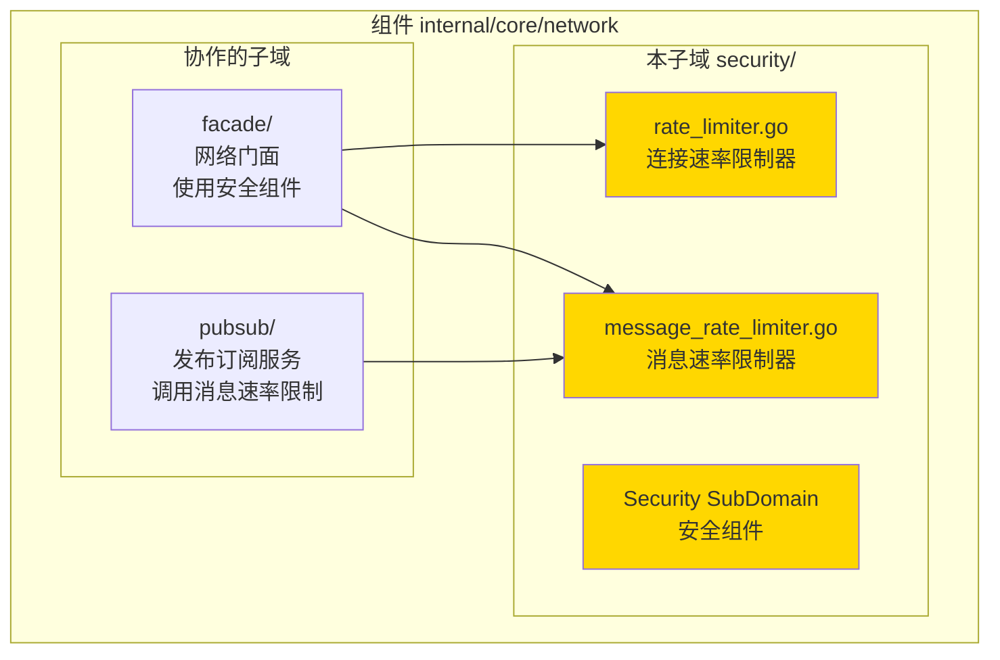
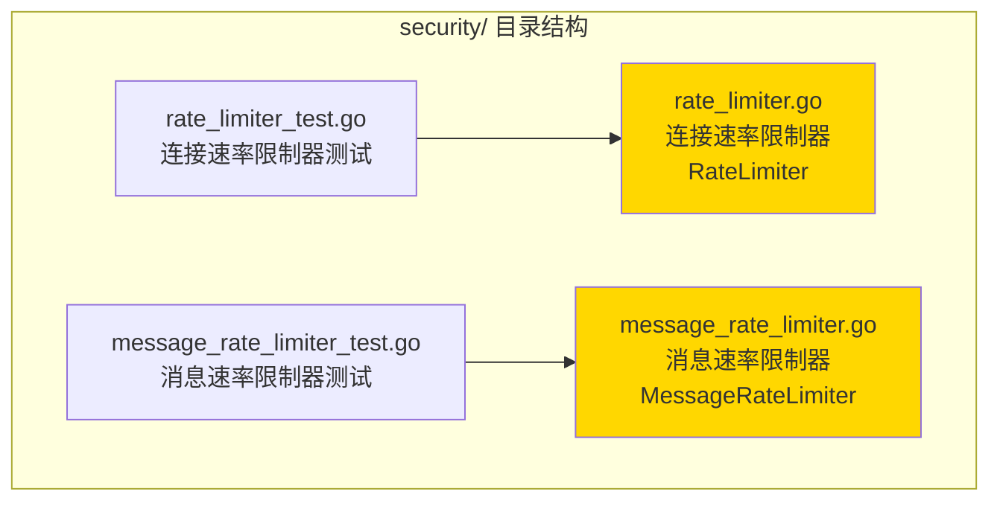

# Security - 安全组件子域

---

## 📌 版本信息

- **版本**：1.0
- **状态**：stable
- **最后更新**：2025-11-30
- **最后审核**：2025-11-30
- **所有者**：WES Network 开发组
- **适用范围**：WES Network 组件安全组件子域

---

## 🎯 子域定位

**路径**：`internal/core/network/security/`

**所属组件**：`network`

**核心职责**：提供网络安全组件，包括连接速率限制和消息速率限制，防止 DoS 攻击和资源滥用。

**在组件中的角色**：
- 网络安全的第一道防线
- 防止恶意节点的资源滥用
- 保护网络服务的稳定性
- 支持细粒度的速率控制策略

---

## 🏗️ 架构设计

### 在组件中的位置

> **说明**：展示此子域在组件内部的位置和协作关系



**位置说明**：

| 关系类型 | 目标 | 关系说明 |
|---------|------|---------|
| **被使用** | facade/ | Facade 使用 RateLimiter 和 MessageRateLimiter 进行速率限制 |
| **被使用** | pubsub/ | PubSub 服务调用 MessageRateLimiter 限制消息速率 |

---

### 内部组织

> **说明**：展示此子域内部的文件组织和类型关系



---

## 📁 目录结构

```
internal/core/network/security/
├── README.md                    # 本文档
├── rate_limiter.go             # 连接速率限制器
├── message_rate_limiter.go     # 消息速率限制器
├── rate_limiter_test.go        # 连接速率限制器测试
└── message_rate_limiter_test.go # 消息速率限制器测试
```

---

## 🔧 核心实现

### 实现文件 1：`rate_limiter.go`

**核心类型**：`RateLimiter`

**职责**：限制每个节点和 IP 的连接速率，防止连接洪水攻击

**关键字段**：

```go
type RateLimiter struct {
    maxConnectionsPerPeer int           // 每个节点的最大连接数
    maxConnectionsPerIP   int           // 每个 IP 的最大连接数
    connections           map[string]int // 连接计数（peerID -> count）
    ipConnections         map[string]int // IP 连接计数（IP -> count）
    mu                    sync.RWMutex   // 并发保护
}
```

**关键方法**：

| 方法名 | 职责 | 可见性 | 备注 |
|-------|------|-------|-----|
| `NewRateLimiter()` | 构造函数 | Public | 创建速率限制器实例 |
| `CheckConnection()` | 检查连接是否允许 | Public | 检查节点和 IP 连接数 |
| `RemoveConnection()` | 移除连接计数 | Public | 连接关闭时调用 |
| `Stop()` | 停止速率限制器 | Public | 清理资源 |

---

### 实现文件 2：`message_rate_limiter.go`

**核心类型**：`MessageRateLimiter`

**职责**：限制每个节点发送消息的速率，防止消息洪水攻击

**关键字段**：

```go
type MessageRateLimiter struct {
    maxMessagesPerSecond int                    // 每秒最大消息数
    windowSize          time.Duration          // 时间窗口大小
    messageCount        map[string][]time.Time // 消息时间戳记录（peerID -> timestamps）
    mu                  sync.RWMutex           // 并发保护
}
```

**关键方法**：

| 方法名 | 职责 | 可见性 | 备注 |
|-------|------|-------|-----|
| `NewMessageRateLimiter()` | 构造函数 | Public | 创建消息速率限制器实例 |
| `CheckMessage()` | 检查消息是否允许 | Public | 检查消息速率限制 |
| `Stop()` | 停止消息速率限制器 | Public | 清理资源 |

---

## 🔗 协作关系

### 依赖的接口

| 接口 | 来源 | 用途 |
|-----|------|-----|
| 无 | - | 独立组件，不依赖外部接口 |

### 被依赖关系

**被以下子域使用**：
- `facade/` - 使用 `RateLimiter` 和 `MessageRateLimiter` 进行速率限制
- `pubsub/` - 使用 `MessageRateLimiter` 限制消息速率

**示例**：

```go
// 在 facade/service.go 中使用
import "github.com/weisyn/v1/internal/core/network/security"

func NewFacade(...) *Facade {
    rateLimiter := netsec.NewRateLimiter(maxConnPerPeer, maxConnPerIP)
    msgRateLimiter := netsec.NewMessageRateLimiter(maxMsgPerSec, windowSize)
    
    return &Facade{
        rateLimiter:    rateLimiter,
        msgRateLimiter: msgRateLimiter,
        // ...
    }
}

// 在发布消息时检查速率限制
func (f *Facade) Publish(ctx context.Context, topic string, data []byte, opts *iface.PublishOptions) error {
    peerID := msg.ReceivedFrom.String()
    if err := f.msgRateLimiter.CheckMessage(peerID); err != nil {
        return err // 速率限制
    }
    // ... 继续发布
}
```

---

## 🧪 测试

### 测试覆盖

| 测试类型 | 文件 | 覆盖率目标 | 当前状态 |
|---------|------|-----------|---------|
| 单元测试 | `rate_limiter_test.go` | ≥ 80% | ✅ 已实现 |
| 单元测试 | `message_rate_limiter_test.go` | ≥ 80% | ✅ 已实现 |

---

## 📊 关键设计决策

### 决策 1：分离连接限制和消息限制

**问题**：连接限制和消息限制是否应该合并？

**方案**：分离为两个独立的组件 `RateLimiter` 和 `MessageRateLimiter`

**理由**：
- 职责单一：连接限制和消息限制是不同的安全策略
- 灵活配置：可以独立配置和调整各自的限制参数
- 易于测试：可以独立测试和验证

**权衡**：
- ✅ 优点：职责清晰、配置灵活、易于维护
- ⚠️ 缺点：需要维护两个组件（但代码量不大，可接受）

---

### 决策 2：滑动时间窗口算法

**问题**：如何实现消息速率限制？

**方案**：使用滑动时间窗口算法，记录每个节点的消息时间戳

**理由**：
- 精确控制：可以精确控制每秒的消息数量
- 内存可控：定期清理过期的时间戳，避免内存泄漏
- 性能良好：时间复杂度 O(n)，n 为时间窗口内的消息数

**权衡**：
- ✅ 优点：精确、可控、性能良好
- ⚠️ 缺点：需要定期清理（已在 `CheckMessage` 中实现）

---

## 🛡️ 安全特性

### 连接速率限制

- **防连接洪水**：限制每个节点和 IP 的最大连接数
- **资源保护**：防止恶意节点占用过多连接资源
- **自动清理**：连接关闭时自动清理计数

### 消息速率限制

- **防消息洪水**：限制每个节点每秒的最大消息数
- **DoS 防护**：防止恶意节点发送大量消息导致系统崩溃
- **滑动窗口**：使用滑动时间窗口算法精确控制速率

---

## ⚙️ 配置参数

### RateLimiter 配置

| 参数 | 类型 | 默认值 | 说明 |
|-----|------|--------|------|
| `maxConnectionsPerPeer` | int | 10 | 每个节点的最大连接数 |
| `maxConnectionsPerIP` | int | 50 | 每个 IP 的最大连接数 |

### MessageRateLimiter 配置

| 参数 | 类型 | 默认值 | 说明 |
|-----|------|--------|------|
| `maxMessagesPerSecond` | int | 100 | 每秒最大消息数 |
| `windowSize` | time.Duration | 1s | 时间窗口大小 |

---

## 📚 相关文档

- [组件总览](../README.md)
- [网络门面](../facade/README.md)
- [发布订阅服务](../pubsub/README.md)
- [代码组织规范](../../../../docs/system/standards/principles/code-organization.md)

---

## 📝 变更历史

| 版本 | 日期 | 变更内容 | 作者 |
|-----|------|---------|------|
| 1.0 | 2025-11-30 | 初始版本 | WES Network 开发组 |

---

## 🚧 待办事项

- [ ] 添加配置化的速率限制参数
- [ ] 添加速率限制的监控指标
- [ ] 支持动态调整速率限制参数
- [ ] 添加速率限制的日志记录

---

