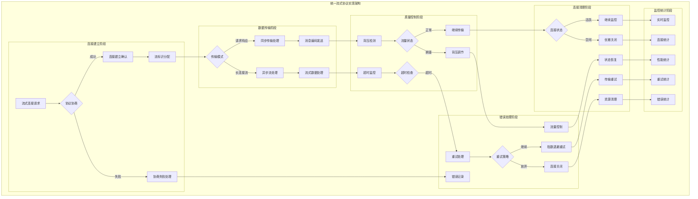
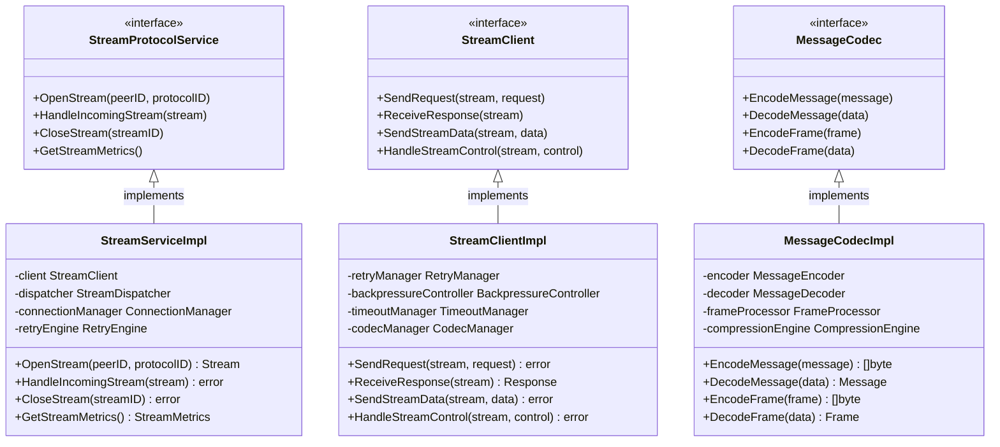

# Stream - 流式协议子域

【模块定位】
　　本目录实现WES网络层的流式协议通信引擎，提供高效的点对点流式通信能力。支持请求-响应模式、长连接流和多路复用，为区块链网络提供可靠的同步通信服务。

【设计原则】
- 流式通信优先：基于流的高效点对点通信模式
- 多模式支持：请求-响应、长连接流、多路复用的统一支持
- 传输质量保障：完善的超时、重试、背压管理机制
- 高性能传输：优化的数据传输和连接管理
- 可靠性优先：网络故障的自动检测和恢复
- 资源优化管理：连接复用和资源的高效利用

【核心职责】
1. **流式通信管理**：请求-响应和长连接流的完整实现
2. **传输质量保障**：超时控制、重试策略和背压管理
3. **连接生命周期**：流连接的建立、维护和优雅关闭
4. **多路复用支持**：单连接承载多个并发流的复用机制
5. **数据编解码**：消息的编解码和格式转换
6. **性能优化**：传输性能的监控和持续优化

【流式协议设计理念：高效点对点通信模式】
本流式协议模块采用"高效点对点通信"设计模式，通过流的抽象提供可靠的同步通信能力。这种设计的核心思想是"流式优先，可靠传输"。

## 流式协议架构设计

```mermaid
graph TB
    subgraph "Stream Protocol Architecture"
        STREAM_SERVICE["Stream Service<br/>流式服务门面"]
        
        subgraph "Stream Management"
            STREAM_CLIENT["Stream Client<br/>流式客户端"]
            STREAM_DISPATCHER["Stream Dispatcher<br/>流分发器"]
            CONNECTION_MANAGER["Connection Manager<br/>连接管理器"]
            MULTIPLEXER["Stream Multiplexer<br/>流复用器"]
        end
        
        subgraph "Quality Control"
            TIMEOUT_MANAGER["Timeout Manager<br/>超时管理器"]
            RETRY_ENGINE["Retry Engine<br/>重试引擎"]
            BACKPRESSURE_CONTROLLER["Backpressure Controller<br/>背压控制器"]
            FLOW_CONTROLLER["Flow Controller<br/>流量控制器"]
        end
        
        subgraph "Data Processing"
            MESSAGE_CODEC["Message Codec<br/>消息编解码器"]
            COMPRESSION_ENGINE["Compression Engine<br/>压缩引擎"]
            FRAME_PROCESSOR["Frame Processor<br/>帧处理器"]
            BUFFER_MANAGER["Buffer Manager<br/>缓冲管理器"]
        end
        
        subgraph "Stream Options"
            STREAM_OPTIONS["Stream Options<br/>流选项配置"]
            QUALITY_OPTIONS["Quality Options<br/>质量选项"]
            PERFORMANCE_OPTIONS["Performance Options<br/>性能选项"]
            SECURITY_OPTIONS["Security Options<br/>安全选项"]
        end
    end
    
    STREAM_SERVICE --> STREAM_CLIENT
    STREAM_SERVICE --> STREAM_DISPATCHER
    
    STREAM_CLIENT --> CONNECTION_MANAGER
    STREAM_DISPATCHER --> MULTIPLEXER
    
    CONNECTION_MANAGER --> TIMEOUT_MANAGER
    MULTIPLEXER --> RETRY_ENGINE
    TIMEOUT_MANAGER --> BACKPRESSURE_CONTROLLER
    RETRY_ENGINE --> FLOW_CONTROLLER
    
    BACKPRESSURE_CONTROLLER --> MESSAGE_CODEC
    FLOW_CONTROLLER --> COMPRESSION_ENGINE
    MESSAGE_CODEC --> FRAME_PROCESSOR
    COMPRESSION_ENGINE --> BUFFER_MANAGER
    
    FRAME_PROCESSOR --> STREAM_OPTIONS
    BUFFER_MANAGER --> QUALITY_OPTIONS
    STREAM_OPTIONS --> PERFORMANCE_OPTIONS
    QUALITY_OPTIONS --> SECURITY_OPTIONS
    
    style STREAM_SERVICE fill:#e1f5fe,stroke:#01579b,stroke-width:2px
    style STREAM_CLIENT fill:#f3e5f5,stroke:#4a148c
    style TIMEOUT_MANAGER fill:#e8f5e8,stroke:#2e7d32
```



**架构层次说明**：
- **Stream Service**（蓝色）：流式服务门面，统一的流通信入口
- **Stream Management**（紫色）：流管理层，负责流的生命周期和复用
- **Quality Control**（绿色）：质量控制层，保障传输质量和可靠性
- **Data Processing**（橙色）：数据处理层，消息编解码和缓冲管理
- **Stream Options**（灰色）：选项配置层，流的各种配置和优化

**流式特点**：
- 点对点通信：高效的端到端流式通信
- 多模式支持：同步异步、短连接长连接的统一支持
- 质量保障：完善的超时重试和背压控制
- 性能优化：连接复用和资源优化管理

## 目录结构

| 文件 | 组件 | 职责描述 |
|------|------|----------|
| **service.go** | `StreamService` | 流式协议服务的统一门面 |
| **client.go** | `StreamClient` | 流式客户端实现 |
| **dispatcher.go** | `StreamDispatcher` | 流消息分发器 |
| **codec.go** | `MessageCodec` | 消息编解码器 |
| **backpressure.go** | `BackpressureController` | 背压控制器 |
| **retry.go** | `RetryEngine` | 重试引擎 |
| **options.go** | `StreamOptions` | 流配置选项 |
| **errors.go** | `ErrorHandler` | 流相关错误处理 |

## 核心组件能力

### 🌊 流式服务门面 (Stream Service)
**服务能力**：
- 统一的流式通信接口实现
- 流生命周期的管理和协调
- 流配置的加载和优化
- 流状态的监控和诊断

### 📡 流式客户端 (Stream Client)
**客户端功能**：
- 请求-响应模式的客户端实现
- 长连接流的建立和维护
- 异步请求的管理和关联
- 客户端连接池的管理

### 🔀 流分发器 (Stream Dispatcher)
**分发能力**：
- 入站流消息的接收和分发
- 流处理器的注册和管理
- 并发流的调度和负载均衡
- 流响应的聚合和返回

### 🔄 消息编解码器 (Message Codec)
**编解码功能**：
- 多种消息格式的编解码支持
- 流消息的帧化和解帧
- 消息长度前缀的处理
- 消息完整性的验证

### ⏱️ 超时管理器 (Timeout Manager)
**超时控制**：
- 分层超时的管理和控制
- 连接超时、读写超时的精确控制
- 超时事件的检测和处理
- 超时策略的配置和优化

### 🔄 重试引擎 (Retry Engine)
**重试机制**：
- 指数退避的重试策略
- 抖动算法的随机化处理
- 断路器模式的故障快速检测
- 重试条件的智能判断

### 🌊 背压控制器 (Backpressure Controller)
**背压管理**：
- 下游拥塞的检测和响应
- 上游流量的主动调节
- 缓冲队列的动态管理
- 背压信号的传递和处理

### 🚨 错误处理器 (Error Handler)
**错误管理**：
- 流通信错误的分类和处理
- 网络错误的自动恢复机制
- 错误统计和趋势分析
- 错误监控和告警

## 流式通信模式

### 请求-响应模式
- **同步调用**：阻塞式的请求-响应通信
- **异步调用**：非阻塞的异步请求处理
- **批量请求**：批量请求的高效处理
- **请求关联**：请求和响应的自动关联

### 长连接流模式
- **双向流**：客户端和服务端的双向数据流
- **单向流**：单向的数据推送和订阅
- **流控制**：流的暂停、恢复和关闭控制
- **流状态**：流状态的实时监控和管理

### 多路复用模式
- **连接复用**：单连接承载多个并发流
- **流标识**：流的唯一标识和路由
- **流隔离**：不同流之间的隔离和保护
- **流调度**：多流的公平调度和优先级

## 传输质量保障

### 超时控制机制
- **连接超时**：TCP连接建立的超时控制
- **读写超时**：数据读写操作的超时控制
- **请求超时**：单个请求的端到端超时
- **流超时**：长连接流的空闲超时管理

### 重试策略算法
- **指数退避**：重试间隔的指数增长
- **最大重试**：重试次数的上限控制
- **抖动机制**：重试时间的随机化避免雷群
- **智能判断**：基于错误类型的重试决策

### 背压控制策略
- **队列监控**：发送和接收队列的实时监控
- **流量调节**：基于队列状态的流量调节
- **丢弃策略**：队列满时的智能丢弃策略
- **反馈机制**：下游压力的上游反馈

### 数据完整性保障
- **帧完整性**：消息帧的完整性检查
- **顺序保证**：消息顺序的严格保证
- **重复检测**：重复消息的检测和过滤
- **校验机制**：数据传输的校验和验证

## 性能优化策略

### 连接管理优化
- **连接池**：TCP连接的高效复用和管理
- **连接预热**：预建立连接减少延迟
- **连接监控**：连接状态的实时监控
- **连接清理**：空闲连接的及时清理

### 数据传输优化
- **零拷贝**：数据传输的零拷贝优化
- **批量传输**：小消息的批量合并传输
- **压缩传输**：大消息的智能压缩传输
- **管道化**：请求的管道化处理

### 内存管理优化
- **对象池**：频繁对象的对象池管理
- **缓冲复用**：缓冲区的复用和回收
- **内存预分配**：大对象的内存预分配
- **垃圾回收**：及时的内存回收和清理

### 并发处理优化
- **协程池**：协程的池化管理和调度
- **无锁设计**：关键路径的无锁数据结构
- **分片处理**：大数据的分片并行处理
- **异步处理**：非关键操作的异步处理

## 流配置和调优

### 超时配置
- **连接超时**：TCP连接建立的超时时间
- **读写超时**：数据读写的超时时间
- **请求超时**：请求处理的总体超时
- **心跳间隔**：长连接的心跳检测间隔

### 重试配置
- **重试次数**：最大重试次数的配置
- **退避因子**：指数退避的增长因子
- **最大间隔**：重试间隔的最大值
- **抖动范围**：随机抖动的范围配置

### 性能配置
- **并发限制**：并发连接和请求的限制
- **缓冲大小**：发送和接收缓冲的大小
- **批量大小**：批量操作的大小配置
- **压缩阈值**：启用压缩的大小阈值

---

## 📁 **模块组织结构**

【内部模块架构】

```
internal/core/network/stream/
├── 🌊 service.go                       # 流式服务门面和统一接口
├── 📡 client.go                        # 流式客户端实现和连接管理
├── 🔀 dispatcher.go                    # 流分发器和消息路由
├── 🔄 codec.go                         # 消息编解码器和格式转换
├── 🌊 backpressure.go                  # 背压控制器和流量管理
├── 🔄 retry.go                         # 重试引擎和故障恢复
├── ⚙️ options.go                       # 流配置选项和参数管理
├── 🚨 errors.go                        # 流相关错误处理和分类
├── 📝 README.md                        # 本文档
└── 📊 tests/                           # 测试文件目录
    ├── service_test.go                 # 流式服务测试
    ├── client_test.go                  # 客户端功能测试
    ├── dispatcher_test.go              # 消息分发测试
    ├── codec_test.go                   # 编解码器测试
    ├── backpressure_test.go            # 背压控制测试
    ├── retry_test.go                   # 重试机制测试
    └── integration_test.go             # 集成测试套件
```

### **🎯 子模块职责分工**

| **文件模块** | **核心职责** | **对外接口** | **内部组件** | **复杂度** |
|-------------|-------------|-------------|-------------|-----------|
| `service.go` | 流式服务门面和统一接口实现 | StreamService | 门面协调、生命周期管理、配置分发 | 高 |
| `client.go` | 流式客户端和连接管理 | StreamClient | 请求管理、连接池、异步处理 | 高 |
| `dispatcher.go` | 流分发器和消息路由 | StreamDispatcher | 消息分发、处理器管理、负载均衡 | 中 |
| `codec.go` | 消息编解码器和格式转换 | MessageCodec | 编解码、帧处理、格式验证 | 中 |
| `backpressure.go` | 背压控制器和流量管理 | BackpressureController | 队列监控、流量调节、背压信号 | 中 |
| `retry.go` | 重试引擎和故障恢复 | RetryEngine | 指数退避、断路器、智能重试 | 中 |
| `options.go` | 流配置选项和参数管理 | StreamOptions | 配置管理、参数验证、默认值 | 低 |
| `errors.go` | 流相关错误处理和分类 | ErrorHandler | 错误分类、恢复策略、监控统计 | 低 |
| `tests/` | 流式协议功能测试验证 | 测试工具和框架 | 单元测试、集成测试、性能测试 | 中 |

---

## 🔄 **统一流式协议实现**

【实现策略】

　　所有流式协议组件均严格遵循**高效点对点通信**架构模式，确保流的可靠传输、质量保障和性能优化。



**关键实现要点：**

1. **统一连接管理**：
   - 标准化的协议协商和连接建立流程
   - 高效的连接复用和生命周期管理
   - 智能的连接池和资源优化

2. **可靠传输保障**：
   - 完整的超时、重试、背压控制机制
   - 分层的错误检测和自动恢复策略
   - 端到端的数据完整性验证

3. **高性能优化**：
   - 零拷贝的数据传输和缓冲管理
   - 异步非阻塞的消息处理模式
   - 智能的批量处理和压缩优化

---

## 🏗️ **依赖注入架构**

【fx框架集成】

　　全面采用fx依赖注入框架，实现流式协议组件间的松耦合和生命周期自动管理。

**依赖注入设计**：
- **核心组件装配**：自动装配流式服务、客户端、分发器、编解码器
- **质量控制注入**：统一注入背压控制器、重试引擎、超时管理器
- **传输系统集成**：通过接口注入连接管理器、消息处理器、流复用器
- **生命周期管理**：自动管理流式服务的初始化、连接建立和优雅关闭

**核心组件依赖关系**：
- StreamService依赖StreamClient、StreamDispatcher、ConnectionManager
- StreamClient依赖RetryEngine、BackpressureController、TimeoutManager  
- StreamDispatcher依赖MessageCodec、HandlerManager、LoadBalancer
- 所有组件共享HostAdapter、Logger、Config、MetricsCollector等基础服务

---

## 📊 **性能与监控**

【性能指标】

| **操作类型** | **目标延迟** | **吞吐量目标** | **成功率** | **监控方式** |
|-------------|-------------|---------------|-----------|------------|
| 连接建立 | < 100ms | > 1000 CPS | > 95% | 实时监控 |
| 流式传输 | < 50ms | > 2000 RPS | > 99% | 批量统计 |
| 消息编解码 | < 1ms | > 10000 OPS | > 99.5% | 关键路径监控 |
| 背压控制 | < 5ms | > 5000 BPS | > 98% | 异步监控 |
| 重试处理 | < 200ms | > 500 RPS | > 90% | 故障监控 |
| 连接清理 | < 20ms | > 2000 CPS | > 97% | 定时监控 |

**性能优化策略：**
- **传输优化**：零拷贝数据传输、连接复用、批量处理
- **编解码优化**：流式编解码、压缩算法选择、缓冲优化
- **控制优化**：智能背压、自适应重试、动态超时调整
- **资源优化**：对象池化、内存复用、异步处理

---

## 🔗 **与公共接口的映射关系**

【接口实现映射】



**实现要点：**
- **接口契约**：严格遵循流式协议接口定义和传输语义
- **错误处理**：分层的错误处理和流式通信异常恢复机制
- **日志记录**：详细的流操作日志和传输性能指标记录
- **测试覆盖**：全面的流式协议测试、传输测试和性能基准测试

---

## 🚀 **后续扩展规划**

【模块演进方向】

1. **协议能力增强**
   - 支持更多流式协议类型（HTTP/2、gRPC等）
   - 实现多协议版本的动态协商和兼容
   - 添加自定义协议扩展机制

2. **传输性能提升**
   - 实现真正的零拷贝数据传输
   - 优化高并发场景的连接管理
   - 添加GPU加速的编解码处理

3. **可靠性增强**
   - 实现更智能的故障检测和恢复
   - 添加网络分区容错机制
   - 增强连接质量评估和自动切换

4. **监控运维增强**
   - 提供实时的流式传输监控面板
   - 实现智能的传输性能告警
   - 添加自动化的流式协议诊断工具

---

## 📋 **开发指南**

【流式协议开发规范】

1. **新组件接入步骤**：
   - 定义流式协议组件接口和传输契约
   - 实现核心流管理逻辑和传输功能
   - 添加质量控制和错误处理功能
   - 完成组件测试和流式协议集成测试

2. **代码质量要求**：
   - 遵循Go语言最佳实践和项目编码规范
   - 实现完整的错误处理和异常恢复机制
   - 提供详细的代码注释和技术文档
   - 保证100%的核心功能测试覆盖率

3. **性能要求**：
   - 关键路径延迟指标必须达到设计目标
   - 内存使用效率和并发安全的数据访问
   - 实现合理的缓存策略和资源清理
   - 支持高频流式操作和传输需求

【参考文档】
- [实现层主文档](../README.md)
- [协议注册模块](../registry/README.md)
- [路由引擎模块](../router/README.md)
- [发布订阅模块](../pubsub/README.md)
- [WES架构设计文档](../../../../../docs/architecture/)

---

> 📝 **模板说明**：本README模板基于WES v0.0.1统一文档规范设计，使用时请根据具体模块需求替换相应的占位符内容，并确保所有章节都有实质性的技术内容。

> 🔄 **维护指南**：本文档应随着模块功能的演进及时更新，确保文档与代码实现的一致性。建议在每次重大功能变更后更新相应章节。

## 🔗 **相关文档**