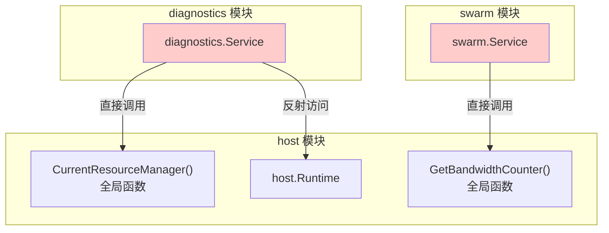
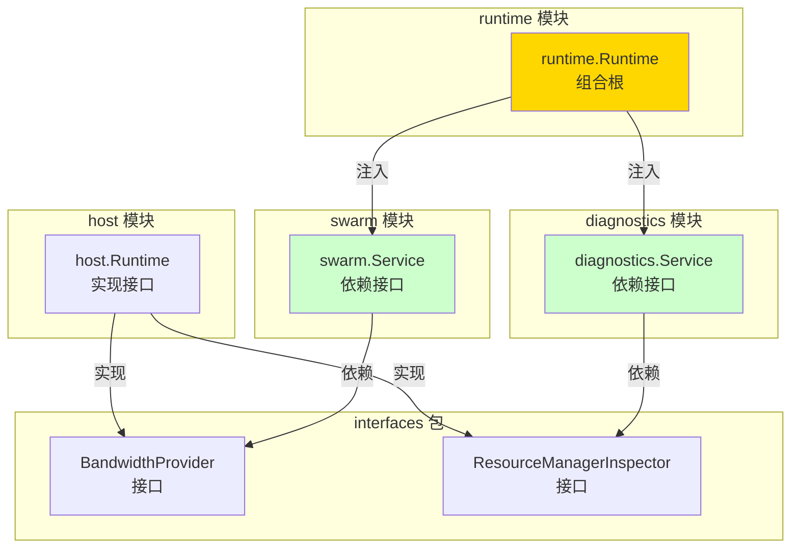

# P2P 模块架构重构记录

---

## 📌 重构概述

**日期**：2025-01-XX  
**目标**：修复违背 `_dev` 架构设计的缺陷，实现子模块之间通过 `interfaces` 内部接口协作，而非直接依赖实现包。

---

## 🎯 问题分析

### 发现的架构缺陷

在 `internal/core/p2p` 模块中，存在以下违背 `_dev` 架构设计的问题：

1. **`swarm` 直接依赖 `host` 包**
   - `swarm/service.go` 直接 import `internal/core/p2p/host`
   - 通过 `host.GetBandwidthCounter()` 获取共享带宽计数器
   - 违背了"子模块之间通过接口协作"的原则

2. **`diagnostics` 直接依赖 `host` 包**
   - `diagnostics/service.go` 直接 import `internal/core/p2p/host`
   - 通过 `host.CurrentResourceManager()` / `CurrentRcmgrLimits()` 获取 ResourceManager 信息
   - 使用反射访问未导出字段，进一步加剧耦合

### 架构原则违背

根据 `_dev` 架构设计和顶层 README 中的原则：

- **接口分层**：`pkg/interfaces/p2p` 公共接口 → `internal/core/p2p/interfaces` 内部接口 → `runtime.Runtime` 实现
- **子模块解耦**：子模块之间应该通过 `interfaces` 定义的内部接口协作，而非直接 import 实现包
- **组合根模式**：只有 `runtime` 作为组合根可以同时看到多个实现包，负责装配接口实现

---

## 🔧 重构方案

### 1. 扩展内部接口层

在 `internal/core/p2p/interfaces/p2p.go` 中添加两个内部接口：

```go
// BandwidthProvider 提供带宽计数器的内部接口
type BandwidthProvider interface {
    BandwidthReporter() metrics.Reporter
}

// ResourceManagerInspector 提供 ResourceManager 限额视图的内部接口
type ResourceManagerInspector interface {
    ResourceManagerLimits() map[string]interface{}
}
```

### 2. host.Runtime 实现接口

在 `internal/core/p2p/host/runtime.go` 中：

- 实现 `BandwidthProvider` 接口：`BandwidthReporter()` 返回共享带宽计数器
- 实现 `ResourceManagerInspector` 接口：`ResourceManagerLimits()` 封装 ResourceManager 反射逻辑

### 3. 迁移 swarm

**修改前**：
```go
import p2phost "github.com/weisyn/v1/internal/core/p2p/host"

func NewService(host lphost.Host) *Service {
    return &Service{
        host:       host,
        bwReporter: p2phost.GetBandwidthCounter(),
    }
}
```

**修改后**：
```go
import "github.com/weisyn/v1/internal/core/p2p/interfaces"

func NewService(host lphost.Host, bwProvider interfaces.BandwidthProvider) *Service {
    var reporter metrics.Reporter
    if bwProvider != nil {
        reporter = bwProvider.BandwidthReporter()
    }
    return &Service{
        host:       host,
        bwReporter: reporter,
    }
}
```

### 4. 迁移 diagnostics

**修改前**：
```go
import p2phostpkg "github.com/weisyn/v1/internal/core/p2p/host"

func (s *Service) getResourceManagerLimits() string {
    rm := p2phostpkg.CurrentResourceManager()
    limits, hasLimits := p2phostpkg.CurrentRcmgrLimits()
    // ... 使用反射访问未导出字段 ...
}
```

**修改后**：
```go
import "github.com/weisyn/v1/internal/core/p2p/interfaces"

type Service struct {
    // ...
    rmInspector interfaces.ResourceManagerInspector
}

func (s *Service) SetResourceManagerInspector(inspector interfaces.ResourceManagerInspector) {
    s.rmInspector = inspector
}

func (s *Service) getResourceManagerLimits() string {
    if s.rmInspector == nil {
        return "{}"
    }
    data := s.rmInspector.ResourceManagerLimits()
    // ... 直接序列化为 JSON ...
}
```

### 5. 更新 runtime 装配逻辑

在 `runtime/runtime.go` 的 `Start()` 方法中：

```go
// Swarm：注入 BandwidthProvider
var bwProvider interfaces.BandwidthProvider
if r.hostRuntime != nil && r.hostRuntime.Runtime != nil {
    bwProvider = r.hostRuntime.Runtime
}
r.swarm = swarm.NewService(r.host, bwProvider)

// Diagnostics：注入 ResourceManagerInspector
if r.hostRuntime != nil && r.hostRuntime.Runtime != nil {
    diagnosticsSvc.SetResourceManagerInspector(r.hostRuntime.Runtime)
}
```

---

## ✅ 重构效果

### 架构改进

1. **接口分层完善**
   - `internal/core/p2p/interfaces` 真正承担了"内部协作契约"的职责
   - 定义了 `BandwidthProvider` 和 `ResourceManagerInspector` 两个内部接口

2. **子模块解耦**
   - ✅ `swarm` 不再直接 import `internal/core/p2p/host`
   - ✅ `diagnostics` 不再直接 import `internal/core/p2p/host`
   - ✅ 子模块之间通过 `interfaces` 定义的接口协作

3. **组合根职责清晰**
   - `runtime` 作为唯一的组合根，负责装配接口实现
   - 子模块不再自己去找全局单例，由 `runtime` 统一注入

### 代码变更统计

| 文件 | 变更类型 | 说明 |
|-----|---------|-----|
| `interfaces/p2p.go` | 新增 | 添加 `BandwidthProvider` 和 `ResourceManagerInspector` 接口 |
| `host/runtime.go` | 修改 | 实现两个内部接口，封装 ResourceManager 反射逻辑 |
| `swarm/service.go` | 修改 | 移除对 `host` 包的 import，改为依赖 `interfaces.BandwidthProvider` |
| `diagnostics/service.go` | 修改 | 移除对 `host` 包的 import，改为依赖 `interfaces.ResourceManagerInspector` |
| `runtime/runtime.go` | 修改 | 更新装配逻辑，注入接口实现 |

---

## 📊 架构对比

### 重构前



**问题**：
- ❌ 子模块直接依赖实现包
- ❌ 全局单例 + 反射访问
- ❌ 违背接口分层原则

### 重构后



**改进**：
- ✅ 子模块通过接口协作
- ✅ 组合根负责装配
- ✅ 符合接口分层原则

---

## 🔍 验证结果

### 编译验证

```bash
$ go build ./internal/core/p2p/...
# 编译成功，无错误
```

### 依赖关系验证

**重构前**：
- `swarm` → `host`（直接依赖）
- `diagnostics` → `host`（直接依赖）

**重构后**：
- `swarm` → `interfaces`（接口依赖）
- `diagnostics` → `interfaces`（接口依赖）
- `runtime` → `host` + `swarm` + `diagnostics`（组合根，允许）

---

## 📚 相关文档

- [P2P 模块顶层 README](./README.md) - 架构设计原则
- [Interfaces 模块文档](./interfaces/README.md) - 内部接口定义
- [Swarm 模块文档](./swarm/README.md) - Swarm 实现
- [Diagnostics 模块文档](./diagnostics/README.md) - Diagnostics 实现
- [Runtime 模块文档](./runtime/README.md) - Runtime 组合器

---

## 📝 后续工作

- [ ] 考虑是否需要为 `discovery` ↔ `routing` 的 DHT 依赖也定义内部接口
- [ ] 评估是否还有其他子模块间的直接依赖需要重构
- [ ] 完善单元测试，验证接口注入的正确性

---

## 🎯 总结

本次重构成功修复了违背 `_dev` 架构设计的缺陷：

1. ✅ **接口分层完善**：`interfaces` 包真正承担了内部协作契约的职责
2. ✅ **子模块解耦**：`swarm` 和 `diagnostics` 不再直接依赖 `host` 包
3. ✅ **组合根模式**：`runtime` 作为唯一组合根，负责装配接口实现
4. ✅ **符合架构原则**：完全符合 `_dev` 中定义的"接口分层"和"模块内解耦"原则

重构后的架构更加清晰、可维护，便于未来扩展和测试。

