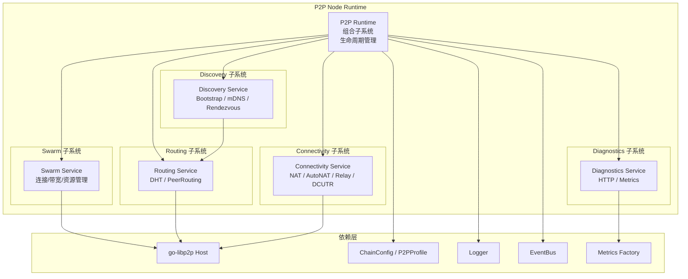

# P2P 节点运行时模块 (P2P Node Runtime Module)

---

## 📌 版本信息

- **版本**：1.0
- **状态**：stable
- **最后更新**：2025-01-XX
- **所有者**：P2P 模块团队
- **适用范围**：WES 区块链系统 P2P 网络层

---

## 🎯 模块定位

**P2P 节点运行时模块（P2P Node Runtime Module）** 是 WES 区块链系统在网络层的"通用 P2P 引擎"，对标 IPFS Kubo 中 libp2p + Swarm + DHT + Discovery 子系统。它为上层 `network`、共识、运维控制台等模块，提供统一的 P2P 能力，包括：

- libp2p Host 装配与 Swarm 连接管理  
- DHT / PeerRouting 路由能力  
- 多种 Peer 发现机制（Bootstrap、mDNS、Rendezvous）  
- NAT / AutoNAT / Relay / DCUTR 等连通性增强能力  
- 节点级诊断与指标导出（HTTP / Prometheus）

并通过统一的 `p2p.Service` 接口和 Fx Module 注入到 WES 七层架构中。

## 📐 设计原则

- **职责收缩**：只负责 P2P 能力，不夹带业务语义（区块/交易/状态等一律在 `network` 模块之上）。  

- **Profile 驱动**：通过链级配置（公有链/联盟链/私有链）+ P2P Profile 组合决策 DHT 模式、连通性策略。  

- **接口分层**：`pkg/interfaces/p2p` 公共接口 → `internal/core/p2p/interfaces` 内部接口 → `runtime.Runtime` 实现。  

- **模块内解耦**：Swarm / Routing / Discovery / Connectivity / Diagnostics 子模块职责清晰，彼此通过接口协作。  

- **可观测性优先**：所有核心行为（连接、路由、发现、连通性）都能通过 Diagnostics 子模块观测与调试。

- **配置单一来源**：所有用户可见/可调的 P2P 配置项和默认值，必须且仅能通过 `internal/config/p2p.Options` 定义和管理。`internal/core/p2p` 层不得重复定义用户级默认值，不得从其他配置源（如 `internal/config/node`）直接读取业务配置。系统级标识（如网络 namespace、链 ID）可通过 `config.Provider` 获取，但 P2P 行为参数必须统一归口到 `p2p.Options`。

- **无兼容分支**：P2P 模块是重构后的网络基础，应以确定性、系统性的实现为主。禁止在 `internal/core/p2p` 中为"向后兼容旧 Node 模块"而添加近似逻辑、降级路径或兼容性分支。对旧 Node 模块的使用仅限于**实现层复用**（如复用 `host.Runtime` 的 Host 构建逻辑），配置与行为决策必须以 `p2p.Options` 为准，映射关系必须明确、单向、可预测。

## 🔧 核心职责

### P2P Runtime 管理

- 启动/停止整个 P2P 节点引擎。

- 组装并持有所有子系统实例（Host/Swarm/Routing/Discovery/Connectivity/Diagnostics）。

### Swarm 管理

- 维护所有活跃连接、流、带宽统计。

- 提供 Dial、Peer 与连接信息视图，以及 Swarm 级策略（HighWater/LowWater、ResourceManager）。

### Routing 管理

- 基于 `go-libp2p-kad-dht` 提供 PeerRouting 能力。

- 支持多种 DHT 模式（`client/server/auto/lan`），可按链类型调优。

### Discovery 管理

- 统一调度 Bootstrap / mDNS / Rendezvous 等发现插件。

- 当 Peers 数低于阈值时，主动触发发现。

### Connectivity 管理

- NAT PortMap、AutoNAT、Relay Client/Service、DCUTR 打洞等能力的开关与状态监控。

- 维护 Reachability 状态（`Unknown/Public/Private`），供上层决策。

### Diagnostics & Metrics

- 暴露 `/debug/p2p/*` HTTP 端点。

- 向 Prometheus 导出 Swarm、Routing、Discovery、Connectivity 指标。

## 🏗️ 架构组件



## 📁 目录结构说明

```text
internal/core/p2p/
├── module.go               # Fx 模块定义：输入依赖、输出 p2p.Service
├── README.md               # 顶层架构 + 接口 + 配置文档
├── interfaces/
│   └── p2p.go              # InternalP2P 接口（继承 pkg/interfaces/.../p2p.Service）
├── runtime/
│   ├── runtime.go          # Runtime 组合各子系统，实现 InternalP2P
│   └── lifecycle.go        # 与 Fx 整合的 Start/Stop 细节
├── swarm/
│   ├── service.go          # Swarm 实现（封装 Host.Network + ResourceManager）
│   └── README.md           # [Swarm 子系统文档](./swarm/README.md)
├── routing/
│   ├── service.go          # DHT / PeerRouting 实现
│   └── README.md           # [Routing 子系统文档](./routing/README.md)
├── discovery/
│   ├── service.go          # 统一调度 mdns/bootstrap/... 插件
│   ├── backoff.go          # 退避策略实现
│   └── README.md           # [Discovery 子系统文档](./discovery/README.md)
├── connectivity/
│   ├── service.go          # AutoNAT / NAT / Relay / DCUTR
│   ├── manager.go          # Advanced Connectivity Manager
│   └── README.md           # [Connectivity 子系统文档](./connectivity/README.md)
├── diagnostics/
│   ├── service.go          # HTTP 端点 + metrics 注册
│   ├── MONITORING.md       # 监控文档（运维视角）
│   ├── VERIFICATION.md     # 验证文档（开发/测试视角）
│   └── README.md           # [Diagnostics 子系统文档](./diagnostics/README.md)
├── host/
│   ├── builder.go          # Host 构建入口
│   ├── runtime.go          # Host Runtime 实现
│   ├── options.go          # 选项构建逻辑
│   ├── network_notifiee.go # 网络事件通知器
│   └── README.md           # [Host 模块文档](./host/README.md)
├── runtime/
│   ├── runtime.go          # Runtime 组合各子系统，实现 InternalP2P
│   └── README.md           # [Runtime 模块文档](./runtime/README.md)
├── interfaces/
│   ├── p2p.go              # InternalP2P 接口（继承 pkg/interfaces/.../p2p.Service）
│   └── README.md           # [Interfaces 模块文档](./interfaces/README.md)
├── service/
│   ├── network.go          # NetworkService 适配器实现
│   └── README.md           # [Service 模块文档](./service/README.md)
└── config/                 # 注意：config 目录在 internal/config/p2p，不在本目录
    └── (配置模块文档见 internal/config/p2p/README.md)
```

## 🔗 接口设计

### 公共接口层：`pkg/interfaces/p2p`

对外唯一暴露的接口对象，供 `network`、BaaS 运维等使用：

- **Service**：P2P 节点运行时统一接口
  - `Host()`：返回底层 libp2p Host
  - `Swarm()`：返回 Swarm 服务
  - `Routing()`：返回 Routing 服务
  - `Discovery()`：返回 Discovery 服务
  - `Connectivity()`：返回 Connectivity 服务
  - `Diagnostics()`：返回 Diagnostics 服务

- **Swarm**：连接管理视图 + Dial 能力
  - `Peers()`：当前连接的 Peer 列表
  - `Connections()`：当前连接信息
  - `Stats()`：Swarm 统计信息
  - `Dial(ctx, info)`：连接到指定 Peer

- **Routing**：PeerRouting 能力
  - `FindPeer(ctx, id)`：查找指定 PeerID 的地址信息
  - `FindClosestPeers(ctx, key, count)`：查找最接近指定 key 的 Peer 列表
  - `Bootstrap(ctx)`：执行 DHT Bootstrap
  - `Mode()`：返回当前 DHT 模式

- **Discovery**：发现控制
  - `Start(ctx)`：启动发现服务
  - `Stop(ctx)`：停止发现服务
  - `Trigger(reason)`：触发一次发现

- **Connectivity**：连通性控制与状态
  - `Reachability()`：返回当前可达性状态
  - `Profile()`：返回当前 P2P Profile

- **Diagnostics**：诊断与指标
  - `HTTPAddr()`：返回诊断 HTTP 服务地址

### 内部接口层：`internal/core/p2p/interfaces`

- **InternalP2P**：内部 P2P 接口，嵌入公共接口，预留内部扩展点

## ⚙️ 配置管理

### 配置单一来源原则

**核心约束**：所有 P2P 相关的配置项和默认值，必须且仅能通过 `internal/config/p2p.Options` 定义和管理。

#### 配置归口路径

```
config.Provider (ChainConfig)
    ↓
internal/config/p2p.NewFromChainConfig()
    ↓
p2p.Options (统一配置对象)
    ↓
internal/core/p2p/* (消费配置，不定义配置)
```

#### 禁止的做法

- ❌ 在 `internal/core/p2p/*` 中硬编码用户级默认值（如端口号、超时时间、重试次数等）
- ❌ 在 `internal/core/p2p/*` 中从 `internal/config/node` 直接读取配置
- ❌ 在 `internal/core/p2p/*` 中定义"兜底默认值"或"兼容性默认值"
- ❌ 在多个地方重复定义相同的默认值

#### 允许的做法

- ✅ 在 `internal/config/p2p.applyDefaults()` 中统一设置所有默认值
- ✅ 在 `internal/core/p2p/*` 中读取 `*p2pcfg.Options` 并根据其值行为
- ✅ 在 `internal/core/p2p/*` 中使用算法级常量（如 Backoff 参数、HTTP 服务超时等内部实现细节）
- ✅ 通过 `config.Provider` 获取系统级标识（如网络 namespace、链 ID）

#### 配置映射到旧实现

**注意**：`internal/core/p2p` 模块已经完全迁移到直接使用 `p2pcfg.Options`，不再依赖 `nodeconfig.NodeOptions` 或旧的 `node` 实现。所有 Host 构建、Connectivity 管理等逻辑都已迁移到 `p2p` 模块自身实现。

### 无兼容分支原则

**核心约束**：P2P 模块是重构后的网络基础，应以确定性、系统性的实现为主，禁止为"向后兼容旧 Node 模块"而添加近似逻辑或降级路径。

#### 禁止的做法

- ❌ 添加"如果没有新配置，则回退到旧配置"的兼容逻辑
- ❌ 使用"近似值"或"猜测值"代替真实状态（如用 `EnableRelay` 近似 `EnableAutoRelay`）
- ❌ 添加"向后兼容"的注释和 fallback 路径
- ❌ 为了兼容旧行为而保留不确定的配置来源

#### 允许的做法

- ✅ 使用真实的状态和配置（如 AutoNAT 真实状态、明确的 AutoRelay 配置）
- ✅ 在配置缺失时使用 `p2p.Options` 中定义的默认值
- ✅ 复用旧 Node 模块的实现层代码（如 Host 构建、Relay 选项工厂）
- ✅ 通过明确的接口和事件系统实现模块间协作（如 Diagnostics 回调、EventBus 事件）

#### 实现层复用 vs 配置兼容

- **实现层复用**（允许）：复用 `host.Runtime` 的 Host 构建逻辑、复用 `AdvancedConnectivityManager` 的 Relay 管理能力
- **配置兼容**（禁止）：为了兼容旧配置格式而添加转换逻辑、为了兼容旧行为而添加近似判断

### 链模式配置规范（Profile / DHT / Rendezvous / 水位 / 资源）

完整规则详见 `internal/config/p2p/README.md`，这里给出对 Runtime 行为有直接影响的摘要：

- **链模式 → Profile / 私网**
  - `public`：`Profile=server`（默认），`PrivateNetwork=false`
  - `consortium`：`Profile=server`（默认），`PrivateNetwork=true`
  - `private`：`Profile=lan`（默认），`PrivateNetwork=true`

- **链模式 → DHT 模式**
  - `public`：若启用 DHT 且 `DHTMode` 为空/auto，则强制为 `server`
  - `consortium`：若启用 DHT 且 `DHTMode` 为空，则默认 `client`
  - `private`：若启用 DHT 且 `DHTMode` 为空/auto，则强制为 `lan`

- **DiscoveryNamespace（Rendezvous 命名）**
  - 若 `NodeOptions.Discovery.RendezvousNamespace` 为非空且不等于 `"weisyn"`：直接复用
  - 否则：统一使用 `"weisyn-" + GetNetworkNamespace()`，例如 `weisyn-mainnet` / `weisyn-testnet`

- **连接水位与资源默认值**
  - `MinPeers=8`、`MaxPeers=50`
  - `LowWater=10`、`HighWater=25`、`GracePeriod=20s`
  - `MemoryLimitMB=512`、`MaxFileDescriptors=4096`

这些规则都在 `internal/config/p2p.NewFromChainConfig` / `applyDefaults` 中集中实现，`internal/core/p2p/*` 只读 `p2p.Options` 的结果，不再自行推导。

### 链类型与 Profile 映射（简版）

P2P 配置通过 `internal/config/p2p` 模块从链配置（`config.Provider`）生成：

- **公有链（public）**
  - 默认 `Profile = server`
  - `DHTMode = server`
  - `PrivateNetwork = false`
  - RelayClient + AutoNAT 开启

- **联盟链（consortium）**
  - 默认 `Profile = server`
  - `PrivateNetwork = true`（需要 PSK）
  - DHT 可选（建议 `client` 或 `auto`），更依赖静态 bootstrap

- **私有链（private）**
  - 默认 `Profile = lan`
  - 强 mDNS / LAN DHT（`mode=lan`）
  - 多数情况下不启 RelayService

### 配置示例

```yaml
node:
  listen_addresses:
    - "/ip4/0.0.0.0/tcp/28683"
    - "/ip4/0.0.0.0/udp/28683/quic-v1"
  bootstrap_peers:
    - "/ip4/bootstrap1.example.com/tcp/28683/p2p/12D3Koo..."
  enable_dht: true
  enable_mdns: false
  enable_dcutr: true
```

## 🔄 Fx Module 集成

### 输入依赖

```go
type ModuleInput struct {
    ConfigProvider config.Provider
    Logger         logiface.Logger      `optional:"true"`
    EventBus       event.EventBus       `optional:"true"`
    MetricsFactory metricsiface.Factory `optional:"true"`
}
```

### 输出依赖

```go
type ModuleOutput struct {
    P2PService p2pi.Service `name:"p2p_service"`
}
```

### 使用方式

```go
fx.Module("app",
    p2p.Module(),
    // ... 其他模块
)
```

上层模块（如 `network`）通过依赖注入获取 `p2p_service`：

```go
type NetworkModuleInput struct {
    fx.In
    P2P p2pi.Service `name:"p2p_service"`
    // ...
}
```

## 🔄 生命周期管理

P2P Runtime 通过 Fx Lifecycle 管理启动和停止：

1. **OnStart**：
   - 创建 libp2p Host
   - 初始化 Swarm / Routing / Discovery / Connectivity / Diagnostics
   - 启动 Discovery 服务
   - 启动 Diagnostics HTTP 服务（如果启用）

2. **OnStop**：
   - 停止 Discovery 服务
   - 停止 Diagnostics HTTP 服务
   - 关闭 libp2p Host
   - 清理所有资源

## 🔗 与其他模块的协作

### 与 `network` 模块

- `network` 模块依赖 `p2p_service`
- 使用 `P2P.Host()` 注册流式协议和 GossipSub
- 使用 `P2P.Swarm().Peers()` 做诊断或限流
- 需要 PeerRouting 时使用 `P2P.Routing().FindPeer()`

### 与 BaaS / Explorer

- 通过 `p2p_service` 获取网络诊断信息
- 使用 `P2P.Diagnostics().HTTPAddr()` 访问诊断端点
- 通过 `P2P.Swarm().Stats()` 获取连接统计

## 📊 对标 Kubo

本模块设计对标 IPFS Kubo 的网络子系统：

- **Swarm**：对标 Kubo Swarm，管理连接、流、带宽
- **Routing**：对标 Kubo Routing，基于 DHT 的 Peer 路由
- **Discovery**：对标 Kubo Discovery，统一调度多种发现机制
- **Connectivity**：对标 Kubo Connectivity，NAT / Relay / DCUTR 等
- **Diagnostics**：对标 Kubo 诊断接口，HTTP + Prometheus 指标

## 📚 子模块文档

P2P 模块各子系统的详细文档：

- [**Swarm**](./swarm/README.md) - 连接管理子系统
- [**Routing**](./routing/README.md) - DHT 路由子系统
- [**Discovery**](./discovery/README.md) - Peer 发现子系统
- [**Connectivity**](./connectivity/README.md) - 连通性增强子系统
- [**Diagnostics**](./diagnostics/README.md) - 诊断与指标子系统
- [**Host**](./host/README.md) - libp2p Host 构建模块
- [**Runtime**](./runtime/README.md) - P2P 运行时组合器
- [**Interfaces**](./interfaces/README.md) - P2P 内部接口层
- [**Service**](./service/README.md) - 网络服务适配器

## 📝 实施状态

详细的实施状态和后续工作请参考：
- [**IMPLEMENTATION_STATUS.md**](./IMPLEMENTATION_STATUS.md) - 实施状态文档

## 🚧 后续工作

- [x] 实现完整的 libp2p Host 构建逻辑
- [x] 实现 Swarm 子系统的连接管理和统计
- [x] 实现 Routing 子系统的 DHT 集成
- [x] 实现 Discovery 子系统的多种发现机制
- [x] 实现 Connectivity 子系统的连通性增强
- [x] 实现 Diagnostics 子系统的 HTTP 端点和指标导出
- [x] 编写各子模块的详细 README 文档
- [ ] 完善单元测试和集成测试
- [ ] 性能优化和调优
- [ ] 完善监控和告警机制

