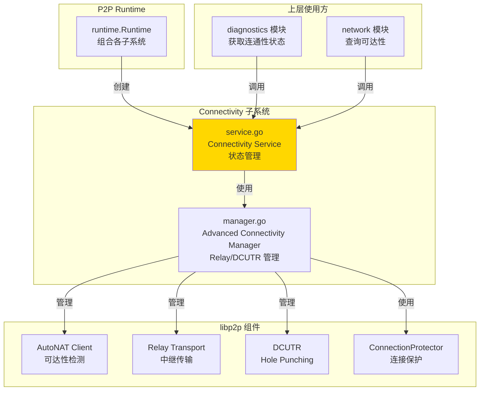
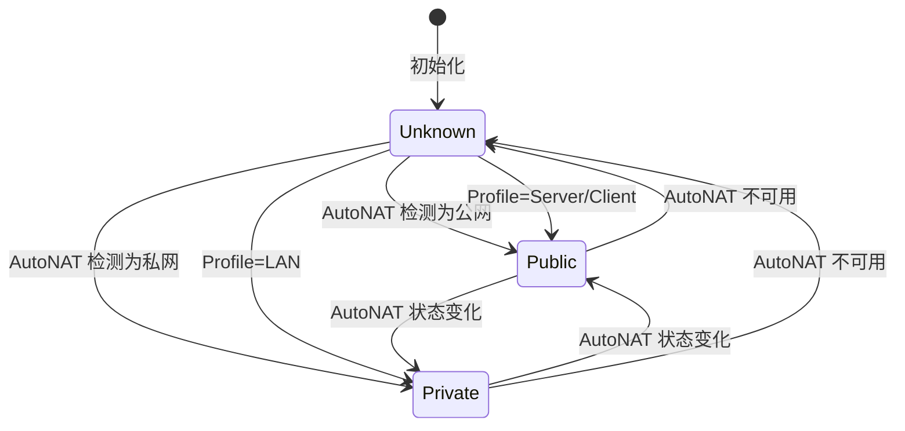
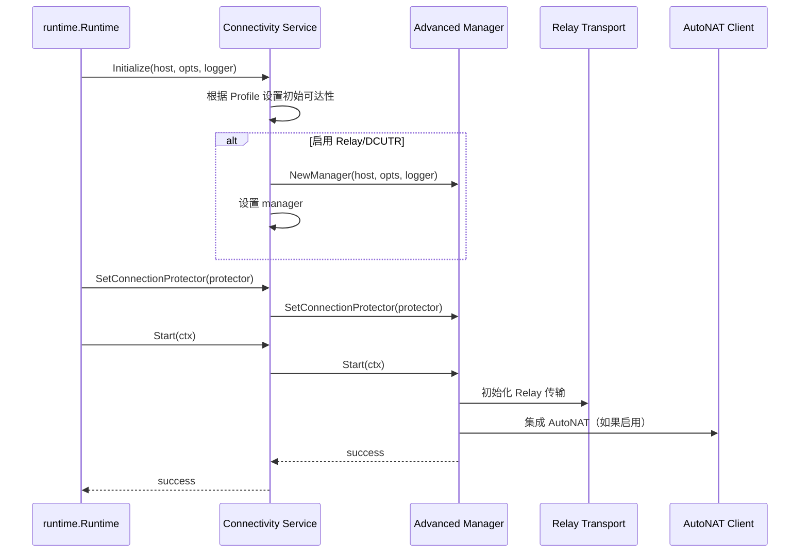

# Connectivity - 连通性增强子系统

---

## 📌 模块定位

**路径**：`internal/core/p2p/connectivity/`

**核心职责**：管理 NAT / AutoNAT / Relay / DCUTR 等连通性增强能力，维护节点的可达性状态（Reachability）和 Profile。

**在 P2P 模块中的角色**：
- 对标 Kubo Connectivity：管理 NAT 穿透、Relay、DCUTR 等连通性增强
- 维护 Reachability 状态（Unknown/Public/Private）
- 管理 Relay Client/Service 和 AutoRelay
- 管理 DCUTR（Hole Punching）能力
- 集成 AutoNAT 客户端进行可达性检测

**边界说明**：
- ✅ **负责**：连通性增强、Reachability 状态管理、Relay/DCUTR 管理
- ❌ **不负责**：直接 Dial（由 Swarm 负责）、路由查找（由 Routing 负责）

---

## 🏗️ 架构设计

### 在 P2P 模块中的位置



**模块职责**：

| 组件 | 职责 | 关键方法 |
|-----|------|---------|
| **Service** | 连通性状态管理 | `Reachability()`, `Profile()`, `Stats()` |
| **Manager** | 高级连通性管理 | `Start()`, `Stop()`, `StatsMap()` |

---

## 📁 目录结构

```
internal/core/p2p/connectivity/
├── README.md          # 本文档
├── service.go         # Connectivity Service 实现
└── manager.go         # Advanced Connectivity Manager 实现
```

---

## 🔧 核心实现

### Connectivity Service

**文件**：`service.go`

**核心类型**：`Service`

**职责**：
- 维护 Reachability 状态和 Profile
- 管理高级连通性管理器（Manager）
- 监听网络事件更新可达性状态
- 提供连通性统计信息

**关键字段**：

```go
type Service struct {
    host         lphost.Host
    reachability p2pi.Reachability
    profile      p2pi.Profile
    opts         *p2pcfg.Options
    logger       logiface.Logger
    manager      *Manager
    mu           sync.RWMutex
}
```

**关键方法**：

| 方法名 | 职责 | 返回值 | 备注 |
|-------|------|-------|-----|
| `NewService()` | 创建 Connectivity 服务 | `*Service` | 构造函数，指定 Profile |
| `Initialize()` | 初始化服务 | - | 需要 Host 和配置 |
| `SetConnectionProtector()` | 设置连接保护器 | - | 由 Runtime 调用 |
| `SetAutoNATClient()` | 设置 AutoNAT 客户端 | - | 由 Runtime 调用 |
| `Start()` | 启动连通性管理器 | `error` | 启动 Manager |
| `Stop()` | 停止连通性管理器 | `error` | 停止 Manager |
| `Reachability()` | 返回可达性状态 | `Reachability` | 优先使用 AutoNAT 结果 |
| `Profile()` | 返回 P2P Profile | `Profile` | server/client/lan |
| `Stats()` | 获取统计信息 | `ConnectivityStats` | 内部接口 |
| `StatsMap()` | 获取统计信息（Map） | `map[string]interface{}` | 供 Diagnostics 使用 |

**实现接口**：`pkg/interfaces/p2p.Connectivity`

### Advanced Connectivity Manager

**文件**：`manager.go`

**核心类型**：`Manager`

**职责**：
- 管理 Relay Client/Service
- 管理 AutoRelay 动态候选
- 管理 DCUTR（Hole Punching）
- 集成 AutoNAT 客户端
- 管理连接保护器统计

**关键方法**：

| 方法名 | 职责 | 返回值 |
|-------|------|-------|
| `NewManager()` | 创建 Manager | `*Manager` |
| `Start()` | 启动 Manager | `error` |
| `Stop()` | 停止 Manager | `error` |
| `SetConnectionProtector()` | 设置连接保护器 | - |
| `SetAutoNATClient()` | 设置 AutoNAT 客户端 | - |
| `GetAutoNATReachability()` | 获取 AutoNAT 可达性 | `Reachability, bool` |
| `Stats()` | 获取统计信息 | `ConnectivityStats` |
| `StatsMap()` | 获取统计信息（Map） | `map[string]interface{}` |

---

## 🔄 核心行为

### Reachability 状态机



**状态优先级**：
1. **AutoNAT 真实状态**（如果可用且不为 Unknown）
2. **Profile 推断状态**（Server/Client → Public，LAN → Private）
3. **Unknown**（默认）

### Connectivity Manager 启动流程



---

## ⚙️ 配置与依赖

### 配置来源

**单一配置来源**：`internal/config/p2p.Options`

**使用的配置字段**：

| 配置字段 | 用途 | 默认值 |
|---------|------|-------|
| `Profile` | P2P Profile | `server`（公有链） |
| `EnableRelay` | 启用 Relay Client | `true`（公有链） |
| `EnableRelayService` | 启用 Relay Service | `false` |
| `EnableDCUTR` | 启用 DCUTR | `true`（公有链） |
| `EnableAutoRelay` | 启用 AutoRelay | `true`（公有链） |
| `StaticRelayPeers` | 静态 Relay 节点 | 空 |
| `AutoRelayDynamicCandidates` | AutoRelay 动态候选数 | `4` |
| `EnableAutoNATClient` | 启用 AutoNAT 客户端 | `true`（公有链） |
| `EnableAutoNATService` | 启用 AutoNAT 服务 | `false` |
| `ForceReachability` | 强制可达性 | 空 |

**配置原则**：
- ✅ 只读取 `p2p.Options`，不定义默认值
- ✅ Profile 决定默认的连通性能力配置

### 依赖关系

| 依赖 | 来源 | 用途 |
|-----|------|-----|
| `lphost.Host` | `libp2p` | 访问网络层 |
| `p2pcfg.Options` | `internal/config/p2p` | 配置来源 |
| `autonat.AutoNAT` | `libp2p` | 可达性检测 |
| `ConnectionProtector` | `p2p/host` | 连接保护统计 |

---

## 🔄 生命周期与并发模型

### 生命周期

**初始化时机**：由 `runtime.Runtime` 在 `Start()` 时初始化

```go
// runtime/runtime.go
connectivitySvc := connectivity.NewService(profile)
connectivitySvc.Initialize(r.host, r.opts, r.logger)
```

**启动时机**：初始化后立即启动 Manager

```go
if connectivityStarter, ok := r.connectivity.(interface {
    Start(context.Context) error
}); ok {
    connectivityStarter.Start(ctx)
}
```

**停止时机**：由 `runtime.Runtime` 在 `Stop()` 时停止

### 并发安全

| 组件 | 并发安全 | 保护机制 |
|-----|---------|---------|
| `Service.reachability` | ✅ 是 | `sync.RWMutex` |
| `Service.manager` | ✅ 是 | Manager 内部保证 |
| `Reachability()` | ✅ 是 | 读锁保护 |

---

## 📊 可观测性与诊断

### 暴露的指标

**通过 Diagnostics 模块暴露**：

| 指标 | 类型 | 说明 |
|-----|------|-----|
| `reachability` | string | 可达性状态（unknown/public/private） |
| `autoNAT_status` | string | AutoNAT 状态 |
| `relay_enabled` | bool | 是否启用 Relay |
| `relay_active` | bool | Relay 是否活跃 |
| `holepunch_enabled` | bool | 是否启用 DCUTR |
| `autorelay_enabled` | bool | 是否启用 AutoRelay |
| `relay_client` | bool | 是否启用 Relay Client |
| `num_relays` | int | Relay 节点数量 |
| `active_relays` | int | 活跃 Relay 节点数量 |
| `allowed_peers` | int | 允许的 Peer 数量（连接保护） |
| `blocked_peers` | int | 阻止的 Peer 数量（连接保护） |

**日志事件**：
- `p2p.connectivity autonat_client started` - AutoNAT 客户端启动
- `p2p.connectivity start failed` - 启动失败

### 诊断端点

**通过 Diagnostics 模块暴露**：
- `/debug/p2p/health` - 健康检查（包含连通性状态）

---

## 🔗 与其他模块的协作

### 被 Runtime 使用

**使用方式**：

```go
// runtime/runtime.go
connectivitySvc := connectivity.NewService(profile)
connectivitySvc.Initialize(r.host, r.opts, r.logger)
connectivitySvc.SetConnectionProtector(protector)
connectivitySvc.SetAutoNATClient(autonatClient)
connectivitySvc.Start(ctx)
r.connectivity = connectivitySvc
```

### 被 Diagnostics 使用

**使用方式**：

```go
// diagnostics/service.go
reachability := connectivity.Reachability()
stats := connectivity.StatsMap()
```

### 依赖 Host

**使用方式**：

```go
// connectivity/service.go
// 监听网络事件
host.Network().Notify(&connectivityNotifiee{
    service: s,
})
```

---

## 📊 关键设计决策

### 决策 1：Reachability 状态优先级

**问题**：如何确定节点的可达性状态？

**方案**：优先使用 AutoNAT 真实状态，其次使用 Profile 推断，最后为 Unknown。

**理由**：
- AutoNAT 提供真实的网络可达性检测
- Profile 提供合理的默认推断
- Unknown 作为兜底状态

**权衡**：
- ✅ 优点：状态准确，有真实检测
- ⚠️ 缺点：依赖 AutoNAT 可用性

### 决策 2：Manager 分离设计

**问题**：Connectivity Service 是否应该直接管理 Relay/DCUTR？

**方案**：分离出 Advanced Connectivity Manager，Service 负责状态管理，Manager 负责具体能力。

**理由**：
- 职责分离，Service 关注状态，Manager 关注实现
- 便于测试和维护
- 便于扩展新的连通性能力

**权衡**：
- ✅ 优点：职责清晰，易于扩展
- ⚠️ 缺点：增加一层抽象

---

## 🧪 测试

### 测试覆盖

| 测试类型 | 文件 | 覆盖率目标 | 当前状态 |
|---------|------|-----------|---------|
| 单元测试 | `connectivity_test.go` | ≥ 80% | 待补充 |
| 集成测试 | `../integration/` | 核心场景 | 待补充 |

---

## 📚 相关文档

- [P2P 模块顶层 README](../README.md) - P2P 模块整体架构
- [Diagnostics 实现](../diagnostics/README.md) - 如何暴露连通性状态
- [配置管理规范](../../config/README.md) - Connectivity 配置说明
- [Kubo Connectivity 文档](https://github.com/ipfs/kubo) - 对标实现参考

---

## 📝 变更历史

| 版本 | 日期 | 变更内容 | 作者 |
|-----|------|---------|------|
| 1.0 | 2025-01-XX | 初始版本 | - |

---

## 🚧 待办事项

- [ ] 实现 AutoNAT 可达性检测完善
- [ ] 完善 Relay 和 DCUTR 状态监控
- [ ] 添加连通性指标完善
- [ ] 完善单元测试覆盖
- [ ] 优化连通性能力启动顺序

