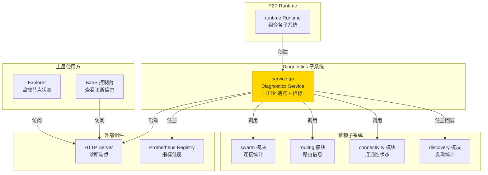

# Diagnostics - 诊断与指标子系统

---

## 📌 模块定位

**路径**：`internal/core/p2p/diagnostics/`

**核心职责**：暴露 HTTP 诊断端点与 Prometheus 指标，提供 P2P 模块的可观测性能力。

**在 P2P 模块中的角色**：
- 对标 Kubo Diagnostics：提供 HTTP 诊断接口和 Prometheus 指标
- 暴露 `/debug/p2p/*` HTTP 端点
- 注册 Prometheus 指标（连接数、带宽、发现统计等）
- 提供健康检查端点
- 支持 Protobuf 和 JSON 格式输出

**边界说明**：
- ✅ **负责**：诊断端点、指标注册、健康检查
- ❌ **不负责**：业务逻辑决策、连接管理、路由查找

---

## 🏗️ 架构设计

### 在 P2P 模块中的位置



**模块职责**：

| 组件 | 职责 | 关键方法 |
|-----|------|---------|
| **Service** | 诊断服务 | `Start()`, `Stop()`, `HTTPAddr()` |

---

## 📁 目录结构

```
internal/core/p2p/diagnostics/
├── README.md              # 本文档
├── service.go             # Diagnostics Service 实现
├── limited_reader.go      # 限制读取器（可选）
├── MONITORING.md          # 监控文档（运维视角）
└── VERIFICATION.md        # 验证文档（开发/测试视角）
```

---

## 🔧 核心实现

### Diagnostics Service

**文件**：`service.go`

**核心类型**：`Service`

**职责**：
- 启动 HTTP 诊断服务器
- 注册 Prometheus 指标
- 提供诊断端点处理函数
- 收集各子系统的统计信息

**关键字段**：

```go
type Service struct {
    httpAddr       string
    host           lphost.Host
    logger         logiface.Logger
    server         *http.Server
    registry       *prometheus.Registry
    bwReporter     metrics.Reporter
    configProvider cfgprovider.Provider
    p2pOpts        interface{...}
    
    // 子系统引用
    routing      p2pi.Routing
    connectivity p2pi.Connectivity
    
    // Discovery 指标
    discoveryBootstrapAttempts  prometheus.Counter
    discoveryBootstrapSuccess   prometheus.Counter
    // ...
}
```

**关键方法**：

| 方法名 | 职责 | 返回值 | 备注 |
|-------|------|-------|-----|
| `NewService()` | 创建 Diagnostics 服务 | `*Service` | 构造函数 |
| `Initialize()` | 初始化服务 | - | 注册指标 |
| `SetConfigProvider()` | 设置配置提供者 | - | 用于获取 network_id |
| `SetP2POptions()` | 设置 P2P 配置 | - | 用于获取配置摘要 |
| `SetSubsystems()` | 设置子系统引用 | - | 用于健康检查 |
| `Start()` | 启动 HTTP 服务器 | `error` | 启动诊断服务 |
| `Stop()` | 停止 HTTP 服务器 | `error` | 停止诊断服务 |
| `HTTPAddr()` | 返回 HTTP 地址 | `string` | 供外部访问 |
| `RecordDiscovery*()` | 记录 Discovery 指标 | - | 供 Discovery 调用 |

**实现接口**：`pkg/interfaces/p2p.Diagnostics`

---

## 🔄 核心行为

### HTTP 端点

**JSON 端点**：

| 端点 | 方法 | 说明 | 返回数据 |
|-----|------|-----|---------|
| `/debug/p2p/peers` | GET | Peer 列表 | `{"peers": N, "peer_ids": [...]}` |
| `/debug/p2p/connections` | GET | 连接数 | `{"connections": N}` |
| `/debug/p2p/stats` | GET | Swarm 统计 | 连接数、带宽、资源限制 |
| `/debug/p2p/health` | GET | 健康检查 | 节点状态、连通性、Relay 状态 |
| `/debug/p2p/routing` | GET | 路由信息 | DHT 路由表大小、模式、离线状态 |
| `/debug/p2p/host` | GET | Host 配置摘要 | ID、地址、协议、配置规则 |

**Protobuf 端点**：

| 端点 | 方法 | 说明 | 格式 |
|-----|------|-----|-----|
| `/debug/p2p/host.pb` | GET | Host 信息（PB） | `application/x-protobuf` |
| `/debug/p2p/host.json` | GET | Host 信息（JSON） | `application/json` |
| `/debug/p2p/peers.pb` | GET | Peer 列表（PB） | `application/x-protobuf` |
| `/debug/p2p/peers.json` | GET | Peer 列表（JSON） | `application/json` |
| `/debug/p2p/connections.pb` | GET | 连接列表（PB） | `application/x-protobuf` |
| `/debug/p2p/connections.json` | GET | 连接列表（JSON） | `application/json` |

**Prometheus 端点**：

| 端点 | 方法 | 说明 |
|-----|------|-----|
| `/metrics` | GET | Prometheus 指标 |

### Prometheus 指标

**连接指标**：

| 指标名 | 类型 | 说明 |
|-------|------|-----|
| `p2p_connections_total` | Gauge | 当前连接数 |
| `p2p_peers_total` | Gauge | 当前 Peer 数 |

**带宽指标**：

| 指标名 | 类型 | 说明 |
|-------|------|-----|
| `p2p_bandwidth_in_rate_bytes_per_sec` | Gauge | 入站带宽速率 |
| `p2p_bandwidth_out_rate_bytes_per_sec` | Gauge | 出站带宽速率 |
| `p2p_bandwidth_in_total_bytes` | Gauge | 入站总流量 |
| `p2p_bandwidth_out_total_bytes` | Gauge | 出站总流量 |

**Discovery 指标**：

| 指标名 | 类型 | 说明 |
|-------|------|-----|
| `p2p_discovery_bootstrap_attempt_total` | Counter | Bootstrap 尝试次数 |
| `p2p_discovery_bootstrap_success_total` | Counter | Bootstrap 成功次数 |
| `p2p_discovery_mdns_peer_found_total` | Counter | mDNS 发现的 Peer 数 |
| `p2p_discovery_mdns_connect_success_total` | Counter | mDNS 连接成功次数 |
| `p2p_discovery_mdns_connect_fail_total` | Counter | mDNS 连接失败次数 |
| `p2p_discovery_last_bootstrap_unixtime` | Gauge | 最后 Bootstrap 时间戳 |
| `p2p_discovery_last_mdns_found_unixtime` | Gauge | 最后 mDNS 发现时间戳 |

---

## ⚙️ 配置与依赖

### 配置来源

**单一配置来源**：`internal/config/p2p.Options`

**使用的配置字段**：

| 配置字段 | 用途 | 默认值 |
|---------|------|-------|
| `DiagnosticsEnabled` | 是否启用诊断 | `false` |
| `DiagnosticsAddr` | 诊断服务地址 | `:6060` |

**配置原则**：
- ✅ 只读取 `p2p.Options`，不定义默认值
- ✅ 诊断服务可选，未启用时不启动 HTTP 服务器

### 依赖关系

| 依赖 | 来源 | 用途 |
|-----|------|-----|
| `lphost.Host` | `libp2p` | 访问网络层 |
| `p2pi.Routing` | `routing` 模块 | 获取路由信息 |
| `p2pi.Connectivity` | `connectivity` 模块 | 获取连通性状态 |
| `metrics.Reporter` | `p2p/host` | 带宽统计 |
| `cfgprovider.Provider` | `pkg/interfaces/config` | 获取 network_id |

---

## 🔄 生命周期与并发模型

### 生命周期

**启动时机**：由 `runtime.Runtime` 在 `Start()` 时启动（如果启用）

```go
// runtime/runtime.go
if r.opts.DiagnosticsEnabled {
    diagnosticsSvc := diagnostics.NewService(r.opts.DiagnosticsAddr)
    diagnosticsSvc.Initialize(r.host, r.logger, bwReporter)
    diagnosticsSvc.SetSubsystems(routingSvc, connectivitySvc)
    diagnosticsSvc.Start(ctx)
    r.diagnostics = diagnosticsSvc
}
```

**停止时机**：由 `runtime.Runtime` 在 `Stop()` 时停止

```go
if r.diagnostics != nil {
    if diagSvc, ok := r.diagnostics.(interface{ Stop(context.Context) error }); ok {
        _ = diagSvc.Stop(ctx)
    }
}
```

### 并发安全

| 组件 | 并发安全 | 保护机制 |
|-----|---------|---------|
| `Service.server` | ✅ 是 | HTTP Server 内部保证 |
| `Service.registry` | ✅ 是 | Prometheus Registry 线程安全 |
| HTTP 处理函数 | ✅ 是 | 只读操作，无状态 |

---

## 🔗 与其他模块的协作

### 被 Runtime 使用

**使用方式**：

```go
// runtime/runtime.go
diagnosticsSvc := diagnostics.NewService(r.opts.DiagnosticsAddr)
diagnosticsSvc.Initialize(r.host, r.logger, bwReporter)
diagnosticsSvc.SetSubsystems(routingSvc, connectivitySvc)
diagnosticsSvc.Start(ctx)
r.diagnostics = diagnosticsSvc
```

### 被 Discovery 使用

**使用方式**：

```go
// discovery/service.go
// Runtime 将 Diagnostics 回调注入到 Discovery
discoverySvc.SetDiagnosticsCallbacks(
    diagnosticsSvc.RecordDiscoveryBootstrapAttempt,
    diagnosticsSvc.RecordDiscoveryBootstrapSuccess,
    // ...
)
```

### 收集各子系统信息

**使用方式**：

```go
// diagnostics/service.go
// 从 Swarm 获取统计
swarm := p2pService.Swarm()
stats := swarm.Stats()

// 从 Routing 获取路由信息
routing := p2pService.Routing()
mode := routing.Mode()

// 从 Connectivity 获取连通性状态
connectivity := p2pService.Connectivity()
reachability := connectivity.Reachability()
```

---

## 📊 关键设计决策

### 决策 1：可选诊断服务

**问题**：诊断服务是否应该总是启用？

**方案**：通过 `DiagnosticsEnabled` 配置控制，默认禁用。

**理由**：
- 减少资源消耗（生产环境可能不需要）
- 避免暴露敏感信息
- 便于按需启用

**权衡**：
- ✅ 优点：灵活，安全
- ⚠️ 缺点：需要显式配置

### 决策 2：回调注入模式

**问题**：Discovery 指标如何记录？

**方案**：通过回调函数注入，Discovery 调用回调记录指标。

**理由**：
- 避免 Discovery 直接依赖 Diagnostics
- 保持模块间解耦
- 便于测试（可注入 mock）

**权衡**：
- ✅ 优点：解耦，灵活
- ⚠️ 缺点：需要显式注入

---

## 🧪 测试

### 测试覆盖

| 测试类型 | 文件 | 覆盖率目标 | 当前状态 |
|---------|------|-----------|---------|
| 单元测试 | `service_test.go` | ≥ 80% | 部分完成 |
| 集成测试 | `../integration/` | 核心场景 | 待补充 |

---

## 📚 相关文档

- [P2P 模块顶层 README](../README.md) - P2P 模块整体架构
- [MONITORING.md](./MONITORING.md) - 监控文档（运维视角）
- [VERIFICATION.md](./VERIFICATION.md) - 验证文档（开发/测试视角）
- [Kubo Diagnostics 文档](https://github.com/ipfs/kubo) - 对标实现参考

---

## 📝 变更历史

| 版本 | 日期 | 变更内容 | 作者 |
|-----|------|---------|------|
| 1.0 | 2025-01-XX | 初始版本 | - |

---

## 🚧 待办事项

- [ ] 添加更多诊断端点（DHT 状态、路由表信息等）
- [ ] 完善 Prometheus 指标
- [ ] 添加健康检查端点完善
- [ ] 完善单元测试覆盖
- [ ] 添加诊断性能优化

