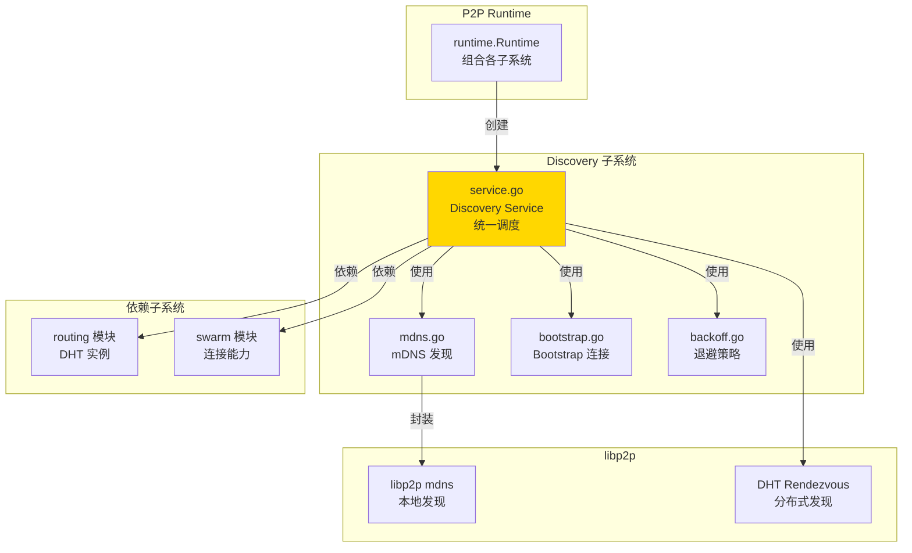
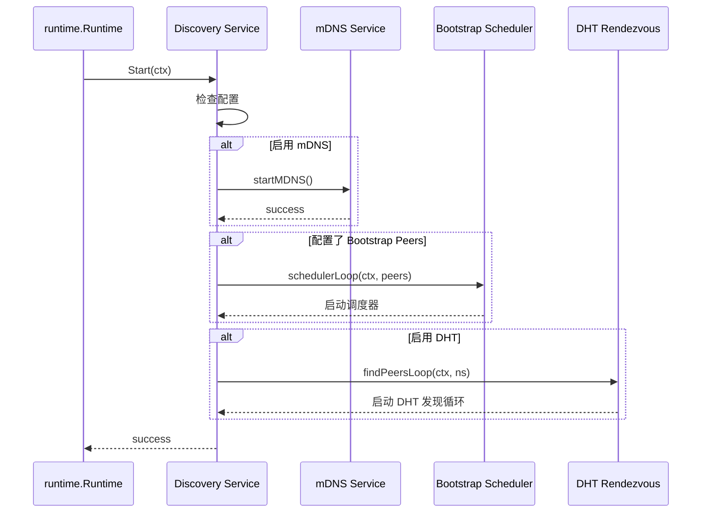
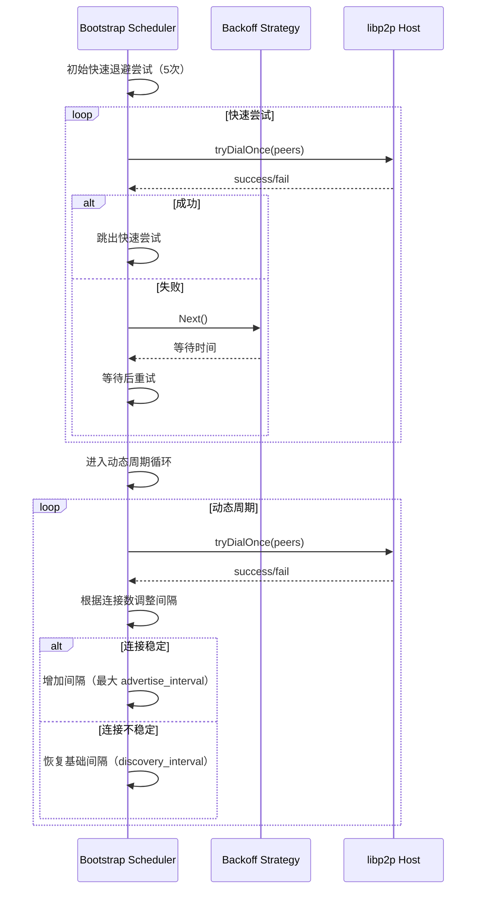

# Discovery - Peer 发现子系统

---

## 📌 模块定位

**路径**：`internal/core/p2p/discovery/`

**核心职责**：统一调度多种 Peer 发现机制（Bootstrap、mDNS、Rendezvous），确保节点能够发现并连接到足够的邻居节点。

**在 P2P 模块中的角色**：
- 对标 Kubo Discovery：统一调度多种发现插件
- 管理 Bootstrap Peers 连接（带退避策略）
- 管理 mDNS 本地网络发现
- 管理 DHT Rendezvous 发现（依赖 Routing 子系统）
- 在 Peer 数低于阈值时主动触发发现

**边界说明**：
- ✅ **负责**：Peer 发现调度、Bootstrap 连接、mDNS/Rendezvous 发现
- ❌ **不负责**：路由查找（由 Routing 负责）、连接管理（由 Swarm 负责）

---

## 🏗️ 架构设计

### 在 P2P 模块中的位置



**模块职责**：

| 组件 | 职责 | 关键方法 |
|-----|------|---------|
| **Service** | 统一调度发现机制 | `Start()`, `Stop()`, `Trigger()` |
| **mdns.go** | mDNS 发现封装 | `startMDNS()` |
| **bootstrap.go** | Bootstrap 连接逻辑 | `tryDialOnce()`, `schedulerLoop()` |
| **backoff.go** | 退避策略 | `NewBackoff()`, `Next()` |

---

## 📁 目录结构

```
internal/core/p2p/discovery/
├── README.md          # 本文档
├── service.go         # Discovery Service 实现
├── backoff.go         # 退避策略实现
└── (mdns.go, bootstrap.go 等可选辅助文件)
```

---

## 🔧 核心实现

### Discovery Service

**文件**：`service.go`

**核心类型**：`Service`

**职责**：
- 统一调度多种发现机制
- 管理发现服务的生命周期
- 在 Peer 数低于阈值时主动触发发现
- 订阅网络质量事件，触发短促引导拨号

**关键字段**：

```go
type Service struct {
    host       lphost.Host
    opts       *p2pcfg.Options
    logger     logiface.Logger
    eventBus   event.EventBus
    mdnsSvc    mdns.Service
    // 通过内部接口协作的 Rendezvous 路由能力（由 Routing 子系统注入）
    rendezvousRouting interfaces.RendezvousRouting
    
    // 调度器相关
    schedulerCancel context.CancelFunc
    dhtLoopCancel   context.CancelFunc
    
    // 诊断指标回调（可选）
    recordBootstrapAttempt   func()
    recordBootstrapSuccess   func()
    // ...
}
```

**关键方法**：

| 方法名 | 职责 | 返回值 | 备注 |
|-------|------|-------|-----|
| `NewService()` | 创建 Discovery 服务 | `*Service` | 构造函数 |
| `Initialize()` | 初始化服务 | `error` | 需要 Host 和配置 |
| `SetRendezvousRouting()` | 设置 Rendezvous 路由实现 | - | 由 Runtime 调用，通过内部接口协作 |
| `Start()` | 启动发现服务 | `error` | 启动所有发现机制 |
| `Stop()` | 停止发现服务 | `error` | 停止所有发现机制 |
| `Trigger()` | 触发一次发现 | - | 手动触发 Bootstrap |
| `SubscribeHints()` | 订阅网络质量事件 | - | 触发短促引导拨号 |

**实现接口**：`pkg/interfaces/p2p.Discovery`

### AddrManager（地址管理器）

**文件**：`addr_manager.go`, `addr_rediscovery.go`, `addr_persistence.go`

**状态**：✅ **内部实现**（对用户完全透明，自动管理）

**职责**：
- 地址持久化：节点地址持久化到 BadgerDB，重启后快速恢复
- 智能地址刷新：自动维护地址有效性，避免过期
- 重发现队列：主动修复失联节点，自动触发地址重查询
- 地址 TTL 管理：区分 DHT/Connected/Failed 地址的生命周期

**核心类型**：`AddrManager`

**关键功能**：

| 功能 | 说明 | 实现文件 |
|-----|------|---------|
| 分级 TTL 管理 | DHT(30m) / Connected(24h) / Failed(5m) | `addr_manager.go` |
| 主动刷新 | 定期检查并刷新即将过期的地址 | `addr_manager.go` |
| 重发现队列 | 无地址节点自动加入重试队列 | `addr_rediscovery.go` |
| BadgerDB 持久化 | 地址持久化到专用 BadgerDB | `addr_persistence.go` |
| Prune 清理 | 定期清理过期记录（7天 TTL） | `addr_persistence.go` |

**实现细节**（用户无需关注）：
- 自动使用生产级默认配置（DHT 30分钟、Connected 24小时）
- 自动推导存储路径：`data/p2p/<hostID>/addrs/`
- 自动启用持久化（BadgerDB）、刷新（10分钟）、重发现（30秒）
- **用户无需配置任何参数**，所有细节由系统自动管理

---

## 🔄 核心行为

### 发现机制启动流程



### Bootstrap 调度器循环



### DHT Rendezvous 发现循环

```mermaid
sequenceDiagram
    participant Loop as DHT Rendezvous Loop
    participant DHT as DHT Routing
    participant Host as libp2p Host
    
    Loop->>DHT: Advertise(ns)
    Loop->>DHT: FindPeers(ns)
    DHT-->>Loop: peer channel
    loop 接收发现的 Peer
        Loop->>Loop: handleDiscoveredPeer(info)
        Loop->>Host: Connect(info)
        Host-->>Loop: success/fail
        alt 成功
            Loop->>Loop: 发布连接事件
        end
    end
    alt channel 关闭
        Loop->>Loop: 等待 5 秒后重启
    end
```

---

## ⚙️ 配置与依赖

### 配置来源

**单一配置来源**：`internal/config/p2p.Options`

**使用的配置字段**：

| 配置字段 | 用途 | 默认值 |
|---------|------|-------|
| `EnableMDNS` | 是否启用 mDNS | `false`（私有链默认 `true`） |
| `EnableDHT` | 是否启用 DHT | `true` |
| `BootstrapPeers` | Bootstrap 节点列表 | 空（需配置） |
| `DiscoveryInterval` | 发现间隔 | `5m` |
| `AdvertiseInterval` | 广告间隔 | `15m` |
| `DiscoveryNamespace` | Rendezvous 命名空间 | `weisyn-{networkNamespace}` |
| `MinPeers` | 最小 Peer 数 | `8` |
| `MaxPeers` | 最大 Peer 数 | `50` |

**配置原则**：
- ✅ 只读取 `p2p.Options`，不定义默认值
- ✅ 所有默认值在 `internal/config/p2p.applyDefaults()` 中统一设置

### 依赖关系

| 依赖 | 来源 | 用途 |
|-----|------|-----|
| `lphost.Host` | `libp2p` | 连接能力 |
| `p2pcfg.Options` | `internal/config/p2p` | 配置来源 |
| `event.EventBus` | `pkg/interfaces/infrastructure/event` | 事件发布 |
| `logiface.Logger` | `pkg/interfaces/infrastructure/log` | 日志 |
| `*dht.IpfsDHT` | `routing` 模块 | DHT Rendezvous |

---

## 🔄 生命周期与并发模型

### 生命周期

**启动流程**：
1. `Start()` 启动 mDNS（如果启用）
2. 启动 Bootstrap 调度器循环（如果配置了 Bootstrap Peers）
3. 启动 DHT Rendezvous 发现循环（如果启用 DHT）

**停止流程**：
1. 停止 Bootstrap 调度器循环
2. 停止 DHT Rendezvous 发现循环
3. 关闭 mDNS 服务
4. 取消主 context

### 并发安全

| 组件 | 并发安全 | 保护机制 |
|-----|---------|---------|
| `Service.routingDHT` | ⚠️ 需注意 | `sync.RWMutex` 保护 |
| `Service.mdnsSvc` | ✅ 是 | libp2p mdns 内部保证 |
| `schedulerLoop()` | ✅ 是 | 单 goroutine 运行 |
| `findPeersLoop()` | ✅ 是 | 单 goroutine 运行 |

---

## 📊 可观测性与诊断

### 暴露的指标

**通过 Diagnostics 模块暴露**：

| 指标 | 类型 | 说明 |
|-----|------|-----|
| `p2p_discovery_bootstrap_attempt_total` | Counter | Bootstrap 尝试次数 |
| `p2p_discovery_bootstrap_success_total` | Counter | Bootstrap 成功次数 |
| `p2p_discovery_mdns_peer_found_total` | Counter | mDNS 发现的 Peer 数 |
| `p2p_discovery_mdns_connect_success_total` | Counter | mDNS 连接成功次数 |
| `p2p_discovery_mdns_connect_fail_total` | Counter | mDNS 连接失败次数 |
| `p2p_discovery_last_bootstrap_unixtime` | Gauge | 最后 Bootstrap 时间戳 |
| `p2p_discovery_last_mdns_found_unixtime` | Gauge | 最后 mDNS 发现时间戳 |

**日志事件**：
- `p2p.discovery.config` - 配置快照
- `p2p.discovery.mdns started` - mDNS 启动
- `p2p.discovery.scheduler start` - Bootstrap 调度器启动
- `p2p.discovery.dht_loop starting` - DHT Rendezvous 启动
- `p2p.discovery.bootstrap_fast` - 快速退避尝试
- `p2p.discovery.cycle` - 周期发现
- `p2p.discovery.dht_loop peer_discovered` - DHT 发现 Peer

**事件发布**：
- `p2p.discovery.bootstrap.attempt` - Bootstrap 尝试事件
- `p2p.discovery.bootstrap.success` - Bootstrap 成功事件
- `p2p.peer.connected` - Peer 连接事件（source: bootstrap/mdns/dht）

---

## 🔗 与其他模块的协作

### 被 Runtime 使用

**使用方式**：

```go
// runtime/runtime.go
discoverySvc := discovery.NewService()
discoverySvc.Initialize(r.host, r.opts, r.logger, r.eventBus)
// 通过 RendezvousRouting 接口注入 DHT Rendezvous 能力
discoverySvc.SetRendezvousRouting(routingSvc)
r.discovery = discoverySvc
discoverySvc.Start(ctx)
```

### 依赖 Routing

**使用方式**：

```go
// discovery/service.go
// Runtime 将 RendezvousRouting 能力注入
discoverySvc.SetRendezvousRouting(routingSvc)

// Discovery 使用 RendezvousRouting 接口进行 Rendezvous
peerCh, err := rendezvousRouting.AdvertiseAndFindPeers(ctx, ns)
```

### 依赖 Swarm

**使用方式**：

```go
// discovery/service.go
// 通过 Host.Connect() 建立连接（Swarm 负责连接管理）
s.host.Connect(ctx, info)
```

---

## 📊 关键设计决策

### 决策 1：统一调度 vs 独立服务

**问题**：Discovery 应该统一调度还是各发现机制独立运行？

**方案**：统一调度，Discovery Service 负责启动/停止所有发现机制。

**理由**：
- 便于统一管理生命周期
- 便于统一配置和监控
- 便于协调不同发现机制

**权衡**：
- ✅ 优点：管理简单，配置统一
- ⚠️ 缺点：耦合度较高

### 决策 2：退避策略

**问题**：Bootstrap 连接失败时如何重试？

**方案**：使用指数退避 + 抖动，初始快速尝试 5 次，然后进入动态周期。

**理由**：
- 避免频繁重试浪费资源
- 抖动避免同步风暴
- 动态周期根据连接稳定性调整

**权衡**：
- ✅ 优点：自适应，资源友好
- ⚠️ 缺点：参数需要调优

### 决策 3：网络质量事件订阅

**问题**：如何快速响应网络质量变化？

**方案**：订阅 `EventTypeNetworkQualityChanged` 事件，触发短促引导拨号。

**理由**：
- 快速修复连接问题
- 不等待下一个发现周期
- 轻量级，不影响正常发现流程

---

## 🧪 测试

### 测试覆盖

| 测试类型 | 文件 | 覆盖率目标 | 当前状态 |
|---------|------|-----------|---------|
| 单元测试 | `service_test.go` | ≥ 80% | 部分完成 |
| 集成测试 | `../integration/` | 核心场景 | 待补充 |

---

## 📚 相关文档

- [P2P 模块顶层 README](../README.md) - P2P 模块整体架构
- [Routing 实现](../routing/README.md) - Discovery 如何使用 DHT
- [配置管理规范](../../config/README.md) - Discovery 配置说明
- [Kubo Discovery 文档](https://github.com/ipfs/kubo) - 对标实现参考

---

## 📝 变更历史

| 版本 | 日期 | 变更内容 | 作者 |
|-----|------|---------|------|
| 1.0 | 2025-01-XX | 初始版本 | - |

---

## 🚧 待办事项

- [ ] 实现 Rendezvous 发现（部分完成）
- [ ] 优化 Bootstrap 重连策略
- [ ] 添加发现指标完善
- [ ] 完善单元测试覆盖
- [ ] 添加发现性能优化

