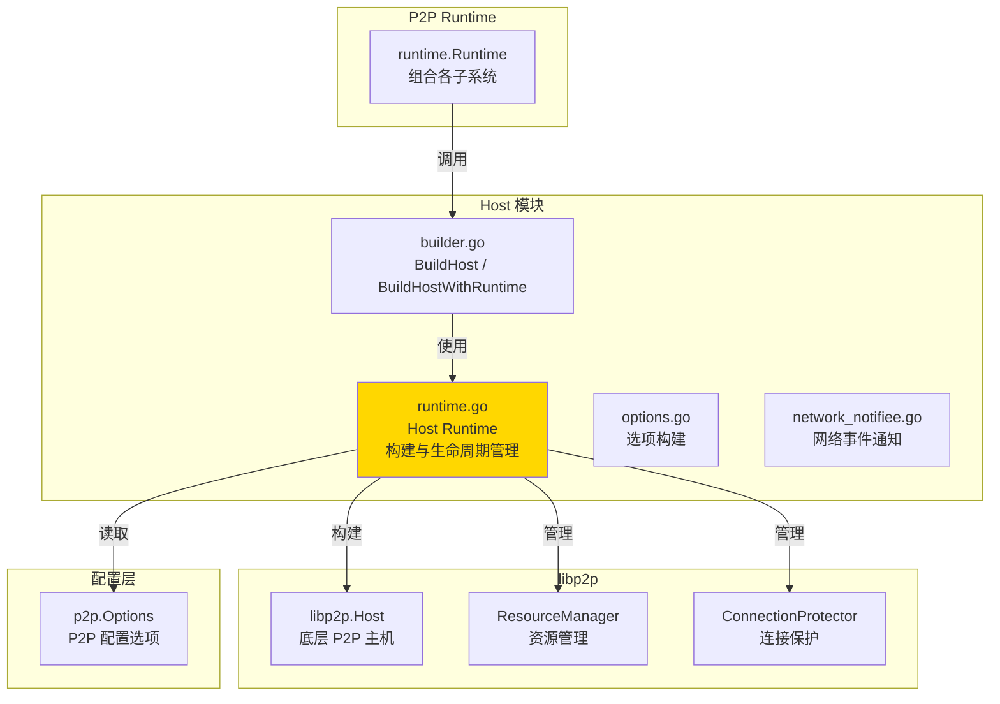
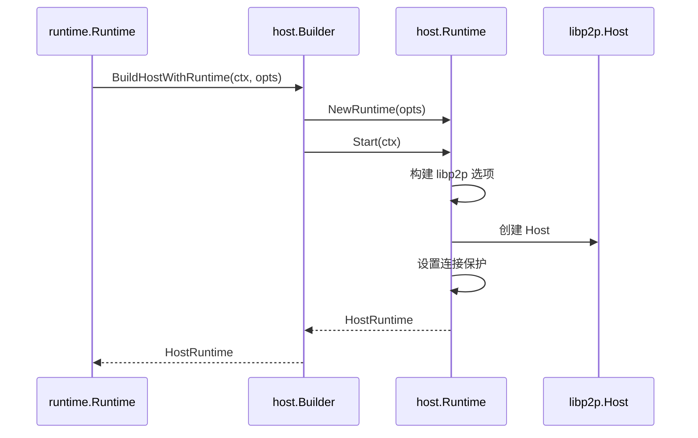

# Host - libp2p Host 构建模块

---

## 📌 模块定位

**路径**：`internal/core/p2p/host/`

**核心职责**：封装 libp2p Host 的构建逻辑，根据 `p2p.Options` 配置创建和初始化 libp2p Host 实例。

**在 P2P 模块中的角色**：
- 负责 libp2p Host 的完整生命周期（创建、启动、关闭）
- 将 `p2p.Options` 配置转换为 libp2p 选项（传输、安全、多路复用、资源管理等）
- 提供共享带宽计数器供其他模块观测
- 管理连接保护器（ConnectionProtector）和资源管理器（ResourceManager）

**对标 Kubo**：对标 IPFS Kubo 的 Host 构建逻辑，但直接使用 `p2p.Options`，不再依赖旧的 `node` 模块配置。

---

## 🏗️ 架构设计

### 在 P2P 模块中的位置



**模块职责划分**：

| 组件 | 职责 | 关键方法 |
|-----|------|---------|
| **builder.go** | 对外构建接口 | `BuildHost()`, `BuildHostWithRuntime()` |
| **runtime.go** | Host 生命周期管理 | `Start()`, `Stop()`, `Host()` |
| **options.go** | 选项构建逻辑 | `withAddressFactoryByConfig()` 等 |
| **network_notifiee.go** | 网络事件桥接 | 将 libp2p 事件发布到 EventBus |

---

## 📁 目录结构

```
internal/core/p2p/host/
├── README.md              # 本文档
├── builder.go             # 构建入口函数
├── runtime.go             # Host Runtime 实现
├── options.go             # 选项构建逻辑
└── network_notifiee.go    # 网络事件通知器
```

---

## 🔧 核心实现

### Host Runtime

**文件**：`runtime.go`

**核心类型**：`Runtime`

**职责**：
- 管理 libp2p Host 的完整生命周期
- 根据 `p2p.Options` 构建 libp2p 选项（传输、安全、多路复用、资源管理器等）
- 管理连接保护器（ConnectionProtector）和资源管理器（ResourceManager）
- 提供共享带宽计数器供其他模块使用

**关键字段**：

```go
type Runtime struct {
    cfg                 *p2pcfg.Options
    host                lphost.Host
    connectionProtector *ConnectionProtector
}
```

**关键方法**：

| 方法名 | 职责 | 可见性 | 备注 |
|-------|------|-------|-----|
| `NewRuntime()` | 创建 Runtime 实例 | Public | 构造函数 |
| `Start()` | 构建并启动 Host | Public | 生命周期管理 |
| `Stop()` | 关闭 Host | Public | 生命周期管理 |
| `Host()` | 返回 Host 实例 | Public | 供其他模块使用 |
| `GetConnectionProtector()` | 返回连接保护器 | Public | 供 Connectivity 使用 |

### Builder 函数

**文件**：`builder.go`

**核心函数**：

| 函数名 | 职责 | 返回值 |
|-------|------|-------|
| `BuildHost()` | 构建 Host（简化版） | `lphost.Host` |
| `BuildHostWithRuntime()` | 构建 Host 和 Runtime | `*HostRuntime` |
| `GetBandwidthCounter()` | 获取共享带宽计数器 | `metrics.Reporter` |

**使用示例**：

```go
// 在 Runtime 中构建 Host
hr, err := p2phost.BuildHostWithRuntime(ctx, r.opts)
if err != nil {
    return fmt.Errorf("build host: %w", err)
}
r.host = hr.Host
r.hostRuntime = hr
```

---

## ⚙️ 配置与依赖

### 配置来源

**单一配置来源**：`internal/config/p2p.Options`

**使用的配置字段**：

| 配置字段 | 用途 | 映射到 libp2p |
|---------|------|--------------|
| `ListenAddresses` | 监听地址 | `libp2p.ListenAddrStrings()` |
| `BootstrapPeers` | 引导节点 | 连接保护（`cm.Protect()`） |
| `PrivateNetwork` | 私有网络 | PSK 配置 |
| `EnableRelay` | 启用 Relay | Relay 传输选项 |
| `EnableDCUTR` | 启用 DCUTR | DCUTR 选项 |
| `EnableAutoRelay` | 启用 AutoRelay | AutoRelay 选项 |
| `MemoryLimitMB` | 内存限制 | ResourceManager 限制 |
| `MaxFileDescriptors` | 文件描述符限制 | ResourceManager 限制 |
| `LowWater`, `HighWater` | 连接水位 | ConnManager 配置 |

**配置原则**：
- ✅ 只读取 `p2p.Options`，不定义默认值
- ✅ 所有默认值在 `internal/config/p2p.applyDefaults()` 中统一设置
- ❌ 禁止硬编码用户级默认值

### 依赖关系

| 依赖 | 来源 | 用途 |
|-----|------|-----|
| `p2pcfg.Options` | `internal/config/p2p` | 配置来源 |
| `libp2p` | `github.com/libp2p/go-libp2p` | Host 构建 |
| `metrics` | `github.com/libp2p/go-libp2p/core/metrics` | 带宽统计 |

---

## 🔄 生命周期与并发模型

### 生命周期

**启动流程**：



**停止流程**：
1. `Runtime.Stop()` 调用 `host.Close()`
2. libp2p Host 关闭所有连接和流
3. 清理资源管理器

### 并发安全

| 组件 | 并发安全 | 保护机制 |
|-----|---------|---------|
| `Runtime.host` | ✅ 是 | libp2p Host 内部保证 |
| `sharedBandwidthCounter` | ✅ 是 | `sync.Once` 初始化 |
| `hostProvider` | ⚠️ 需注意 | 全局变量，建议只读 |

---

## 🔗 与其他模块的协作

### 被 Runtime 使用

**使用方式**：

```go
// runtime/runtime.go
hr, err := p2phost.BuildHostWithRuntime(ctx, r.opts)
r.host = hr.Host
r.hostRuntime = hr
```

### 被 Connectivity 使用

**使用方式**：

```go
// connectivity/service.go
if r.hostRuntime != nil && r.hostRuntime.Runtime != nil {
    if protector := r.hostRuntime.Runtime.GetConnectionProtector(); protector != nil {
        connectivitySvc.SetConnectionProtector(protector)
    }
}
```

### 被 Diagnostics 使用

**使用方式**：

```go
// diagnostics/service.go
bwReporter := p2phost.GetBandwidthCounter()
diagnosticsSvc.Initialize(r.host, r.logger, bwReporter)
```

---

## 📊 关键设计决策

### 决策 1：直接使用 p2p.Options

**问题**：如何避免依赖旧的 `node` 模块配置？

**方案**：Host 构建逻辑直接使用 `p2pcfg.Options`，不再依赖 `nodeconfig.NodeOptions`。

**理由**：
- 符合"配置单一来源"原则
- 减少配置转换层，降低复杂度
- 便于未来完全迁移到 P2P 模块

**权衡**：
- ✅ 优点：配置清晰，易于维护
- ⚠️ 缺点：需要确保 `p2p.Options` 包含所有必要字段

### 决策 2：共享带宽计数器

**问题**：如何让多个模块（Swarm、Diagnostics）共享带宽统计？

**方案**：使用全局单例 `sharedBandwidthCounter`，通过 `GetBandwidthCounter()` 访问。

**理由**：
- 避免重复创建带宽计数器
- 保证统计的一致性
- 简化模块间协作

**权衡**：
- ✅ 优点：简单高效
- ⚠️ 缺点：全局状态，需注意初始化顺序

---

## 🧪 测试

### 测试覆盖

| 测试类型 | 文件 | 覆盖率目标 | 当前状态 |
|---------|------|-----------|---------|
| 单元测试 | `host_test.go` | ≥ 80% | 待补充 |
| 集成测试 | `../integration/` | 核心场景 | 待补充 |

---

## 📚 相关文档

- [P2P 模块顶层 README](../README.md) - P2P 模块整体架构
- [配置管理规范](../../config/README.md) - P2P 配置说明
- [Runtime 实现](../runtime/README.md) - Runtime 如何使用 Host
- [配置单一来源原则](../README.md#配置管理) - 配置管理原则

---

## 📝 变更历史

| 版本 | 日期 | 变更内容 | 作者 |
|-----|------|---------|------|
| 1.0 | 2025-01-XX | 初始版本，迁移到直接使用 p2p.Options | - |

---

## 🚧 待办事项

- [ ] 完善单元测试覆盖
- [ ] 添加集成测试
- [ ] 优化资源管理器配置
- [ ] 完善连接保护策略

