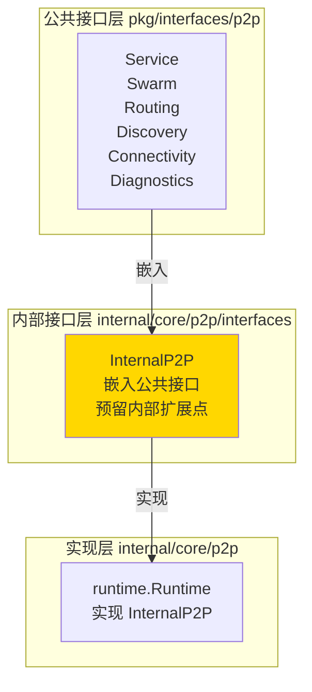

# Interfaces - P2P 内部接口层

---

## 📌 模块定位

**路径**：`internal/core/p2p/interfaces/`

**核心职责**：定义 P2P 模块的内部接口，作为公共接口层与实现层之间的桥梁。

**在 P2P 模块中的角色**：
- 提供内部扩展点，允许在不修改公共接口的情况下扩展功能
- 明确"对外稳定接口"与"内部扩展接口"的边界
- 作为实现层与公共接口层之间的适配层

---

## 🏗️ 架构设计

### 在 P2P 模块中的位置



**接口层次关系**：

| 层级 | 接口 | 职责 | 可见性 |
|-----|------|------|-------|
| **公共接口** | `pkg/interfaces/p2p.Service` | 对外稳定契约 | Public |
| **内部接口** | `interfaces.InternalP2P` | 内部扩展点 | Internal |
| **内部协作接口** | `interfaces.BandwidthProvider`<br/>`interfaces.ResourceManagerInspector` | 子模块间协作契约 | Internal |
| **实现** | `runtime.Runtime`<br/>`host.Runtime` | 具体实现 | Internal |

---

## 📁 目录结构

```
internal/core/p2p/interfaces/
├── README.md          # 本文档
└── p2p.go             # InternalP2P 接口定义
```

---

## 🔧 核心接口

### InternalP2P

**文件**：`p2p.go`

**定义**：

```go
type InternalP2P interface {
    p2pi.Service  // 嵌入公共接口
}
```

**职责**：
- 嵌入公共接口 `pkg/interfaces/p2p.Service`，继承所有公共方法
- 作为内部扩展点，未来如需添加内部控制/调试方法，可在此扩展
- 不暴露到 `pkg` 层，保持公共接口的稳定性

**实现关系**：
- `runtime.Runtime` 实现 `InternalP2P`
- 通过 `module.go` 将 `Runtime` 绑定到公共接口 `p2pi.Service`

### BandwidthProvider

**文件**：`p2p.go`

**定义**：

```go
type BandwidthProvider interface {
    BandwidthReporter() metrics.Reporter
}
```

**职责**：
- 提供带宽统计 Reporter 的内部接口
- 用于解耦子模块对 `host` 包的直接依赖
- 通过接口获取带宽统计能力，而非直接调用 `host.GetBandwidthCounter()`

**实现关系**：
- `host.Runtime` 实现 `BandwidthProvider`
- `swarm` 通过此接口获取带宽计数器

### ResourceManagerInspector

**文件**：`p2p.go`

**定义**：

```go
type ResourceManagerInspector interface {
    ResourceManagerLimits() map[string]interface{}
}
```

**职责**：
- 提供 ResourceManager 限额视图的内部接口
- 用于解耦子模块对 `host` 包的直接依赖
- 通过接口获取资源管理限额信息，而非直接调用 `host.CurrentResourceManager()` / `CurrentRcmgrLimits()`

**实现关系**：
- `host.Runtime` 实现 `ResourceManagerInspector`
- `diagnostics` 通过此接口获取 ResourceManager 限额信息

---

## 🔗 协作关系

### 依赖关系

| 依赖 | 来源 | 用途 |
|-----|------|-----|
| `pkg/interfaces/p2p.Service` | `pkg/interfaces/p2p/` | 嵌入公共接口 |

### 被依赖关系

**被以下模块使用**：
- `runtime/` - `Runtime` 实现 `InternalP2P` 接口
- `host/` - `host.Runtime` 实现 `BandwidthProvider` 和 `ResourceManagerInspector` 接口
- `swarm/` - 通过 `BandwidthProvider` 接口获取带宽计数器
- `diagnostics/` - 通过 `ResourceManagerInspector` 接口获取 ResourceManager 限额
- `module.go` - 通过 Fx 将实现绑定到公共接口

**示例**：

```go
// runtime/runtime.go
var _ interfaces.InternalP2P = (*Runtime)(nil)

// host/runtime.go
var _ interfaces.BandwidthProvider = (*Runtime)(nil)
var _ interfaces.ResourceManagerInspector = (*Runtime)(nil)

// swarm/service.go
func NewService(host lphost.Host, bwProvider interfaces.BandwidthProvider) *Service {
    // 通过接口获取带宽计数器
}

// diagnostics/service.go
func (s *Service) SetResourceManagerInspector(inspector interfaces.ResourceManagerInspector) {
    s.rmInspector = inspector
}

// module.go
fx.Provide(
    fx.Annotate(
        runtime.NewRuntime,
        fx.As(new(p2pi.Service)),
    ),
)
```

---

## 📊 设计原则

### 接口稳定性

- ✅ **公共接口**（`pkg/interfaces/p2p`）：对外稳定，遵循语义化版本控制
- ✅ **内部接口**（`interfaces.InternalP2P`）：可扩展，但需谨慎添加方法
- ❌ **禁止**：在内部接口中添加会破坏公共接口兼容性的方法

### 扩展指南

**何时可以扩展 `InternalP2P`**：
- 需要添加内部调试/控制方法（不暴露到公共接口）
- 需要添加实现层特定的优化接口
- 需要在不影响公共接口的情况下进行重构

**扩展约束**：
- 新增方法必须是内部使用，不暴露到 `pkg` 层
- 新增方法不应影响现有实现的兼容性
- 新增方法应通过类型断言访问，而非直接调用

---

## 📚 相关文档

- [P2P 模块顶层 README](../README.md) - P2P 模块整体架构
- [公共接口文档](../../../../pkg/interfaces/p2p/README.md) - 公共接口定义
- [Runtime 实现](../runtime/README.md) - InternalP2P 的具体实现
- [接口设计规范](../../../../_dev/04-工程标准-standards/01-代码与接口标准-code-and-interfaces/) - 接口设计原则

---

## 📝 变更历史

| 版本 | 日期 | 变更内容 | 作者 |
|-----|------|---------|------|
| 1.0 | 2025-01-XX | 初始版本 | - |
| 1.1 | 2025-01-XX | 添加 `BandwidthProvider` 和 `ResourceManagerInspector` 内部协作接口 | - |

---

## 🚧 待办事项

- [ ] 根据实际需求评估是否需要添加内部扩展方法
- [ ] 完善接口文档和示例代码

