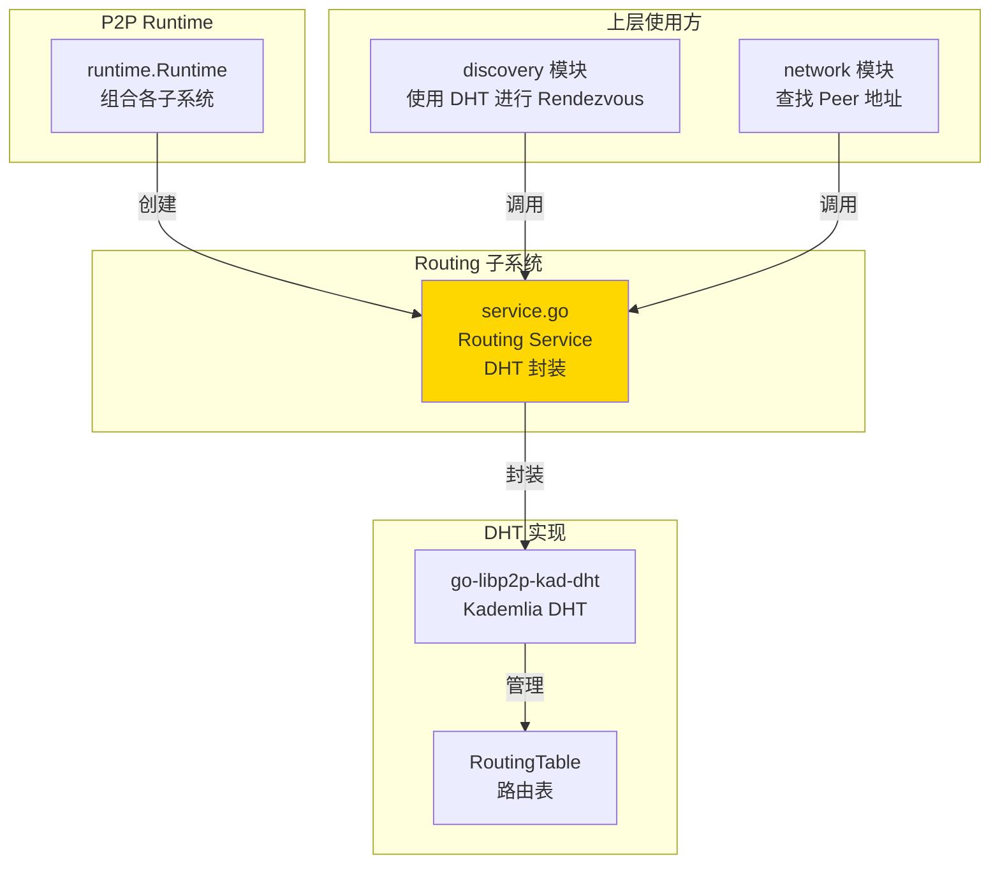
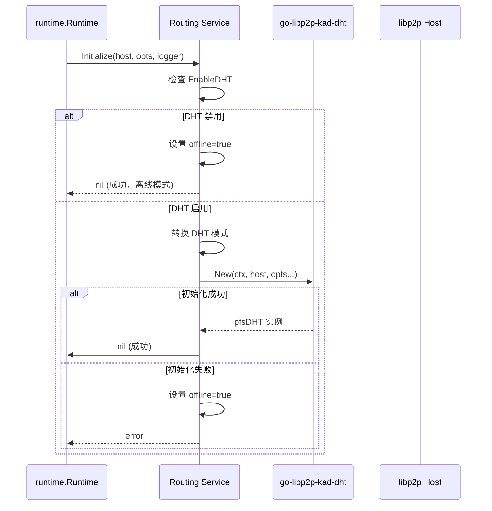
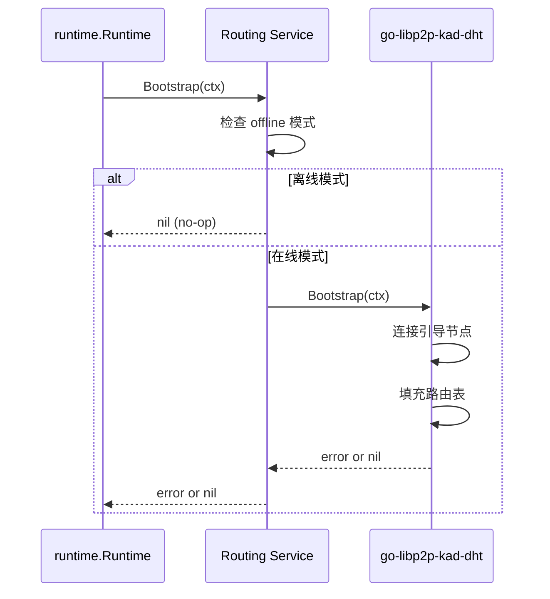

# Routing - DHT 路由子系统

---

## 📌 模块定位

**路径**：`internal/core/p2p/routing/`

**核心职责**：封装 `go-libp2p-kad-dht`，提供基于 DHT 的 Peer 路由与发现能力。

**在 P2P 模块中的角色**：
- 对标 Kubo Routing：基于 Kademlia DHT 的 Peer 路由
- 提供 `FindPeer()` 和 `FindClosestPeers()` 能力
- 支持多种 DHT 模式（client/server/auto/lan）
- 管理 DHT Bootstrap 流程

**边界说明**：
- ✅ **负责**：DHT 路由表管理、Peer 查找、DHT Bootstrap
- ❌ **不负责**：Peer 发现调度（由 Discovery 负责）、连接管理（由 Swarm 负责）

---

## 🏗️ 架构设计

### 在 P2P 模块中的位置



**模块职责**：

| 组件 | 职责 | 关键方法 |
|-----|------|---------|
| **Service** | DHT 路由封装 | `FindPeer()`, `FindClosestPeers()`, `Bootstrap()`, `Mode()` |

---

## 📁 目录结构

```
internal/core/p2p/routing/
├── README.md          # 本文档
└── service.go         # Routing Service 实现
```

---

## 🔧 核心实现

### Routing Service

**文件**：`service.go`

**核心类型**：`Service`

**职责**：
- 封装 `go-libp2p-kad-dht` 的 DHT 能力
- 支持多种 DHT 模式（client/server/auto/lan）
- 管理 DHT Bootstrap 流程
- 提供离线模式（DHT 禁用或初始化失败时）

**关键字段**：

```go
type Service struct {
    host    lphost.Host
    kdht    *dht.IpfsDHT
    mode    p2pi.DHTMode
    opts    *p2pcfg.Options
    logger  logiface.Logger
    offline bool  // 离线模式标记
}
```

**关键方法**：

| 方法名 | 职责 | 返回值 | 备注 |
|-------|------|-------|-----|
| `NewService()` | 创建 Routing 服务 | `*Service` | 构造函数，指定 DHT 模式 |
| `Initialize()` | 初始化 DHT | `error` | 需要 Host 和配置 |
| `FindPeer()` | 查找指定 PeerID | `peer.AddrInfo, error` | DHT 查询 |
| `FindClosestPeers()` | 查找最接近的 Peer | `<-chan peer.AddrInfo, error` | 路由表查询 |
| `Bootstrap()` | 执行 DHT Bootstrap | `error` | 离线模式下为 no-op |
| `Mode()` | 返回当前 DHT 模式 | `DHTMode` | client/server/auto/lan |
| `Offline()` | 返回是否离线模式 | `bool` | 内部方法，供 Diagnostics 使用 |

**实现接口**：`pkg/interfaces/p2p.Routing`

---

## 🔄 核心行为

### DHT 初始化流程



### DHT Bootstrap 流程



### DHT 模式映射

| Profile / 链模式 | DHT 模式 | 说明 |
|-----------------|---------|------|
| `public` + `auto` | `server` | 公有链强制 server 模式 |
| `consortium` + 空 | `client` | 联盟链默认 client 模式 |
| `private` + `auto` | `lan` | 私有链强制 lan 模式 |
| 显式指定 | 使用指定值 | 用户显式配置 |

---

## ⚙️ 配置与依赖

### 配置来源

**单一配置来源**：`internal/config/p2p.Options`

**使用的配置字段**：

| 配置字段 | 用途 | 默认值 |
|---------|------|-------|
| `EnableDHT` | 是否启用 DHT | `true` |
| `DHTMode` | DHT 模式 | 根据 Profile 推导 |
| `BootstrapPeers` | 引导节点 | 空（需配置） |

**配置原则**：
- ✅ 只读取 `p2p.Options`，不定义默认值
- ✅ DHT 模式由 Profile 和配置共同决定
- ❌ 禁止硬编码默认值

### 依赖关系

| 依赖 | 来源 | 用途 |
|-----|------|-----|
| `lphost.Host` | `libp2p` | DHT 需要 Host |
| `go-libp2p-kad-dht` | `github.com/libp2p/go-libp2p-kad-dht` | DHT 实现 |
| `p2pcfg.Options` | `internal/config/p2p` | 配置来源 |
| `logiface.Logger` | `pkg/interfaces/infrastructure/log` | 日志 |

---

## 🔄 生命周期与并发模型

### 生命周期

**初始化时机**：由 `runtime.Runtime` 在 `Start()` 时初始化

```go
// runtime/runtime.go
routingSvc := routing.NewService(dhtMode)
if err := routingSvc.Initialize(r.host, r.opts, r.logger); err != nil {
    // 初始化失败不阻断其他服务
}
```

**Bootstrap 时机**：初始化成功后立即执行 Bootstrap

```go
if err := routingSvc.Bootstrap(ctx); err != nil {
    // Bootstrap 失败记录警告，不阻断
}
```

**生命周期管理**：
- Routing Service 本身无独立生命周期
- DHT 实例由 libp2p 管理
- Host 关闭时 DHT 自动关闭

### 并发安全

| 组件 | 并发安全 | 保护机制 |
|-----|---------|---------|
| `Service.kdht` | ✅ 是 | libp2p DHT 内部保证 |
| `FindPeer()`, `FindClosestPeers()` | ✅ 是 | DHT 查询线程安全 |
| `Bootstrap()` | ✅ 是 | 可并发调用，DHT 内部管理 |

---

## 📊 可观测性与诊断

### 暴露的指标

**通过 Diagnostics 模块暴露**：

| 指标 | 类型 | 说明 |
|-----|------|-----|
| `routing_table_size` | int | DHT 路由表大小 |
| `mode` | string | DHT 模式（client/server/auto/lan） |
| `offline` | bool | 是否离线模式 |
| `num_bootstrap_peers` | int | 配置的引导节点数量 |

**日志事件**：
- `p2p.routing.dht initialized mode=%v` - DHT 初始化成功
- `p2p.routing.dht bootstrap ok rt_size=%d` - Bootstrap 成功
- `p2p.routing.dht bootstrap failed` - Bootstrap 失败
- `p2p.routing.dht disabled by config, routing offline` - DHT 被禁用

### 诊断端点

**通过 Diagnostics 模块暴露**：
- `/debug/p2p/routing` - DHT 路由信息

---

## 🔗 与其他模块的协作

### 被 Runtime 使用

**使用方式**：

```go
// runtime/runtime.go
routingSvc := routing.NewService(dhtMode)
routingSvc.Initialize(r.host, r.opts, r.logger)
r.routing = routingSvc
```

### 被 Discovery 使用

**使用方式**：

```go
// discovery/service.go
// Runtime 将 RendezvousRouting 能力注入到 Discovery
discoverySvc.SetRendezvousRouting(routingSvc)

// Discovery 使用 RendezvousRouting 接口进行 Rendezvous 发现
peerCh, err := routingSvc.AdvertiseAndFindPeers(ctx, ns)
```

### 被 Network 模块使用

**使用方式**：

```go
// network 模块通过 p2p.Service 访问
routing := p2pService.Routing()
addrInfo, err := routing.FindPeer(ctx, peerID)
```

---

## 📊 关键设计决策

### 决策 1：离线模式设计

**问题**：DHT 禁用或初始化失败时，如何避免上层模块报错？

**方案**：引入 `offline` 标记，离线模式下 `Bootstrap()` 和查询方法返回 no-op 或错误。

**理由**：
- 允许用户显式禁用 DHT（私有链场景）
- 初始化失败时不阻断其他服务
- 提供明确的错误信息

**权衡**：
- ✅ 优点：容错性好，不影响其他功能
- ⚠️ 缺点：需要上层模块处理离线情况

### 决策 2：DHT 模式映射

**问题**：如何根据链类型自动选择 DHT 模式？

**方案**：在 `internal/config/p2p.NewFromChainConfig()` 中根据链模式推导 DHT 模式。

**理由**：
- 符合"配置单一来源"原则
- 减少用户配置负担
- 保证配置一致性

---

## 🧪 测试

### 测试覆盖

| 测试类型 | 文件 | 覆盖率目标 | 当前状态 |
|---------|------|-----------|---------|
| 单元测试 | `routing_test.go` | ≥ 80% | 待补充 |
| 集成测试 | `../integration/` | 核心场景 | 待补充 |

---

## 📚 相关文档

- [P2P 模块顶层 README](../README.md) - P2P 模块整体架构
- [Discovery 实现](../discovery/README.md) - Discovery 如何使用 DHT
- [配置管理规范](../../config/README.md) - DHT 配置说明
- [Kubo Routing 文档](https://github.com/ipfs/kubo) - 对标实现参考
- [Kademlia DHT 论文](https://pdos.csail.mit.edu/~petar/papers/maymounkov-kademlia-lncs.pdf) - DHT 算法原理

---

## 📝 变更历史

| 版本 | 日期 | 变更内容 | 作者 |
|-----|------|---------|------|
| 1.0 | 2025-01-XX | 初始版本 | - |

---

## 🚧 待办事项

- [ ] 集成持久化存储（Badger）
- [ ] 优化 DHT Bootstrap 策略
- [ ] 添加路由表状态查询接口
- [ ] 完善单元测试覆盖
- [ ] 添加 DHT 查询性能优化

