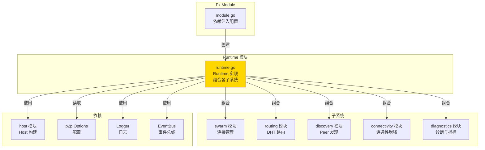
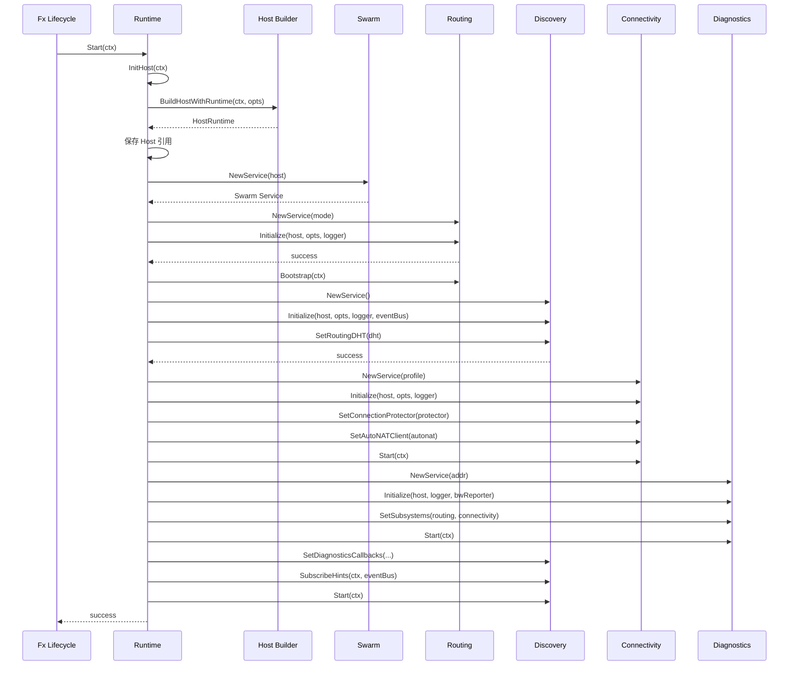
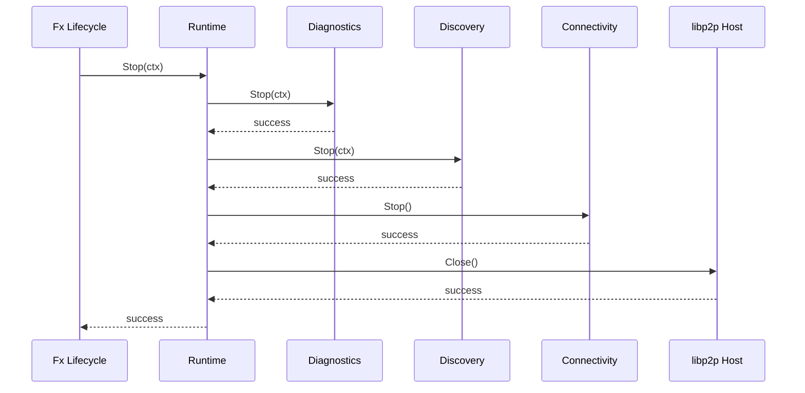

# Runtime - P2P 运行时组合器

---

## 📌 模块定位

**路径**：`internal/core/p2p/runtime/`

**核心职责**：组合所有 P2P 子系统（Swarm、Routing、Discovery、Connectivity、Diagnostics），实现 `InternalP2P` 接口，管理 P2P 运行时的完整生命周期。

**在 P2P 模块中的角色**：
- 作为 P2P Node Runtime 的组合器和生命周期管理者
- 实现 `InternalP2P` 接口（嵌入公共接口 `p2pi.Service`）
- 通过 Fx Module 暴露给其他模块使用
- 协调各子系统的初始化和启动顺序

**边界说明**：
- ✅ **负责**：子系统组合、生命周期管理、依赖注入协调
- ❌ **不负责**：具体业务逻辑（由各子系统负责）

---

## 🏗️ 架构设计

### 在 P2P 模块中的位置



**模块职责**：

| 组件 | 职责 | 关键方法 |
|-----|------|---------|
| **Runtime** | 运行时组合器 | `Start()`, `Stop()`, `InitHost()` |

---

## 📁 目录结构

```
internal/core/p2p/runtime/
├── README.md          # 本文档
└── runtime.go         # Runtime 实现
```

---

## 🔧 核心实现

### Runtime

**文件**：`runtime.go`

**核心类型**：`Runtime`

**职责**：
- 组合所有子系统
- 管理 P2P 运行时的生命周期
- 实现 `InternalP2P` 接口
- 协调子系统间的依赖注入

**关键字段**：

```go
type Runtime struct {
    host         lphost.Host
    hostRuntime  *p2phost.HostRuntime
    swarm        p2pi.Swarm
    routing      p2pi.Routing
    discovery    p2pi.Discovery
    connectivity p2pi.Connectivity
    diagnostics  p2pi.Diagnostics
    
    logger         logiface.Logger
    opts           *p2pcfg.Options
    eventBus       event.EventBus
    configProvider cfgprovider.Provider
}
```

**关键方法**：

| 方法名 | 职责 | 返回值 | 备注 |
|-------|------|-------|-----|
| `NewRuntime()` | 创建 Runtime | `*Runtime, error` | 构造函数 |
| `NewRuntimeWithConfig()` | 创建 Runtime（带配置提供者） | `*Runtime, error` | 构造函数 |
| `InitHost()` | 初始化 Host | `error` | 幂等操作 |
| `Start()` | 启动 Runtime | `error` | 启动所有子系统 |
| `Stop()` | 停止 Runtime | `error` | 停止所有子系统 |
| `Host()` | 返回 Host | `lphost.Host` | 实现接口 |
| `Swarm()` | 返回 Swarm | `p2pi.Swarm` | 实现接口 |
| `Routing()` | 返回 Routing | `p2pi.Routing` | 实现接口 |
| `Discovery()` | 返回 Discovery | `p2pi.Discovery` | 实现接口 |
| `Connectivity()` | 返回 Connectivity | `p2pi.Connectivity` | 实现接口 |
| `Diagnostics()` | 返回 Diagnostics | `p2pi.Diagnostics` | 实现接口 |

**实现接口**：`interfaces.InternalP2P`（嵌入 `p2pi.Service`）

---

## 🔄 核心行为

### 启动流程



**启动顺序**：
1. **InitHost** - 构建 libp2p Host
2. **Swarm** - 创建 Swarm Service（无状态）
3. **Routing** - 初始化 DHT 并 Bootstrap
4. **Discovery** - 初始化并设置 DHT 引用
5. **Connectivity** - 初始化并启动 Manager
6. **Diagnostics** - 初始化并启动 HTTP 服务器
7. **Discovery** - 设置 Diagnostics 回调并启动

**错误处理策略**：
- Host 初始化失败：**fail-fast**（阻断启动）
- Routing 初始化失败：**记录警告，继续**（离线模式）
- Discovery 初始化失败：**fail-fast**（必需服务）
- Connectivity 启动失败：**记录警告，继续**（可选服务）
- Diagnostics 启动失败：**记录警告，继续**（可选服务）

### 停止流程



**停止顺序**：
1. **Diagnostics** - 停止 HTTP 服务器
2. **Discovery** - 停止发现服务
3. **Connectivity** - 停止连通性管理器
4. **Host** - 关闭 libp2p Host（自动关闭所有连接）

---

## ⚙️ 配置与依赖

### 配置来源

**单一配置来源**：`internal/config/p2p.Options`

**使用的配置字段**：所有 P2P 配置字段（通过各子系统使用）

### 依赖关系

| 依赖 | 来源 | 用途 |
|-----|------|-----|
| `p2pcfg.Options` | `internal/config/p2p` | 配置来源 |
| `logiface.Logger` | `pkg/interfaces/infrastructure/log` | 日志 |
| `event.EventBus` | `pkg/interfaces/infrastructure/event` | 事件总线 |
| `cfgprovider.Provider` | `pkg/interfaces/config` | 配置提供者（可选） |

---

## 🔄 生命周期与并发模型

### 生命周期

**创建时机**：由 Fx Module 在 `ProvideService` 时创建

```go
// module.go
fx.Provide(
    fx.Annotate(
        runtime.NewRuntime,
        fx.As(new(p2pi.Service)),
    ),
)
```

**启动时机**：由 Fx Lifecycle 在 `OnStart` 时调用

```go
// module.go
fx.Invoke(func(lc fx.Lifecycle, p2p p2pi.Service) {
    lc.Append(fx.Hook{
        OnStart: func(ctx context.Context) error {
            if rt, ok := p2p.(interface{ Start(context.Context) error }); ok {
                return rt.Start(ctx)
            }
            return nil
        },
        OnStop: func(ctx context.Context) error {
            if rt, ok := p2p.(interface{ Stop(context.Context) error }); ok {
                return rt.Stop(ctx)
            }
            return nil
        },
    })
})
```

### 并发安全

| 组件 | 并发安全 | 保护机制 |
|-----|---------|---------|
| `Runtime.host` | ✅ 是 | libp2p Host 内部保证 |
| `Runtime.swarm` | ✅ 是 | Swarm Service 线程安全 |
| `Runtime.routing` | ✅ 是 | Routing Service 线程安全 |
| `Runtime.discovery` | ✅ 是 | Discovery Service 线程安全 |
| `Runtime.connectivity` | ✅ 是 | Connectivity Service 线程安全 |
| `Runtime.diagnostics` | ✅ 是 | Diagnostics Service 线程安全 |

---

## 🔗 与其他模块的协作

### 被 Fx Module 使用

**使用方式**：

```go
// module.go
fx.Module("p2p",
    fx.Provide(
        fx.Annotate(
            runtime.NewRuntime,
            fx.As(new(p2pi.Service)),
        ),
    ),
    fx.Invoke(func(lc fx.Lifecycle, p2p p2pi.Service) {
        // 生命周期管理
    }),
)
```

### 被 Network 模块使用

**使用方式**：

```go
// network 模块通过依赖注入获取
type NetworkModuleInput struct {
    fx.In
    P2P p2pi.Service `name:"p2p_service"`
}

func NewNetworkService(p2p p2pi.Service) {
    host := p2p.Host()
    swarm := p2p.Swarm()
    routing := p2p.Routing()
    // ...
}
```

### 被 BaaS / Explorer 使用

**使用方式**：

```go
// BaaS / Explorer 通过 p2p_service 获取诊断信息
p2p := container.Get("p2p_service").(p2pi.Service)
diagnostics := p2p.Diagnostics()
httpAddr := diagnostics.HTTPAddr()
// 访问诊断端点
```

---

## 📊 关键设计决策

### 决策 1：组合器模式

**问题**：如何组织多个子系统？

**方案**：使用组合器模式，Runtime 组合所有子系统，统一管理生命周期。

**理由**：
- 职责清晰，Runtime 负责组合和协调
- 便于统一管理生命周期
- 便于依赖注入和测试

**权衡**：
- ✅ 优点：结构清晰，易于维护
- ⚠️ 缺点：Runtime 类较大

### 决策 2：错误处理策略

**问题**：子系统初始化失败时如何处理？

**方案**：区分必需服务和可选服务，必需服务失败时 fail-fast，可选服务失败时记录警告继续。

**理由**：
- 保证核心功能可用（Host、Discovery）
- 允许部分功能降级（Routing、Connectivity、Diagnostics）
- 提供明确的错误信息

**权衡**：
- ✅ 优点：容错性好，不影响核心功能
- ⚠️ 缺点：需要明确区分必需/可选服务

### 决策 3：InitHost 幂等性

**问题**：Host 何时构建？

**方案**：提供 `InitHost()` 方法，支持在 Fx 构造阶段和 Start 阶段调用，幂等操作。

**理由**：
- 允许 Network 模块在构造阶段获取 Host
- 保证 Start 阶段 Host 已就绪
- 避免重复构建

**权衡**：
- ✅ 优点：灵活，支持多种使用场景
- ⚠️ 缺点：需要保证幂等性

---

## 🧪 测试

### 测试覆盖

| 测试类型 | 文件 | 覆盖率目标 | 当前状态 |
|---------|------|-----------|---------|
| 单元测试 | `runtime_test.go` | ≥ 80% | 待补充 |
| 集成测试 | `../integration/` | 核心场景 | 待补充 |

---

## 📚 相关文档

- [P2P 模块顶层 README](../README.md) - P2P 模块整体架构
- [Fx Module 配置](../module.go) - 依赖注入配置
- [各子系统 README](../) - 各子系统的详细文档

---

## 📝 变更历史

| 版本 | 日期 | 变更内容 | 作者 |
|-----|------|---------|------|
| 1.0 | 2025-01-XX | 初始版本 | - |

---

## 🚧 待办事项

- [ ] 完善单元测试覆盖
- [ ] 添加集成测试
- [ ] 优化启动顺序
- [ ] 完善错误处理策略

