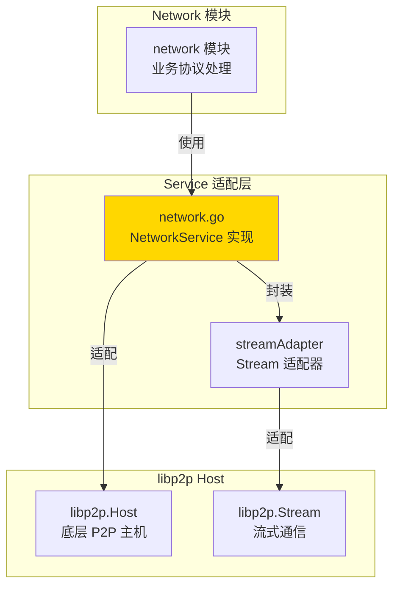
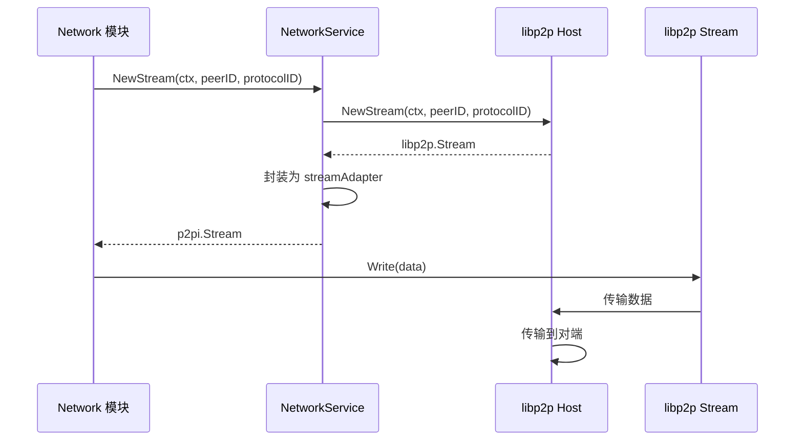
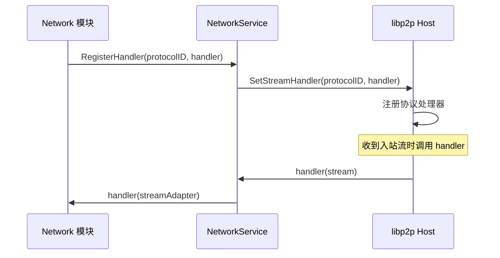
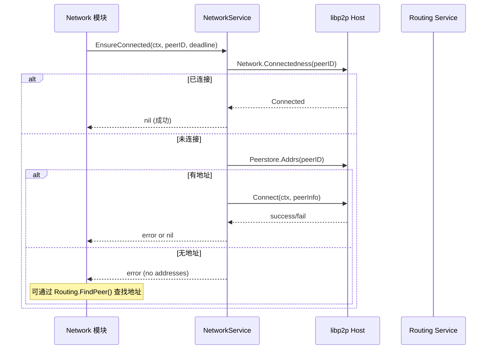

# Service - 网络服务适配器

---

## 📌 模块定位

**路径**：`internal/core/p2p/service/`

**核心职责**：提供 `p2p.NetworkService` 接口的实现，将 libp2p Host 的能力适配为网络服务接口。

**在 P2P 模块中的角色**：
- 适配层：将 libp2p Host 的能力适配为 `p2pi.NetworkService` 接口
- 提供流式通信能力（`NewStream`、`RegisterHandler`）
- 提供连接管理能力（`EnsureConnected`）
- 作为 Network 模块与 P2P 模块之间的桥梁

**边界说明**：
- ✅ **负责**：流式通信适配、连接管理适配、协议注册适配
- ❌ **不负责**：业务协议处理（由 Network 模块负责）、连接发现（由 Discovery 负责）

---

## 🏗️ 架构设计

### 在 P2P 模块中的位置



**模块职责**：

| 组件 | 职责 | 关键方法 |
|-----|------|---------|
| **networkService** | 网络服务实现 | `NewStream()`, `RegisterHandler()`, `EnsureConnected()` |
| **streamAdapter** | Stream 适配器 | `Read()`, `Write()`, `Close()` |

---

## 📁 目录结构

```
internal/core/p2p/service/
├── README.md          # 本文档
└── network.go         # NetworkService 实现
```

---

## 🔧 核心实现

### NetworkService

**文件**：`network.go`

**核心类型**：`networkService`

**职责**：
- 实现 `p2pi.NetworkService` 接口
- 适配 libp2p Host 的流式通信能力
- 适配 libp2p Host 的连接管理能力

**关键字段**：

```go
type networkService struct {
    host   lphost.Host
    logger logiface.Logger
}
```

**关键方法**：

| 方法名 | 职责 | 返回值 | 备注 |
|-------|------|-------|-----|
| `NewNetworkService()` | 创建网络服务 | `p2pi.NetworkService` | 构造函数 |
| `EnsureConnected()` | 确保连接 | `error` | 幂等操作 |
| `NewStream()` | 打开出站流 | `p2pi.Stream, error` | 适配 libp2p Stream |
| `RegisterHandler()` | 注册协议处理器 | - | 适配 libp2p SetStreamHandler |
| `UnregisterHandler()` | 注销协议处理器 | - | 适配 libp2p RemoveStreamHandler |

**实现接口**：`pkg/interfaces/p2p.NetworkService`

### StreamAdapter

**文件**：`network.go`

**核心类型**：`streamAdapter`

**职责**：
- 将 libp2p Stream 适配为 `p2pi.Stream` 接口
- 提供统一的流式通信接口

**关键方法**：

| 方法名 | 职责 | 返回值 |
|-------|------|-------|
| `ID()` | 返回流 ID | `string` |
| `Peer()` | 返回对端 PeerID | `peer.ID` |
| `Read()` | 读取数据 | `int, error` |
| `Write()` | 写入数据 | `int, error` |
| `Close()` | 关闭流 | `error` |

---

## 🔄 核心行为

### 流式通信流程



### 协议注册流程



### 连接确保流程



---

## ⚙️ 配置与依赖

### 配置来源

**间接依赖**：Service 本身不直接读取配置，但依赖的 Host 由 `p2p.Options` 配置。

### 依赖关系

| 依赖 | 来源 | 用途 |
|-----|------|-----|
| `lphost.Host` | `libp2p` | 访问网络层 |
| `logiface.Logger` | `pkg/interfaces/infrastructure/log` | 日志 |

---

## 🔄 生命周期与并发模型

### 生命周期

**创建时机**：由 Network 模块创建（通过依赖注入）

```go
// network 模块
networkService := p2pservice.NewNetworkService(host, logger)
```

**生命周期管理**：
- Service 本身无独立生命周期
- 依赖 Host 的生命周期（Host 关闭时流自动关闭）
- 无需显式 `Start/Stop` 方法

### 并发安全

| 组件 | 并发安全 | 保护机制 |
|-----|---------|---------|
| `networkService.host` | ✅ 是 | libp2p Host 内部保证 |
| `streamAdapter` | ✅ 是 | libp2p Stream 内部保证 |
| `NewStream()` | ✅ 是 | libp2p Host 线程安全 |
| `RegisterHandler()` | ✅ 是 | libp2p Host 线程安全 |

---

## 🔗 与其他模块的协作

### 被 Network 模块使用

**使用方式**：

```go
// network 模块
networkService := p2pservice.NewNetworkService(host, logger)

// 注册协议处理器
networkService.RegisterHandler("protocol/1.0.0", func(ctx context.Context, stream p2pi.Stream) {
    // 处理流
})

// 打开出站流
stream, err := networkService.NewStream(ctx, peerID, "protocol/1.0.0")
```

### 依赖 Host

**使用方式**：

```go
// service/network.go
// 直接使用 libp2p Host
stream, err := n.host.NewStream(ctx, to, libprotocol.ID(protocolID))
```

---

## 📊 关键设计决策

### 决策 1：适配器模式

**问题**：如何将 libp2p Host 的能力适配为 NetworkService 接口？

**方案**：使用适配器模式，提供 `networkService` 和 `streamAdapter` 适配 libp2p 接口。

**理由**：
- 保持接口稳定性（不直接暴露 libp2p 接口）
- 便于未来替换底层实现
- 简化上层模块的使用

**权衡**：
- ✅ 优点：接口清晰，易于维护
- ⚠️ 缺点：增加一层抽象

### 决策 2：连接确保策略

**问题**：`EnsureConnected()` 如何处理无地址的情况？

**方案**：返回错误，提示上层可通过 Routing 查找地址。

**理由**：
- 保持职责分离（Service 不负责路由查找）
- 提供明确的错误信息
- 允许上层灵活处理

**权衡**：
- ✅ 优点：职责清晰
- ⚠️ 缺点：需要上层处理路由查找

---

## 🧪 测试

### 测试覆盖

| 测试类型 | 文件 | 覆盖率目标 | 当前状态 |
|---------|------|-----------|---------|
| 单元测试 | `service_test.go` | ≥ 80% | 待补充 |
| 集成测试 | `../integration/` | 核心场景 | 待补充 |

---

## 📚 相关文档

- [P2P 模块顶层 README](../README.md) - P2P 模块整体架构
- [NetworkService 接口](../../../../pkg/interfaces/p2p/README.md) - 接口定义
- [Network 模块文档](../../network/README.md) - Network 模块如何使用 Service

---

## 📝 变更历史

| 版本 | 日期 | 变更内容 | 作者 |
|-----|------|---------|------|
| 1.0 | 2025-01-XX | 初始版本 | - |

---

## 🚧 待办事项

- [ ] 完善单元测试覆盖
- [ ] 添加流式通信性能优化
- [ ] 完善错误处理
- [ ] 添加连接重试机制

