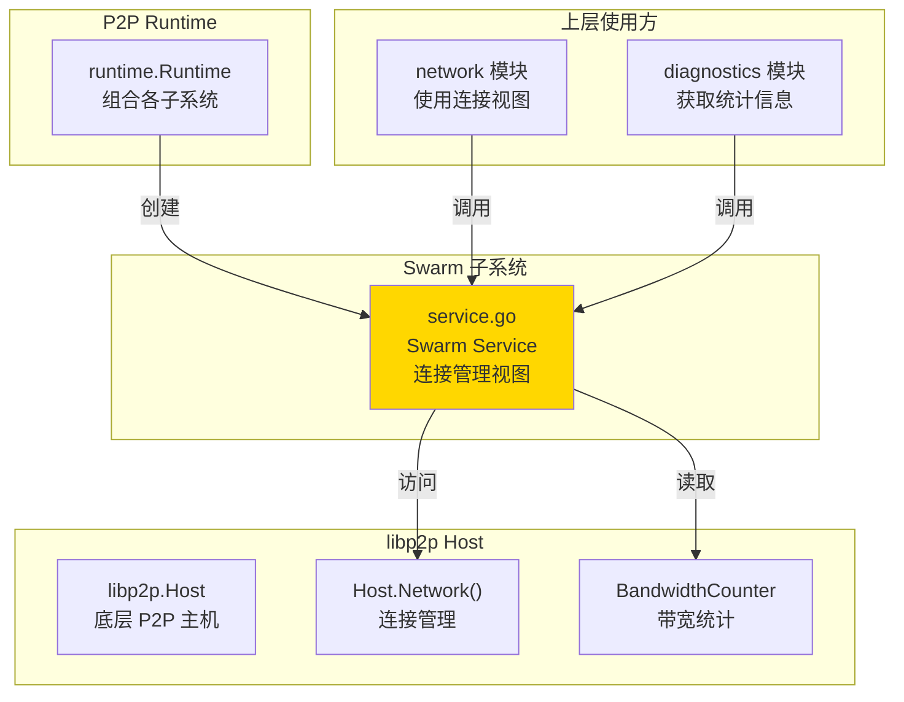
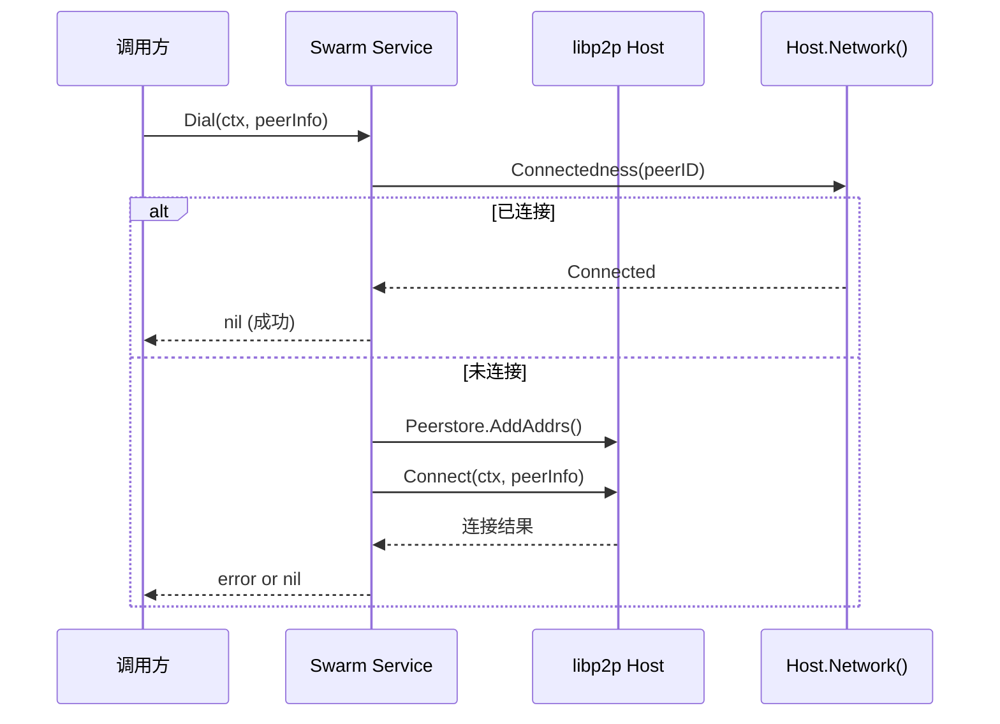

# Swarm - 连接管理子系统

---

## 📌 模块定位

**路径**：`internal/core/p2p/swarm/`

**核心职责**：管理 P2P 网络中的所有连接、流和带宽统计，提供连接视图与 Dial 能力。

**在 P2P 模块中的角色**：
- 对标 Kubo Swarm：封装 `libp2p.Host.Network()` 的连接管理能力
- 提供连接状态查询（Peers、Connections、Stats）
- 提供主动连接能力（Dial）
- 统计带宽使用情况（通过共享 BandwidthCounter）

**边界说明**：
- ✅ **负责**：连接管理、流统计、带宽统计、连接视图
- ❌ **不负责**：路由查找（由 Routing 负责）、Gossip 传播（由 Network 模块负责）、Peer 发现（由 Discovery 负责）

---

## 🏗️ 架构设计

### 在 P2P 模块中的位置



**模块职责**：

| 组件 | 职责 | 关键方法 |
|-----|------|---------|
| **Service** | 连接管理视图 | `Peers()`, `Connections()`, `Stats()`, `Dial()` |

---

## 📁 目录结构

```
internal/core/p2p/swarm/
├── README.md          # 本文档
└── service.go         # Swarm Service 实现
```

---

## 🔧 核心实现

### Swarm Service

**文件**：`service.go`

**核心类型**：`Service`

**职责**：
- 封装 `libp2p.Host.Network()` 的连接管理能力
- 提供连接状态查询接口
- 提供主动连接能力
- 统计带宽使用情况

**关键字段**：

```go
type Service struct {
    host       lphost.Host
    bwReporter metrics.Reporter  // 共享带宽计数器
}
```

**关键方法**：

| 方法名 | 职责 | 返回值 | 备注 |
|-------|------|-------|-----|
| `NewService()` | 创建 Swarm 服务 | `*Service` | 构造函数 |
| `Peers()` | 返回当前连接的 Peer 列表 | `[]peer.AddrInfo` | 从 `host.Network().Conns()` 提取 |
| `Connections()` | 返回连接详细信息 | `[]ConnInfo` | 包含方向、地址、流数量等 |
| `Stats()` | 返回 Swarm 统计信息 | `SwarmStats` | 连接数、流数、带宽统计 |
| `Dial()` | 连接到指定 Peer | `error` | 幂等操作，已连接则直接返回 |

**实现接口**：`pkg/interfaces/p2p.Swarm`

---

## 🔄 核心行为

### 连接生命周期



### 统计信息收集

**Stats() 方法流程**：
1. 遍历 `host.Network().Conns()` 统计连接数（inbound/outbound）
2. 统计每个连接的流数量
3. 从共享 `BandwidthCounter` 获取带宽统计（速率、总量）

---

## ⚙️ 配置与依赖

### 配置来源

**间接依赖**：Swarm 本身不直接读取配置，但依赖的 Host 由 `p2p.Options` 配置。

**相关配置字段**（通过 Host 间接影响）：
- `LowWater`, `HighWater` - 连接水位（影响 ConnManager 行为）
- `MemoryLimitMB`, `MaxFileDescriptors` - 资源限制（影响 ResourceManager）

### 依赖关系

| 依赖 | 来源 | 用途 |
|-----|------|-----|
| `lphost.Host` | `libp2p` | 访问网络层 |
| `metrics.Reporter` | `p2p/host` | 带宽统计（共享 BandwidthCounter） |

---

## 🔄 生命周期与并发模型

### 生命周期

**创建时机**：由 `runtime.Runtime` 在 `Start()` 时创建

```go
// runtime/runtime.go
r.swarm = swarm.NewService(r.host)
```

**生命周期管理**：
- Swarm Service 本身无独立生命周期
- 依赖 Host 的生命周期（Host 关闭时连接自动关闭）
- 无需显式 `Start/Stop` 方法

### 并发安全

| 组件 | 并发安全 | 保护机制 |
|-----|---------|---------|
| `Service.host` | ✅ 是 | libp2p Host 内部保证 |
| `Service.bwReporter` | ✅ 是 | 共享 BandwidthCounter 线程安全 |
| `Peers()`, `Connections()`, `Stats()` | ✅ 是 | 只读操作，libp2p 保证 |

---

## 📊 可观测性与诊断

### 暴露的指标

**通过 `Stats()` 方法暴露**：

| 指标 | 类型 | 说明 |
|-----|------|-----|
| `NumPeers` | int | 当前连接的 Peer 数量 |
| `NumConns` | int | 当前连接数 |
| `NumStreams` | int | 当前流总数 |
| `InboundConns` | int | 入站连接数 |
| `OutboundConns` | int | 出站连接数 |
| `InboundRateBps` | float64 | 入站带宽速率（字节/秒） |
| `OutboundRateBps` | float64 | 出站带宽速率（字节/秒） |
| `InboundTotal` | int64 | 入站总流量（字节） |
| `OutboundTotal` | int64 | 出站总流量（字节） |

**日志事件**：
- 无独立日志（依赖 Host 和上层模块的日志）

### 诊断端点

**通过 Diagnostics 模块暴露**：
- `/debug/p2p/peers` - Peer 列表
- `/debug/p2p/connections` - 连接列表
- `/debug/p2p/stats` - Swarm 统计信息

---

## 🔗 与其他模块的协作

### 被 Runtime 使用

**使用方式**：

```go
// runtime/runtime.go
r.swarm = swarm.NewService(r.host)
```

### 被 Network 模块使用

**使用方式**：

```go
// network 模块通过 p2p.Service 访问
swarm := p2pService.Swarm()
peers := swarm.Peers()
stats := swarm.Stats()
```

### 被 Diagnostics 使用

**使用方式**：

```go
// diagnostics/service.go
swarm := p2pService.Swarm()
stats := swarm.Stats()
// 通过 HTTP 端点暴露
```

---

## 📊 关键设计决策

### 决策 1：只读视图 vs 主动管理

**问题**：Swarm 是否应该主动管理连接生命周期？

**方案**：Swarm 提供只读视图和 Dial 能力，连接生命周期由 libp2p ConnManager 管理。

**理由**：
- 符合职责分离原则（Swarm 负责视图，ConnManager 负责策略）
- 避免重复实现连接管理逻辑
- 利用 libp2p 成熟的连接管理能力

**权衡**：
- ✅ 优点：职责清晰，实现简单
- ⚠️ 缺点：连接策略调整需要通过 Host 配置

### 决策 2：共享带宽计数器

**问题**：如何让多个模块共享带宽统计？

**方案**：使用 `p2p/host.GetBandwidthCounter()` 获取共享带宽计数器。

**理由**：
- 避免重复统计
- 保证数据一致性
- 简化模块间协作

---

## 🧪 测试

### 测试覆盖

| 测试类型 | 文件 | 覆盖率目标 | 当前状态 |
|---------|------|-----------|---------|
| 单元测试 | `swarm_test.go` | ≥ 80% | 待补充 |
| 集成测试 | `../integration/` | 核心场景 | 待补充 |

---

## 📚 相关文档

- [P2P 模块顶层 README](../README.md) - P2P 模块整体架构
- [Runtime 实现](../runtime/README.md) - Runtime 如何创建 Swarm
- [Diagnostics 实现](../diagnostics/README.md) - 如何暴露 Swarm 统计
- [Kubo Swarm 文档](https://github.com/ipfs/kubo) - 对标实现参考

---

## 📝 变更历史

| 版本 | 日期 | 变更内容 | 作者 |
|-----|------|---------|------|
| 1.0 | 2025-01-XX | 初始版本 | - |

---

## 🚧 待办事项

- [ ] 完善单元测试覆盖
- [ ] 添加连接质量评估接口
- [ ] 优化带宽统计性能
- [ ] 添加连接池管理优化

