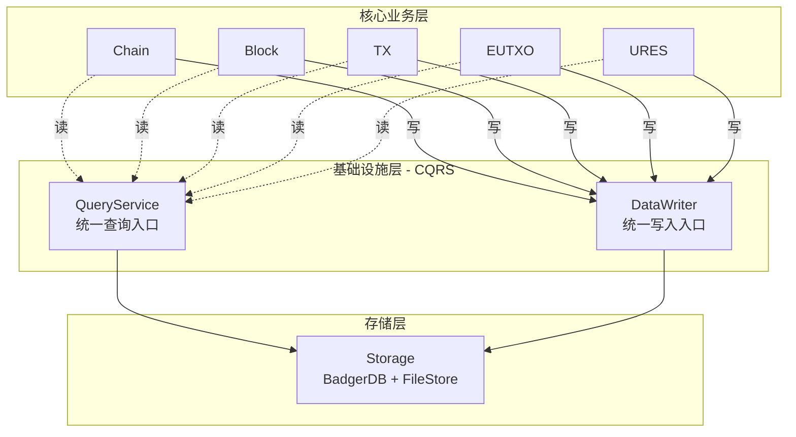
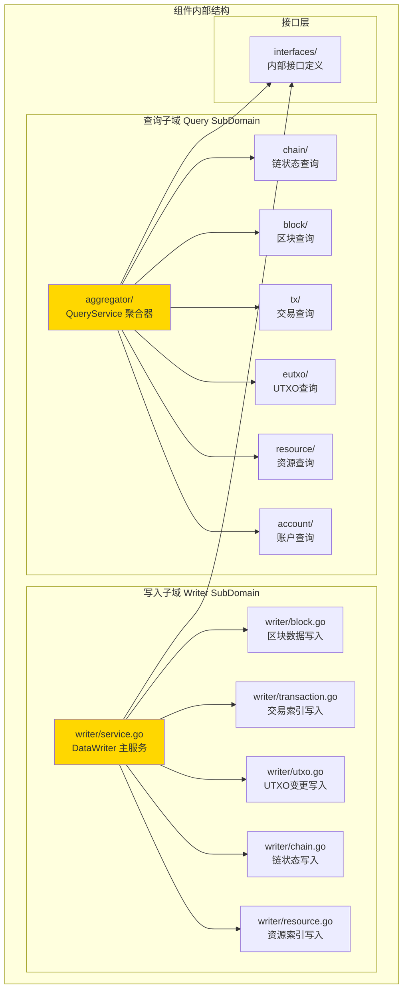
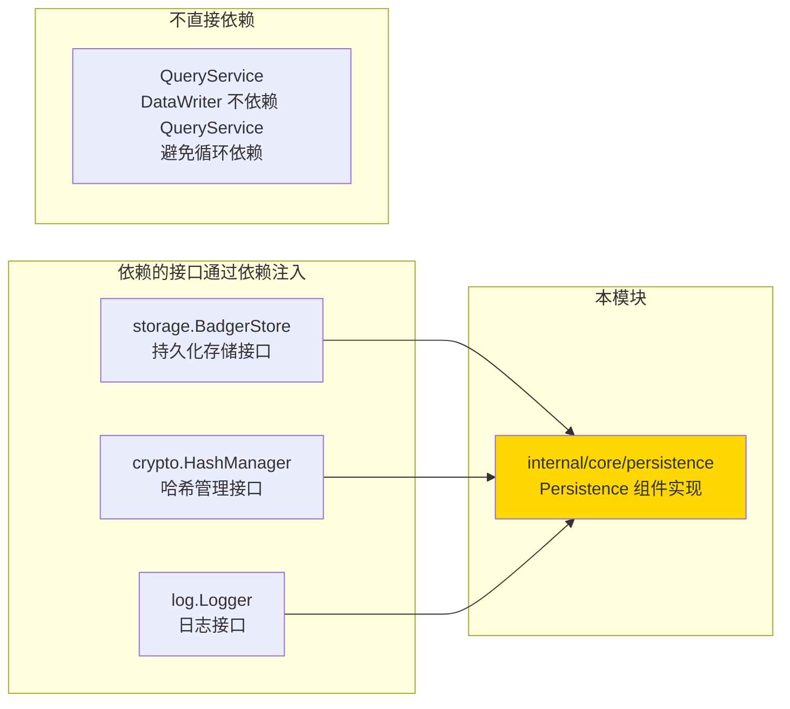
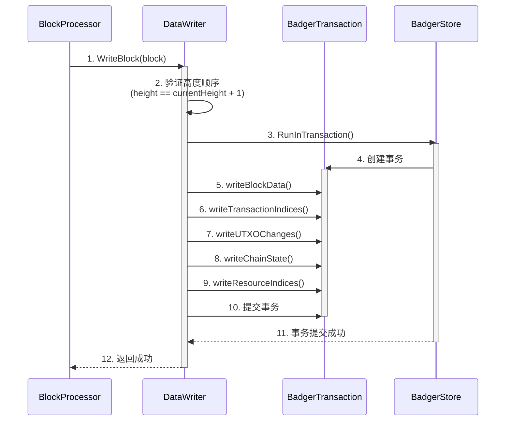
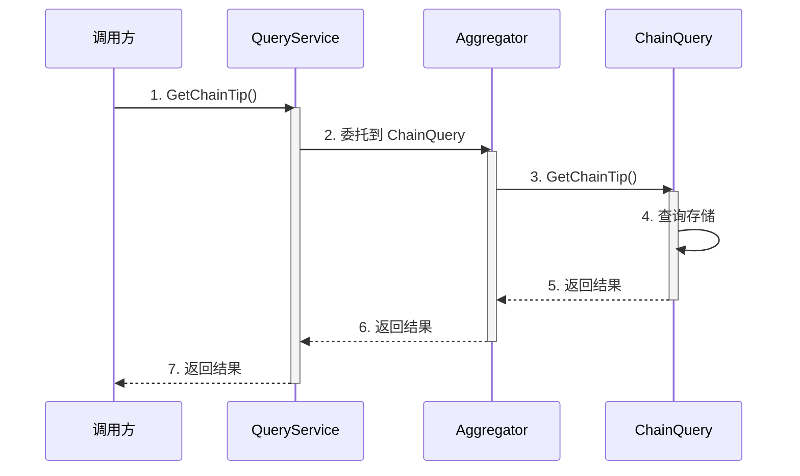

# Persistence - 实现

---

## 📌 版本信息

- **版本**：1.0
- **状态**：stable
- **最后更新**：2025-11-30
- **最后审核**：2025-11-30
- **所有者**：WES Persistence 开发组
- **适用范围**：WES Persistence 组件实现

---

## 🎯 实现定位

**路径**：`internal/core/persistence/`

**目的**：提供 Persistence 组件的具体实现，实现内部接口，并通过 `module.go` 配置依赖注入。

**核心原则**：
- ✅ 实现内部接口（而不是直接实现公共接口）
- ✅ 通过 `module.go` 统一管理依赖注入
- ✅ 保持实现与接口分离
- ✅ 遵循 CQRS 架构原则（读写分离）

**解决什么问题**：
- 提供统一的数据查询入口（QueryService），避免模块间循环依赖
- 提供统一的数据写入入口（DataWriter），确保所有写操作原子性完成
- 实现真正的读写分离，提升系统可维护性和性能

**不解决什么问题**（边界）：
- ❌ 不处理业务逻辑验证（由 BlockProcessor、TxProcessor 等处理）
- ❌ 不处理分叉检测和链重组（由 CHAIN 层 ForkHandler 处理）
- ❌ 不处理共识逻辑（由 Consensus 层处理）

---

## 🏗️ 架构设计

### CQRS 架构定位

**Persistence 是基础设施层（Infrastructure Layer），实现 CQRS 架构**：



**关键架构原则**：
- ✅ **被业务层调用**：业务层通过 QueryService 读取，通过 DataWriter 写入
- ❌ **不调用业务层**：persistence 只操作存储（Storage），不依赖业务组件
- ✅ **CQRS 架构**：QueryService（只读）+ DataWriter（只写）
- ✅ **统一入口**：所有读通过 QueryService，所有写通过 DataWriter
- ✅ **避免循环依赖**：通过统一查询服务解耦业务层

> ⚠️ **重要说明**：文档中的"领域 Writer"（如 `UTXOWriter`）是 `persistence` 组件**内部**的实现，不是外部业务组件 `pkg/interfaces/eutxo/UTXOWriter`。`persistence.DataWriter` 应该直接操作存储，不依赖外部业务组件。

### 整体架构

> **说明**：展示组件的整体架构，包括查询服务和写入服务

```mermaid
graph TB
    subgraph "上游使用方"
        UP1["BlockProcessor<br/>区块处理"]
        UP2["ForkHandler<br/>分叉处理"]
        UP3["SyncService<br/>同步服务"]
        UP4["其他业务模块<br/>查询需求"]
    end
    
    subgraph "本模块 - internal/core/persistence"
        subgraph "查询服务 Query Service"
            QUERY["QueryService<br/>统一查询入口"]
            Q_CHAIN["ChainQuery<br/>链状态查询"]
            Q_BLOCK["BlockQuery<br/>区块查询"]
            Q_TX["TxQuery<br/>交易查询"]
            Q_UTXO["UTXOQuery<br/>UTXO查询"]
            Q_RESOURCE["ResourceQuery<br/>资源查询"]
            Q_ACCOUNT["AccountQuery<br/>账户查询"]
            
            QUERY --> Q_CHAIN
            QUERY --> Q_BLOCK
            QUERY --> Q_TX
            QUERY --> Q_UTXO
            QUERY --> Q_RESOURCE
            QUERY --> Q_ACCOUNT
        end
        
        subgraph "写入服务 Writer Service"
            WRITER["DataWriter<br/>统一写入入口"]
            W_BLOCK["writeBlockData<br/>区块数据"]
            W_TX["writeTransactionIndices<br/>交易索引"]
            W_UTXO["writeUTXOChanges<br/>UTXO变更"]
            W_CHAIN["writeChainState<br/>链状态"]
            W_RESOURCE["writeResourceIndices<br/>资源索引"]
            
            WRITER --> W_BLOCK
            WRITER --> W_TX
            WRITER --> W_UTXO
            WRITER --> W_CHAIN
            WRITER --> W_RESOURCE
        end
    end
    
    subgraph "下游依赖"
        DOWN1["storage.BadgerStore<br/>持久化存储"]
        DOWN2["crypto.HashManager<br/>哈希服务"]
        DOWN3["log.Logger<br/>日志服务"]
    end
    
    UP1 --> WRITER
    UP2 --> WRITER
    UP3 --> WRITER
    UP4 --> QUERY
    
    WRITER -.依赖注入.-> DOWN1
    WRITER -.依赖注入.-> DOWN2
    WRITER -.依赖注入.-> DOWN3
    QUERY -.依赖注入.-> DOWN1
    QUERY -.依赖注入.-> DOWN3
    
    style QUERY fill:#FFD700
    style WRITER fill:#FFD700
```



**架构说明**：

| 层级 | 组件 | 职责 | 关键机制 |
|-----|------|------|---------|
| **查询服务** | QueryService | 统一查询入口，组合所有领域查询接口 | 组合模式，聚合所有子查询服务 |
| **写入服务** | DataWriter | 统一写入入口，协调所有数据写入操作 | 事务管理，原子性保证 |
| **依赖** | BadgerStore | 持久化存储 | 事务支持，原子性 |
| **依赖** | HashManager | 哈希计算 | 区块和交易哈希计算 |

---

### 内部结构

> **说明**：展示组件内部的子模块组织和协作关系



**子域说明**：

| 子域 | 核心组件 | 职责 | 协作关系 |
|-----|---------|------|---------|
| **Query** | aggregator, chain, block, tx, eutxo, resource, account | 提供统一查询服务，聚合所有领域查询 | 通过组合模式聚合所有子查询服务 |
| **Writer** | service, block, transaction, utxo, chain, resource | 提供统一写入服务，协调所有数据写入 | 通过委托模式协调各写入操作 |

---

### 依赖关系

> **说明**：展示本组件依赖的外部组件接口



**依赖说明**：

| 依赖模块 | 依赖接口 | 用途 | 约束条件 |
|---------|---------|------|---------|
| **infrastructure/storage** | `BadgerStore` | 持久化存储，支持事务 | 必需依赖 |
| **infrastructure/crypto** | `HashManager` | 计算区块和交易哈希 | 必需依赖（仅 Writer） |
| **infrastructure/log** | `Logger` | 日志记录 | 可选依赖 |
| **无** | （内部实现） | Query 和 Writer 在同一组件中，但职责分离 | DataWriter 不依赖 QueryService |

**⚠️ 禁止的依赖**：
- ❌ **禁止依赖业务层组件**：`persistence.DataWriter` 不应依赖 `eutxo.UTXOWriter` 等业务层组件
- ✅ **只依赖基础设施层**：persistence 只操作存储（BadgerDB + FileStore），不调用业务组件
- ✅ **职责分离**：UTXO 的存储格式和索引管理应该在 persistence 组件内部实现，不依赖外部的 `eutxo.UTXOWriter`

> 📖 **详细架构分析和当前问题**：参见 [../../ARCHITECTURE_DEPENDENCY_ANALYSIS.md](../../ARCHITECTURE_DEPENDENCY_ANALYSIS.md)

---

### 核心流程

> **说明**：展示关键业务流程的时序图

#### 区块写入流程



**流程说明**：
1. **步骤1-2**：BlockProcessor 调用 DataWriter.WriteBlock()，DataWriter 验证区块高度顺序
2. **步骤3-9**：在单一事务中执行所有写入操作（区块数据、交易索引、UTXO变更、链状态、资源索引）
3. **步骤10-12**：事务提交，返回结果

#### 查询流程



**流程说明**：
1. **步骤1-2**：调用方通过 QueryService 查询，QueryService 委托到对应的子查询服务
2. **步骤3-5**：子查询服务查询存储并返回结果
3. **步骤6-7**：结果通过聚合器返回给调用方

---

## 📐 目录结构

```
internal/core/persistence/
├── README.md                    # 本文档（实现总览）
├── module.go                    # 依赖注入配置 ⭐
│
├── interfaces/                  # 内部接口层
│   ├── README.md               # 内部接口说明
│   ├── query.go                # 查询接口定义
│   └── writer.go               # 写入接口定义
│
├── query/                       # 查询子域
│   ├── README.md               # 查询子域说明
│   ├── aggregator/             # QueryService 聚合器
│   │   └── service.go
│   ├── chain/                  # 链状态查询
│   │   └── service.go
│   ├── block/                  # 区块查询
│   │   └── service.go
│   ├── tx/                     # 交易查询
│   │   └── service.go
│   ├── eutxo/                  # UTXO查询
│   │   └── service.go
│   ├── resource/               # 资源查询
│   │   └── service.go
│   └── account/                # 账户查询
│       └── service.go
│
├── writer/                      # 写入子域
│   ├── README.md               # 写入子域说明
│   ├── service.go              # DataWriter 主服务
│   ├── block.go                # 区块数据写入
│   ├── transaction.go          # 交易索引写入
│   ├── utxo.go                 # UTXO变更写入
│   ├── chain.go                # 链状态写入
│   └── resource.go             # 资源索引写入
│
└── {persistence}_test.go        # 测试文件（待添加）
```

---

## 🔧 核心实现文件

### 实现 1：`writer/service.go`

**实现对象**：`writer.Service`

**实现的内部接口**：`interfaces.InternalDataWriter`

**职责**：统一数据写入服务，协调所有数据写入操作，确保原子性

**关键字段**：

```go
type Service struct {
    storage storage.BadgerStore
    hasher  blockutil.Hasher
    logger  log.Logger
}
```

**关键方法**：

| 方法名 | 职责 | 来源接口 | 备注 |
|-------|------|---------|-----|
| `WriteBlock` | 写入单个区块 | 公共接口 | 验证高度顺序，协调所有写入操作 |
| `WriteBlocks` | 批量写入连续区块 | 公共接口 | 用于同步场景的性能优化 |
| `getCurrentHeight` | 获取当前链高度 | 内部方法 | 用于高度验证 |

**实现要点**：
- 所有写操作在单一事务中完成，确保原子性
- 严格验证高度顺序（只接受 `height == currentHeight + 1`）
- 协调各写入操作，但不暴露内部实现细节

---

### 实现 2：`query/aggregator/service.go`

**实现对象**：`aggregator.Service`

**实现的内部接口**：`interfaces.InternalQueryService`

**职责**：聚合所有领域查询服务，提供统一查询入口

**关键字段**：

```go
type Service struct {
    chainQuery    interfaces.InternalChainQuery
    blockQuery    interfaces.InternalBlockQuery
    txQuery       interfaces.InternalTxQuery
    utxoQuery     interfaces.InternalUTXOQuery
    resourceQuery interfaces.InternalResourceQuery
    accountQuery  interfaces.InternalAccountQuery
    logger        log.Logger
}
```

**实现要点**：
- 通过组合模式聚合所有子查询服务
- 通过委托模式实现查询方法
- 不包含业务逻辑，只做接口组合和方法委托

---

## ⚙️ 依赖注入配置（module.go）⭐

**文件**：`module.go`

**职责**：
- 将具体实现绑定到公共接口
- 配置组件的依赖关系
- 管理组件生命周期

**关键配置**：

```go
package persistence

import (
    "go.uber.org/fx"
    "github.com/weisyn/v1/pkg/interfaces/persistence"
)

var Module = fx.Module(
    "persistence",
    
    // 提供查询子服务
    fx.Provide(
        fx.Annotate(
            chain.NewService,
            fx.As(new(persistence.ChainQuery)),
            fx.ResultTags(`name:"chain_query"`),
        ),
        // ... 其他子查询服务
    ),
    
    // 提供统一查询服务
    fx.Provide(
        fx.Annotate(
            aggregator.NewService,
            fx.As(new(persistence.QueryService)),
            fx.ResultTags(`name:"query_service"`),
            fx.ParamTags(
                `name:"chain_query"`,
                // ... 其他子服务标签
            ),
        ),
    ),
    
    // 提供统一写入服务
    fx.Provide(
        fx.Annotate(
            writer.NewService,
            fx.As(new(persistence.DataWriter)),
            fx.ResultTags(`name:"data_writer"`),
        ),
    ),
    
    // 生命周期管理
    fx.Invoke(
        func(
            queryService persistence.QueryService,
            dataWriter persistence.DataWriter,
            logger log.Logger,
            lc fx.Lifecycle,
        ) {
            // 启动和停止钩子
        },
    ),
)
```

**配置说明**：

| 配置项 | 说明 | 备注 |
|-------|------|-----|
| `fx.Provide` | 提供实现实例 | 绑定到公共接口 |
| `fx.As` | 类型转换 | 从实现类型转换为接口类型 |
| `fx.ResultTags` | 结果标签 | 用于依赖注入时的标签识别 |
| `fx.ParamTags` | 参数标签 | 用于指定依赖注入时的标签匹配 |
| `fx.Invoke` | 调用初始化函数 | 组件启动时执行生命周期管理 |

**依赖注入示意图**：

```
module.go 配置
    ↓ fx.Provide
NewService 构造函数
    ↓ 注入依赖
Service 实例
    ↓ fx.As 类型转换
persistence.DataWriter 公共接口
    ↓ 供其他组件使用
调用方获得接口实例
```

---

## 🔄 架构层次关系

```
pkg/interfaces/persistence/              ← 公共接口（对外契约）
    ↓ 嵌入/继承
internal/core/persistence/interfaces/    ← 内部接口（扩展方法）
    ↓ 实现
internal/core/persistence/              ← 您在这里（具体实现）
    ↓ 装配
internal/core/persistence/module.go     ← 依赖注入配置
    ↓ 提供
其他组件通过公共接口调用
```

**关键约束**：
- ✅ 实现 → 实现内部接口
- ✅ module.go → 绑定到公共接口
- ❌ 禁止：实现 → 直接实现公共接口

---

## 📊 实现细节

### 关键设计决策

**决策 1：CQRS 读写分离架构**
- **问题**：如何实现真正的读写分离，避免循环依赖？
- **方案**：QueryService 和 DataWriter 在同一组件中，但职责分离，DataWriter 不依赖 QueryService
- **理由**：真正的读写分离，提升系统可维护性和性能
- **权衡**：
  - ✅ 优点：清晰的职责边界，避免循环依赖，易于优化
  - ⚠️ 缺点：组件内部需要协调两个服务

**决策 2：统一写入入口**
- **问题**：如何确保所有数据写入的原子性和一致性？
- **方案**：DataWriter 作为唯一写入入口，所有写操作在单一事务中完成
- **理由**：确保数据一致性，简化错误处理

**决策 3：有序写入原则**
- **问题**：如何处理区块顺序和分叉？
- **方案**：DataWriter 只接受 `height == currentHeight + 1` 的区块，分叉处理由上层完成
- **理由**：职责分离，DataWriter 专注于数据写入，不处理业务逻辑

---

### 性能优化

| 优化点 | 方案 | 效果 |
|-------|------|-----|
| 批量写入 | WriteBlocks() 支持批量写入连续区块 | 提升同步性能 |
| 事务优化 | 所有写操作在单一事务中完成 | 减少事务开销 |
| 查询聚合 | QueryService 聚合所有子查询服务 | 统一查询入口，便于缓存优化 |

---

### 错误处理

**错误定义**：`pkg/interfaces/persistence/writer.go`

```go
var (
    ErrInvalidHeight = errors.New("block height does not match expected height (must be currentHeight + 1)")
)
```

**错误处理原则**：
- ✅ 使用明确的错误类型
- ✅ 包含足够的上下文信息
- ✅ 区分可恢复和不可恢复错误

---

### 并发安全

| 字段/方法 | 是否并发安全 | 保护机制 |
|----------|------------|---------|
| `storage` | ✅ 是 | BadgerDB 支持并发读写 |
| `hasher` | ✅ 是 | 无状态 |
| `WriteBlock` | ✅ 是 | 事务保证原子性 |
| `WriteBlocks` | ✅ 是 | 事务保证原子性 |

---

## 🧪 测试

**测试文件**：待添加

**测试覆盖**：

| 测试类型 | 覆盖率目标 | 当前状态 |
|---------|-----------|---------|
| 单元测试 | ≥ 80% | 待添加 |
| 集成测试 | 核心场景 | 待添加 |
| 基准测试 | 关键路径 | 待添加 |

---

## 📚 相关文档

- [公共接口目录](../../../pkg/interfaces/persistence/README.md)
- [内部接口目录](./interfaces/README.md)
- [代码组织规范](../../../docs/system/standards/principles/code-organization.md)
- [组件文档](../../../docs/components/infrastructure/persistence/README.md)
- [数据架构设计](../../../docs/system/designs/storage/data-architecture.md)
- [写入架构设计](../../../docs/system/designs/storage/data-writer-architecture.md)

---

## 🔍 关键依赖

| 依赖接口 | 用途 | 来源 |
|---------|------|-----|
| `storage.BadgerStore` | 持久化存储 | `pkg/interfaces/infrastructure/storage` |
| `crypto.HashManager` | 哈希计算 | `pkg/interfaces/infrastructure/crypto` |
| `log.Logger` | 日志记录 | `pkg/interfaces/infrastructure/log` |

---

## 📝 变更历史

| 版本 | 日期 | 变更内容 | 作者 |
|-----|------|---------|------|
| 1.0 | 2025-11-30 | 初始版本，完成 CQRS 架构实现 | WES Persistence 开发组 |

---

## 🚧 待办事项

- [ ] 添加单元测试（覆盖率目标 ≥ 80%）
- [ ] 添加集成测试（核心场景）
- [ ] 添加性能基准测试
- [ ] 优化批量写入性能
- [ ] 添加查询缓存机制

---

