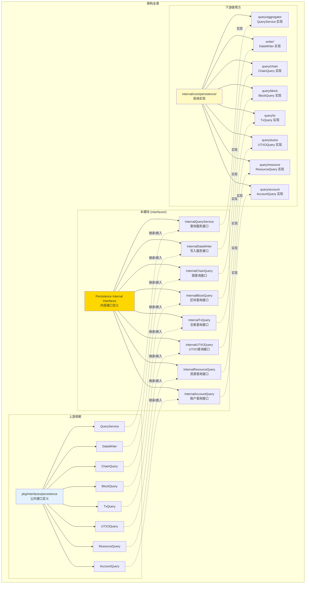
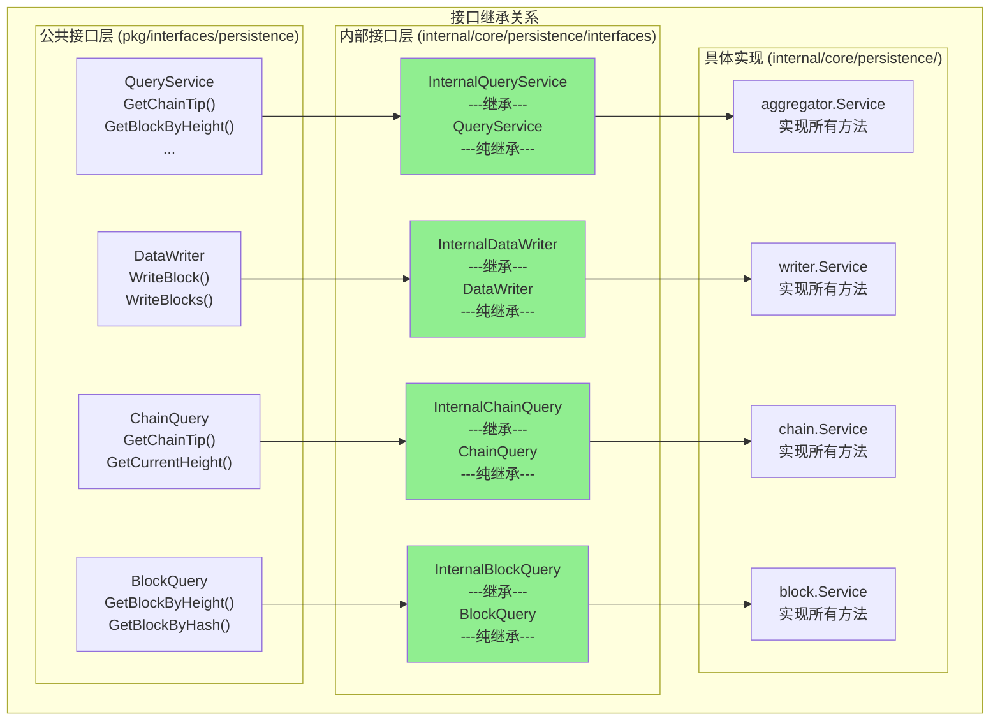

# Persistence - 内部接口

---

## 📌 版本信息

- **版本**：1.0
- **状态**：stable
- **最后更新**：2025-11-30
- **最后审核**：2025-11-30
- **所有者**：WES Persistence 开发组
- **适用范围**：WES Persistence 组件内部接口

---

## 🎯 接口定位

**路径**：`internal/core/persistence/interfaces/`

**目的**：继承公共接口，扩展组件内部运行所需的方法，作为具体实现与公共接口的桥梁。

**核心原则**：
- ✅ 必须继承（嵌入）对应的公共接口
- ✅ 只添加必要的内部方法
- ✅ 内部方法通常为小写（包内可见）
- ✅ 作为实现层实现的接口类型

**关键约束** ⭐：
- ✅ **强制继承**：内部接口必须嵌入对应的公共接口
- ✅ **节制扩展**：只添加必要的内部方法，避免过度扩展
- ❌ **禁止跳过**：具体实现不得直接实现公共接口，必须实现内部接口

---

## 🏗️ 架构设计

### 架构全景

> **说明**：展示三层架构关系（公共接口 → 内部接口 → 具体实现）



**架构说明**：

| 层级 | 组件 | 职责 | 关键约束 |
|-----|------|------|---------|
| **公共接口** | `pkg/interfaces/persistence` | 对外暴露的能力契约 | 稳定、简洁、面向调用方 |
| **内部接口** | `internal/core/persistence/interfaces` | 继承公共 + 扩展内部 | 必须嵌入公共接口 |
| **具体实现** | `internal/core/persistence/` | 实现内部接口 | 只实现内部接口 |

---

### 接口层次（继承关系）

> **说明**：展示每个内部接口如何继承公共接口、扩展了哪些方法



**继承类型说明**：
- 🟢 **纯继承**：所有内部接口都是纯继承，只嵌入公共接口，不添加任何方法
  - 适用场景：实现简单，无需内部协作，仅作为实现层与公共接口的桥接

---

## 🔗 与公共接口的继承关系

### 公共接口

**路径**：`pkg/interfaces/persistence/`

**接口列表**：
- `QueryService` - 统一查询服务接口
- `DataWriter` - 统一数据写入接口
- `ChainQuery` - 链状态查询接口
- `BlockQuery` - 区块查询接口
- `TxQuery` - 交易查询接口
- `UTXOQuery` - UTXO查询接口
- `ResourceQuery` - 资源查询接口
- `AccountQuery` - 账户查询接口

### 继承方式

**强制约束**：内部接口必须嵌入对应的公共接口

```go
// 示例：InternalQueryService
type InternalQueryService interface {
    persistence.QueryService  // 嵌入公共接口
    
    // 目前无扩展方法（纯继承）
}

// 示例：InternalDataWriter
type InternalDataWriter interface {
    persistence.DataWriter  // 嵌入公共接口
    
    // 目前无扩展方法（纯继承）
    // 未来如需扩展，可添加内部方法，例如：
    // getCurrentHeight() (uint64, error)
}
```

---

## 📐 内部接口列表

### 接口文件 1：`query.go`

**接口对象**：`InternalQueryService` 及其子接口

**继承的公共接口**：`persistence.QueryService` 及其子接口

**扩展的内部方法**：

```go
// InternalQueryService - 统一查询服务内部接口
type InternalQueryService interface {
    persistence.QueryService  // 继承公共接口
    
    // 目前无扩展方法（纯继承）
}

// InternalChainQuery - 链状态查询内部接口
type InternalChainQuery interface {
    persistence.ChainQuery
}

// InternalBlockQuery - 区块查询内部接口
type InternalBlockQuery interface {
    persistence.BlockQuery
}

// InternalTxQuery - 交易查询内部接口
type InternalTxQuery interface {
    persistence.TxQuery
}

// InternalUTXOQuery - UTXO查询内部接口
type InternalUTXOQuery interface {
    persistence.UTXOQuery
}

// InternalResourceQuery - 资源查询内部接口
type InternalResourceQuery interface {
    persistence.ResourceQuery
}

// InternalAccountQuery - 账户查询内部接口
type InternalAccountQuery interface {
    persistence.AccountQuery
}
```

**设计理由**：
- 当前实现简单，无需内部协作方法
- 内部接口仅作为实现层与公共接口的桥接
- 遵循代码组织规范，强制使用内部接口
- 如果未来需要内部协作，可在此扩展

---

### 接口文件 2：`writer.go`

**接口对象**：`InternalDataWriter`

**继承的公共接口**：`persistence.DataWriter`

**扩展的内部方法**：

```go
type InternalDataWriter interface {
    persistence.DataWriter  // 继承公共接口
    
    // 目前无扩展方法（纯继承）
    // 未来如需扩展，可添加内部方法，例如：
    // getCurrentHeight() (uint64, error)  // 内部：获取当前高度
    // validateBlockOrder(block *core.Block) error  // 内部：验证区块顺序
}
```

**说明**：
- ⚠️ 并非所有内部接口都需要扩展方法
- ✅ 如果组件实现简单，内部接口可以只继承公共接口，无需添加任何方法
- ✅ 这种情况下，内部接口仅作为实现层与公共接口的桥接

---

## 🔄 架构层次关系

```
pkg/interfaces/persistence/              ← 公共接口（对外）
    ↓ 嵌入/继承
internal/core/persistence/interfaces/    ← 您在这里（内部接口）
    ↓ 实现
internal/core/persistence/              ← 具体实现
    ↓ 装配
internal/core/persistence/module.go     ← 依赖注入配置
```

**关键约束**：
- ❌ 禁止：具体实现 → 直接实现公共接口
- ✅ 必须：具体实现 → 实现内部接口 → 继承公共接口

---

## 💡 使用示例

### 场景 1：具体实现实现内部接口

```go
// 具体实现：writer/service.go
type Service struct {
    storage storage.BadgerStore
    hasher  blockutil.Hasher
    logger  log.Logger
}

// 实现内部接口（而不是公共接口）
var _ interfaces.InternalDataWriter = (*Service)(nil)

func (s *Service) WriteBlock(ctx context.Context, block *core.Block) error {
    // 实现公共方法
    // ...
}

func (s *Service) WriteBlocks(ctx context.Context, blocks []*core.Block) error {
    // 实现公共方法
    // ...
}
```

### 场景 2：组件内部协作（未来扩展）

```go
// 如果未来需要内部协作，可添加内部方法
type InternalDataWriter interface {
    persistence.DataWriter
    
    // 内部方法（小写，包内可见）
    getCurrentHeight(ctx context.Context) (uint64, error)
}

// 在组件内部，其他模块可以通过内部接口调用内部方法
func (service *SomeInternalService) Process() error {
    // 调用内部方法
    height, err := service.dataWriter.getCurrentHeight(ctx)
    if err != nil {
        return err
    }
    // ...
}
```

---

## 📊 内部方法设计原则

### 什么时候添加内部方法？

✅ **应该添加**：
- 组件内部模块间需要协作
- 实现层需要一些辅助方法，但不应暴露到公共接口
- 需要在组件内部共享状态或资源

❌ **不应添加**：
- 只是为了"内部调用"而添加（可以用私有方法）
- 破坏公共接口的稳定性
- 过度设计，添加不必要的抽象

### 内部方法命名约定

| 可见性 | 命名规则 | 示例 | 用途 |
|-------|---------|------|-----|
| 包内可见 | 小写开头 | `getCurrentHeight()` | 组件内部协作 |
| 跨包可见 | 大写开头（谨慎） | `InternalMethod()` | 跨组件内部协作（少见） |

---

## 🚫 常见错误

### 错误 1：实现直接实现公共接口

```go
❌ 错误示例
type Service struct {}

// 直接实现公共接口（禁止）
func (s *Service) WriteBlock(ctx context.Context, block *core.Block) error {
    // ...
}
```

### 错误 2：内部接口未继承公共接口

```go
❌ 错误示例
type InternalDataWriter interface {
    // 未嵌入公共接口
    WriteBlock(ctx context.Context, block *core.Block) error
}
```

### 错误 3：过度扩展内部方法

```go
❌ 错误示例
type InternalDataWriter interface {
    persistence.DataWriter
    
    // 添加了太多内部方法
    internalMethod1() error
    internalMethod2() error
    internalMethod3() error
    // ... 10+ 个方法
}
```

**正确做法**：
- ✅ 如果内部方法过多，考虑是否需要拆分接口
- ✅ 评估这些方法是否真的需要定义在接口中
- ✅ 大部分辅助方法应该是私有方法，而不是接口方法

---

## 📚 相关文档

- [公共接口目录](../../../pkg/interfaces/persistence/README.md)
- [代码组织规范](../../../docs/system/standards/principles/code-organization.md)
- [实现目录](../README.md)
- [组件文档](../../../docs/components/infrastructure/persistence/README.md)

---

## 📝 变更历史

| 版本 | 日期 | 变更内容 | 作者 |
|-----|------|---------|------|
| 1.0 | 2025-11-30 | 初始版本，定义所有内部接口 | WES Persistence 开发组 |

---

