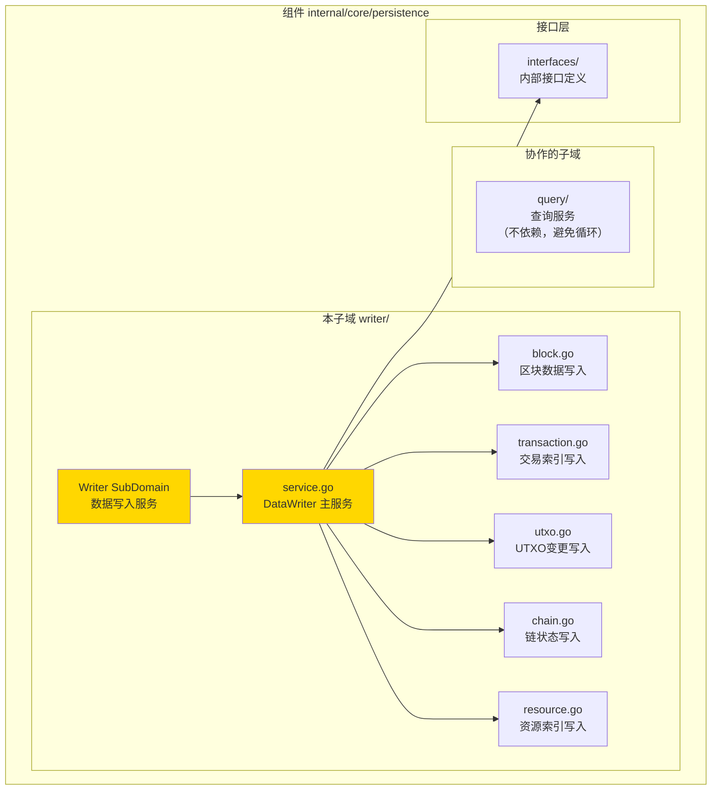
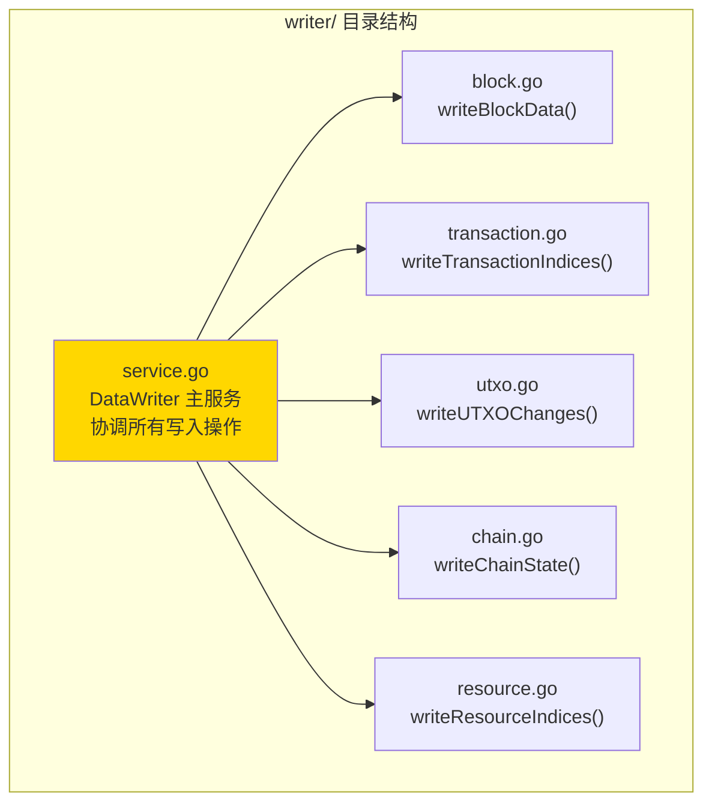
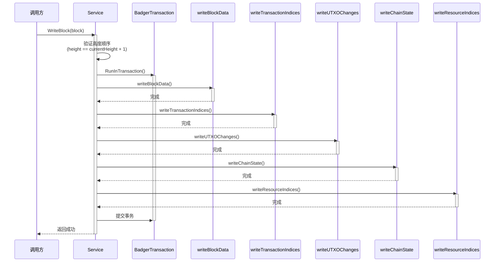

# Writer - 数据写入子域

---

## 📌 版本信息

- **版本**：1.0
- **状态**：stable
- **最后更新**：2025-11-30
- **最后审核**：2025-11-30
- **所有者**：WES Persistence 开发组
- **适用范围**：WES Persistence 组件写入子域

---

## 🎯 子域定位

**路径**：`internal/core/persistence/writer/`

**所属组件**：`persistence`

**核心职责**：实现统一数据写入服务（DataWriter），协调所有数据写入操作，确保原子性和一致性。

**在组件中的角色**：
- 数据写入的核心逻辑实现
- 协调区块、交易索引、UTXO、链状态、资源索引的写入
- 确保所有写操作在单一事务中原子性完成

---

## 🏗️ 架构设计

### 在组件中的位置

> **说明**：展示此子域在组件内部的位置和协作关系



**位置说明**：

| 关系类型 | 目标 | 关系说明 |
|---------|------|---------|
| **协作** | query/ | 不依赖 QueryService，避免循环依赖，直接读存储 |
| **依赖** | interfaces/ | 实现 InternalDataWriter 接口 |

---

### 内部组织

> **说明**：展示此子域内部的文件组织和类型关系



---

## 📁 目录结构

```
internal/core/persistence/writer/
├── README.md                    # 本文档
├── service.go                   # DataWriter 主服务（核心实现）
├── block.go                     # 区块数据写入实现
├── transaction.go               # 交易索引写入实现
├── utxo.go                      # UTXO变更写入实现
├── chain.go                     # 链状态写入实现
└── resource.go                  # 资源索引写入实现
```

---

## 🔧 核心实现

### 实现文件：`service.go`

**核心类型**：`Service`

**职责**：统一数据写入服务，实现 DataWriter 接口，协调所有数据写入操作

**关键字段**：

```go
type Service struct {
    // 存储服务
    storage storage.BadgerStore
    
    // 哈希服务（用于计算区块和交易哈希）
    hasher blockutil.Hasher
    
    // 辅助服务
    logger log.Logger
}
```

**关键方法**：

| 方法名 | 职责 | 可见性 | 备注 |
|-------|------|-------|-----|
| `NewService()` | 构造函数 | Public | 用于依赖注入 |
| `WriteBlock()` | 写入单个区块 | Public | 实现接口方法，协调所有写入操作 |
| `WriteBlocks()` | 批量写入连续区块 | Public | 实现接口方法，用于同步场景 |
| `getCurrentHeight()` | 获取当前链高度 | Private | 内部辅助方法，用于高度验证 |
| `uint64ToBytes()` | uint64 转字节 | Private | 内部辅助函数 |
| `bytesToUint64()` | 字节转 uint64 | Private | 内部辅助函数 |

**实现要点**：
- 所有写操作在单一事务中完成，确保原子性
- 严格验证高度顺序（只接受 `height == currentHeight + 1`）
- 协调各写入操作，但不暴露内部实现细节
- 不依赖 QueryService，直接读存储，避免循环依赖

---

### 辅助文件

**block.go** - 区块数据写入：
- `writeBlockData()` - 存储区块数据、区块索引（高度→哈希、哈希→高度）

**transaction.go** - 交易索引写入：
- `writeTransactionIndices()` - 存储交易索引（交易哈希→区块信息）

**utxo.go** - UTXO变更写入：
- `writeUTXOChanges()` - 处理交易输入（删除 UTXO）、输出（创建 UTXO）、地址索引
  - 彻底迭代：`is_reference_only=true` 的引用型输入不形成“跨区块锁定”，仅在事务内更新 `resource:counters-instance:*` 的使用统计（TotalReferenceTimes/LastReference*），用于观测与分析

**chain.go** - 链状态写入：
- `writeChainState()` - 更新链尖（state:chain:tip）、状态根（state:chain:root）

**resource.go** - 资源索引写入：
- `writeResourceIndices()` - 更新资源索引（资源内容哈希→交易和区块信息）

---

## ⚠️ 已知的“跨存储非原子”风险（已记录，待后续方案落地）

当前资源内容文件（CAS/FileStore）仍是文件系统存储，而资源索引/视图在 BadgerDB：
- **风险形态**：文件写入与 Badger 事务无法做到同一原子提交（跨存储）。
- **当前处理策略**：不在本次讨论中强行引入去中心化存储；后续将以“自研去中心化存储/可事务对象存储”收敛为单存储或可回放写入语义。
- **工程约束**：本仓库当前仅保证链上索引/区块/UTXO 等 Badger 内部的原子一致性；资源文件一致性需要单独的 repair/迁移策略（后续讨论并实施）。

---

## 🔗 协作关系

### 依赖的接口

| 接口 | 来源 | 用途 |
|-----|------|-----|
| `interfaces.InternalDataWriter` | `internal/core/persistence/interfaces/` | 实现接口约束 |
| `storage.BadgerStore` | `pkg/interfaces/infrastructure/storage` | 持久化存储 |
| `crypto.HashManager` | `pkg/interfaces/infrastructure/crypto` | 哈希计算 |
| `log.Logger` | `pkg/interfaces/infrastructure/log` | 日志记录 |

---

### 被依赖关系

**被以下组件使用**：
- `internal/core/block/processor` - BlockProcessor 调用 `DataWriter.WriteBlock()` 写入区块
- `internal/core/chain` - ForkHandler 和 SyncService 调用 `DataWriter.WriteBlock()` 应用区块

**示例**：

```go
// 在 BlockProcessor 中使用
import "github.com/weisyn/v1/pkg/interfaces/persistence"

func (s *Service) executeBlock(ctx context.Context, block *core.Block) error {
    // 通过 DataWriter 写入区块
    if err := s.dataWriter.WriteBlock(ctx, block); err != nil {
        return fmt.Errorf("写入区块数据失败: %w", err)
    }
    return nil
}
```

---

## 📊 核心写入流程

### WriteBlock 流程



**流程说明**：
1. **验证阶段**：验证区块高度顺序（必须等于 currentHeight + 1）
2. **事务阶段**：在单一事务中执行所有写入操作
3. **写入阶段**：依次执行区块数据、交易索引、UTXO变更、链状态、资源索引写入
4. **提交阶段**：事务提交，确保原子性

---

## 🧪 测试

### 测试覆盖

| 测试类型 | 文件 | 覆盖率目标 | 当前状态 |
|---------|------|-----------|---------|
| 单元测试 | `writer_test.go` | ≥ 80% | 待添加 |
| 集成测试 | `../integration/` | 核心场景 | 待添加 |

---

## 📊 关键设计决策

### 决策 1：单一事务原子性

**问题**：如何确保所有写操作的原子性？

**方案**：所有写操作在单一 BadgerDB 事务中完成

**理由**：确保数据一致性，失败时全部回滚

**权衡**：
- ✅ 优点：数据一致性保证，简化错误处理
- ⚠️ 缺点：事务时间较长，可能影响并发性能

---

### 决策 2：不依赖 QueryService

**问题**：如何避免循环依赖？

**方案**：DataWriter 直接读存储，不依赖 QueryService

**理由**：避免循环依赖，保持架构清晰

**权衡**：
- ✅ 优点：避免循环依赖，职责清晰
- ⚠️ 缺点：需要直接操作存储，代码可能重复

---

### 决策 3：严格有序写入

**问题**：如何处理区块顺序？

**方案**：只接受 `height == currentHeight + 1` 的区块，分叉处理由上层完成

**理由**：职责分离，DataWriter 专注于数据写入

**权衡**：
- ✅ 优点：职责清晰，简化实现
- ⚠️ 缺点：调用方需要处理分叉逻辑

---

## 📚 相关文档

- [组件总览](../README.md)
- [内部接口](../interfaces/README.md)
- [公共接口](../../../../pkg/interfaces/persistence/README.md)
- [接口与实现的组织架构](../../../../docs/system/standards/principles/code-organization.md)
- [数据架构设计](../../../../docs/system/designs/storage/data-architecture.md)
- [写入架构设计](../../../../docs/system/designs/storage/data-writer-architecture.md)

---

## 📝 变更历史

| 版本 | 日期 | 变更内容 | 作者 |
|-----|------|---------|------|
| 1.0 | 2025-11-30 | 初始版本，完成 DataWriter 实现 | WES Persistence 开发组 |

---

## 🚧 待办事项

- [ ] 添加单元测试（覆盖率目标 ≥ 80%）
- [ ] 添加集成测试（核心场景）
- [ ] 优化批量写入性能
- [ ] 添加写入性能监控

---

