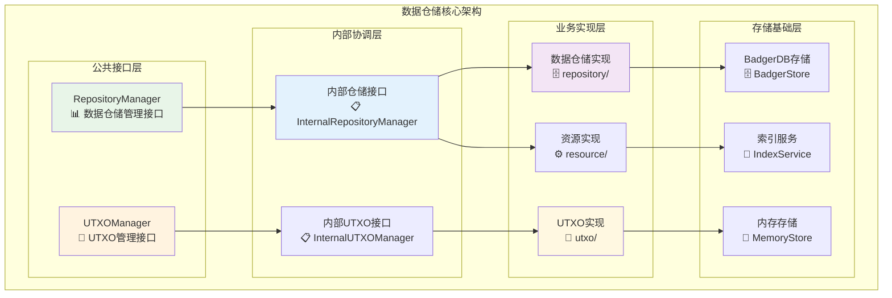
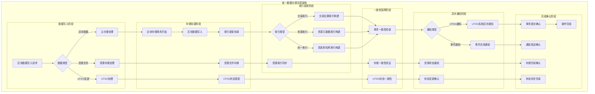
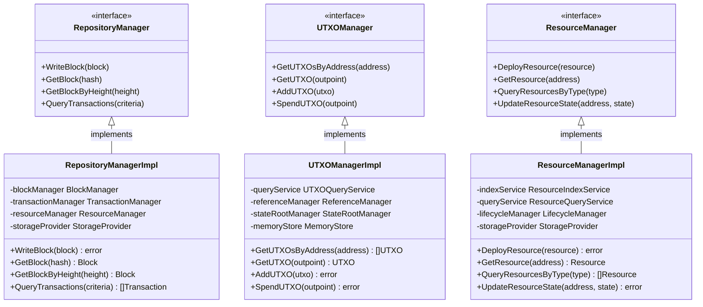

# Repositories Core Module（internal/core/repositories）

## 🎯 模块概述

**Repositories Core Module** 是 WES 区块链数据仓储层的核心实现模块，提供完整的区块链数据存储、查询和管理服务。本模块遵循单一数据源原则，将区块作为唯一数据写入点，为整个系统提供可靠的数据基础设施。

【实现架构】

　　采用**分层数据管理**的三层实现架构，确保数据访问的高效性和可靠性。



**架构层次说明：**

1. **公共接口层**：对外提供标准化的数据访问接口
   - 区块链数据存储查询
   - UTXO状态管理
   - 统一的错误处理

2. **内部协调层**：内部接口协调和业务逻辑组织
   - 跨模块协作接口
   - 复杂业务流程协调
   - 内部状态管理

3. **业务实现层**：具体的数据操作和业务逻辑实现
   - 区块、交易、资源数据操作
   - UTXO查询和引用管理
   - 资源生命周期管理

---

## 📁 **模块组织结构**

【数据仓储层模块架构】

```
internal/core/repositories/
├── 📋 module.go                         # fx依赖注入模块配置
├── 🏗️ interfaces/                       # 内部接口定义层
│   ├── repository.go                     # 内部仓储接口扩展
│   ├── resource.go                       # 内部资源接口扩展
│   ├── utxo.go                          # 内部UTXO接口扩展
│   └── README.md                        # 接口层文档
├── 🗄️ repository/                       # 主数据仓储实现
│   ├── manager.go                       # 仓储管理器主入口
│   ├── batch_hash.go                    # 批量哈希计算服务
│   ├── block.go                         # 区块存储核心实现
│   ├── chain.go                         # 区块链状态管理
│   ├── outbox.go                        # 事件输出盒管理
│   ├── validation.go                    # 数据验证服务
│   ├── 🔍 index/                        # 统一索引管理子模块
│   │   ├── manager.go                   # 索引管理器协调中心
│   │   ├── hash.go                      # 哈希索引实现
│   │   ├── height.go                    # 高度索引实现
│   │   └── README.md                    # 索引管理文档
│   ├── 📄 transaction/                  # 交易位置索引子模块
│   │   ├── service.go                   # 交易查询服务门面
│   │   ├── index.go                     # 交易索引核心实现
│   │   ├── query.go                     # 交易查询操作实现
│   │   └── README.md                    # 交易索引文档
│   ├── 📦 resource/                     # 资源元数据索引子模块
│   │   ├── service.go                   # 资源查询服务门面
│   │   ├── index.go                     # 资源索引核心实现
│   │   ├── query.go                     # 资源查询操作实现
│   │   └── README.md                    # 资源索引文档
│   ├── 🔗 utxo/                         # UTXO系统接口客户端
│   │   ├── service.go                   # UTXO接口客户端服务
│   │   └── README.md                    # UTXO客户端文档
│   └── README.md                        # 主仓储实现文档
├── 📁 resource/                         # 资源文件存储管理
│   ├── manager.go                       # 资源管理器主入口
│   ├── store.go                         # 混合存储核心实现
│   ├── index.go                         # 资源索引管理
│   ├── query.go                         # 资源查询操作
│   ├── lifecycle.go                     # 资源生命周期管理
│   ├── consistency.go                   # 一致性检查和修复
│   └── README.md                        # 资源管理文档
├── 💎 utxo/                             # UTXO状态管理实现
│   ├── manager.go                       # UTXO管理器主入口
│   ├── query.go                         # UTXO查询操作实现
│   ├── reference.go                     # UTXO引用管理实现
│   ├── state_root.go                    # UTXO状态根管理
│   ├── storage.go                       # UTXO存储策略
│   └── README.md                        # UTXO管理文档
├── 📝 README.md                         # 本文档
└── 📊 tests/                            # 测试文件目录
    ├── repository_manager_test.go        # 仓储管理器测试
    ├── utxo_manager_test.go             # UTXO管理器测试
    ├── resource_manager_test.go         # 资源管理器测试
    ├── integration_test.go              # 模块集成测试
    └── benchmark_test.go                # 性能基准测试
```

### **🎯 子模块职责分工**

| **子模块** | **核心职责** | **对外接口** | **内部组件** | **复杂度** |
|-----------|-------------|-------------|-------------|-----------|
| `module.go` | fx依赖注入模块配置 | RepositoriesModule | 依赖管理、生命周期控制、接口导出 | 低 |
| `interfaces/` | 内部接口定义和扩展 | 扩展接口集合 | 仓储接口、资源接口、UTXO接口 | 低 |
| `repository/` | 主数据仓储服务实现 | RepositoryManager | 区块存储、交易索引、资源索引、UTXO客户端 | 高 |
| `repository/index/` | 统一索引管理协调 | IndexManager | 高度索引、哈希索引、索引健康检查 | 高 |
| `repository/transaction/` | 交易位置索引与查询 | TransactionService | 交易索引、查询服务、nonce计算 | 中 |
| `repository/resource/` | 资源元数据索引与查询 | ResourceService | 资源索引、查询服务、内容寻址 | 中 |
| `repository/utxo/` | UTXO系统接口客户端 | UTXOClient | 接口调用、异步通知、重试机制 | 中 |
| `resource/` | 资源文件存储管理 | ResourceManager | 混合存储、索引管理、生命周期控制 | 高 |
| `utxo/` | UTXO状态管理实现 | UTXOManager | UTXO查询、引用管理、状态根管理 | 高 |
| `tests/` | 数据仓储层功能测试 | 测试工具和框架 | 单元测试、集成测试、性能测试 | 中 |

---

## 🔄 **统一数据仓储实现**

【实现策略】

　　所有数据仓储子模块均严格遵循**单一数据源原则**和**分层存储架构**，确保数据的一致性、高效性和可靠性。



**关键实现要点：**

1. **单一数据源保证**：
   - 区块作为唯一数据写入点，所有其他数据从区块实时提取
   - 轻量级索引设计，只存储位置信息不重复存储业务数据
   - 强一致性事务保证，确保数据写入的原子性

2. **分层存储优化**：
   - 主仓储负责区块和索引的核心存储功能
   - 资源存储负责文件内容的混合存储策略
   - UTXO存储负责状态数据的高效查询优化

3. **异步协调机制**：
   - 跨模块异步通知，避免阻塞主存储流程
   - 重试和恢复机制，确保分布式操作的可靠性
   - 事件驱动集成，支持系统间的松耦合协作

### 🎯 核心服务

#### 🗄️ Repository Manager

**数据仓储管理服务** - 实现 `repository.RepositoryManager` 接口

- **区块数据操作**：区块存储、查询、索引管理
- **交易权利管理**：交易查询、nonce防重放攻击
- **资源能力管理**：基于内容哈希的资源查询

#### 💎 UTXO Manager

**UTXO数据管理服务** - 实现 `repository.UTXOManager` 接口

- **UTXO查询操作**：精确查询和地址聚合查询
- **引用管理操作**：ResourceUTXO的并发引用控制

### 🚀 技术特性

- **单一数据源**：严格遵循区块作为唯一写入点的架构原则
- **高效查询**：基于多重索引的O(1)时间复杂度查询
- **并发安全**：ResourceUTXO引用计数管理，防止并发冲突
- **存储分层**：热数据缓存与冷数据索引的灵活存储策略
- **依赖注入**：通过fx框架统一管理服务依赖和生命周期

---

## 🏗️ **依赖注入架构**

【fx框架集成】

　　全面采用fx依赖注入框架，实现组件间的松耦合和生命周期自动管理。

```go
// 示例：数据仓储模块依赖注入配置
package repositories

import (
    "go.uber.org/fx"
    "github.com/weisyn/v1/pkg/interfaces/repository"
)

// Module 数据仓储模块
var Module = fx.Module("repositories",
    // 导入核心组件
    fx.Provide(
        // 数据仓储管理组件
        repository.NewRepositoryManager,
        repository.NewBlockManager,
        repository.NewTransactionManager,
        repository.NewResourceManager,
        
        // UTXO管理组件
        utxo.NewUTXOManager,
        utxo.NewQueryService,
        utxo.NewReferenceManager,
        utxo.NewStateRootManager,
        
        // 资源管理组件
        resource.NewResourceManager,
        resource.NewIndexService,
        resource.NewQueryService,
        resource.NewLifecycleManager,
        
        // 存储基础组件
        NewStorageProvider,
        NewIndexManager,
        NewCacheManager,
    ),
    
    // 导出公共接口
    fx.Provide(
        fx.Annotate(
            func(mgr *repository.RepositoryManager) repository.RepositoryManager {
                return mgr
            },
            fx.As(new(repository.RepositoryManager)),
        ),
        fx.Annotate(
            func(mgr *utxo.UTXOManager) repository.UTXOManager {
                return mgr
            },
            fx.As(new(repository.UTXOManager)),
        ),
        // ... 其他接口导出
    ),
    
    // 生命周期管理
    fx.Invoke(InitializeRepositoryServices),
    fx.Invoke(CreateIndexes),
)

// 数据仓储服务初始化
func InitializeRepositoryServices(
    repoManager *repository.RepositoryManager,
    utxoManager *utxo.UTXOManager,
    config *RepositoriesConfig,
) error {
    // 初始化存储后端
    if err := repoManager.Initialize(config.Storage); err != nil {
        return err
    }
    
    // 初始化UTXO管理器
    if err := utxoManager.Initialize(config.UTXO); err != nil {
        return err
    }
    
    return nil
}

// 索引创建
func CreateIndexes(
    indexManager *IndexManager,
    config *RepositoriesConfig,
) error {
    // 创建区块索引
    if err := indexManager.CreateBlockIndexes(); err != nil {
        return err
    }
    
    // 创建交易索引
    if err := indexManager.CreateTransactionIndexes(); err != nil {
        return err
    }
    
    // 创建资源索引
    if err := indexManager.CreateResourceIndexes(); err != nil {
        return err
    }
    
    return nil
}
```

**依赖管理特点：**
- **自动生命周期**：组件启动和停止由fx自动管理
- **接口导向**：通过接口而非具体类型进行依赖
- **层次清晰**：明确的依赖方向，避免循环依赖
- **测试友好**：支持依赖注入的单元测试

---

## 📊 **性能与监控**

【性能指标】

| **操作类型** | **目标延迟** | **吞吐量目标** | **命中率** | **监控方式** |
|-------------|-------------|---------------|-----------|------------|
| 区块查询 | < 5ms | > 2000 QPS | > 95% | 实时监控 |
| 交易查询 | < 2ms | > 5000 QPS | > 98% | 批量统计 |
| UTXO查询 | < 1ms | > 10000 QPS | > 99% | 关键路径监控 |
| 区块写入 | < 50ms | > 100 BPS | N/A | 异步监控 |
| 索引更新 | < 10ms | > 1000 UPS | > 90% | 实时监控 |

**性能优化策略：**
- **缓存优化**：多级缓存、智能预取、LRU策略
- **索引优化**：复合索引、分区索引、增量更新
- **存储优化**：批量写入、压缩存储、异步持久化
- **查询优化**：查询计划优化、并行查询、结果缓存

---

## 🔗 **与公共接口的映射关系**

【接口实现映射】



**实现要点：**
- **接口契约**：严格遵循公共接口的方法签名和语义
- **错误处理**：标准化的错误返回和异常处理机制
- **日志记录**：完善的操作日志和性能指标记录
- **测试覆盖**：每个接口方法都有对应的单元测试和集成测试

### 📋 接口映射

本模块完整实现公共数据仓储接口，为上层业务模块提供数据服务：

| 公共接口 | 实现模块 | 核心功能 |
|----------|----------|----------|
| `repository.RepositoryManager` | `repository/` | 区块链数据存储查询 |
| `repository.UTXOManager` | `utxo/` | UTXO状态管理 |

### 🔗 依赖关系

#### 输入依赖

- **基础设施**：Logger, ConfigProvider, EventBus
- **存储组件**：BadgerStore, MemoryStore, StorageProvider  
- **密码学组件**：HashManager, SignatureManager, KeyManager, AddressManager

#### 输出服务

- **数据仓储服务**：为blockchain、api等模块提供数据访问能力
- **UTXO管理服务**：为账户服务、交易验证提供UTXO操作能力

### 🎯 设计原则

1. **职责分离**：将不同业务域的操作分散到专门模块
2. **接口统一**：通过内部接口保持与公共接口的一致性
3. **依赖明确**：通过fx框架明确声明服务依赖
4. **业务导向**：基于实际业务需求设计，避免过度设计

### 📊 业务价值

- **数据基础设施**：为整个WES区块链系统提供可靠的数据基础
- **性能优化**：通过高效索引和缓存策略提升查询性能
- **开发效率**：统一的数据访问接口简化上层业务开发
- **系统可靠性**：严格的数据一致性保证确保系统稳定

---

---

## 🚀 **后续扩展规划**

【模块演进方向】

1. **存储能力增强**
   - 支持更多存储后端（Redis、MongoDB等）
   - 实现分布式存储和数据分片
   - 添加数据压缩和加密存储

2. **查询性能优化**
   - 实现更智能的查询优化器
   - 添加并行查询和批量查询支持
   - 优化索引策略和缓存机制

3. **数据一致性增强**
   - 实现更强的事务一致性保证
   - 添加数据完整性校验机制
   - 增强故障恢复和数据修复能力

4. **监控运维增强**
   - 提供更详细的存储监控指标
   - 实现自动化的数据备份和恢复
   - 添加数据库性能分析工具

---

## 📋 **开发指南**

【子模块开发规范】

1. **新建子模块步骤**：
   - 在interfaces/中定义内部接口
   - 创建子模块目录和基础文件
   - 实现核心业务逻辑
   - 添加完整的单元测试
   - 更新fx依赖注入配置

2. **代码质量要求**：
   - 遵循Go语言最佳实践
   - 100%的接口方法测试覆盖
   - 完善的错误处理机制
   - 清晰的代码注释和文档

3. **性能要求**：
   - 关键路径延迟指标达标
   - 内存使用合理，避免泄漏
   - 并发安全的数据访问
   - 合理的资源清理机制

【参考文档】
- [数据仓储实现](repository/README.md)
- [UTXO管理实现](utxo/README.md)
- [资源管理实现](resource/README.md)
- [WES架构设计文档](../../../docs/architecture/)

---

> 📝 **模板说明**：本README模板基于WES v0.0.1统一文档规范设计，使用时请根据具体模块需求替换相应的占位符内容，并确保所有章节都有实质性的技术内容。

> 🔄 **维护指南**：本文档应随着模块功能的演进及时更新，确保文档与代码实现的一致性。建议在每次重大功能变更后更新相应章节。

**Repositories Core Module 作为WES区块链系统的数据基础设施，确保整个系统具备高效、可靠、一致的数据管理能力。**
